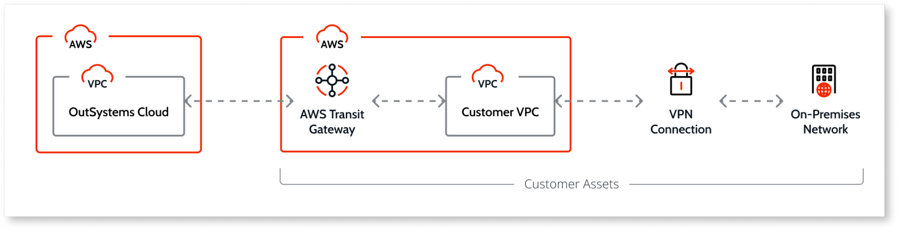
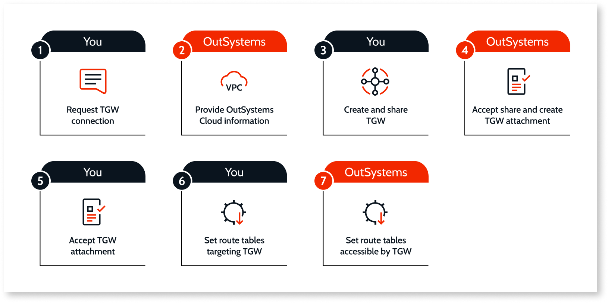
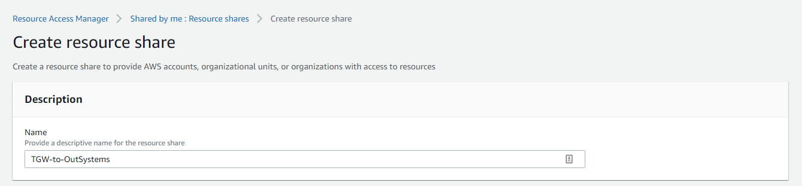
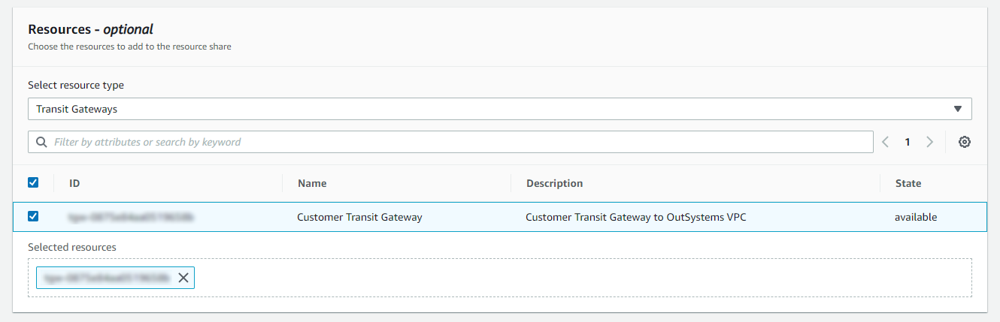
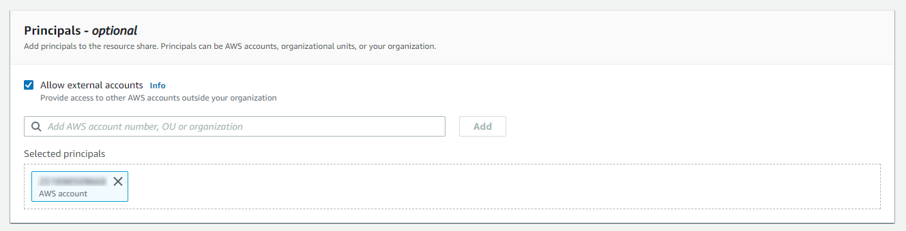
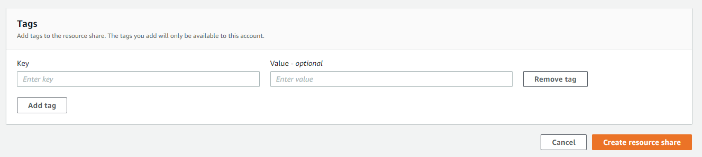
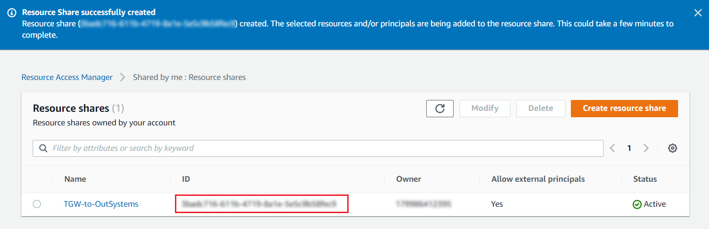
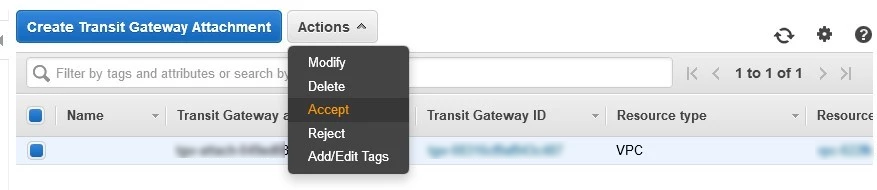
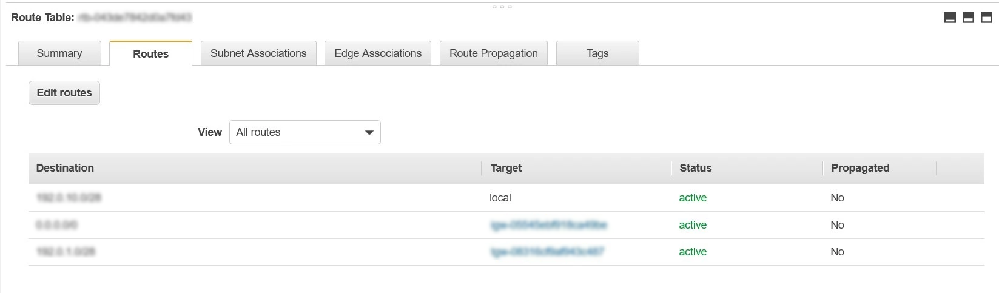

# Connect to your OutSystems Cloud using AWS Transit Gateway

This topic details how you can connect to your OutSystems Cloud using an AWS Transit Gateway.

Check in the [Cloud services catalog](https://success.outsystems.com/Support/Enterprise_Customers/OutSystems_Support/Cloud_services_catalog) if the AWS Transit Gateway service is available for your OutSystems Cloud edition.

## AWS Transit Gateway and your OutSystems Cloud

[AWS Transit Gateway](https://aws.amazon.com/transit-gateway/) is a service that enables you to connect your multiple AWS accounts, Virtual Private Clouds (VPCs), and your on-premises networks to a single gateway. For seamless integration with your corporate systems, OutSystems allows you to connect to your OutSystems Cloud VPC using your own AWS Transit Gateway.

Some advantages of using an AWS Transit Gateway are:

* You can connect your OutSystems Cloud to your AWS network in a simple and manageable way.

* You have full control of your network, as you connect your OutSystems Cloud VPC, your corporate AWS accounts, Virtual Private Clouds (VPCs), and your on-premises networks to a single gateway.

* You gain autonomy to create and manage your own VPN connections to your on-premises network. Having no VPNs to the OutSystems Cloud in this scenario, you minimize the interactions with OutSystems Support, as you don’t need to contact us to [set up or change a VPN](../vpn/vpn-support.md).

* Traffic between OutSystems Cloud VPC and your AWS Transit Gateway remains on the AWS global private network and is not exposed to the public internet.

The diagram below shows an example of how you can use AWS Transit Gateway to centrally connect your OutSystems Cloud VPC and your own AWS VPC, using a VPN on your side to connect to your on-premises network.

## Set up the connection to your OutSystems Cloud

### Before you begin

* The AWS Transit Gateway is under your ownership. You are responsible for creating it and sharing it with your OutSystems Cloud AWS Account. OutSystems is responsible for all the needed configuration on the OutSystems Cloud side.

* You must create your AWS Transit Gateway in the same region as the VPC of your OutSystems Cloud.

* Once you connect to your OutSystems Cloud using an AWS Transit Gateway, you will use it to manage all the internal traffic to your OutSystems Cloud. Therefore, you must reconfigure any existing [VPN connection](../vpn/vpn-support.md) or [AWS Direct Connect](../aws-direct-connect/aws-direct-connect-os-cloud.md) using your AWS Transit Gateway. OutSystems will terminate any existing VPN connection or AWS Direct Connect to your OutSystems Cloud after your AWS Transit Gateway connection is up and running.

### Setup Overview

### Step 1. Request the setup of AWS Transit Gateway connection  { #step-1 }

[Open a support case](https://www.outsystems.com/tk/redirect?g=A82EA0CB-B101-4F08-BCFB-77559EF63801) to OutSystems Support requesting the setup of the connection to your OutSystems Cloud using AWS Transit Gateway. Make sure you include the following information:

* Clearly indicate that you want to connect to your OutSystems Cloud using your AWS Transit Gateway.

* The **internal network IP range (CIDR blocks)** from your side to be added to OutSystems VPC route tables.

### Step 2. OutSystems provides OutSystems Cloud information { #step-2 }

OutSystems replies to you through the support case providing you the instructions on how to proceed and the following information:

* The **AWS Account ID** of your OutSystems Cloud. You will need it to share the AWS Transit Gateway.

* The **internal network IP range** of your OutSystems Cloud. You will need them to add to your route tables.

### Step 3. Create the AWS Transit Gateway and share it with OutSystems Cloud { #step-3 }

1. [Create your AWS Transit Gateway](https://docs.aws.amazon.com/vpc/latest/tgw/tgw-transit-gateways.html#create-tgw), if it doesn’t already exist:

    * Make sure your AWS Transit Gateway is in the **same region** as the VPC of your OutSystems Cloud.

    * When creating the AWS Transit Gateway, you can enable the **Auto accept shared attachments** functionality to automatically accept cross-account attachments. This way, you don’t need to manually accept the transit gateway attachment in [Step 5](#step-5) below.

1. Go to [AWS Resource Access Manager](https://aws.amazon.com/ram/) and choose the option **Create resource share**.

1. Choose a **Name** for the resource share.

    

1. Select **Transit Gateways** for the **resource type**.

1. Select the Transit Gateway that you want to share.

    

1. Check the **Allow external accounts** option and add the **AWS Account Id** of your OutSystems Cloud, provided by OutSystems in [Step 2](#step-2).

    

1. Click the **Create resource share** button.

    

1. Reply to the support case to inform OutSystems that you have already created the resource share on your side. Make sure you include the **ID of the newly created Resource share** in the support case information.

    

### Step 4. OutSystems accepts the resource share and creates an attachment to OutSystems Cloud VPC { #step-4 }

OutSystems accepts the resource share you have created in the previous step and creates a transit gateway attachment to your OutSystems Cloud VPC.

OutSystems then requests you to accept the transit gateway attachment.

### Step 5. Accept the attachment { #step-5 }

Make sure you accept the incoming VPC attachment on your side:

1. Open the Amazon VPC console and choose **Transit Gateway Attachments** on the navigation pane.

1. Validate if the incoming VPC attachment is accepted. If your AWS Transit Gateway is not configured to automatically accept attachments, you need to [manually accept the transit gateway attachment](https://docs.aws.amazon.com/vpc/latest/tgw/tgw-transit-gateways.html#tgw-accept-shared-attachment) that is pending on your side.

    

1. Reply to the support case to inform OutSystems that you have accepted the transit gateway attachment.

### Step 6. Set the route tables targeting the AWS Transit Gateway { #step-6 }

Update the route tables targeting the AWS Transit Gateway with the **internal network IP range** of your OutSystems Cloud VPC, provided to you by OutSystems Support in [Step 2](#step-2).

  

### Step 7. OutSystems sets the route tables accessible by your Transit Gateway { #step-7 }

After you accept the transit gateway attachment, OutSystems updates the route tables that are accessible by your Transit Gateway with the **internal network IP range** of your AWS VPC.

OutSystems then replies to you through the support case informing that the process is completed on our side and your Transit Gateway is ready to use.
