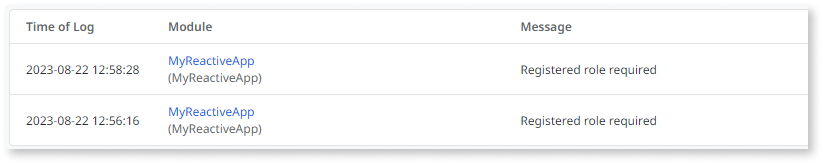
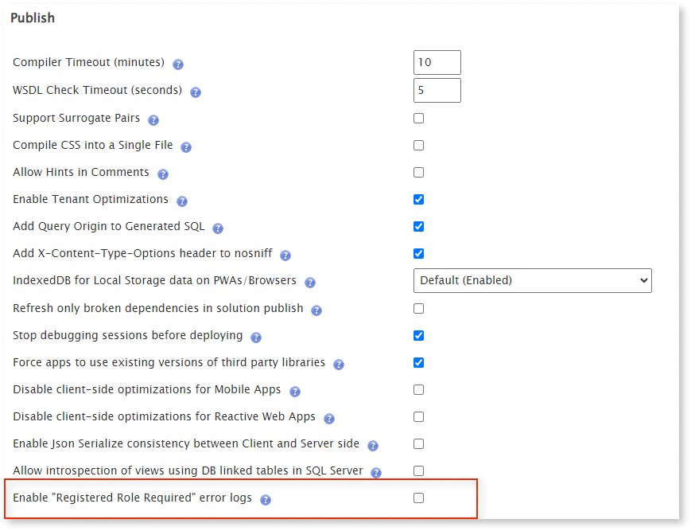

# Disable Registered Role Required error logs

It's common to find the error `Registered Role Required` in the error logs. This exception happens when an expired user session requests any action that requires a registered role. A registered role refers to any non-anonymous role, including custom roles. Considering the asynchronous nature of reactive and mobile apps that contain multiple actions, these errors can multiply in the error logs. Sometimes, OutSystems developers consider these messages irrelevant and prefer to disable them. This article explains why these error messages happen and how to disable them. 

## Context

On reactive and mobile apps, the session expires if it's idle for more than the time defined in [Max Idle Time](../../security/configure-authentication.md) (20 minutes by default). The client-side (browser) can only validate the session by contacting the server. This means that the next time the user interacts with the app and it generates one or more server requests (through the execution of server, service and data actions, or aggregates), the server validates if the session is still valid. When processing the request, the server detects that the session is no longer valid and will reject it throwing and logging a **Registered role required** exception (NotRegistered Exception). As a result, the server invalidates the session by invalidating the session cookies.

The client logic is usually prepared to receive a **NotRegistered Exception** (or Security Exception) on an exception handler to redirect the user to a login or invalid permissions screen. These client handlers might have the option **Log Error** set to **Yes**, which will log a second error on the Error Logs.

However, these apps might have many actions that are executed asynchronously. For example, if a screen contains more than 5 data actions and the screen is refreshed, each of these requests generates 2 errors in the logs. This might lead to log pollution.

## Procedure

This feature is only available in Platform Server 11.21.0 and newer versions. When it's enabled, it affects all reactive and mobile apps once they're re-published. 

Please follow these steps to disable the **Registered Role Required** error logs.

1. Install [Factory Configuration](https://www.outsystems.com/forge/component-overview/25/factory-configuration) (version 11.1.5 or newer).

1. In the **Platform Configurations** tab, uncheck the option **Enable "Registered Role Required" error logs**.

    

1. Create a solution in Service Center, including all reactive and mobile apps with corresponding dependencies. Check the option **Publish with full compilations** and publish the solution. 

This toggle will disable the creation of these error logs when requests reach the server. It also disables the logging of these errors by exception handlers. 

You can also disable the client-side errors by setting **Log Error = No** in all exception handlers that might catch **NotRegistered** exceptions. But this isn't an elegant solution and you might suppress information about other relevant exceptions. Therefore, we implemented this alternative solution to turn off the logging of **Registered role required** errors only, even when log error is set to **Yes**. If a NotRegistered exception is caught by a **NotRegistered**, **SecurityException**, or **AllException** handler, the error isn't logged. Every other type of error is still logged.
