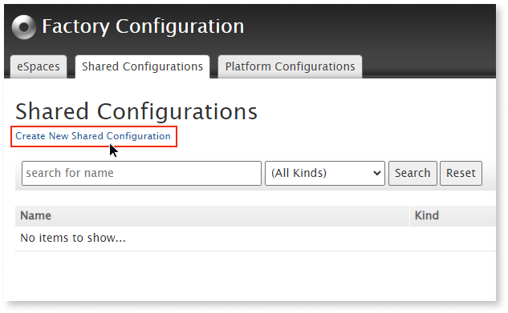
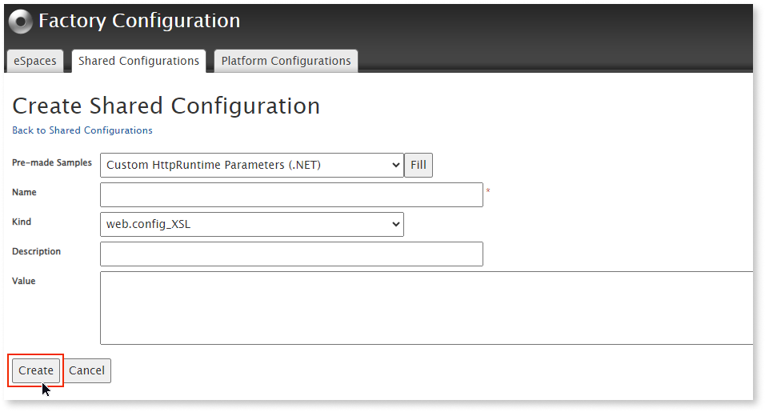
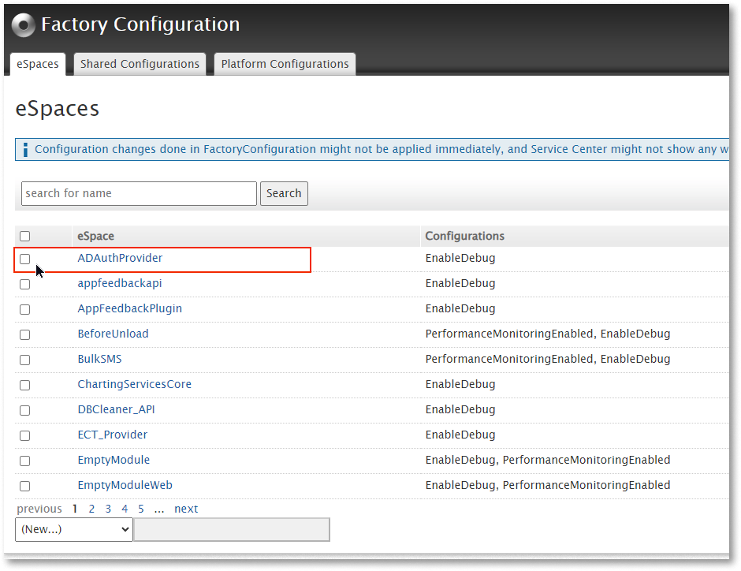
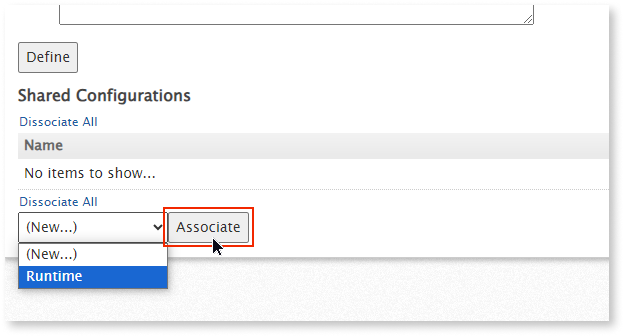
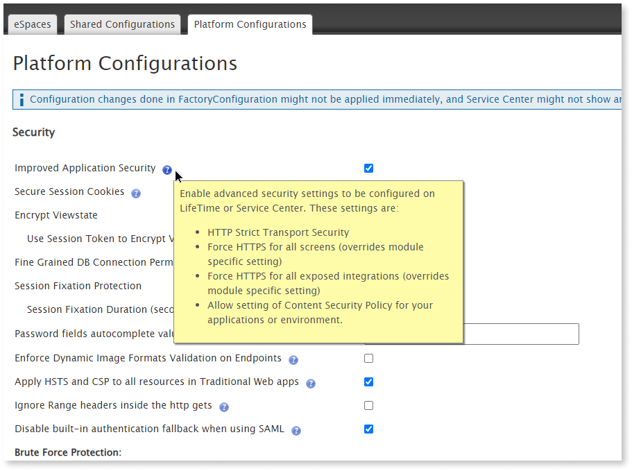

# Factory Configuration

The [Factory Configuration plugin](https://www.outsystems.com/forge/component-overview/25/factory-configuration-o11) allows you to change the configuration of the components of your Service Center Factory. Factory Configuration has no dependencies and no consumers and enables:

* Shared Configurations in a centralized way

* Well-defined collection of Platform Configurations

* Viewing existing modules in your Service Center and their current configurations

To set up Factory Configuration, install it from [Forge](https://www.outsystems.com/forge/) and then opening the module in the browser. The tested version used in this document is 11.1.4 (OutSystems 11).

## Features

The Factory Configuration includes the following tabs:

* **eSpaces:**. Lists all the modules and their existing configurations.

* **Shared Configurations**: Enables the creation of specific configurations that are shared between chosen modules.

* **Platform Configurations**: Lists several internal configurations that affect the whole platform.

## Apply shared configurations

OutSystems creates web apps with a `web.config` file, an application configuration part of Microsoft’s http\://ASP.NET. The file is written in XML, stays in the app's root directory, and controls the app's behavior.

In **the OutSystems Platform**, whenever a deployment is triggered, the `web.config` is always rebuilt from scratch. As a result, you have to manually change it every time a new version of your app is deployed if changes need to be applied.

Factory Configuration allows the creation of shared configurations per module applied to the `web.config` file. For example, if you want custom error handlers for HTTP error codes, you can create a configuration that varies for each module. Those configurations persist even after you deploy your applications.

## Technical details

Factory Configuration uses an XML file with XSL styling language. It uses XSL Transformations (XSLT) to transform the default `web config` file.

For additional resources regarding XSLT, refer to this [XSLT Introduction](https://www.w3schools.com/xml/xsl_intro.asp).

To test the modifications of an XSLT file on a `web.config` file, use this[Online XSLT Test Tool](https://xslttest.appspot.com/).

### Main Structure of an XSLT

Here is an example of the main structure of an XSLT file:

```
<?xml version="1.0" encoding="UTF-8"?>
<xsl:stylesheet version="1.0" xmlns:xsl="http://www.w3.org/1999/XSL/Transform">
  <xsl:output method="xml" indent="yes" encoding="UTF-8"/> 

  <xsl:template match="@*|node()">
      <xsl:copy>
          <xsl:apply-templates select="@*|node()"/>
      </xsl:copy>
  </xsl:template>
      
  <xsl:template match="/configuration/system.web/httpRuntime">
      <xsl:copy>
          <xsl:apply-templates select="@*|node()"/>
          <xsl:attribute name="executionTimeout">180</xsl:attribute>
          <xsl:attribute name="maxRequestLength">65536</xsl:attribute>
      </xsl:copy>
  </xsl:template>
</xsl:stylesheet>
```

## Create a new Shared Configuration

Factory Configuration allows you to create a shared configuration by either creating a new configuration from scratch or using one of the pre-made samples available.

To create a shared configuration from scratch:

1. Navigate to the **Shared Configurations** tab.

1. Click **Create New Shared Configuration**.

    

1. Click **Create** when you are ready to create a new configuration.

### Pre-made samples

Pre-made samples are found in the **Pre-made Samples** field. Use the following set of pre-made samples:

* **Custom HttpRuntime Parameters**: The HttpRuntime parameter allows you to handle the parameters affecting the app's runtime behavior. It refers to the node in the configuration file indicated by the `httpRuntime` element in the configuration hierarchy. Use it to change the `executionTimeout` and the `maxRequestLength`, time, and size of the request.

* **Default Proxy**: Use it to configure an HTTP proxy server.

* **Custom Handler**: Use it to create custom handlers in the `web.config` file. For example, you can customize the error handling.

* **Integrated Authentication**: Use it to configure Integrated Authentication for Java using NTLM HTTP filters.

* **OSTraces**: Changes the Log level of the OutSystems Platform, file location, and other related settings. These changes increase the log level number by editing the following snippet created automatically by Factory Configuration when you press the **Fill** button. For more information about OSTraces, refer to [Change OutSystems platform logging levels - OSTrace](https://success.outsystems.com/support/troubleshooting/getting_logs_for_troubleshooting_purposes/change_outsystems_platform_logging_levels_ostrace/)

```
(...)
<xsl:template name="loglevel">
      <add name="LogLevel" value="4" />
(...)
```

### Associate shared configurations to eSpaces

After creating a shared configuration, associate them with the eSpaces by following these steps:

1. Navigate to the eSpaces tab.

1. Click on the eSpace name.

    

1. Select the shared configuration to be associated.

    

**Note**: You can also link multiple shared configurations to a single eSpace.

<div class="info" markdown="1">

Configuration changes done in Factory Configuration 11 might not be applied immediately, and the Service Center might not show any warnings about these pending changes. You will need to republish the affected module after associating the shared configuration.Learn more about how to act when [applying configurations](https://success.outsystems.com/documentation/11/deploying_apps/applying_configurations_in_service_center/).

</div>

## Platform Configurations

The **Platform Configurations** tab lists several internal configurations that affect the whole platform. To view the description of each configuration and the effects of enabling or modifying it, hover the mouse over each question mark.



Here's a list of relevant platform configurations and their parameters used inside the OutSystems database:

* **Fine Grained DB Connection Permissions**

    * **Description:** Controls if the database connection permissions for a user (assigned via Service Center) allow them to use a database connection even if they don't have access over the overall environment

    * **Database parameter**: `[UseFinerGrainPermissionsInDBConnection]`

* **Password fields autocomplete value for Consoles**

    * **Description**: Controls the autocomplete attribute value of password inputs used in OutSystems consoles. The default value is off.

    * **Database parameter:** `[Consoles.PasswordAutocompleteValue]`

* **Brute Force Protection Window (minutes)**

    * **Description**: Timeframe for counting the number of failed login attempts. This configuration applies to both Brute Force Protection (Username and IP Address) if they are enabled.

    * **Database parameter**: `[InvalidLoginCheckWindowInMinutes]`

* **Brute Force Protection by Username**

    * **Description**: Blocks any login attempt for a username from a specific IP Address after exceeding the specified number of failed login attempts within the defined Brute Force Protection Window.

    * **Database parameter**: `[EnableBruteForceProtection]`

* **Brute Force Protection by IP Address**

    * **Description**: Blocks any login attempt from a specific IP Address after exceeding the specified number of failed login attempts within the defined Brute Force Protection Window.

    * **Database parameter**: `[EnableBruteForceProtectionPerIP]`

    * **Other parameters for Brute Force Protection:**

        * MaxUsernameAttemptsFirstBackoff

        * UsernameAttemptsFirstBackoffDelayInSeconds

        * MaxUsernameAttemptsSecondBackoff

        * UsernameAttemptsSecondBackoffDelayInSeconds

        * MaxIPAttemptsFirstBackoff

        * MaxIPAttemptsSecondBackoff

        * IPAttemptsFirstBackoffDelayInSeconds

        * IPAttemptsSecondBackoffDelayInSeconds

* **Remember Login (days)**

    * **Description**: Timeout used by the persistent Login mechanism. This value is the number of days the OutSystems Platform remembers a user in a specific browser

    * **Database parameter**: `[OutSystems.HubEdition.RememberLoginTimeoutInDays]`

* **Slow Query Threshold (milliseconds)**

    * **Description**: The number of milliseconds a query may run before it is logged as a slow query in the General Log of Service Center.

    * **Database parameter**: `[OutSystems.HubEdition.Log.SlowQueryInMs]`

* **One Connection per Debugger Request**

    * **Description**: Enables short debugger requests at the environment level. This may be useful in network configurations where long-lived requests can be broken by firewalls or proxies. This may improve your experience with the built-in debugger.

    * **Database parameter**: `[OutSystems.HubEdition.UseShortRequestsOnDebugger]`

* **Set Expect 100 Continue**

    * **Description**: Sets the Expect 100 Continue property of the ServicePointManager class. This may improve the performance of web services, specifically when the web service endpoint requires authentication. For more details on this behavior, refer to this [Microsoft article](https://learn.microsoft.com/en-us/dotnet/api/system.net.servicepointmanager.expect100continue?view=netframework-4.7.2).

    * **Database parameter:** `[Runtime.Expect100Continue]`

* **Use Platform Date Format in Excel**

    * **Description**: Allows exporting dates and times formatted according to the platform settings (defined in Service Center).

    * **Database parameter**: `[ExportToExcel.UsePlatformDateFormat]`

* **Write Null Date as Blank Cell in Excel**

    * **Description**: Leaves Excel cells blank whenever the value to be written is a null date or DateTime.

    * **Database parameter**:  `[ExportToExcel.WriteNullDateAsBlankCell]`
