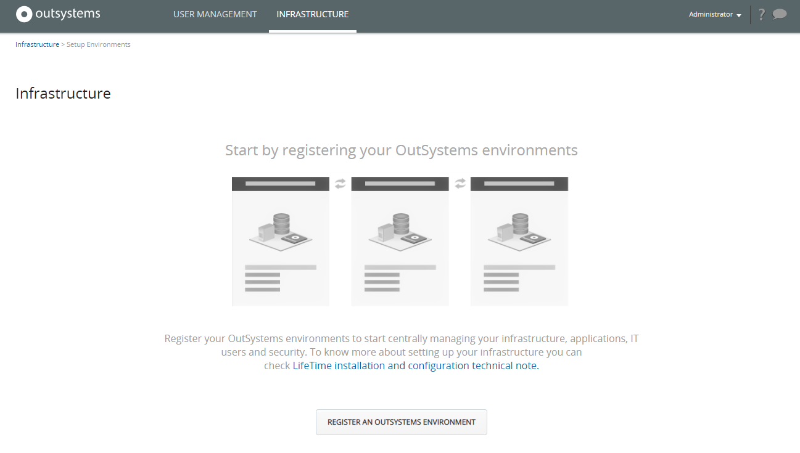
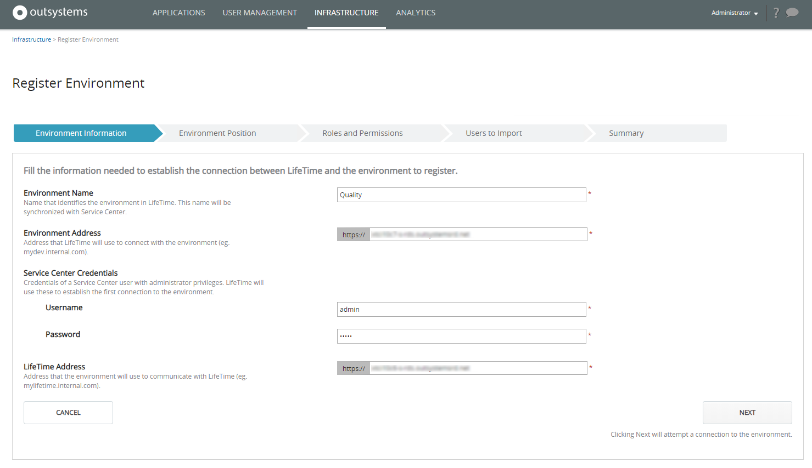
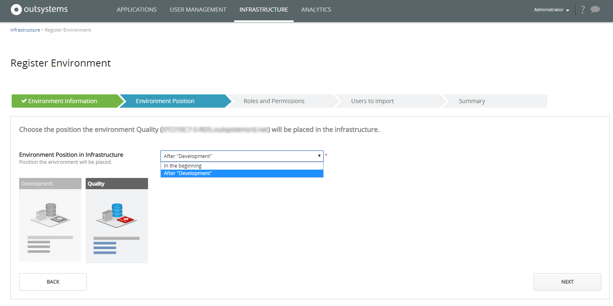
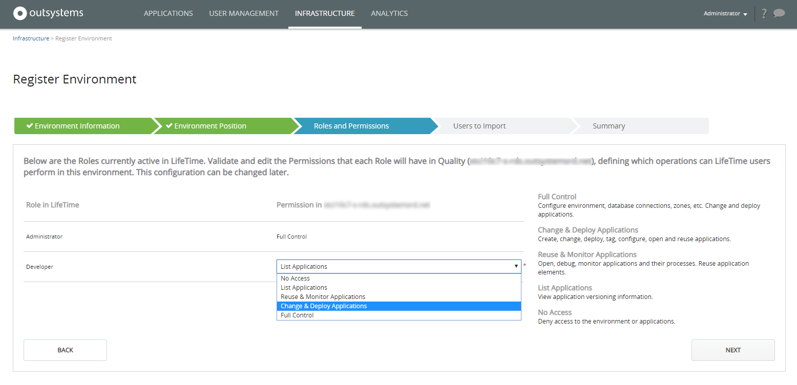
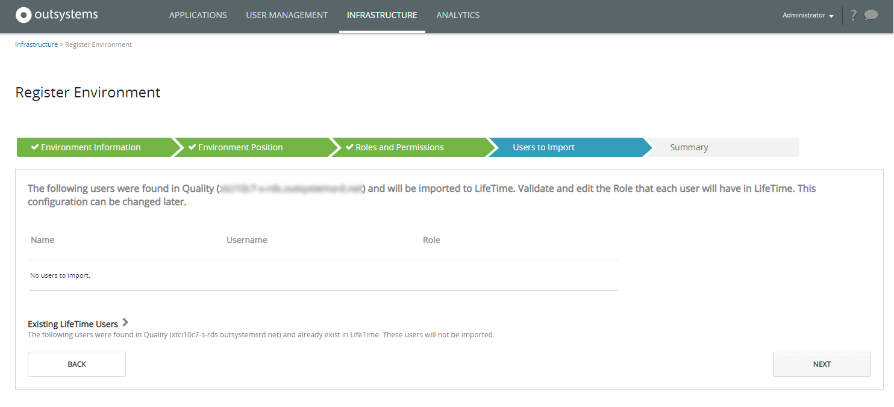
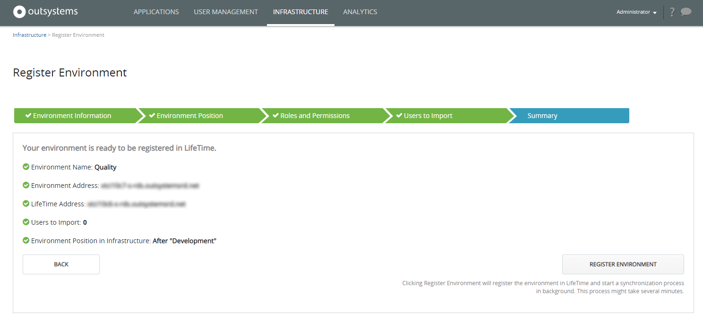
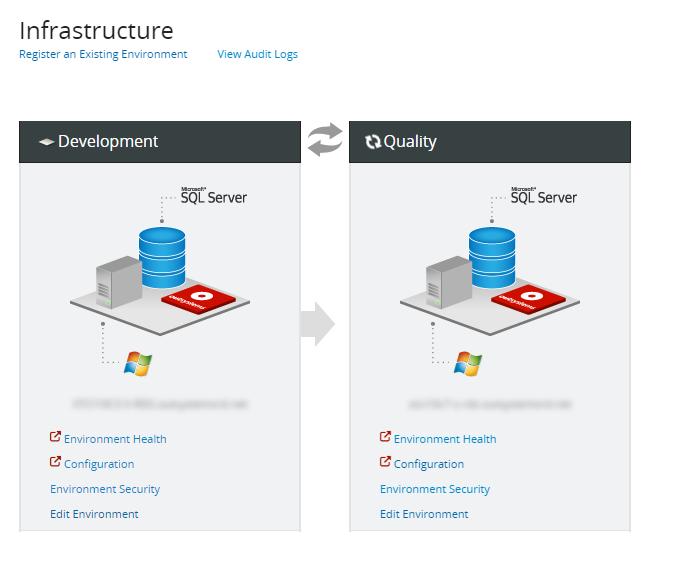

# Configure the infrastructure management console

This article applies to: **OutSystems 11**&#8195;&#8195;Other versions available: [10](https://success.outsystems.com/Documentation/10/Setting_Up_OutSystems/Configure_the_infrastructure_management_console)

LifeTime is the centralized console for managing the infrastructure, environments, applications, IT users, and security.

Given its requirements, this application must run in a **dedicated** environment. **Installing LifeTime in an environment that already has a different role in the infrastructure (such as the development or the production environment) is not a supported scenario.** To remove LifeTime from a shared environment and install it in a new dedicated environment, follow the procedure in [Reinstall the infrastructure management console in a dedicated environment](https://success.outsystems.com/Support/Enterprise_Customers/Maintenance_and_Operations/Reinstall_the_infrastructure_management_console_in_a_dedicated_environment).

This article describes the steps to configure LifeTime after you have installed it. For further information on how to manage your infrastructure in LifeTime, check how to [Manage Your OutSystems Infrastructure](../../managing-the-applications-lifecycle/initial-setup-of-an-infrastructure.md).

## Logging in LifeTime for the first time

After you have installed LifeTime, open it in your browser using the URL `https://<your_lifetime_server>/lifetime`. If you are installing OutSystems for the first time, use the default credentials (admin/admin) to login and change these credentials right after registering all your environments.

If you are upgrading from a previous OutSystems version, you may use Service Center administrator credentials to login into LifeTime.

## Register your OutSystems environments

When you login in LifeTime for the first time, you will be redirected to the **INFRASTRUCTURE** tab, where you can set up your infrastructure by registering your OutSystems environments.

 
### Prerequisites

To successfully register an OutSystems environment in LifeTime, make sure the following requirements are met:

* Both LifeTime and the OutSystems environment servers are configured to establish secure connections (https).
* The OutSystems environment has a [valid license](http://www.outsystems.com/licensing) (same Activation Code than LifeTime license).
* The OutSystems environment is not a LifeTime environment.
* The OutSystems environment is not already registered in your infrastructure.
* The OutSystems environment is running a supported Platform Server version.
* You have the credentials of a user with administration privileges on the OutSystems environment.

### Register an environment

To register an OutSystems environment in LifeTime you will be guided through a wizard where you need to:  

* Provide the environment information.
* Define the environment position in the infrastructure.
* Map LifeTime roles with environment roles.
* Import existing users from the environment.
* Review the summary and confirm.

To start the registration process of the first environment, click the **REGISTER AN OUTSYSTEMS ENVIRONMENT** button. For the remaining environments, click the **Register an Existing Environment** link.

#### Step 1. Provide the environment information

In this step you will provide the information that LifeTime needs to establish a connection to the environment you want to register:

* The **name** by which the environment will be identified in LifeTime (eg. Development or Quality). This name must be unique in your infrastructure and will be synchronized with the environment name in Service Center console.
* The **environment address** that LifeTime will use to connect to the environment.
* The **credentials** of a Service Center user having **administrator privileges**. LifeTime will use these credentials to establish the connection to the environment.
* The **LifeTime address** that the environment will use to communicate with LifeTime. This address must be reachable from the environment.

When you click the **NEXT** button, LifeTime will attempt to establish a secure two-way connection with the environment, and validates if the environment complies with all the prerequisites. If the validations are successful, LifeTime will collect from the environment the information that is required for the following steps, such as existing roles and users.

#### Step 2. Define the environment position in the infrastructure

This step does not apply when you are registering your first environment.

When you are registering the second or following environment in the infrastructure, the new environment will be positioned by default at the end of the environments sequence.

However, if you already know your environment belongs to another position in the sequence, you can set it to the correct position by changing the value in the dropdown.

After registering an environment, you will still be able to move it back and forth in the sequence using the **Switch Order** operation.

#### Step 3. Map LifeTime roles with environment permissions

In this step you will define the permission level that each LifeTime role will have in the new environment, from **No Access** to **Full Control**. This will determine which operations the LifeTime users will be able to do in that environment.

Click the dropdown next to each LifeTime role to change the permission that role will have in the environment. If you are installing OutSystems for the first time, this will be straight forward: you will only need to define which permissions you want to grant the Developer role in the environment you are registering.

#### Step 4. Import existing users from the environment

LifeTime centrally manages roles and IT users across the whole infrastructure. Therefore, when you register an environment in LifeTime, the IT users that may exist in the environment will be imported to LifeTime to consolidate them for central management.

In this step, you will validate the list of IT users that will be imported to LifeTime and set the LifeTime role you want to assign to each of them.

If you are installing OutSystems for the first time, there are no users in the environment to be imported, so you can click the **NEXT** button to proceed.

The environment users that already exist in LifeTime will not be imported. You can check the list of these users in section **Existing LifeTime Users**.

#### Step 5. Review the summary and confirm

In this final step you will be presented with a short summary of the information you have provided in all the previous steps.

Confirm the information and click the **REGISTER ENVIRONMENT** button to complete the registration process.

When you click the **REGISTER ENVIRONMENT** button, LifeTime registers the environment in the infrastructure and starts a synchronization process in background, which might take several minutes. During this period, your applications will slowly appear in the Applications area.

To proceed with the registration of another environment, click the **Register an Existing Environment** link and repeat steps 1 to 5.

## Language options

The default language of LifeTime is English, but you have the possibility to change it to Japanese, or Portuguese (Brazil). To do so, go to the Service Center console of the environment where LifeTime is installed (`https://<your_lifetime_server>/ServiceCenter`), and set up the following Site Properties in the LifeTimeCore module:

* **EnableLocale**: Set it to true to activate the translations.
* **Locale**: Choose either **ja** or **pt-BR**. If this site property is left empty, LifeTime screens are displayed according to the end user browser preferences.
