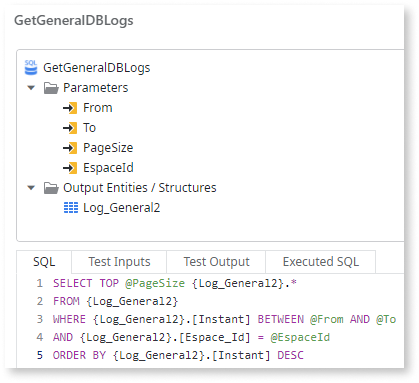
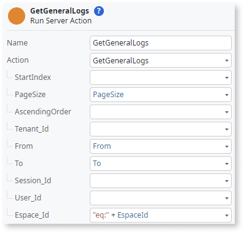

# Using the CentralizedPlatformLogs extension to access separated logs

If you store the app logs in the Database Server, you can use the [PlatformLogs extension](../../../../monitor-and-troubleshoot/logging/reference.md) to query data from the database. However, when you use the [logs separation feature](intro.md), the logs are no longer stored in the database, and you can’t use the PlatformLogs extension to access them. In that case, you must use the CentralizedPlatformLogs extension to retrieve the log data from an API.

When querying data from the database, you build your queries based on the log properties, which match the names of the database table columns for each log type. Similarly, when requesting data from the API, you need to provide the input parameters to the extension server actions. 

## Prerequisites

To use the CentralizedPlatformLogs extension, make sure you meet the following requirements:

* You have activated [log separation](intro.md).
* You use Platform Server version 11.23.0 or higher.
* You use Service Studio version 11.54.0 or higher.
  

## Transition from using the PlatformLogs extension to the CentralizedPlatformLogs extension

If you have apps using the [PlatformLogs extension](../../../../monitor-and-troubleshoot/logging/reference.md), and you activate the [logs separation feature](intro.md), you need to update your apps, migrating from the PlatformLogs extension to the CentralizedPlatformLogs extension:

1. Remove all references to PlatformLogs extension actions.

1. Replace those references with the [corresponding actions of the CentralizedPlatformLogs extension](#available-actions-reference).

## Differences between the PlatformLogs and CentralizedPlatformLogs extensions

There are some key differences between both extensions, mostly differences between accessing a database and requesting an API.

| | PlatformLogs extension | CentralizedPlatformLogs extension |
|---|---|---|
| **Time interval** | Both the **Cycle** and **Instant** fields can be used to filter the logs by date. | The time interval is defined by the parameters **From** and **To** (inclusive) which accept Date Time values. If only **To** is defined with a value `toDate`, the **From** will, by default, be defined with a value of `toDate`-15m. |
| **Number of results and skipping** | The number of results returned and skipping of rows can be defined using default database syntax (TOP, OFFSET). | The number of results can be defined using **PageSize** and skipped using **StartIndex**. |
| **Query operators** | The query can include several conditions to be applied when filtering the logs using database syntax. | Applicable to integer and text input parameter types:   `eq` - returns results that contain and exact value.   Applicable to integer and date time input parameter types:   `lt` - returns results containing values less than the provided.   `lte` - values less than or equal to the provided.   `gt` - values greater than the provided.   `gte` - values greater than or equal to the provided.  All query conditions are combined with the **AND** operator. |
| **Sorting** | The query can include a sorting command (ORDER BY) which can be applied to any log property. | Every request accepts a boolean input parameter **AscendingOrder** which sorts the logs by `Instant`. False for newest first and true for oldest first. Default is false. |
| **Restrictions** | The maximum number of logs per request is 500 (**PageSize** <= 500). | The maximum number of logs + offset logs is 10000 (**PageSize** + **StartIndex** <= 10000). |

### Unsupported scenarios

Currently, OutSystems doesn’t support the following operations with the CentralizedPlatformLogs extension:

* Joining different log entities in a single query

* Grouping records in a single query

* Complex SQL operations (such as subqueries, sorting by multiple fields, etc.)

* Filtering by the SQL exclude operator (!=)

## Example: Request the first five general logs inside a timeframe for a specific module ordered by the most recent

Both server actions responsible for fetching the data from the DB and the API in the app have the same input parameters and an equivalent response structure.

To request the first five general logs for a specific module using the PlatformLogs extension, you use the GetGeneralDBLogs action:

To do the same using the CentralizedPlatformLogs extension, you use the GetGeneralLogs action:

## Available actions reference

When using the CentralizedPlatformLogs extension, you have the following server actions available in Service Studio.

### Get&#60;LogType&#62;Logs

All of these actions have these input parameters in common:

| Parameter | Input parameter type | Default value |
|---|---|---|
| PageSize | Integer | 10 |
| StartIndex | Integer | 0 |
| AscendingOrder | Boolean | false |
| From | Date Time | Now-15m |
| To | Date Time | Now |

Additionally, each action has also the parameters represented in the following tables.

#### GetCyclicJobLogs

| Parameter | Input parameter type | Output response type |
|---|---|---|
| Application_Key | Text | Text |
| Application_Name | Text | Text |
| Cyclic_Job_Key | Text | Text |
| Cyclic_Job_Name | Text | Text |
| Duration | Text | Integer |
| Error_Id | Text | Text |
| Espace_Id | Text | Integer |
| Espace_Name | Text | Text | 
| Executed_By | Text | Text |
| Next_Run | Text | Date Time |
| Request_Key | Text | Text |
| Should_Have_Run_At | Text | Date Time |
| Tenant_Id | Text | Integer |

#### GetErrorLogs

| Parameter | Input parameter type | Output response type |
|---|---|---|
| Action_Name | Text | Text |
| Application_Key | Text | Text |
| Application_Name | Text | Text |
| Entrypoint_Name | Text | Text |
| EnvironmentInformation | Text | Text |
| Espace_Id | Text | Integer |
| Espace_Name | Text | Text |
| Id | Text | Text |
| Message | Text | Text |
| Module_Name | Text | Text |
| Request_Key | Text | Text |
| Server | Text | Text |
| Session_Id | Text | Text |
| Stack | Text | Text |
| User_Id | Text | Integer |
| Username | Text | Text |
| Tenant_Id | Text | Integer |

#### GetExtensionLogs

| Parameter | Input parameter type | Output response type |
|---|---|---|
| Action_Name | Text | Text |
| Application_Key | Text | Text |
| Application_Name | Text | Text |
| Duration | Text | Integer |
| Error_Id | Text | Text |
| Espace_Id | Text | Integer |
| Espace_Name | Text | Text |
| Executed_By | Text | Text |
| Extension_Id | Text | Integer |
| Extension_Name | Text | Text |
| Request_Key | Text | Text |
| Session_Id | Text | Text |
| Tenant_Id | Text | Integer |
| User_Id | Text | Integer |
| Username | Text | Text |

#### GetGeneralLogs

| Parameter | Input parameter type | Output response type |
|---|---|---|
| Action_Name | Text | Text |
| Application_Key | Text | Text |
| Application_Name | Text | Text |
| Client_IP | Text | Text |
| Entrypoint_Name | Text | Text |
| Error_Id | Text | Text |
| Espace_Id | Text | Integer |
| Espace_Name | Text | Text |
| Message | Text | Text |
| Message_Type | Text | Text |
| Module_Name | Text | Text |
| Request_Key | Text | Text |
| Session_Id | Text | Text |
| Tenant_Id | Text | Integer |
| User_Id | Text | Integer |
| Username | Text | Text |

#### GetIntegrationLogs

| Parameter | Input parameter type | Output response type |
|---|---|---|
| Action | Text | Text |
| Application_Key | Text | Text |
| Application_Name | Text | Text |
| Duration | Text | Integer |
| Endpoint | Text | Text |
| Error_Id | Text | Text |
| Espace_Id | Text | Integer |
| Espace_Name | Text | Text | 
| Executed_by | Text | Text |
| Id | Text | Text |
| Is_Expose | Text | Boolean |
| Request_Key | Text | Text |
| Source | Text | Text |
| Tenant_Id | Text | Integer |
| Type | Text | Text |

#### GetMobileRequestLogs

| Parameter | Input parameter type | Output response type |
|---|---|---|
| Application_Key | Text | Text |
| Application_Name | Text | Text |
| Duration | Text | Integer |
| Endpoint | Text | Text |
| Error_Id | Text | Text |
| Espace_Id | Text | Integer |
| Espace_Name | Text | Text | 
| Executed_by | Text | Text |
| Id | Text | Text |
| Login_Id | Text | Text |
| Request_Key | Text | Text |
| Screen | Text | Text |
| Source | Text | Text |
| Tenant_Id | Text | Integer |
| User_Id | Text | Integer |
| Username | Text | Text |

#### GetRequestEventLogs

| Parameter | Input parameter type | Output response type |
|---|---|---|
| ApplicationKey | Text | Text |
| ApplicationName | Text | Text |
| EventDetails | Text | Text |
| ModuleKey | Text | Text |
| ModuleName | Text | Text |
| RequestEventName | Text | Text |
| RequestKey | Text | Text |

#### GetScreenLogs

| Parameter | Input parameter type | Output response type |
|---|---|---|
| Access_Mode | Text | Text |
| Action_Name | Text | Text |
| Application_Key | Text | Text |
| Application_Name | Text | Text |
| Client_IP | Text | Text |
| Duration | Text | Integer |
| Espace_Id | Text | Integer |
| Espace_Name | Text | Text | 
| Executed_by | Text | Text |
| Request_Key | Text | Text |
| Screen | Text | Text |
| Screen_Type | Text | Text |
| Session_Bytes | Text | Integer |
| Session_Id | Text | Text |
| Session_Requests | Text | Integer |
| Tenant_Id | Text | Integer |
| User_Id | Text | Integer |
| Username | Text | Text |
| Viewstate_Bytes | Text | Integer |

#### GetServiceAPILogs

| Parameter | Input parameter type | Output response type |
|---|---|---|
| Action | Text | Text |
| Application_Key | Text | Text |
| Application_Name | Text | Text |
| Duration | Text | Integer |
| Endpoint | Text | Text |
| Entrypoint_Name | Text | Text |
| Error_Id | Text | Text |
| Espace_Id | Text | Integer |
| Espace_Name | Text | Text |
| Executed_by | Text | Text |
| Id | Text | Text |
| Login_Id | Text | Text |
| Original_Request_Key | Text | Text |
| Request_Key | Text | Text |
| Session_Id | Text | Text |
| Source | Text | Text |
| Tenant_Id | Text | Text |
| User_Id | Text | Integer |
| Username | Text | Text |

### Get&#60;LogType&#62;DetailLogs

#### GetIntegrationDetailLogs/GetMobileRequestDetailLogs/GetServiceAPIDetailLogs

All these actions have the following parameters:

| Parameter | Input parameter type | Output response type |
|---|---|---|
| AscendingOrder | Boolean | N/A |
| Detail | Text | Text |
| DetailLabel | Text | Text |
| Id | Text | Text |
| Message | Text | Text |
| Tenant_Id | Text | Text |

Note: The response from each server action contains the exact same properties, plus an additional property named **Instant** with data type DateTime.
