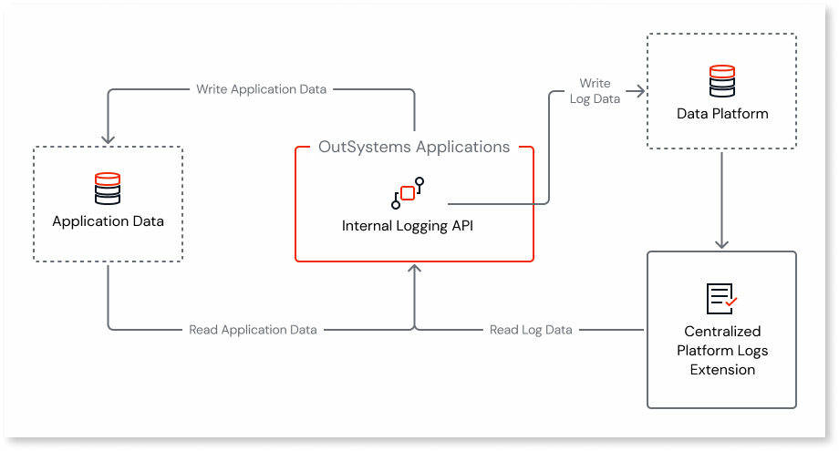
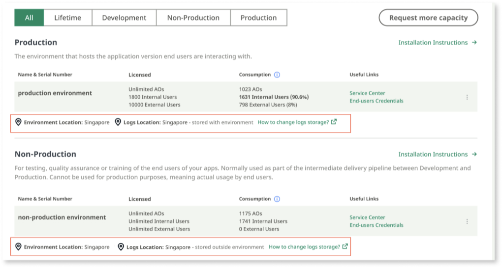

# Change logs storage location at OutSystems Cloud

Apps can produce a high volume of logs. Storing such a large volume along with the application data in the Database Server can place a high strain on an environment, as both the apps and logs share the same resources (such as database storage and CPU, for example). The high logging volume can even cause outages.

From Platform Server 11.23.1, OutSystems Cloud customers can store the log data in a different location, as was already possible for [self-managed infrastructures](../configure-separate-db.md). This way, the platform app logs don't share the same resources as the application data. When storing the log data in a different location, the types of logs and their information remain the same. 

By using the separated logs feature, you can: 

* Reduce database usage in an app environment. This improves the stability and performance of the environment. 

* Have all the performance capacity in an environment dedicated to the app. 

* Improve your observability and monitoring capabilities by using appropriate tools that won't impact the ongoing performance of app environments.

## Architecture

Separated logs are stored for 7 weeks in the Data Platform, OutSystems' native cloud service. Data Platform is a pipeline for all observability data. It uses [Open Telemetry](https://opentelemetry.io/docs/) data standards to ensure that all observability data is properly structured and tagged, and can be correlated across services. 

Each app writes its own log entries using an internal logging API, ensuring user requests aren't blocked while these logs are being written. This logging API collects log information produced by the app and sends it to the Data Platform. Data sent from your OutSystems Cloud to Data Platform is encrypted in transit using TLS 1.2 and at rest using an AES-256 algorithm. The logs can then be read using the [CentralizedPlatformLogs extension](centralized-platform-logs-extension.md). 

## Activate logs separation

If you're a new OutSystems Cloud customer, this feature will be activated for you during the onboarding process. If you're an existing customer, you need to open a support ticket and request to change the logs storage location.

### Prerequisites

To use the logs separation feature, make sure you meet the following requirements:

* Your infrastructure is on the OutSystems Cloud. 

* You use Platform Server version 11.23.1 or higher.

* You use LifeTime version 11.19.0 or higher.

Once logs are separated, you'll be able to see the log storage location at [Customer Portal](https://www.outsystems.com/csportal/).

### Open a support ticket

To request the activation of logs separation, [open a support ticket](https://www.outsystems.com/tk/redirect?g=A82EA0CB-B101-4F08-BCFB-77559EF63801).  
After selecting your infrastructure, select **Configure the platform** > **Managing Environments** > **Change logs storage location**.  
Once you submit your request, OutSystems support will plan the activation with you and inform you of all the steps.

## Impact on related capabilities

Although the logging capabilities don’t change, by changing the logs storage location, you won’t be able to access the logs directly from the database.

### Service Center and LifeTime

Changing the logs storage location won't change how Service Center and LifeTime Analytics display the logs. You’ll still be able to access the logs via Service Center and LifeTime Analytics despite the change of the logs storage location.
Service Center shows the logs from the previous four weeks, while LifeTime Analytics considers logs from the previous two weeks. However, note that after activating the logs separation feature, Service Center and LifeTime Analytics won’t show the logs from before the activation. You are only able to see the logs from the moment you activated the feature. If you need to access logs from the previous two weeks, reach out to [OutSystems support](https://www.outsystems.com/tk/redirect?g=A82EA0CB-B101-4F08-BCFB-77559EF63801).  

### PlatformLogs extension

If you use the PlatformLogs extension in Service Studio to access the logs, you need to start using the CentralizedPlatformLogs extension. While the PlatformLogs extension accesses the logs directly from the database, the CentralizedPlatformLogs extension uses an API to access the logs from the Data Platform. If you don’t update your apps, migrating from the old extension to the new one, you’ll stop seeing log records, as there won’t be any new records to fetch from the database.  
For more information, see Using the [CentralizedPlatformLogs extension](centralized-platform-logs-extension.md) to access separated logs.  

### Direct access to the database

You'll no longer be able to [query the database directly to access the log database](https://www.outsystems.com/tk/redirect?g=4cdae94f-8633-4875-98bd-a3a4ac1bd89a), after activating the logs separation feature. The alternatives are:

* Use the [CentralizedPlatformLogs extension](centralized-platform-logs-extension.md).

* Use [Log Streaming](https://www.outsystems.com/tk/redirect?g=75f48471-6193-4149-abf4-29c15e75c1f6).

