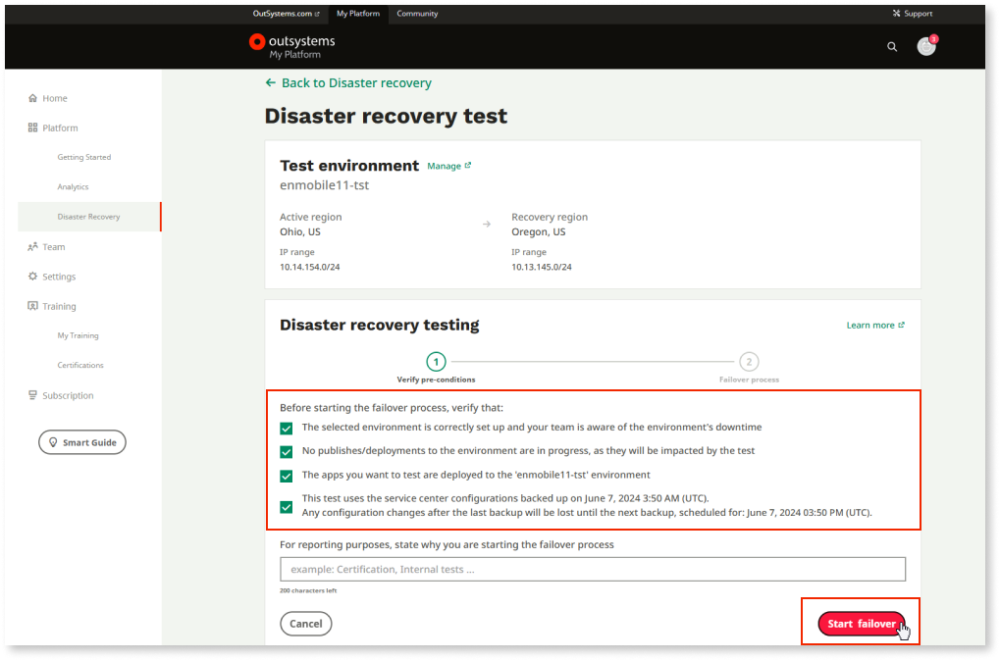

# Perform a cross-region disaster recovery test

OutSystems cross-region disaster recovery (XRDR) requires the subscription of an add-on. Please contact your OutSystems account team for more information.

A robust disaster recovery process is vital for business continuity, ensuring system availability and minimizing downtime during unexpected failures. Regular testing of these processes is crucial to verify their effectiveness and may be mandated by industry regulations. 

The OutSystems Customer Portal allows you to conduct cross-region disaster recovery tests that validate your backup and recovery procedures at any time. The test is a controlled disaster recovery failover simulation conducted in a preproduction environment. Employing the same automated failover processes triggered during a real disaster provides a realistic evaluation of recovery capabilities. This approach ensures you can validate your disaster recovery procedures without risking disruptions to your production environment or business operations.

Applies to OutSystems Cloud infrastructures only.

## Prerequisites

* You have the [cross region disaster recovery](xrdr.md) feature enabled in at least 1 environment in your infrastructure

To perform a cross-region disaster recovery test that replicates a real-world scenario of a failover during a disaster, follow these steps:

1. From the Customer Portal, go to **Disaster recovery** > **Tests**.

1. Click on **Start test** for the environment you want to test.

    

1. Check all checkboxes to verify the preconditions of the failover test and click **Start failover**.

    

    **Note**: If you fail to fulfill all preconditions, you risk losing data from the environment used for the failover test. Be aware that any changes done to the environment since its last backup will be lost irreversibly once the test procedure starts

1. In the popup, enter the environment name and click **Start failover**.

    The test progress is displayed.

    **Note**: Once the test starts, **the environment will be unavailable,** and the test cannot be stopped. Any app **data changes** done after the **last backup** of the environment **will be lost**.

    

When the test is finished, the system sends you an email confirming the failover process has been completed.

## Mandatory next steps

* Republish the factory in the new environment.

    * A new environment is created in the new region from the database backup. You must publish the factory to guarantee its stability.

* Recreate private connections: VPN (via Lifetime), Transit Gateway (via OutSystems support case), and Direct Connect (via OutSystems support case).

    * A new virtual private cloud (VPC) is created in the new region using a different class inter-domain routing (CIDR) block from the primary region. Based on the database backup, OutSystems creates all assets from scratch, that is, environment front-ends and databases.

* Reinstall client-side certificates via an OutSystems support case.

    * The new environment is created from scratch in the new region. Subsequently, you must set up the certificates in the new front-end instances.

* Reinstall server-side certificates via LifeTime.

    * The new environment is created with the default certificate (OutSystems Enterprise). If you're using a custom certificate, you must configure it LifeTime.

* Reconfigure the DNS rules via an OutSystems support case.

    * A new DNS instance is created in the new VPC. Subsequently, you must reconfigure the rules in the new instance.

* Recreate permanent database users via OutSystems support case.

    * A new database is created based on the backup. The logins in the new instance are not the same as those in the source database instance. New users must be created.

The following configurations are kept in the environment, with no need for additional setup:

* Sentry

* HIPAA

* Log separation

* WAF IP filtering rules

* External connections (in Service Center, for example, DB connections)

The new environment's front-ends and database configuration will mirror the source environment's configuration. The relational database service (RDS) instance engine version, instance type (class), and storage parameters will match. Additionally, the front-end count, instance type (class), and storage parameters will align.

## Failover test report

Once a failover test is complete, you can download the test results in PDF format. To do so, go to **Disaster recovery** > **Test** > **Test history** > **View history** and click the download icon in the **Report** column.

From the **Report** column, you can also edit the following attributes of the disaster recovery report:

* Test reason

* Result: This result is the customer's interpretation of the test's success, not the technical operation status of the failover test.

* Additional observations
