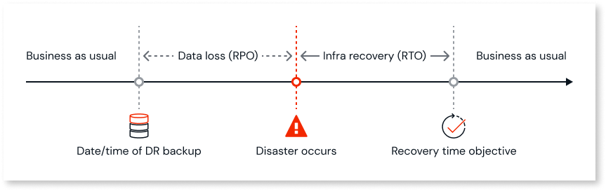

# Cross-region disaster recovery

OutSystems cross-region disaster recovery (XRDR) requires the subscription of an add-on. Please contact your OutSystems account team for more information.

OutSystems cross-region disaster recovery (XRDR) is a strategy that allows you to recover your OutSystems Cloud platform from the complete loss of an Amazon Web Services (AWS) or OutSystems Cloud region. The strategy involves backing up your data, apps, and cloud infrastructure across different geographic regions. With cross-region disaster recovery, you get business continuity and data protection against the most impactful natural or man-made disasters.
To validate your backup and recovery procedures it's also possible to [perform a cross-region disaster recovery test](disaster-recovery-test.md).

## Key concepts of cross-region disaster recovery

The following are some of the key concepts of cross-region disaster recovery:

* **Failover and failback**

    * Failover: The switch of operations from the primary site to the secondary following a disaster.

    * Failback: The process of returning operations to the primary site once it's restored.

* **Cross-region data backup**

    * Regular data backups between different cloud regions that enable the full recovery of an OutSystems Cloud platform based on these backups.

* **Recovery point objective (RPO)**

    * Defines the point in time to which data must be recovered after a disruption. For example, if an organization has an RPO of 4 hours, it means that the organization can tolerate losing up to 4 hours worth of data but no more.
 

OutSystems XRDR supports RPO of either 4 hours or 24 hours, depending on the XRDR add-on selected for the production environment. For more information, please contact your OutSystems account team.

* **Recovery time objective (RTO)**

    * Refers to the maximum acceptable amount of time that a system, app, or process can be down after a failure or disruption. For example, if an organization has an RTO of 2 hours, it means that the system or process must be up and running within 2 hours of an outage. 

    The following diagram illustrates the recovery point objective before the disaster and the recovery time objective after the disaster.

    

OutSystems XRDR supports a standard RTO of 24 hours. For production environments that include Sentry, the RTO is 48 hours.

## Benefits of cross-region disaster recovery

The following are some of the benefits of cross-region disaster recovery:

* **Enhanced resilience and business continuity**

    * You can recover your business-critical apps even when faced with the most impactful and disruptive events, which may affect a region within a 100-kilometer radius.

* **Improved data protection**

    * With cross-region data recovery, you can best protect your data by storing it encrypted in different locations.

* **Compliance**

    * For many industries (for example, healthcare and government), a business continuity disaster recovery plan that is compliant with disasters that may affect a region within a 100-kilometer radius is mandatory. OutSystems XRDR allows you to choose the recovery region from any of the available OutSystems Cloud regions. 

    * Data sovereignty: With OutSystems XRDR, you can choose the recovery region from any of the available OutSystems Cloud regions.

## How cross-regional disaster recovery works

1. Primary region: This is the main operational site where applications are running and data is stored. It is fully functional and serves end-users.

1. Disaster recovery region: A recovery site is located in a different geographic region. When the primary site is healthy, this site only contains regular data backups, stored and updated with a frequency dependent on the contracted RPO.

1. Cross-region backup: Data from the primary site is copied to the recovery site, using backups, on a fixed schedule of no more than 24 hours, depending on the contracted RPO.

## Failover triggering

Triggering a cross-region disaster recovery process results in several hours of downtime. OutSystems works with your team to assess the situation and determine the best course of action before initiating failover procedures.

### Automated failover process

OutSystems triggers an automated failover only after receiving explicit approval from at least two designated platform administrators. This ensures the decision aligns with your business needs and operational priorities. While OutSystems may notify you of potential threats or disruptions, you make the final decision to initiate failover.

Alternatively, you can request a failover through a support ticket if the following conditions are met:

* At least two designated platform administrators submit or explicitly approve the request.
* You provide a valid business justification.
* You have conducted at least one successful failover test.

OutSystems assesses whether failover is the most appropriate solution based on the available information.

### Recovery process

The recovery of your infrastructure components, runtime services, and data is fully automated and adheres to the applicable RPOs and RTOs. No manual intervention is required during this process. OutSystems ensures that the following configurations are preserved in the recovery cloud region:

* **Sentry**: Security and monitoring configurations
* **HIPAA compliance**: Ensuring adherence to healthcare data protection standards
* **Log separation**: Maintaining log integrity and separation
* **WAF IP filtering rules**: Preserving web app firewall configurations
* **External connections**: Retaining configurations such as database connections in Service Center

The new environment will mirror the source environment's configuration, including:

* Relational database service (RDS) instance engine version, instance type (class), and storage parameters.
* Front-end count, instance type (class), and storage parameters.

OutSystems notifies you once your platform is back online and operational.

### Post-failover steps

After the failover process is complete, you should take the following steps to ensure stability and optimal performance:

1. **Republish apps or the factory**: This ensures that all apps are running correctly in the new environment.
2. **Reapply configurations**: Depending on your setup, you may need to reapply minor configurations. For example, you might need to update external integrations, adjust logging settings, or verify database connections.

## Related resources

[Perform a cross-region disaster recovery test](disaster-recovery-test.md)
