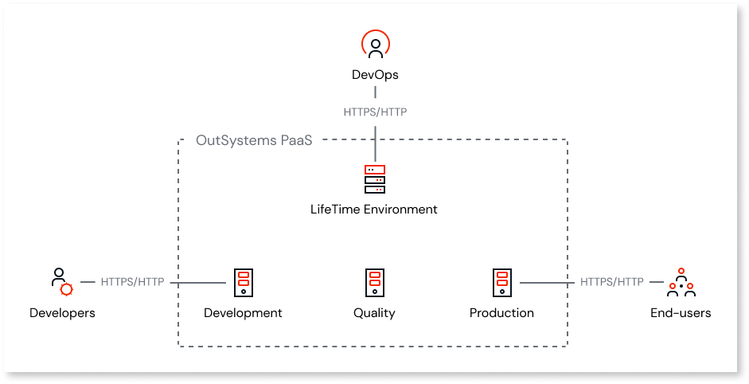
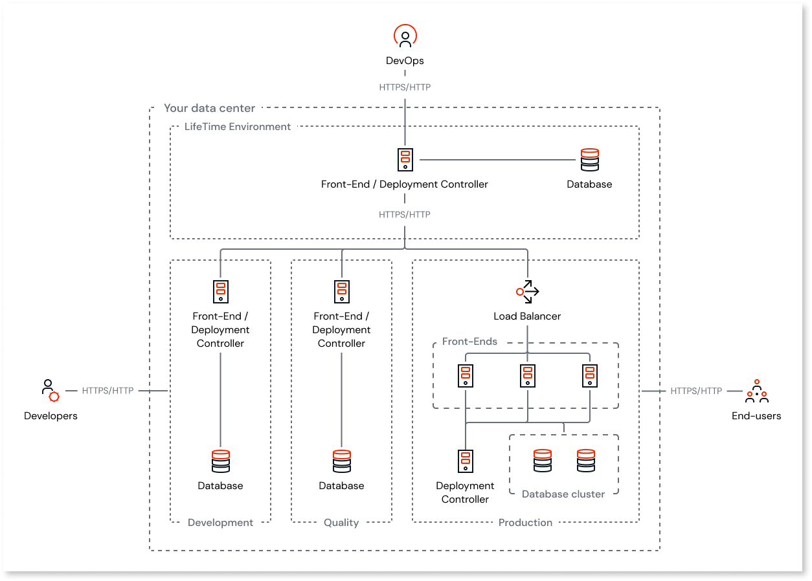
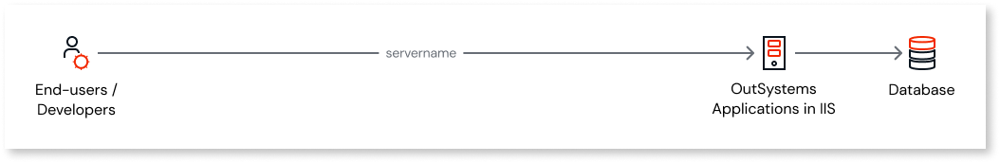
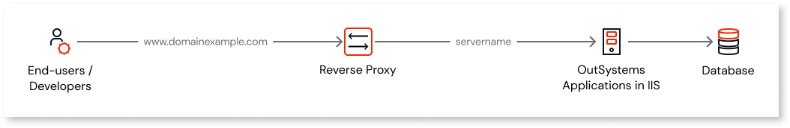
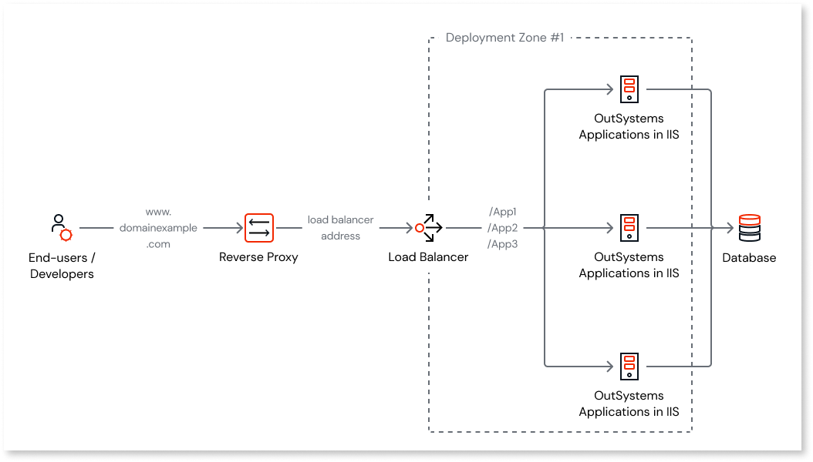
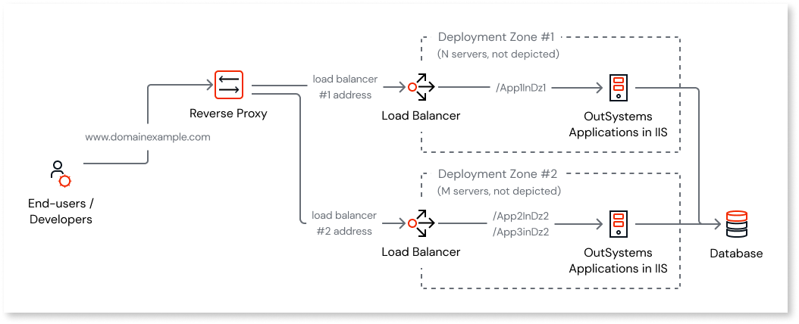
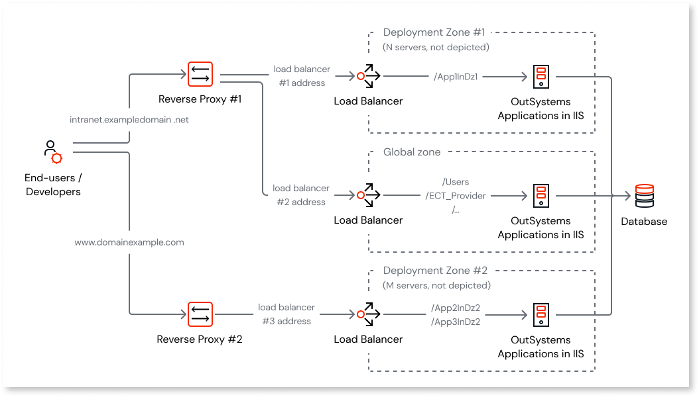
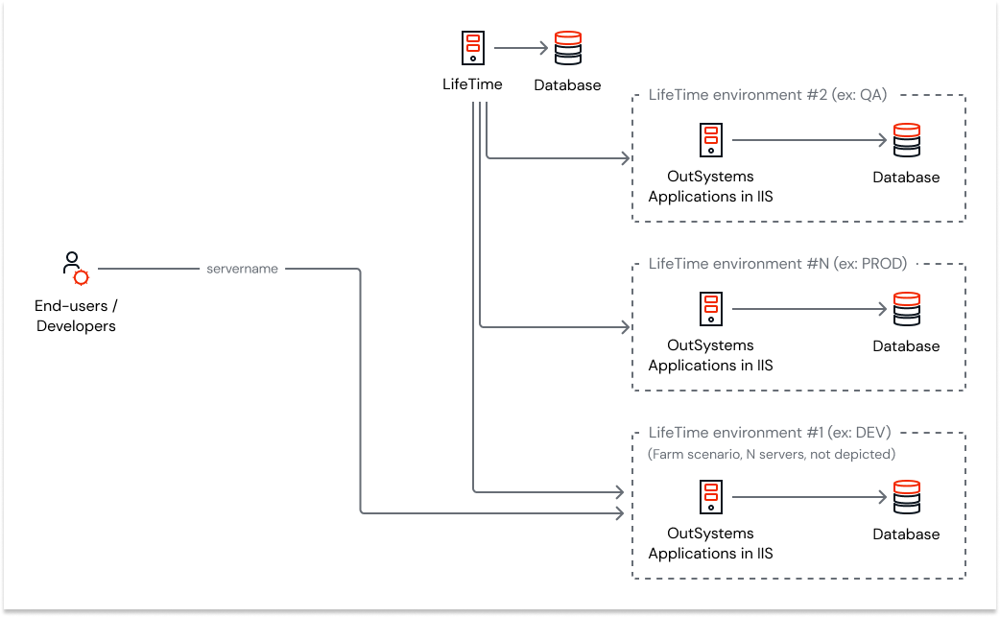
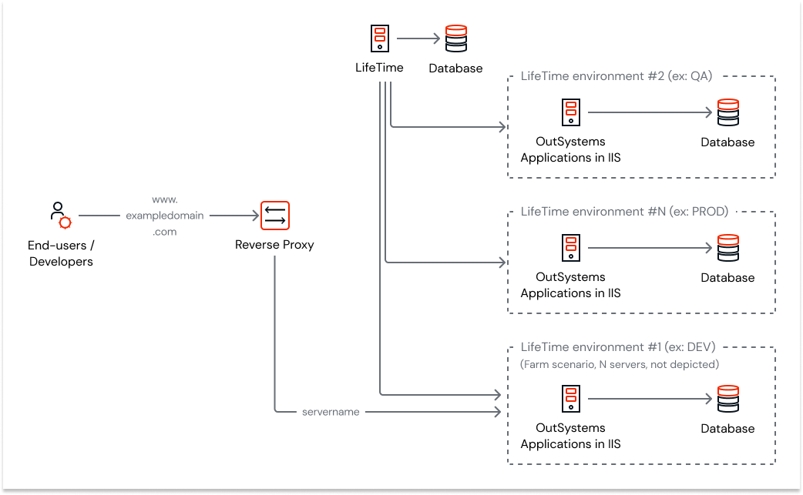
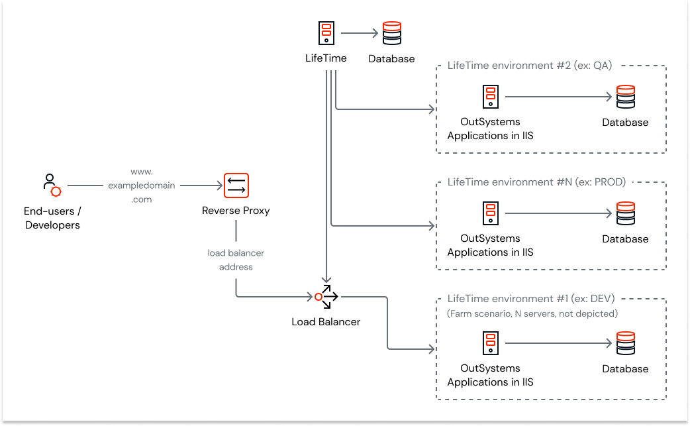

# Possible setups for an OutSystems infrastructure

This article applies to: **OutSystems 11**&#8195;&#8195;Other versions available: [10](https://success.outsystems.com/Documentation/10/Setting_Up_OutSystems/Possible_setups_for_an_OutSystems_infrastructure)

OutSystems allows delivering enterprise web and mobile applications that run in the cloud or on-premises environments. Since it covers the full application lifecycle, from development to deployment, a typical OutSystems installation is comprised of an infrastructure with four environments:

* **Development Environment:** In development is where developers and development managers build and debug apps.

* **Quality Environment:** In quality environment is where testers and business users experiment the production candidate applications or the application versions resulting from (agile) sprints. There are usually few scalability and redundancy requirements for this environment.

* **Production Environment:** In production, full control is given to the Operations team but is advisable to setup read-only access accounts for development/maintenance teams to have access to analytics information on performance and application errors.

* **LifeTime Environment:** LifeTime is the console for managing the infrastructure, environments, applications, IT users, and security.

Even though this is the typical OutSystems infrastructure, you can always adjust the infrastructure to add and remove environments, since the platform is made to scale with your own needs.

## Cloud infrastructure

Since OutSystems [runs on the cloud](cloud-architecture.md), it's possible to set up your infrastructure with a mouse-click. You only have to install Service Studio and Integration Studio development tools to start developing and deploying your applications. Learn more at [www.outsystems.com](https://www.outsystems.com).

## On-premises infrastructure

If you need to retain the control of your servers, simply install OutSystems in your own datacenter.

The scenario depicts an infrastructure where you manage the environments: Development, Quality Assurance, Production, and LifeTime. In this case you’ll have to install the Platform Server in each server of your infrastructure (front-ends and deployment controllers), and Service Center for each environment, to monitor them. You’ll also need to install LifeTime, the console to manage your infrastructure. Given its requirements, LifeTime must run in a **dedicated** environment. **Installing LifeTime in an existing environment is not supported from version OutSystems 11 onwards.**

## Environment-level configurations for different network architectures

The following configuration types are relevant for an OutSystems network architecture:

* [Environment level](#environment-level-configurations)
* [Deployment zone](#deployment-zone-configurations)
* [LifeTime](#lifetime-configurations)

For more information about network architecture, see Recommended Network Architecture.

### Environment-level configurations

This section details scenarios that can be achieved by manipulating the hostname configuration (Service Center > Administration > Environment Configuration > Hostname).

The hostname configuration is used in the following scenarios:
* Mobile applications' code and configuration files
* Links in email screens
* Service Studio **Distribute** tab (in some platform versions)
* When LifeTime needs to redirect the user to configurations in the environment

The following scenarios are unaffected by the hostname configuration in Service Center. However, they require that the network addresses and routes are correctly configured (This configuration is completely independent of the platform):
* Address that end-users enter when they access the application, for example ``http(s)://servername/MyApp``
* Address that developers use to connect to the server to publish/debug the applications via Service Studio

#### Scenario 1: Single server

Since there is a single server, the hostname configuration must be the name of the server (or ``servername`` in the diagram).

Assuming that DNS records are configured correctly, the hostname configuration can also be a fully qualified domain name (FQDN).

#### Scenario 2: Single server with a reverse proxy

You can build on scenario 1 and introduce a reverse proxy into the network architecture. In such scenarios, the reverse proxy maps requests arriving at ``http(s)://www.exampledomain.com/MyApp`` into requests to ``http(s)://servername/MyApp``.

In this scenario,you must change the hostname configuration to match ``www.exampledomain.com``.

### Deployment zone configurations

[Selective Deployment Using Deployment Zones](../../../deploying-apps/zones/intro.md) is a feature that allows you to define the distribution of apps by servers on farm environments, ensuring that servers can have different purposes. 

Each deployment zone has an address, which is used in the following scenario:
* Internal communication between apps deployed into different zones, including service APIs

#### Scenario 3: Multiple servers and a load balancer

You can build upon scenarios 1 or 2 and add more servers and a load balancer. This is useful when you need to serve more requests. In this scenario, all servers have the same set of apps.

In this scenario, you must change the hostname configuration to match ``www.exampledomain.com``, and the reverse proxy maps the requests arriving at ``http(s)://www.exampledomain.com/AppX to http(s)://loadbalancer/AppX``.

The address of the deployment zone, which is used for **internal communications**, must be configured to the address of the load balancer.

Note: For this scenario, it's important to keep the considerations regarding the usage of reverse proxies in mind. For more information, see [Using reverse proxies (applicable to all scenarios)](#using-reverse-proxies-applicable-to-all-scenarios).

#### Scenario 4: Multiple deployment zones

This complex scenario builds upon scenario 3 and adds an additional deployment zone and load balancer. App1InDZ1 can be reached at the server(s) from deployment zone 1 (DZ1), App2InDZ2 and App3InDZ2 can be reached at the server(s) from deployment zone 2 (DZ2).

In this scenario, you must use ``www.exampledomain.com`` as the hostname configuration, and the reverse proxy maps all requests arriving at ``http(s)://www.exampledomain.com/App1InDZ1`` to ``http(s)://loadbalancer1/App1InDz1`` and all requests arriving at ``http(s)://www.exampledomain.com/AppXInDZ2`` to ``http(s)://loadbalancer2/AppXInDz2``.

The address of DZ1 is configured to the address of load balancer 1, and the address of DZ2 is configured to the address of load balancer 2.

Applications in DZ1 use the address of load balancer 2 to reach applications in DZ2 and vice versa.

**Note**: For this scenario, it's important to keep the considerations regarding the usage of reverse proxies in mind. For more information, see [Using reverse proxies (applicable to all scenarios)](#using-reverse-proxies-applicable-to-all-scenarios).

#### Scenario 5: Multiple deployment zones, some (or all) zones with a single server

This is a special case of scenario 4, where some deployment zones might have single servers instead of many. If there is no load balancer for such deployment zones, then the deployment zone address and mappings in the reverse proxy can be replaced with the address of the server.

#### Scenario 6: Multiple deployment zones, some applications reachable from the Internet, other applications only reachable from the intranet

This is a variation of scenario 4, where some apps are accessible from the Internet, and some apps are accessible only from the intranet. These apps live in separate deployment zones and are accessed via different addresses. To achieve that address separation, you either make your reverse proxy rules a lot more complex or follow the easier approach and deploy a second reverse proxy. Apps in one deployment zone may or may not interact with apps in another deployment zone.

In this scenario, you must think carefully about the environment configurations.

As mentioned in previous scenarios, the address of each deployment zone must be the same address as its load balancer. Additionally, the reverse proxy must map requests from a given external URL to the address of the load balancer.

You can only **define one value for the hostname configuration**. In doing so,  this impacts a few use cases (as described in the [Environment-level configurations](#environment-level-configurations) section), so you need to understand what each of the apps in each deployment zone does and pick one of the following:
* Address of reverse proxy 1 (``intranet.exampledomain.net``)
* Address of reverse proxy 2 (``www.exampledomain.com``)

**Note**: For this scenario, it's important to keep the considerations regarding the usage of reverse proxies in mind. For more information, see [Using reverse proxies (applicable to all scenarios)](#using-reverse-proxies-applicable-to-all-scenarios).

### LifeTime configurations

LifeTime is the [centralized console for managing your OutSystems environments](../../../manage-platform-app-lifecycle/initial-setup-of-an-infrastructure.md), apps, IT users, and security, covering the full application life cycle from development to deployment.

To provide its functionality, LifeTime contacts some APIs on the servers. These APIs are exposed by Service Center and Server.API.

#### Scenario 7: LifeTime connecting to an environment with a single server

In this scenario, a given environment registered in LifeTime (for example, DEV) consists of a single server.

In this scenario, the environment address configured in LifeTime must be the name of the server (or ``servername`` in the diagram).

#### Scenario 8: LifeTime connecting to an environment with a single server and a reverse proxy

This is a slightly more complex variant of scenario 7, to which you add a reverse proxy.

In this scenario, the environment address configured in LifeTime must be the name of the server (or ``servername`` in the diagram above).

If the reverse proxy is performing SSL offloading, then you must use ``www.exampledomain.com`` as the environment address. This is needed because LifeTime requires HTTPS connections to the environments.

#### Scenario 9: LifeTime connecting to an environment with multiple servers (farm)

This scenario is a variation of scenario 8, where you introduce more servers (farm) and a load balancer for the environment.

In this scenario, the environment address configured in LifeTime can be the address of the load balancer as long as LifeTime can reach the environment's Service Center and Server.API.

If the reverse proxy is performing SSL offloading, then you must use ``www.exampledomain.com`` as the environment address.

**Note**: Deployment zones don't affect how environment addresses are configured in LifeTime, and in the case of multiple deployment zones,  you must use the address of the deployment zone where ServiceCenter is deployed.

### Using reverse proxies (applicable to all scenarios)

Requests whose source is the servers and address is the load balancer address must be served locally.

In such scenarios, mapping the load balancer address used in the deployment zone of the current server to ``127.0.0.1`` in the ``hosts`` file on each server will address the issue. This optimization is only possible to implement in situations where the deployment zone does not use the **Use HTTPS for internal communications** option, or if it does, there is a valid local certificate installed matching the address used.

If any server belongs to several deployment zones at the same time, the mapping must be done for all the deployment zones that contain the server.
