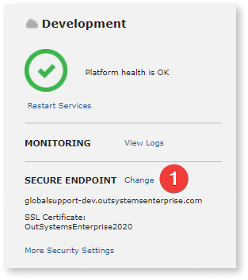

# Use your SSL domain in OutSystems Cloud

Your OutSystems cloud environment includes a valid SSL certificate with the `outsystemsenterprise.com` domain. You can also use your own domain by assigning your SSL certificate to the environment. To use your own domain, you must upload your SSL certificate that replaces the `outsystemsenterprise.com` default certificate.

To set up your environment with your company domain, follow these steps:

Setting up a different SSL domain changes the endpoint URL of the web services exposed by the environment to include the new domain. This change means that consumer apps must use the new endpoint URLs. OutSystems applications consuming your [REST APIs](../../../integration-with-systems/rest/consume-rest-apis/configure-a-consumed-rest-api-at-runtime.md) or [SOAP Web Services](../../../integration-with-systems/soap/consume/configure-runtime.md) can configure the new endpoint URLs at runtime in Service Center.

To update the new SSL domain name in a mobile application, you must regenerate the app and then distribute the updated version to end users, allowing them to download and install the new version. For more information, refer to [Customizing the mobile app domain name](../../../deploying-apps/mobile-app-packaging-delivery/generate-distribute-mobile-app/intro.md#customizing-the-mobile-app-domain-name--customizing-the-mobile-app-domain-name).

## SSL domain requirements
To configure SSL for your domain, do the following:

1. You must own the desired domain address (for example, www.example.com)

1. Obtain an SSL certificate from a trusted Certificate Authority for the desired domain so the end users can access the apps using HTTPS. For more information, refer to [How to generate a CSR](https://success.outsystems.com/Support/Enterprise_Customers/Installation/How_to_generate_a_CSR). The supported formats are either **PEM** or **PFX** with a maximum private key size of 4096 bits. Contact your Certificate Authority if none of these formats are supplied.

1. Create a CNAME Record for the domain address that points directly to the OutSystems Enterprise address your environment uses. An example is acme.outsystemsenterprise.com.

**Multi-domain (SAN) certificates:** While you can only have one certificate at a time applied to your environment, it's possible to use multiple domains. To use multiple domains,you can opt for a multi-domain (SAN) certificate.

Certificates follow a chain structure that includes the root, intermediate, and domain certificate. You must provide a certificate that contains the complete chain. Some CAs provide the full chain, while others only provide the domain certificate, requiring you to assemble the chain. Before upload, validate that your certificate contains the complete chain.

## Upload the certificate in LifeTime { #upload-certificate }

To use your domain on OutSystems Cloud, you must upload the SSL certificate before assigning it to the environments:

1. Navigate to the infrastructure management console at *`https://<yourlifetimeenvironment>/lifetime`* and go to the **Environments** tab.

1. Select the environment you want to use your own HTTPS domain.

1. Click **Change** under the **SECURE ENDPOINT** section.

    

1. Click **Add a new Domain Certificate**.

    

You'll have 3 possible options on the next screen:

* [My Domain Certificate is in PEM format](#PEM-certificate)
* [My Domain Certificate is in PFX format](#PFX-certificate)
* [I don't really know in what format my Domain Certificate is](#ZIP-bundle)

OutSystems recommends **PEM** and **PFX** certificates. These file types ensure a correct and complete certificate format.

Depending on the certificate file format, the wizard guides you through the next steps.

### Domain certificate in PEM format { #PEM-certificate }

A PEM certificate is commonly presented as a set of .PEM files (namely a certificate, a private key, and a chain), that contain text. To submit a new PEM certificate, you require the following information:

* **Domain:** The domain the certificate was signed for. Add `*.` for wildcard certificates, for instance: *.example.com. If you are submitting a multi-domain certificate (SAN) you must fill the Domain field with one of the DNS Names that your certificate is signing.

* **Certificate Name:** A unique name for the certificate of your choice.

* **Private Key:** The certificate's private key that's generated when the certificate is requested.

* **Public Key Certificate:** The public certificate issued by the Certificate Authority.

* **Certificate Chain:** The intermediate certificate trust chain. This field is optional, however, if the Certificate Authorities isn't already trusted on all browsers by default, this is mandatory.

* **PEM Password:** If the private key is protected with a header such as `----- BEGIN ENCRYPTED PRIVATE KEY -----`, the password must be entered.

### Domain certificate in PFX format { #PFX-certificate }

The PFX certificate is the most commonly used format and is identified by a single '.PFX' file with all the certificate information, including the private key, public certificate, and chain.

To submit a new PFX certificate, you require the following information:

* **Domain:** The domain the certificate was signed for. Add `*.` for wildcard certificates, for instance: *.example.com. If you are submitting a multi-domain certificate (SAN), fill the **Domain** field with one of the DNS Names that your certificate is signing.

* **Certificate Name:** A unique name for the certificate at your choice.

* **Certificate File:** The PFX file.

* **PFX Password:** The file is commonly protected with a password that's supplied by the Certificate Authority or your IT department.

### Unknown domain certificate format { #ZIP-bundle }

Choose the **I don't really know in what format my Domain certificate is** option only when it's impossible to use the PEM and PFX certificate options. 

If you have a ZIP file, unzip the zip file and check for .PFX or .PEM file. Then, choose the corresponding option on the wizard to use the .PFX or .PEM files.

It's possible to submit a ZIP file (must be .zip extension) containing the files you currently have for validation.

To submit a bundle, you require the following information:

* **Domain:** The domain the certificate was signed for. Add `*.` for wildcard certificates, for instance: *.example.com. If you are submitting a multi-domain certificate (SAN) you must fill the Domain field with one of the DNS Names that your certificate is signing.

* **Certificate Name:** A unique name for the certificate of your choice.

* **ZIP File:** The ZIP file with all the information required. The file must have a *.zip extension.

* **ZIP Password:** The password of the ZIP file, if there is one.

* **Notes:** Additional information or required passwords that can help OutSystems determine the submitted information.

### Certificate validation { #validate-certificate }

To finish the wizard, click **Validate**. Our systems will check the certificate. 

Once successful, click **Submit**.

If the certificate is not valid, the following warning message is displayed:

OutSystems recommends to double check your certificate and submit it for a new validation.  For more information about handling errors, refer to [Possible errors when validating your SSL domain certificate](https://success.outsystems.com/Support/Troubleshooting/Infrastructure_management/Possible_errors_when_validating_your_SSL_domain_certificate)

You can submit an invalid certificate. In this case, OutSystems validates the certificate manually.This can take several days to complete, according to our [target delivery](https://www.outsystems.com/legal/success/cloud-services-catalog/).

In the meanwhile, you can check the status of the certificate validation at **Environments** > **Options** > **Manage Domain certificates**.

If the certificate isn't validated you'll see the **Status** as loading:

 You can only assign the certificate to an environment once the validation process is complete.
 
OutSystems Support will only contact you if the certificate is missing any information. You can assign the certificate to an environment only once this process is complete.

## Assigning the certificate to an environment

You can now assign the certificate to an environment, directly from the **Environments** dashboard:

1. Select the environment and click **Change** in the Secure Endpoint section. 

    

1. Select the desired certificate from the drop-down box and click **Next**.  
    
    

1. Chose the hostname for the environment and tick "I have created a CNAME record on my chosen hostname".
1. Click **Update Secure Endpoint**.

    

    Updating the hostname takes approximately 5 minutes.

## Assigning a domain certificate to LifeTime { #lifetime-certificate }

You can customize the domain of the LifeTime environment. However, it's only available with a support ticket because it has a direct impact on the user session.

Follow these steps:

1. Upload the domain certificate successfully on another environment, as shown [here](#upload-certificate). If you're using a wildcard certificate that's already uploaded (because it's also used on another environment, for example), you can skip this step.

1. Create a new [support ticket](https://www.outsystems.com/goto/submit-support-case) and let us know the certificate name and the hostname to assign to LifeTime.

1. Wait for a confirmation, this is a manual operation that's done by OutSystems and can take several days to complete.

1. Make sure you [configure your DNS](#configure-dns)

## Configure your DNS { #configure-dns }

You'll need to configure your DNS to point the hostname that was chosen for an environment to it's default `outsystemsenterprise.com`. You may also do this before uploading the certificate but note that your apps will only use your domain with HTTPS after completing all the steps.

An example : 

* Our environment had the `my-environment.outsystemsenterprise.com` hostname.
* We assigned the new hostname to be `dev.example.com` after uploading a wildcard certificate valid for `*.example.com`.
* We now have to, on our DNS service, create a CNAME record where `dev.example.com` will point to `my-environment.outsystemsenterprise.com`.

* The DNS of the OutSystems servers redirects to a load balancer, with an address like *.elb.amazonaws.com. But the address of the load balancer is subject to change. You can't use the load balancer address in your DNS records.

* You should never create on your DNS an A record pointing to an OutSystems Cloud server's IP address.

* If you have enabled [secure endpoints in LifeTime](../../../security/host-header-protection.md) make sure that they're adjusted to your DNS configurations.

The diagram below shows the correct configuration in green:

## Renew the certificate

When a certificate is about to expire, a warning appears for the environment:

1. Click **Manage Domain Certificates**.
1. On the next screen, click **Renew**.

### LifeTime certificate renewal

Just like the [initial configuration of a LifeTime certificate](#lifetime-certificate), the renewal requires the same process by creating a support ticket.
