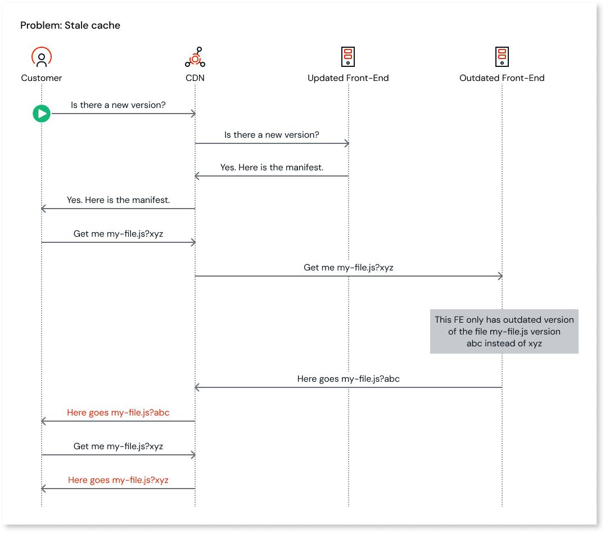
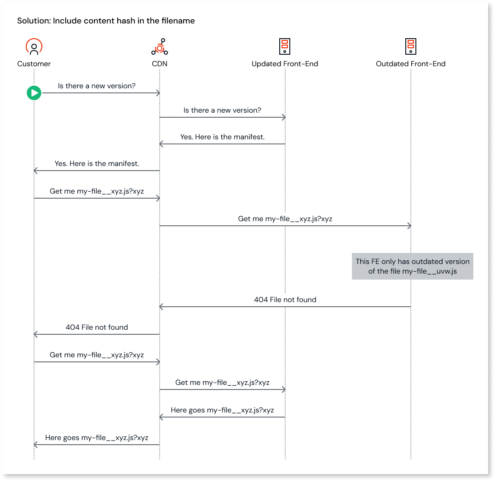

# Preventing stale cache

Applies to Mobile Apps and Reactive Web Apps only

Deploying a reactive or mobile application in an environment with multiple front-ends and a caching mechanism can result in a stale cache. To address this, starting in Platform Server 11.30.0, OutSystems introduced a feature to prevent stale cache issues.
The following sections explain what a stale cache is, how it impacts applications, and how this feature mitigates the problem.

## Caching in web and mobile apps

Web applications run on the browser and require files delivered by the server. To increase the performance and reduce server load, a caching mechanism (e.g Content Delivery Network (CDN)), can be introduced to serve some of the files.
When a browser requests a file, first the cache is consulted to check if the file exists. If the cache has the file, it replies with the file to the browser. Otherwise, the request is served by the server and the returned file is cached. Any subsequent requests for that same file will be served by the cache, until the cache invalidates the file and the request goes again to the server.

## What causes a “stale cache”?

A stale cache is one that has outdated files.

In environments with multiple front-ends, if the application being served becomes outdated in one or more front-ends, it may happen that when the browser is requesting the application files, that one of their requests hits an outdated server. This may cause an outdated file version to be served and cached. From then on, all requests for that file will be answered by the cache, which can cause the application to not work properly.

## How can this happen in OutSystems apps?

The deployment of an OutSystems app typically generates new versions of .js and other static files. When such a deployment is made to an environment with multiple front-ends it can happen, during a small time frame, that some front-ends have the new application version while others do not.

During that time frame, should an application perform a server request that hits an updated front-end, the application detects a new version is available and starts the update process. While fetching the modified files, some requests may end up on front-ends that are still not updated with the latest application version, causing the outdated file to be fetched.

When a CDN or similar caching mechanism is placed between a client and the environment, the file content returned by one of the servers for a given URL is cached until it expires or the cache is invalidated. CDNs are business-agnostic and unaware of server-side deployments. So, even when the file content changes on the server, the CDN will continue serving an outdated version. At this stage, we say the cache is stale since it is delivering an older file.

As for why it is possible to retrieve and cache a previous version of a file, this is due to the fact that while a caching mechanism looks at the entire URL, application servers ignore the hash that comes after the query string (‘?’) when serving static files. This means that, if the URL `http://app.outsystems.com/my-file.js?abc` represents the outdated file request and `http://app.outsystems.com/my-file.js?xyz` the new file request, although each URL would have their own cache entry, the application server interprets both URLs as a request to `my-file.js`.

  

## How did we tackle the problem

We addressed the stale cache issue by adding the file content hash into the filename as a suffix separated by a double underscore (“__”).
Taking the previously mentioned example, the outdated file request URL becomes `http://app.outsystems.com/my-file__abc.js?abc` and the updated file version becomes `http://app.outsystems.com/my-file__xyz.js?xyz`.
This change ensures that each URL has its own cache entry, because each one requests different resources: `my-file__abc.js` and `my-file__xyz.js`.
Should a front-end that has an outdated version of the app receive a request for `my-file__xyz.js`, a 404 (Not Found) would be returned since the `my-file__abc.js` has not yet been replaced with file `my-file__xyz.js`.

The application, upon receiving a 404, will attempt to retrieve the file a specific number of times, as an attempt for the request to land in a front-end that already has the latest application version.
Should the maximum number of attempts be reached, the application fails to load and an error is displayed to the end users.

This feature is disabled by default and can be enabled via Factory Configuration, in option **“Enable Client Runtime Filename Versioning”** under the **Publish section** of the **Platform Configurations** tab.

  

## Caveats

Before enabling the feature, the following caveats should be taken into consideration:

* Mobile applications will download most of their files again when the application is first republished or staged. This happens because the application sees the renamed files as new ones, even if their content has not changed. We recommend generating a new mobile build and distributing it to the end-users, especially in Production environments.
* Most of the files will be duplicated in the OutSystems Platform `share` and `BAR` folders, upon republishing or staging an application, since we keep both the original files and the ones that contain the hash suffix in the filename.
* Filenames will contain up to 24 more characters, so ensure that the windows [max path length of 255](https://learn.microsoft.com/en-us/windows/win32/fileio/maximum-file-path-limitation?tabs=registry) is not reached.

* This feature doesn't affect Traditional Web apps.
* The double underscore `__` becomes a reserved keyword. To ensure the correct application behavior, two or more consecutive underscores should not be used in any of the application's component or asset names.
* Application resource files with the same name but different extensions and located in the same folder **should be renamed**, as they are currently not supported.
    * The URL built to request that resource might be incorrectly generated.

## Breaking change

When this feature is enabled, hardcoded references to application resources will stop working since the filename will start to contain the content hash, as a result, resource files such as `sitemaps.xml` and `robots.txt` will also be hashed by default, causing web crawlers not to find such files.
However, if it's not intended to have specific resource filenames with a hash and therefore be susceptible to the stale cache, you can configure a regex pattern to exclude them. This regex can be specified in Factory configuration in the **"Client Runtime Filename Versioning Exclusion Regex"** option under the **Publish section** of the **Platform Configurations** tab.
