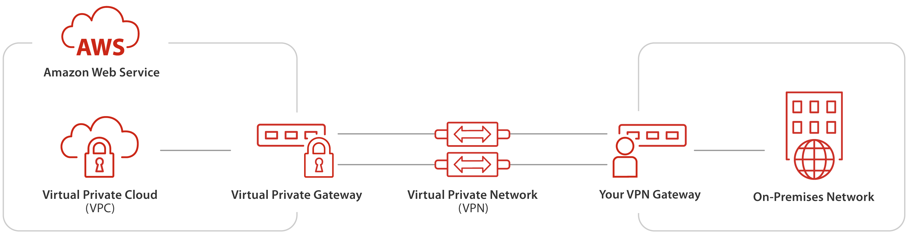
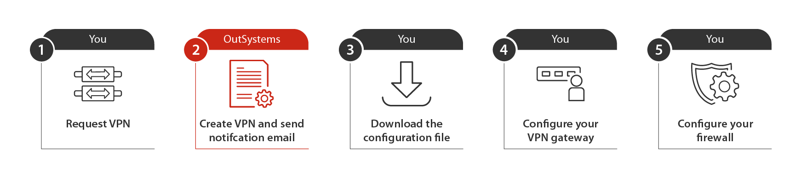
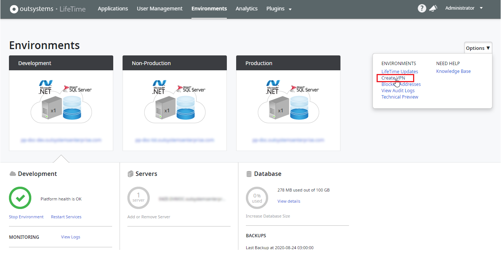
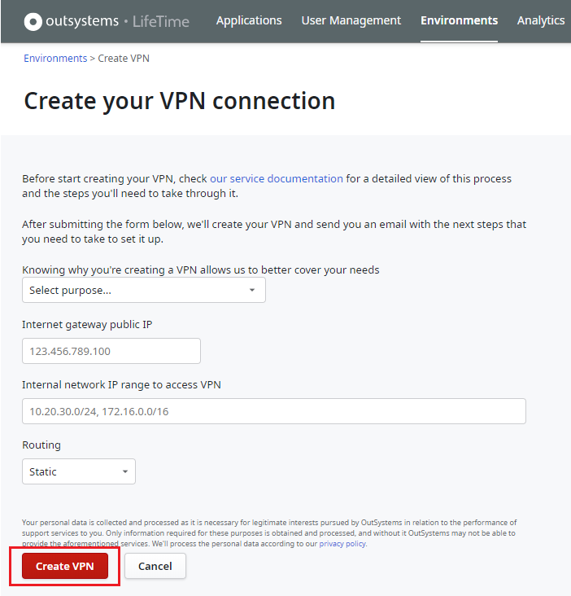
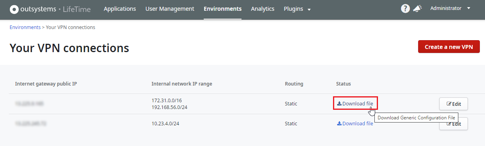
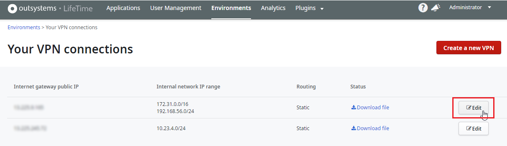
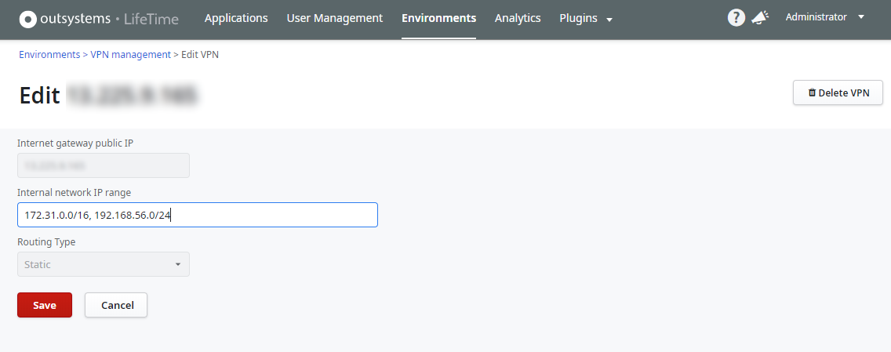

# Set up a VPN to your OutSystems Cloud

This topic details how you can set up a site-to-site VPN (virtual private network) connection that allows secure communication between your on-premises network and OutSystems Cloud.

Check in the [Cloud services catalog](https://www.outsystems.com/legal/success/cloud-services-catalog/) if the VPN service is available for your OutSystems Cloud edition.
For the editions that support VPN connectivity, a maximum of 5 connections can be added.

## VPN and your OutSystems Cloud

Your OutSystems Cloud environments are hosted on Amazon Web Services (AWS) and protected inside a virtual private cloud (VPC), which is logically isolated from the Internet and from other virtual networks in the AWS cloud.

To establish a secure connection between your on-premises network and the OutSystems Cloud you can create a site-to-site virtual private network (VPN) connection using Internet Protocol security (IPSec).

The following diagram shows a single VPN connection, with your OutSystems Cloud, hosted on AWS, shown in the left side, and your on-premises network shown on the right side:

The VPN tunnels are anchored to a virtual private gateway on the OutSystems Cloud side, and to your VPN gateway on the on-premises network side.

The VPN connection consists of two VPN tunnels. If your VPN gateway supports asymmetric routing and if the first VPN tunnel is temporarily disabled, the VPN connection automatically switches over to the second VPN tunnel so that your access isn't interrupted.

If you use your own [AWS Transit Gateway](https://aws.amazon.com/transit-gateway/) to connect OutSystems Cloud to your corporate network, you manage all the internal traffic to your OutSystems Cloud on your side. Therefore:

* The current procedure doesn't apply to you. You must set up any needed VPN connection on your side, using your AWS Transit Gateway.

* When you [request the connection to your OutSystems Cloud using your AWS Transit Gateway](../connect-tgw/connect-tgw.md), you must reconfigure any existing VPN connection on your side. After the connection with your AWS Transit Gateway is up and running, OutSystems terminates any existing VPN connection that you previously requested.

### VPN specifications { #specifications }

VPN network traffic
:   Your on-premises network must generate constant network traffic to initiate the VPN connection and keep it alive; the OutSystems Cloud can't initiate the VPN tunnel. If your Site-to-Site VPN connection experiences a period of idle time (usually 10 seconds, depending on your configuration), the tunnel may go down. To initiate the VPN connection and keep it operating, you can use one of the following options:

    * Use your VPN gateway to generate network traffic by using features such as service-level agreement (SLA) monitor.

    or

    * Ping the OutSystems cloud DNS servers.

Redundancy
:   If your VPN gateway supports asymmetric routing, configure the two VPN tunnels to ensure high-availability of the VPN connection. Amazon performs routine maintenance on the virtual private gateways, which can disable one of the VPN tunnels for a brief period. Having two VPN tunnels configured ensures the failover to the second VPN tunnel if the first VPN tunnel goes down.

    Note that Cisco ASA devices only establish a single connection with the first configured peer, whereas the second peer IP is kept down ('standby' — connected only in case peer number 1 is unreachable).

Virtual private gateway device
:   AWS defines the VPN Hardware Manufacturer for the virtual private gateway device as "Amazon AWS VPC with VPN Service".

Limitation
:   The site-to-site VPN currently doesn't support IPv6 traffic.

## Set up a VPN to OutSystems Cloud { #setup-procedure }

Before setting up your VPN, make sure to comply with the requirements and to gather the necessary information to proceed:

### Check the VPN gateway requirements { #requirements }

Your VPN gateway can be a physical or software device. Check [the list provided by AWS](https://docs.aws.amazon.com/vpn/latest/s2svpn/your-cgw.html#example-configuration-files) to know if AWS tested your VPN gateway with the site-to-site VPN. If your VPN gateway isn't in the previous list, it must meet the following requirements:

* Maintains the same static public IP address.

* Establishes IKE v1 or IKE v2 Security Association using pre-shared keys.

* Establishes IPSec Security Associations in Tunnel mode.

* Uses IPsec Dead Peer Detection (DPD).

* Uses AES128-bit or AES256-bit encryption function.

* Uses the SHA-1, SHA-256 or SHA-512 hashing function.

* Uses the Diffie-Hellman Perfect Forward Secrecy in groups 2 (1024 bit), 5 (1536 bit), 14-18 (2048 bit), 22, 23, or 24 (2048 bit).

### Gather the necessary information

Before creating a VPN connection, make sure you have the following information:

* Your Internet gateway public IP. If your VPN gateway is behind a network address translation (NAT) device that's enabled for NAT traversal (NAT-T), use the public IP address of your NAT device.

* The internal network IP range that will access the VPN.

* The type of routing that your VPN gateway supports. If the gateway supports Border Gateway Protocol (BGP), use dynamic routing, otherwise use static routing.

### Check your on-premises network

Your on-premises network internal IP address range must not overlap with the internal IP address range of your OutSystems Cloud. Check how to [find out the internal IP address range of your OutSystems Cloud](../ip-range-cloud.md).

### Make sure you have the necessary permissions

To create a VPN you must have the **Administrator role** in **LifeTime**.

## Setup overview

Make sure you read [the requirements](#requirements) before you continue.

### Step 1. Request the VPN { #request-vpn }

To request the creation of a VPN to your OutSystems Cloud, follow these steps:

1. Open **LifeTime** by accessing `https://<lifetime_environment>/lifetime`, where `<lifetime_environment>` is the address of your LifeTime environment.

1. Select the **Environments** tab and open the **Options** dropdown.

1. If you are creating the first VPN, select **Create VPN**. Otherwise, select **VPN Management** and click the **Create new VPN** button.

    

1. Fill in the form by entering the values for each field:

    * The purpose of this new VPN.

    * The **Internet gateway public IP**. If your VPN gateway is behind a network address translation (NAT) device that's enabled for NAT traversal (NAT-T), use the public IP address of your NAT device.

    * The **Internal network IP range to access VPN**, for Static routing.

    * The type of **Routing** that your VPN gateway supports. If your VPN gateway supports Border Gateway Protocol (BGP), select **Dynamic** routing, otherwise select **Static** routing.

    * The **ASN** value, for Dynamic routing.

1. Click the **Create VPN** button.

    

OutSystems starts creating your new VPN. You can check the status of the process on **Your VPN Connections** screen, under **Environments > Options > VPN Management**.

If OutSystems can't create the VPN connection using the information you provided, you get an error message describing the cause after clicking the **Create VPN** button. See [these guidelines](https://www.outsystems.com/tk/redirect?g=9b339da0-8b05-4388-83b4-f8cb8f6b5d9a) for further details.

### Step 2. OutSystems creates the VPN connection and notifies you when it's ready { #create-notify }

OutSystems creates the VPN connection on your OutSystems Cloud. Having the VPN created, OutSystems sends an email to the user that created the VPN in LifeTime. This email notifies that the VPN configuration file is ready for download and provides the information needed to configure the VPN gateway on the on-premises network.

### Step 3. Download the configuration file { #download-file }

After receiving the OutSystems email notifying about your VPN creation, you must download the VPN configuration file:

1. In LifeTime, select the **Environments** tab.

1. Open the **Options** dropdown and select **VPN Management**.

1. Identify your new VPN in the list of VPN connections and click the **Download file** link.

    

### Step 4. Configure your VPN gateway { #configure-gateway }

This step must be performed by your network engineer.

Configure your VPN gateway using the values provided in the configuration file you downloaded in Step 3.

If you want to use your own configuration, make sure your VPN gateway configuration values respect the following AWS requirements:

| Phase 1 Parameters | |
| ---|--- |
| Protocol | IKE v1 or IKE v2 |
| Authentication Method | Pre-shared Key |
| Protocol Communications | Encapsulated UDP port 500, NAT-T (UDP port 4500) |
| Encryption Algorithm | AES-128, AES-256 |
| Diffie-Hellman Group | 2 (1024 bit), 14-18 (2048 bit), 22, 23, and 24 (2048 bit) |
| Perfect Forward Secrecy (PFS) | Yes |
| Hashing Algorithm for Integrity | SHA-1,  SHA-256, SHA-512 |
| Re-negotiation time | 28800 seconds |
| Mode | Main |

| Phase 2 Parameters| |
| ---|--- |
| Protocol | IKE Phase II (IPSEC SA) |
| IPSec Protocol | ESP; UDP port 500; NAT-T is supported on your side |
| Encryption Algorithm | AES-128, AES-256 |
| Encryption Mode | Tunnel |
| Diffie-Hellman Group | 2 (1024 bit), 5 (1536 bit), 14-18 (2048 bit), 22, 23, and 24 (2048 bit) |
| Hashing Algorithm for Integrity | SHA-1,  SHA-256, SHA-512 |
| Lifetime Measurement | Time |
| Time Lifetime | 3600 seconds |

### Step 5. Configure your firewall { #configure-firewall }

This step must be performed by your network engineer.

If your on-premises network includes a firewall between the Internet and your VPN gateway, implement the following rules in the firewall:

* Allow **UDP** traffic on port **500** between your VPN gateway and each of the VPN tunnels to the OutSystems Cloud to enable the transmission of IKE packets. There should be four rules: a pair of inbound and outbound rules for each VPN tunnel.

* Allow Encapsulating Security Payload (**ESP**) traffic - IP protocol number 50 - between your VPN gateway and each of the VPN tunnels to the OutSystems Cloud to enable the transmission of IPSec packets containing the encrypted network traffic. There should be four rules: a pair of inbound and outbound rules for each VPN tunnel.

* If your OutSystems Cloud needs to access systems on your on-premises network add other inbound and outbound firewall rules. Make sure to create inbound and outbound rules for each of the VPN tunnels.
For example, to access a **SQL Server** database, allow **TCP** traffic on port **1433**, and to access an **Oracle** database, allow **TCP** traffic on port **1521**.

* If you are using **NAT-T** on your VPN gateway, allow **UDP** traffic on port **4500**. Add outbound and inbound firewall rules.

## Change the internal IP range of your VPN { #change-vpn-route }

When the internal IP range of your on-premises network that accesses your VPN changes, you need to reflect that change in your OutSystems Cloud VPN.

### Static VPN

If your VPN uses **static** routing, you can change the internal IP range of your VPN in the **VPN Management** area:

1. In LifeTime, select the **Environments** tab.

1. Open the **Options** dropdown and select **VPN Management**.

1. Identify the VPN you want to change in the list of VPN connections and click the **Edit** button.

    

1. Set the **Internal network IP range** to the new value.

    

1. Click the **Save** button.

This action updates the VPN configuration, the security groups, and the firewall, to allow traffic from the new IP range. After some minutes, your VPN is ready to use.

If OutSystems can't change the internal IP range of your VPN using the information you provided, you get an error message describing the cause after clicking the **Save** button. See [these guidelines](https://www.outsystems.com/tk/redirect?g=9b339da0-8b05-4388-83b4-f8cb8f6b5d9a) for further details.

### Dynamic VPN

If your VPN uses **dynamic** routing, OutSystems needs to change the security groups according to your new internal IP range. For this, [open a support case](https://www.outsystems.com/tk/redirect?g=A82EA0CB-B101-4F08-BCFB-77559EF63801) and ensure to include the new IP range of your on-premises network.

## Troubleshooting

Check the [VPN connectivity and troubleshooting guide](https://www.outsystems.com/tk/redirect?g=eee4da25-8b13-4bac-b8e7-dae4ece8c3ec).
