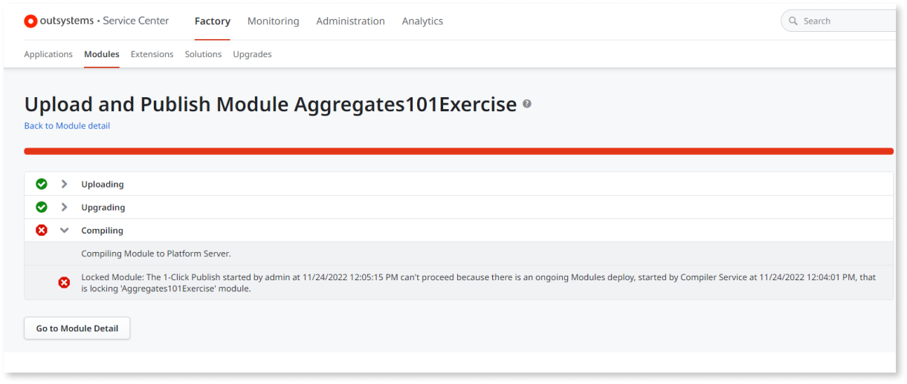
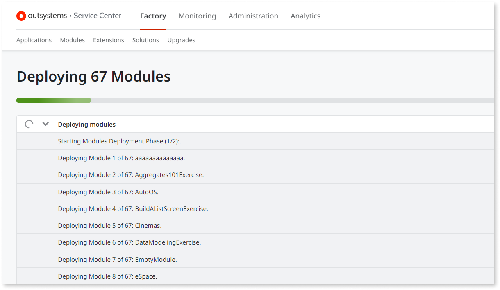
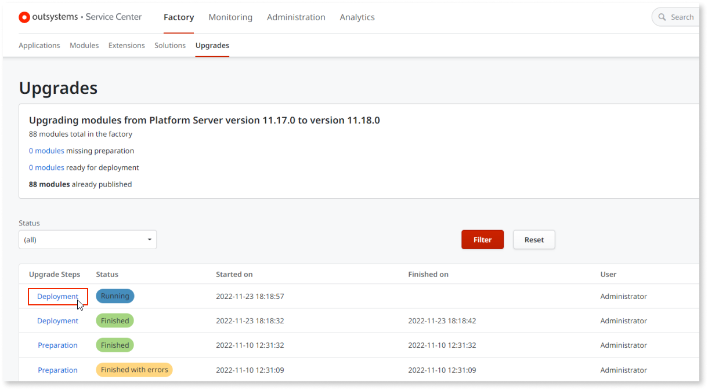
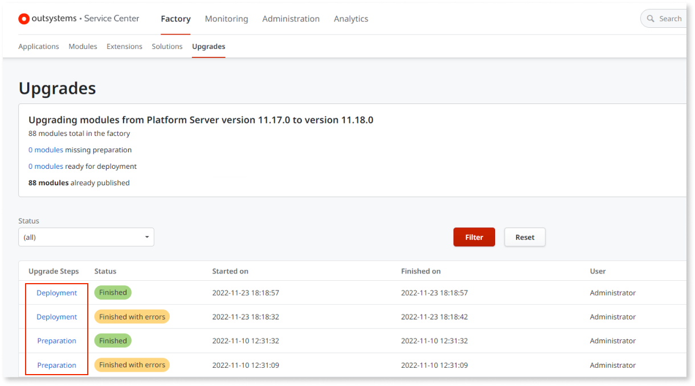

# Modules deployment step during Platform Server upgrade

Starting from Platform Server 11.19.0, the environment upgrade process includes a new optional modules deployment step.

When upgrading your OutSystems environment from your current version to Platform Server 11.19.0 (or later), after the Platform Server installation ends preparing your modules for the new version, you can now use the Deploy All feature to deploy all the previously prepared modules.

This step enables you to deploy the latest successful compilation in the current platform version, as long as that module hasn't been deployed yet.

However, if the compilation of a module in the current platform version isn't successful, or if the latest version of a module is already deployed in the current platform version, that module is skipped from the **Deploy All** process.

If you have modules ready for deployment, you can use the Deploy All feature in Service Center. To do so, go to **Factory** > **Upgrades**, and select **Deploy**.

## Modules deployment improvements

After upgrading to Platform Server 11.19.0 or later, you have the option to  use the Deploy All feature, which includes the following key improvements:

* You decide when to deploy your modules; if the time isn't right, you can skip it and do it when it's more convenient, or not  use it at all and deploy modules or apps one at a time, based on your  needs.

* The Deploy All feature supports CI/CD automation scenarios, upgrades via scripts, as well as manual upgrades via Service Center GUI and Configuration Tool in unattended mode.

* As you take advantage of Progressive Upgrades to reduce the Platform Server upgrades times, this feature allows you to upgrade more frequently, enabling you to use the most recent features and improvements.

## During the modules deployment step

The  modules deployment process must be complete before you perform the following operations for the modules being deployed:

* Publish module
* Apply configurations
* Delete module

If you try to perform any of the above operations for a module while the deployment is in progress, an error occurs. See below an example of an attempt to publish a module while the deployment is in progress: 

## Checking the progress of the modules deployment

After selecting **Deploy** to start the modules deployment, Service Center automatically shows the progress of the deployment. 

If you leave that page and want to access it again, go to **Factory** > **Upgrades** and select **Deployment** on the corresponding row of the report table.

## After the modules deployment finishes

After the modules deployment finishes successfully, your environment is fully upgraded to the new version. To see the upgrades report, go to **Factory** > **Upgrades**. 

The report table displays all the previous deployment executions and the corresponding status. To access the deployment details of each execution, select **Deployment** on the corresponding row.

If an error occurs during the modules deployment, relaunch the deployment operation by selecting the **Deploy** button again. Subsequent module deployments will only deploy the modules that failed during the previous run. If the error keeps occurring, publish your solution instead of using the Deploy All feature.

