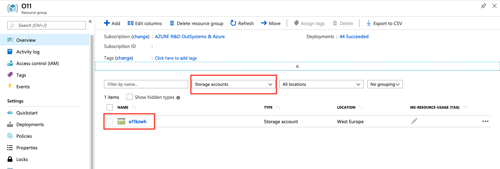
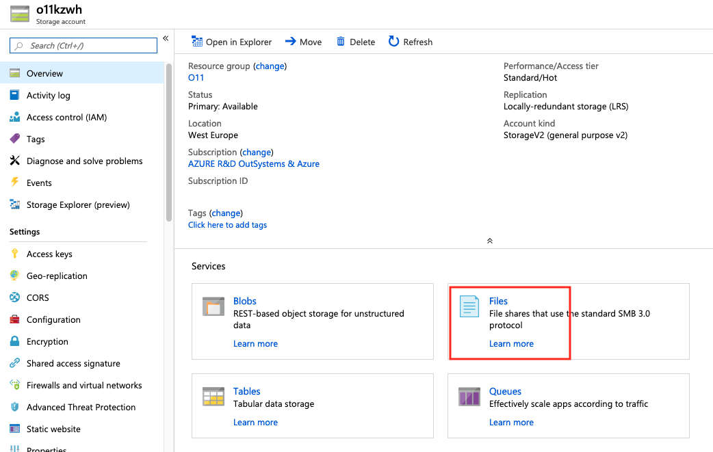
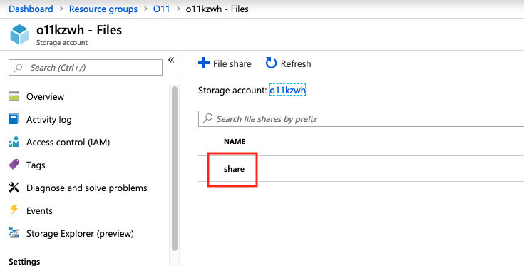
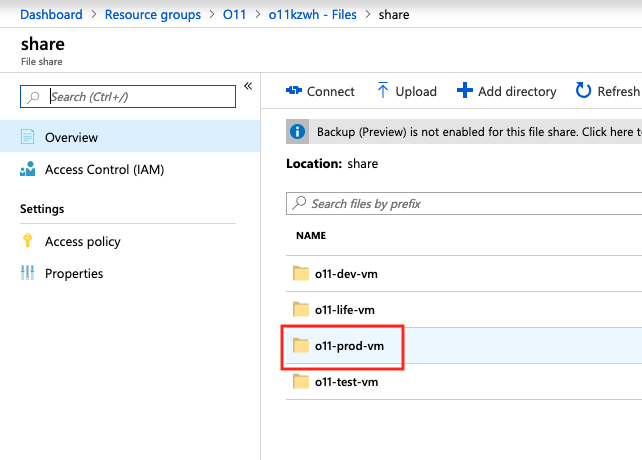
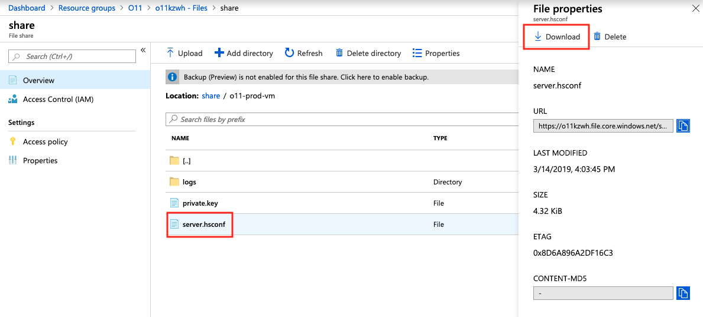
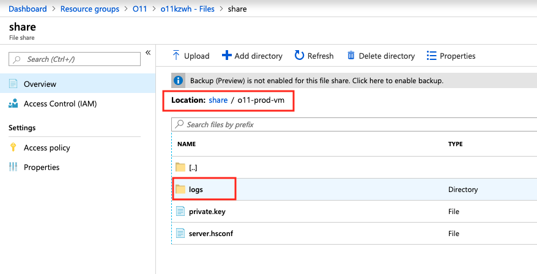
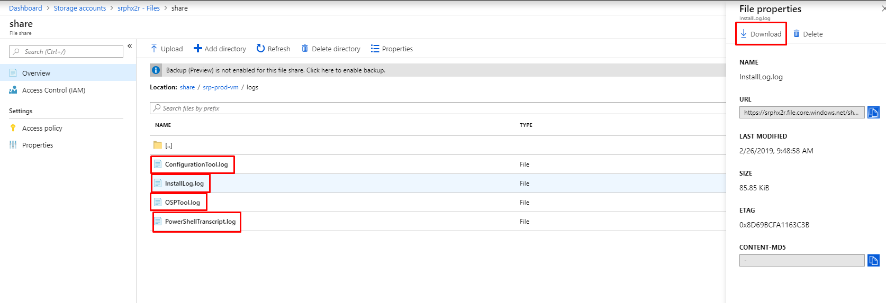
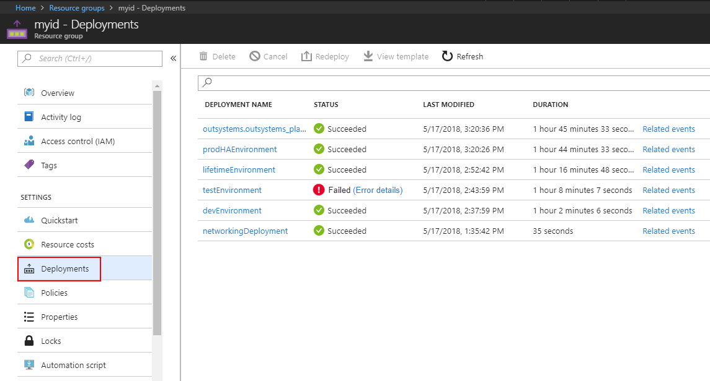
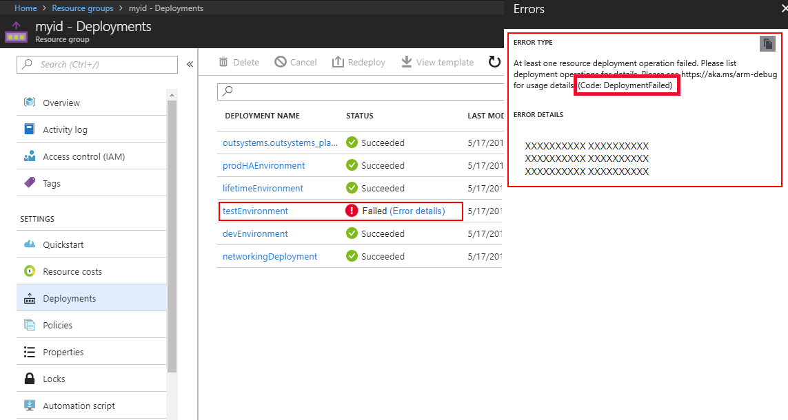

# How to Get the Setup Logs of OutSystems on Microsoft Azure

When setting up OutSystems on Microsoft Azure, the first step is to [run the solution template wizard](set-up-platform.md#run-the-solution-template-wizard "Set Up OutSystems on Microsoft Azure") to deploy OutSystems infrastructure.

If an error occurs during this deployment phase, you will need the following information to troubleshoot the problem:

* OutSystems configuration file.
* The log files generated by the deployment process.
* The Azure Portal error stack.

This article shows you how to get this information.

## Get OutSystems Configuration File

For each OutSystems environment, you have a configuration file named **server.hsconf**.

To get this configuration file, do the following:

1. On your [Azure Portal](https://portal.azure.com), go to the resource group of your OutSystems infrastructure and select [the storage account associated](quick-reference.md#storage-accounts "Quick Reference for OutSystems on Microsoft Azure") with your deployment.

    

1. On the **Storage account** details page, click **Files** to access the storage account file service.

      

1. Select **share** from the list of file shares.

      

1. Select the directory corresponding to the virtual machine of the environment.

      

1. You will find **server.hsconf** configuration file in this directory. To download the file, select the file name and click **Download**.

    

## Get the Log Files Generated by the Deployment Process

For each OutSystems environment, the infrastructure deployment process generates the following log files:

* Log.txt
* ConfigurationTool.log
* DevelopmentEnvironmentInstall.log
* PlatformServerInstall.log

To get these log files, do the following:

1. Follow steps 1 to 4 from section  **Get OutSystems Configuration Files** to go to the Directory corresponding to the virtual machine of the environment, inside the storage account file service. Then, select the **logs** directory.

      

1. You will find the log files in this directory. To download each file, select the file name and click **Download**.

    

## Get the Azure Portal Error Stack

To get the stack of the deployment error thrown in the Azure Portal, do the following:

1. Go to the Resource group of your OutSystems infrastructure and choose **Deployments** from the menu to the left.

    

1. Click on the failed deployment to expand the error and see the error stack.

    
