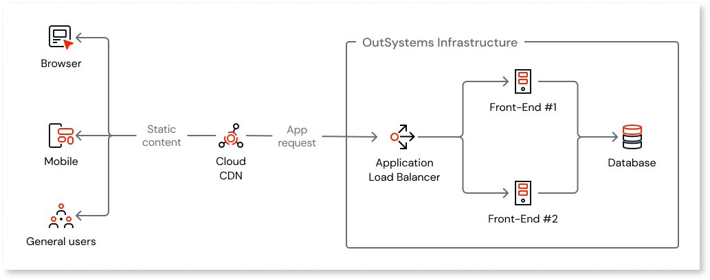
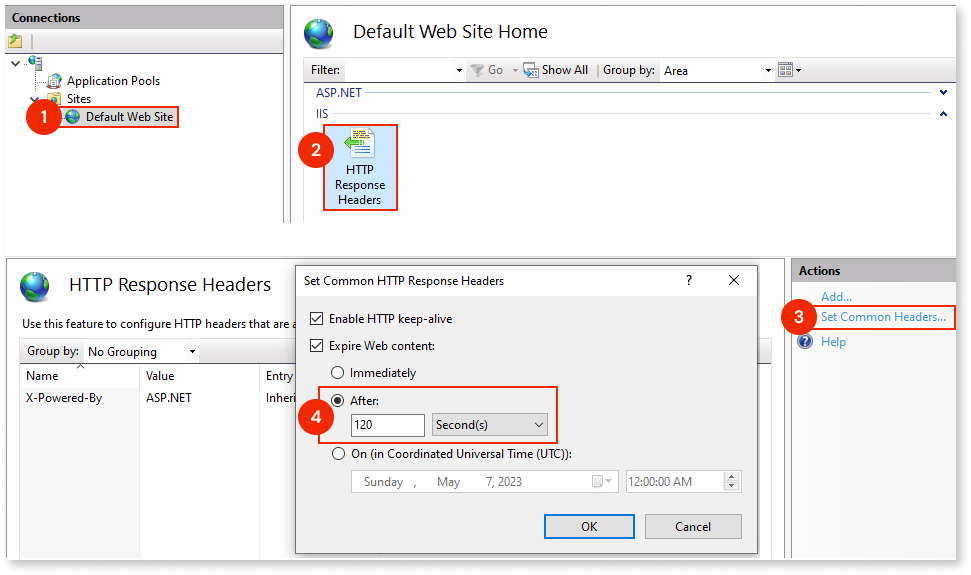

# Using a CDN with OutSystems

Content Delivery Network (CDN) is a cache mechanism useful for apps with a lot of static content.

Mobile apps usually have a lot of static content, for example, css, js, and jpeg, which means that they only change when a new version of the app is deployed.

With a CDN on your infrastructure, static content is served to users by the CDN instead of the front-end servers. This removes load from your servers allowing you to save hardware resources and improve performance.

OutSystems advises using CDN for:

* Mobile or reactive web apps
* B2C or B2B apps

With a CDN, the hydration process (ability to update the mobile app without downloading a new version from the app store) is served from the CDN instead of front-end servers. This reduces front-end load and helps prevent outages and the need for hardware scale-up.

You can use your own CDN with your OutSystems self-managed infrastructure.

Below is an example of a typical architecture:

## Configurations

To configure a CDN, the following configurations must be executed both on the CDN side and on the OutSystems side.

### CDN-specific configurations

The following configurations must be made on the CDN side:

* Add an alias canonical name (CNAME) resource record in DNS. Configure an additional CNAME in DNS with the same URL that is showing up on the Environment Hostname (Service Center Administration tab)
* Install the SSL certificate on the CDN. To ensure a secure connection, the certificate used by the apps that will be served by the CDN must be installed on the CDN. If more than one certificate is used (for different apps), then more than one CDN must be configured.
* Define the HTTP versions (supported by OutSystems) that the CDN will use: HTTP/1.1; HTTP/1.0  and, optionally, HTTP/2.
* The CDN must deliver the requests to the load balancer. To do this, ensure that the origin domain name and path are the load balancer address.
* ForwardCookies must match the cache policy. This means the CDN won’t cache the objects based on a cookie sent by the client.
* Always redirect to HTTPS. When accessing the URL via HTTP, the CDN redirects to HTTPS.
* Set up OriginKeepaliveTimeout to 60 seconds. This is the time that the CDN will maintain an idle connection before timing out.
* Set up OriginReadTimeout to 30 seconds. This is the amount of time that the CDN will wait for a response from the origin.
Avoid any configuration that allows code injection in the cached files. This prevents you from having problems with your mobile apps during your release cycle when you push new code to production.

### Cache content

The following is a list of the most common static content on OutSystems apps. OutSystems recommends configuring these files to be cached. You have the option to add others.

* *.css
* *.js
* *.gif
* *.woff
* *.woff2
* *.svg
* *.jpeg
* *.jpg
* .png
* *.otf
* *.ttf
* *.ico
* *.zip
* *.eot
* *.txt

### Cache timeout

When using a CDN, you must change the cached timeout on IIS to prevent an outage while pushing new code to production. 

By default, the cached timeout is 30 days. This means that the CDN will refresh the content in 30 days. 

When you deploy a new version of your app, you don’t want to manually purge the cache or wait 30 days until the CDN renews the cached files.

You must reduce the static content expiration time from the default 30 days to a smaller value. OutSystems recommends 2 minutes (120 seconds).

To do this, follow these steps:

1. Open Internet Information Services (IIS) Manager.
1. Go to **Sites**, and then **Default Web Site**.
1. Double-click **HTTP Response Headers**.
1. Under the **Actions** section, click **Set Common Headers…** 
1. In the dialog box, select the **Expire Web content** checkbox and set the **After** value to **120 Second(s)**.

### Service Center tuning

If your application uses the **Users** OutSystems module as the user provider, you must adjust the brute force protection mechanism. 

One of the brute force protection mechanisms of the Users module prevents multiple failed attempts from one individual user to log in. When adding a CDN, this mechanism is unable to detect the end-user IP. As such, all requests appear to come from the same source IP and multiple failed login attempts will trigger the protection mechanism. 

To avoid this situation you must change the value of the **EnableBruteForceProtectionPerIP** site property to **False**. To do this, follow these steps:

1. Open Service Center in your environment (`http://<environment>/ServiceCenter`) and log in with your credentials.
1. On the **Factory** tab, select **Modules** and filter by **Users**.
1. Select the module **Users (Users)**;
1. Inside the **Users** module detail click **Site Properties**.
1. In the list of site properties find and click  **EnableBruteForceProtectionPerIP**.
1. Change the **Effective Value** to **False**.
1. Click **Apply**.

Additional protection mechanisms, such as a firewall, are advised to compensate for disabling this setting.

