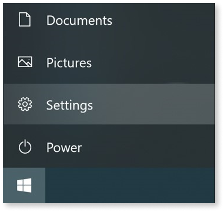
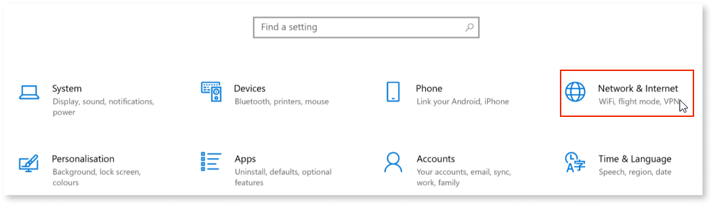
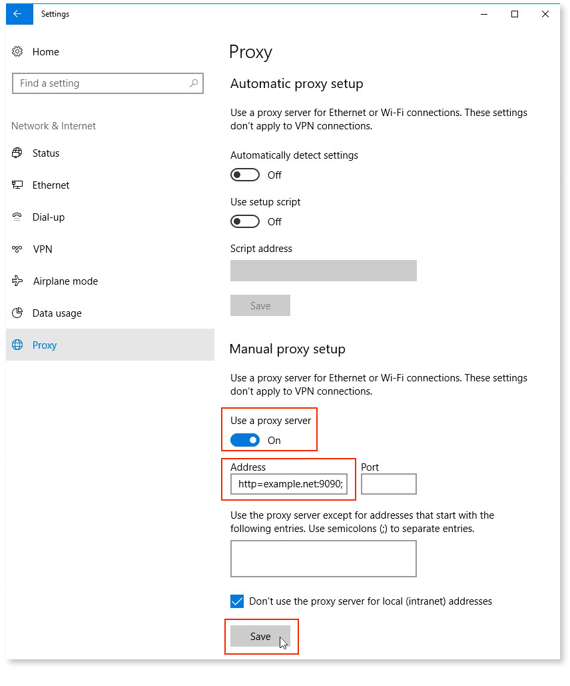
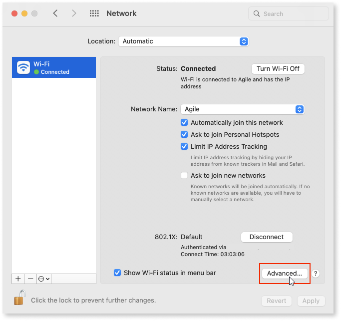
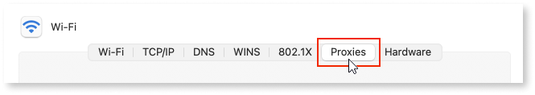
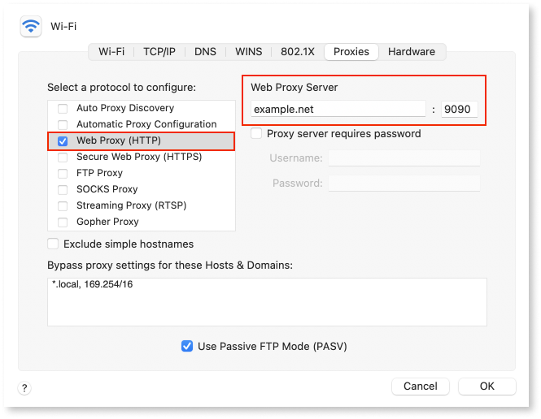
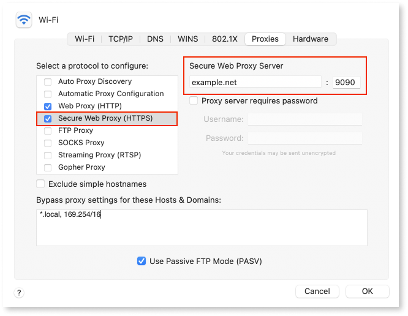
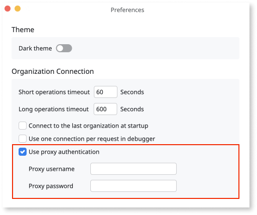

# How to configure a HTTP proxy server in Service Studio

This article explains how to configure a HTTP proxy server on your local computer so you can deploy your Service Studio apps in an OutSystems environment.

To configure a HTTP proxy server:
1. [Configure the proxy server in the operating system](#configure-the-proxy-server-in-the-operating-system)
1. [Configure the proxy authentication in Service Studio](#configure-the-proxy-authentication-in-service-studio)

## Configure the proxy server in the operating system 

Service Studio relies on the proxy servers (HTTP and HTTPS) that are defined in the operating system (Windows or MacOS) when connecting to an OutSystems environment. This means the configuration steps depend on the operating system.

### Windows setup

1. Click the **Start** icon and select **Settings**. 

    

1. Select **Network & Internet**.

    

1. Select **Proxy**.

1. On the proxy configurations screen:

    1. Enable the **Use a proxy server** toggle.

    1. In the **Address** field, enter ``http=example.net:9090;https=example.net:9090``replacing ``example.net`` with your proxy server name or IP address and ``9090`` with your proxy server port. 

    1. Leave the **Port** field empty.

        

    1. Click **Save**.

### MacOS setup

1. Open **System Preferences**.

1. Search for **Proxies**.

    

1. Click **Advanced**.

    

1. Select **Proxies**.

    

1. In the **Select a protocol to configure** section, choose **Web Proxy (HTTP)**.

    1. In the **Web proxy server** field, enter the proxy server name or IP address and port. In the example below, the proxy server is ``example.net`` and the proxy port is ``9090``.

        

1. In the **Select a protocol to configure** section, select **Secure Web Proxy (HTTPS)** and enter the proxy server name or IP address and port.

    

1. Click **Ok**.

## Configure the proxy authentication in Service Studio 

Some proxy servers require user authentication. In this case, you must provide the proxy credentials in the Service Studio Preferences dialog.

1. Open Service Studio.

1. Open the **Preferences** dialog.

1. Enable the **Use proxy authentication** option.

1. Enter the **Proxy username** and **Proxy password**.

    

1. Click **Apply**.
