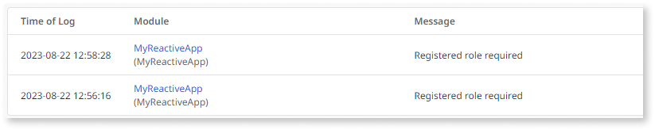
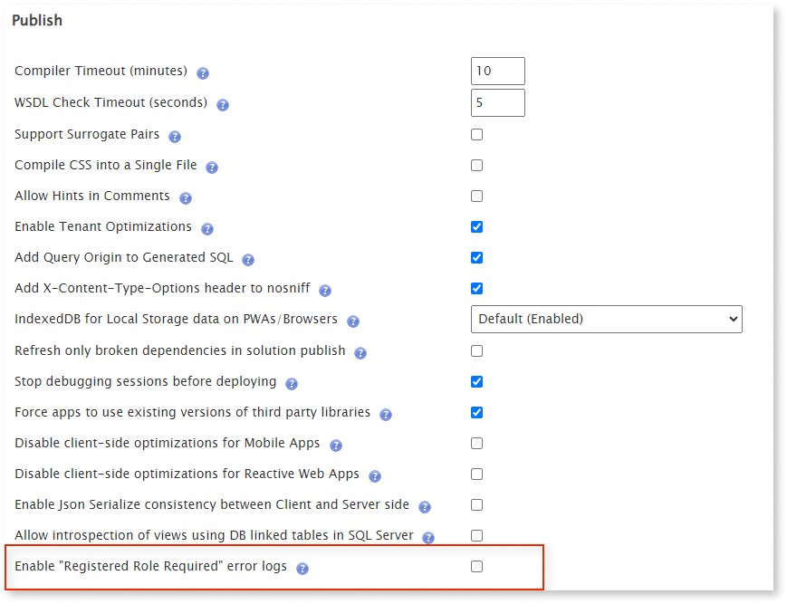

# Disable "Registered Role Required" error logs

It is common to find the error "Registered Role Required" in the platform logs. This error happens when a request is made to the server by the app after the session has expired. Considering the asynchronous nature of Reactive and Mobile apps that contain multiple actions, these errors can multiply in the Error Logs. Sometimes, OutSystems developers consider these messages not relevant and prefer to disable them. This article gives a brief context about these error messages and how to disable them.

## Context

On Reactive and Mobile apps, the session expires if it is idle for more than the time defined in [Max. Idle Time](https://success.outsystems.com/documentation/11/managing_the_applications_lifecycle/secure_the_applications/configure_app_authentication/) (20 minutes by default). The client-side (browser) can only validate the session by contacting the server. This means that the next time the user interacts with the app and it generates one or more server requests (through the execution of Server Actions, Service Actions, Data Actions, or Aggregates), the server validates if the session is still valid or not. When processing the request, the server detects that the session is no longer valid and will reject it throwing and logging a **Registered role required** exception (NotRegistered Exception). As a result, the server invalidates the session by invalidating the session cookies.

The client logic is usually prepared to receive a **NotRegistered Exception** (or Security Exception) on an exception handler in order to redirect the user to a login or invalid permissions screen. These client handlers might have the option Log Error set to **Yes**, which will log a second error on the Error Logs.

However, these apps might have a large number of actions that are executed asynchronously. For example, if a screen contains more than 5 Data Actions and the screen is refreshed, each of these requests generates 2 errors in the logs. This might lead to some log pollution.

## Procedure

This feature is only available in PS 11.21.0 and newer versions. When it is enabled, it affects all Reactive and Mobile applications after being re-published. 

Please follow these steps to disable the **Registered Role Required** error logs:

1. Install [Factory Configuration](https://www.outsystems.com/forge/component-overview/25/factory-configuration) (version 11.1.5 or newer).

1. In the **Platform Configurations** tab, uncheck the option **Enable "Registered Role Required" error logs**.

    

1. In order to make the feature effective, one needs to restart the Deployment Controller Service. For Cloud environments, one can submit a Support Case in order to request a restart of the service or, alternatively, one can [restart services in LifeTime](https://success.outsystems.com/support/troubleshooting/infrastructure_management/restart_services_on_outsystems_cloud/). 
Note that this second option is more disruptive as it also restarts IIS.

1. Create a solution in Service Center, including all Reactive and Mobile apps with corresponding dependencies. Check the option **Publish with full compilations** and publish the solution. 

Not checking that option might not guarantee that the changes take effect. 

This toggle will disable the creation of these error logs when requests reach the server. It also disables the logging of these errors by exception handlers. For additional context, as mentioned before, you can disable the client-side errors by setting **Log Error = No** in all exception handlers that might catch NotRegistered exceptions. 

But this is not an elegant solution because it's a handy task and you might suppress information about other relevant exceptions. Therefore, we implemented this alternative solution to turn off the logging of **Registered role required** errors only, even when Log Error is set to **Yes**. If a NotRegistered exception is caught by a NotRegistered, SecurityException, or AllException handler, the error is not logged. Every other type of error is still logged.
