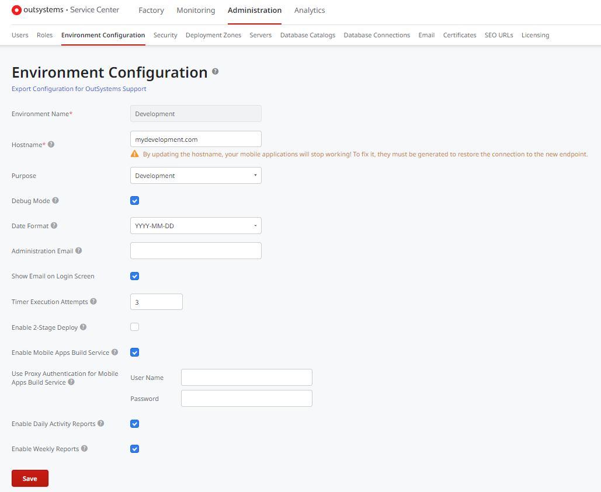

# Configure your OutSystems environment

This article applies to: **OutSystems 11**

When [installing the Platform Server](intro.md#install-the-platform-server) in an environment, the installation checklist will ask you to configure Service Center, which is the management console of your OutSystems environment.

The Service Center console of a specific environment (eg. Development, Test, Production) is accessible through the url `http://<your_server>/ServiceCenter`.

## Configure your environment

The configuration of your environment is done in the **Administration > Environment Configuration** area in Service Center console:

When installing the Platform Server for the first time, you must configure the following settings:

* Hostname

* Purpose

* Debug Mode

### Purpose

The **Purpose** of an OutSystems environment defines the main objective of the environment in the infrastructure. OutSystems changes its behavior to better fit the needs of each purpose, which reflects in optimizations and the availability of specific features.

The environment **Purpose** should only be changed when an environment is being configured for the first time or right after an upgrade to OutSystems 11. Besides those two moments, the **Purpose** should be stable throughout the life of an environment. 

In case you need to change the environment **Purpose**, the new configuration [is applied to all modules automatically](https://success.outsystems.com/Support/Enterprise_Customers/Maintenance_and_Operations/Applying_Configurations_in_Service_Center).

This setting must be set to one of the following values:

Development

:   Environments whose main purpose is to create and develop applications, requiring a fast feedback loop. Development environments use several 1-Click Publish process optimizations, like differential compilation, and allow testing/previewing data in Aggregates and SQL Queries, viewing data in Entities and using Personal Areas.

Production

:   Environments whose main purpose is to make applications available to your end users. In Production environments, reliability is a top priority so 1-Click Publish process optimizations are disabled; as a consequence, publishing an application in a Production environment can take longer than publishing the same application in a Development environment.

Non-Production

:   Environments whose main purpose is to provide a real scenario (similar to Production) where developers can test your applications and mitigate the risk of deploying them to Production while keeping features that can assist developers with debugging. In Non-Production environments 1-Click Publish process optimizations are disabled (just like Production environments) and it is still possible to test SQL Queries and preview data in Aggregates and SQL Queries (like Development environments).

Management (LifeTime)

:   This is where LifeTime, the infrastructure management console, lives. An environment with this purpose requires stability, and that’s why they also behave similarly to environments with Production purpose, with no optimizations being done.

The **Purpose** you can configure for the environment is subject to the environment's license.

#### Feature availability for different Purposes

<table markdown="1">
<caption>

Legend: Yes&#160;Available; YesX Available with restrictions; No&#160;Not available

</caption>
<tbody>
<tr>
<th style="font-weight:bold;align:center;vertical-align:middle;">Feature / Purpose</th>
<th style="font-weight:bold;align:center;vertical-align:middle;">Development</th>
<th style="font-weight:bold;align:center;vertical-align:middle;">Non-Production</th>
<th style="font-weight:bold;align:center;vertical-align:middle;">Production</th>
<th style="font-weight:bold;align:center;vertical-align:middle;">Management (LifeTime)</th>
</tr>
<tr>
<td>1-Click Publish process optimizations1</td>
<td style="align:center;background-color:#2ecc71;">Yes</td>
<td style="align:center;background-color:#dddddd;">No</td>
<td style="align:center;background-color:#dddddd;">No</td>
<td style="align:center;background-color:#dddddd;">No</td>
</tr>
<tr>
<td>Publishing of solution continues with errors2</td>
<td style="align:center;background-color:#2ecc71;">Yes</td>
<td style="align:center;background-color:#2ecc71;">Yes</td>
<td style="align:center;background-color:#dddddd;">No</td>
<td style="align:center;background-color:#dddddd;">No</td>
</tr>
<tr>
<td>Publishing the Current Running Version refreshes dependencies3</td>
<td style="align:center;background-color:#2ecc71;">Yes</td>
<td style="align:center;background-color:#dddddd;">No</td>
<td style="align:center;background-color:#dddddd;">No</td>
<td style="align:center;background-color:#dddddd;">No</td>
</tr>
<tr>
<td>Preview in Devices</td>
<td style="align:center;background-color:#2ecc71;">Yes</td>
<td style="align:center;background-color:#2ecc71;">Yes</td>
<td style="align:center;background-color:#f1c40f;">YesA</td>
<td style="align:center;background-color:#f1c40f;">Yes A</td>
</tr>
<tr>
<td>Test/preview data in Aggregates and Queries</td>
<td style="align:center;background-color:#2ecc71;">Yes</td>
<td style="align:center;background-color:#2ecc71;">Yes</td>
<td style="align:center;background-color:#dddddd;">No</td>
<td style="align:center;background-color:#dddddd;">No</td>
</tr>
<tr>
<td>View Data in Entities</td>
<td style="align:center;background-color:#2ecc71;">Yes</td>
<td style="align:center;background-color:#2ecc71;">Yes</td>
<td style="align:center;background-color:#dddddd;">No</td>
<td style="align:center;background-color:#dddddd;">No</td>
</tr>
<tr>
<td><a href="https://success.outsystems.com/Documentation/11/Developing_an_Application/Troubleshooting_Applications/Debugging_Applications/Public_and_Personal_Areas">Test and debug in Personal Area</a></td>
<td style="align:center;background-color:#f1c40f;">YesB</td>
<td style="align:center;background-color:#dddddd;">No</td>
<td style="align:center;background-color:#dddddd;">No</td>
<td style="align:center;background-color:#dddddd;">No</td>
</tr>
<tr>
<td style="width:433px;">Delete Module in Service Studio</td>
<td style="align:center;background-color:#2ecc71;">Yes</td>
<td style="align:center;background-color:#dddddd;">No</td>
<td style="align:center;background-color:#dddddd;">No</td>
<td style="align:center;background-color:#dddddd;">No</td>
</tr>
<tr>
<td>Replace Module in Service Studio4</td>
<td style="align:center;background-color:#2ecc71;">Yes</td>
<td style="align:center;background-color:#dddddd;">No</td>
<td style="align:center;background-color:#dddddd;">No</td>
<td style="align:center;background-color:#dddddd;">No</td>
</tr>
</tbody>
</table>

1- Optimizations that only concern the performance of the 1-Click Publish process; 2- When not available the publish process will stop and ask the user if it should abort or continue; 3- Publishing the Current Running Version of a solution ensures all dependencies are refreshed; 4- By publishing a module with the same name.

A- Requires enabling the site property `AvailableInProductionMode` in PreviewInDevices Module; B- Requires enabling the Module's Debug Mode.

### Environment Debug Mode

The Debug Mode of an OutSystems environment determines if Modules in that environment can be debugged in Service Studio.

To be able to debug a Module in Service Studio, **both** the environment Debug Mode and the Module Debug Mode must be enabled.

Disabling the environment Debug Mode

:   Disables the Debug Mode for each Module in the environment.

    When the Debug Mode of the environment is disabled it is not possible to enable the Debug Mode for any of the Modules.

Enabling the environment Debug Mode

:   Allows you to manually enable the Debug Mode for Modules you want to debug.

Changes in Debug Mode will only affect Modules after they have been republished; read more about [applying compile-time configurations](https://success.outsystems.com/Support/Enterprise_Customers/Maintenance_and_Operations/Applying_Configurations_in_Service_Center#Apply_Compile-time_Configurations).

Note: When disabling the Debug Mode of an environment you will only need to republish the Modules whose Debug Mode was previously enabled.

When you publish a Module for the first time, the Debug Mode of the Module is set according to the Debug Mode of that environment.
