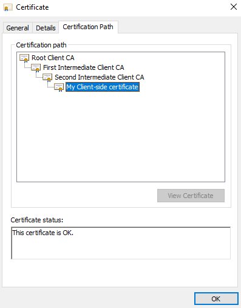
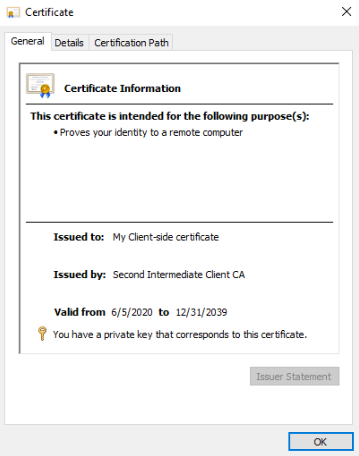

# Installing client side certificates on self-managed environments

To make certificate authenticated requests to web services using SOAP / REST APIs hosted on other networks (server-side) you’ll need to configure the Platform Server (client-side) to bear the certificate so that it’s able to send it to the client-side.

The client side certificate needs to be configured in each front-end of the environment that will consume the Web Services. This document guides you through the process.

For OutSystems cloud environments, please check [this document](https://success.outsystems.com/Support/Enterprise_Customers/Maintenance_and_Operations/Requesting_to_install_client-side_certificates_on_OutSystems_PaaS).

## Installing the client-side certificate

The certificate needs to be installed through Microsoft Management Console (MMC) under Certificates snap-in.

1. Make sure the service CNG Key Isolation Service is running. If not, change it to "Automatic" and start it.
1. Install the certificate on the Personal Store:
    1. Open the Microsoft Management Console (Start > MMC);
    1. go to **File** >  **Add/Remove Snap-in**;
    1. on the left list, select **Certificates** and click **Add**; 
    1. on the certificates snap-in window, select **Computer Account**. Click next;
    1. select **Local Computer**. Click **Finish**;
    1. click **OK**;
    1. on the left side menu, expand **Certificates(Local Computer)** > **Personal** > **Certificates**;
    1. on the left side folder, select the **Certificates** folder under **Personal**;
    1. right-click it and select **All Tasks** > **Import...** to open the Certificate Import Wizard:
        1. click **Next**;
        1. click on **Browser** and browse for the certificate file;
        1. click **Next**;
        1. make sure that **Automatically select the certificate store based on the type of certificate** is selected;
        1. click **Next**;
        1. click on **Finish**.       
1.   Verify if the certificate and the CAs are installed in the correct stores and the Root Certification Authority (CA) is trusted:

* Go back to the location where the certificate file is (under **MMC** > **Certificates** > **Personal** > **Certificates**);
* right-click on the certificate and select **Open**;
* on the **Certification Path** tab, find all the CAs used to validate the certificate;

    

* under **MMC** > **Certificates (Local Computer)** > **Trusted Root Certification Authorities** > **Certificates**, see if the Root CA (the first element in the certification path, in the example above 'Root Client CA')  appears on the list. If it is, skip the next step.

1. If the CA isn't in the Trusted Root Certification Authorities store, you need to add it.

1. Verify that the remaining CAs, if any (in the example above, there’s two, 'First Intermediate Client CA' and 'Second Intermediate Client CA') appear under **MMC** > **Certificates (Local Computer)** > **Intermediate Certification Authorities** > **Certificates**.

    If any are missing, you can import them (similarly to the previous step, but choose the **Intermediate Certification Authorities** store); you can also copy and paste or drag the certificates in MMC to move them to the correct location.

## Configure  the certificate permissions

This step is only necessary if the certificate *isn't* a CER type certificate.

For certificates that aren't of CER type, configure the certificate's security to grant read permissions for the following groups/users:

* **IIS_IUSRS** (the group for IIS worker process accounts, the identity where the application pool runs under);

* **NETWORK SERVICE** (local account used by Windows service control manager).

To do so, follow these steps:

1. Open the Microsoft Management Console (**Start** > **MMC**);
1. choose **Certificates (Local Computer)** > **Personal** > **Certificates**;
1. right-click on the certificate > **All Tasks** > **Manage private keys** > **Add...**;
1. add the following groups/users:
    * IIS_IUSRS;
    * NETWORK SERVICE;
1. confirm both have 'Read' permissions;
1. select **Apply**.

## Export the certificate

Export the public certificate to the following path: D:\Certificates.

When adding certificates due to the installation of a new front end, make sure to use the same name as configured either in Service Center and/or the previous machines when exporting the certificate.

1. Open the Microsoft Management Console (**Start** > **MMC**);
1. select **Certificates (Local Computer)** > **Personal** > **Certificates**;
1. right-click on the certificate > **All Tasks** > **Export**;
1. choose the option to export the certificate without the private key;
1. choose the format to be DER encoded binary X.509 (CER);
1. save the file into D:\Certificates;

For environments with more than 1 front end, these instructions need to be followed on all front end servers

## Troubleshooting the client side certificate installation

If you are having trouble using client-side authentication, besides double checking the usage of the certificate itself in your application, verify the following:

* Make sure the certificate you’ve installed includes the private key. Otherwise, client authentication can’t be used at runtime.

    1. Go to the location where the certificate file is (under **MMC** > **Certificates** > **Personal** > **Certificates**);
    1. right-click on the certificate and select **Open**;
    1. on the **General** tab, there should be the indication 'You have a private key that corresponds to this certificate'

        

* Verify that the certificate's permissions for the private key are [correctly configured](https://success.outsystems.com/Support/Enterprise_Customers/Maintenance_and_Operations/Installing_client_side_certificates_on_on-premises_environments#Configure__the_certificate_permissions).

* Confirm that no CA or certificate is missing. 

    You might have more than one certificate file. They can contain the same certificate in different file formats or each certificate/CA might be separated. They should be imported such that the certification path is included in the certificate store.

    Note: re-importing a certificate containing a private key resets the private key permissions to the default.

