# How to install an SSL Certificate in self-managed environments

**The following instructions apply to self-managed infrastructures only.**

The OutSystems Cloud environments include valid SSL certificates, by default, with the outsystemsenterprise.com domain. Should you wish to customize your environment domain please refer to [this article](ssl-domain-cloud/ssl-domain-cloud.md).

An SSL certificate binds a cryptographic key to an organization’s details. When such a certificate is installed in an application server, the HTTPS protocol is activated. This creates an encrypted channel between your web server and your visitor’s web browser, allowing the transmission of private information without being eavesdropped or tampered.

This article contains instructions on how to request and install a certificate in your application server so that your OutSystems applications can be used over secure connections via HTTPS. It applies to .NET/Windows stacks.

These instructions focus on the scenario in which your server is only accessible via the same name, even if over multiple IP addresses. If you need to have your server accessible via two (or more) different names (and IP addresses), that is, one for the internal and another for the external network, you must repeat these instructions for each name, or use a multi-domain certificate.

**It's expected that you have a fair knowledge of administering a server (including using the command line) and managing certificates, to follow this document.**

Reach out to your network, system or infrastructure administrator if you need help in following specific instructions in your infrastructure.

## Creating a Certificate Signing Request (CSR)

A typical step before requesting a new certificate or renew an existing one, is to generate a CSR to be provided to the Certificate Authority. If you need instructions on how to generate a CSR, refer to [this article](https://success.outsystems.com/Support/Enterprise_Customers/Installation/How_to_generate_a_CSR). If you already have a CSR, proceed to the next section.

## Acquiring the SSL certificate

After you have created your Certificate Signing Request (the .txt file), you need to acquire the certificate before installing it in your application server.

There are two ways to obtain a certificate:

* Contact one Certification Authority
* Contact your company's Certification Authority, if there is one

**Important Note:**

Self-signed certificates shouldn't be used with OutSystems 11.

Check the [OutSystems System Requirements](system-requirements.md) for more information about the supported configurations.

## Installing the SSL certificate

**Important Note:**
Certificates have a chain comprised of the following:
* Root > Intermediate > Final server (domain) certificate

​​Some Certificate Authorities issue the certificate with the complete chain, and others issue the final server (domain) certificate only, instructing the users to create the remaining parts of the chain.
Before proceeding with the installation, check the integrity of your certificate, for example, using [SSL Checker](https://www.sslshopper.com/ssl-checker.html).

Once you have acquired your certificate, you need to install it in your application server. The following sections include instructions on how to do it, for each of the application servers supported by OutSystems. These instructions assume that you have OutSystems installed, already. For instructions on how to install OutSystems, refer to [Setting Up OutSystems](./intro.md).

**Note:**

You must run all commands as a user with Administrator privileges.

### Importing the root and intermediate certificates

If your certification authority provided you with a root certificate and/or one or more intermediate certificates, you need to import them before installing your final server certificate. This ensures that you have a proper certification path that validates your server certificate. You will need to repeat these instructions for each intermediate certificate:

1. Click the Windows Start button, type **mmc**, and press the **Enter** key to run the Microsoft Management Console.
1. Click **Yes** to allow this app to make changes to your device.

    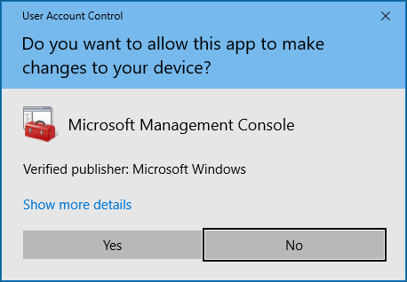

    The Microsoft Management Console window opens.

    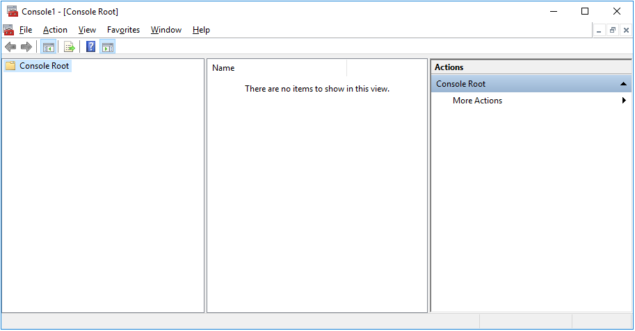

1. Go to **File > Add/Remove Snap-in...**

    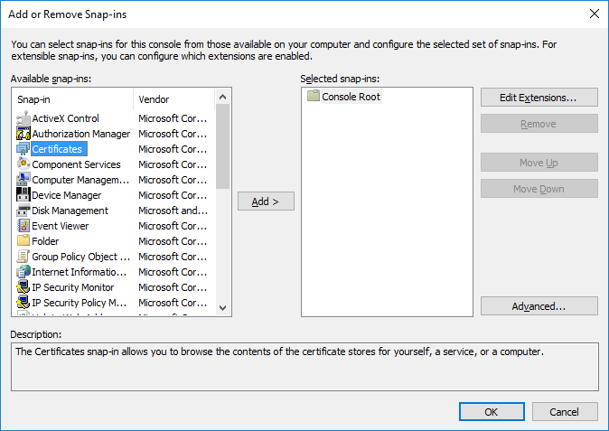

1. Select **Certificates** and click **Add**. The **Certificate snap-in** window opens.
    
    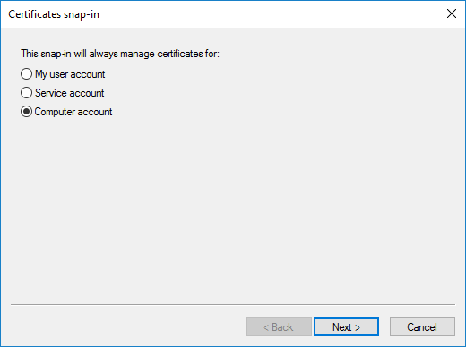

1. Select **Computer Account** and click **Next >**.
1. Select **Local Computer** and click **Finish**.

    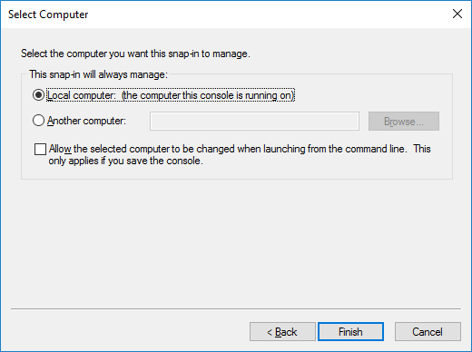

1. Click **OK** to close the **add/remove snap-in** window.
1. Expand the **Certificates (Local Computer)** entry on the left side.

    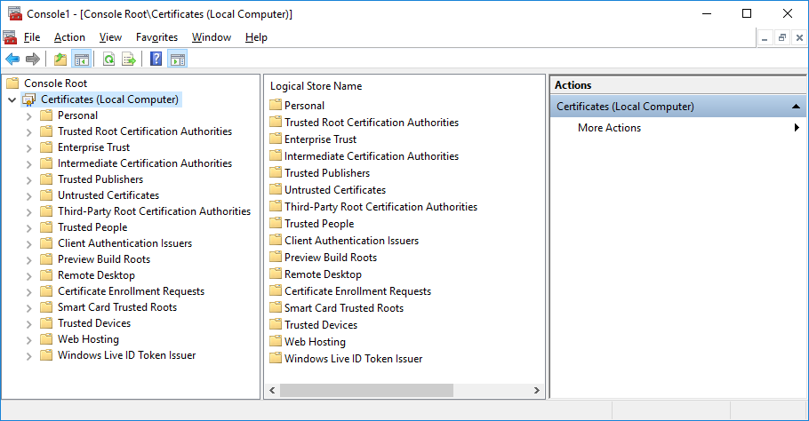

1. If you are installing a Root certificate, navigate to **Trusted Root Certification Authorities**, expand it, and select the **Certificates** entry.

1. Right-click on **Certificates**, then select **All Tasks > Import...**

    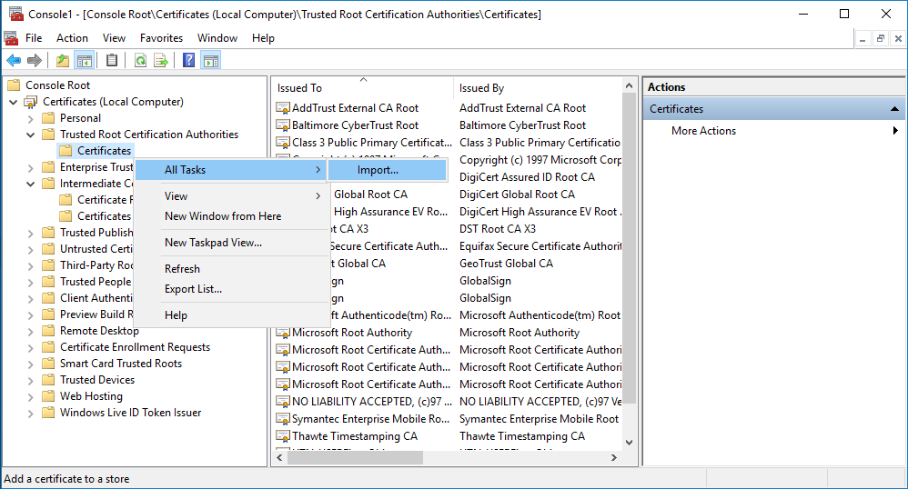

    The **Certificate Import Wizard** opens.

    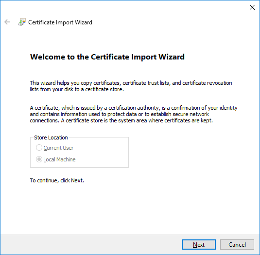

1. In the Certificate Import Wizard, click **Next**.
1. In the **File to Import** section, browse the location of your root or intermediate certificate (for example, *MyCA_Root_or_Intermediate.cer*), select it, and click **Next**.

    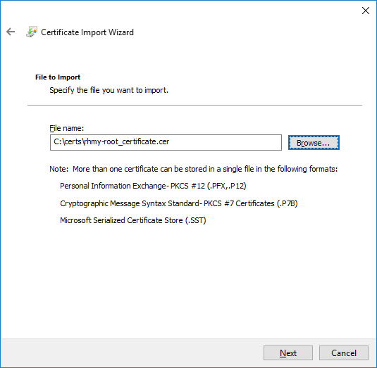

1. In the **Certificate Store** section, select the **Place all certificates in the following store** bullet.
    * If you are installing a Root certificate, choose the **Trusted Root Certification Authorities** certification store.
    * If you are installing an Intermediate certificate, choose the **Intermediate Certification Authorities** certification store.

        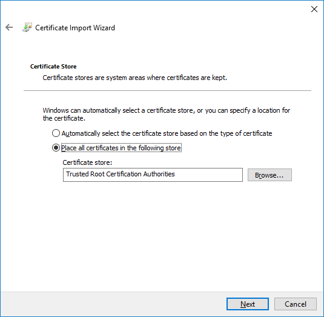

1. Click **Next**. A screen shows an overview of the certificate you are importing.

    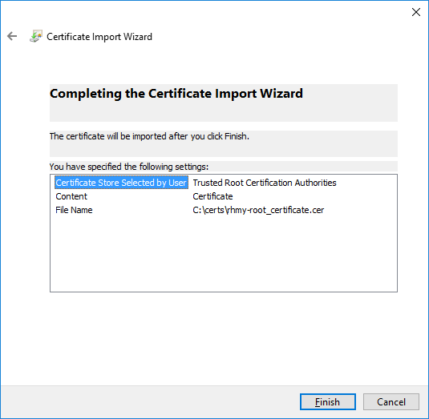

1. Click **Finish** to complete the Certificate Import Wizard.
1. Repeat steps **13** to **15** to install the other certificate (intermediate, in case you installed the root, or vice-versa). You must have both certificates installed.

### Importing the server (domain) certificate 

After importing the root and intermediate certificates, you need to import the server certificate (final domain certificate). Perform the following actions to accomplish this:

1. Click the Windows Start button, go to **Windows Administrative Tools** and open the **Internet Information Services (IIS) Manager**.
1. Click on the server name on the left side.
1. On the center, scroll down to the **IIS** section, and double-click the **Server Certificates** icon.

    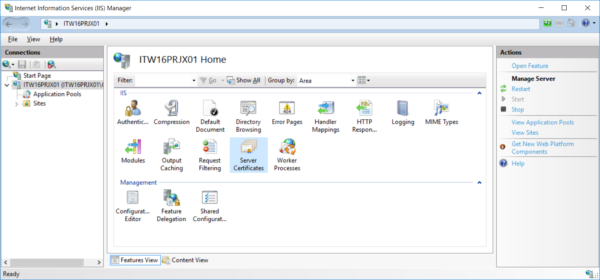

1. On the **Actions** menu on the right side, click on **Complete Certificate Request...**

    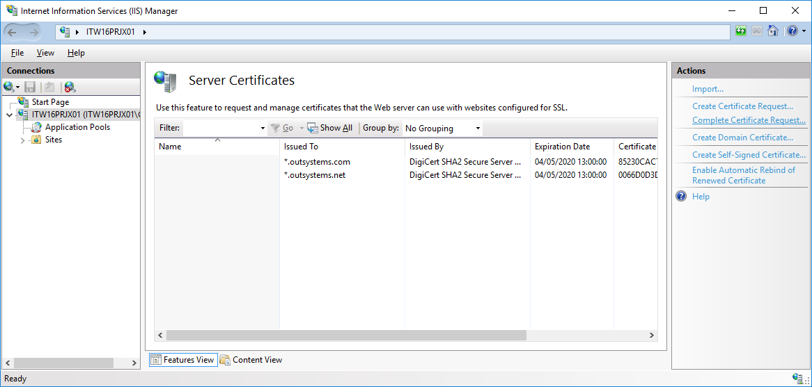

    The **Complete Certificate Request** window opens.

1. Click the **...**  button at the right side to browse the location where you keep the .cer certification file provided by your Certification Authority.
1. Write a friendly name for the certificate (this is the name to use on future references).
1. Select the **Personal** certificate store in the drop-down menu below, if asked.

    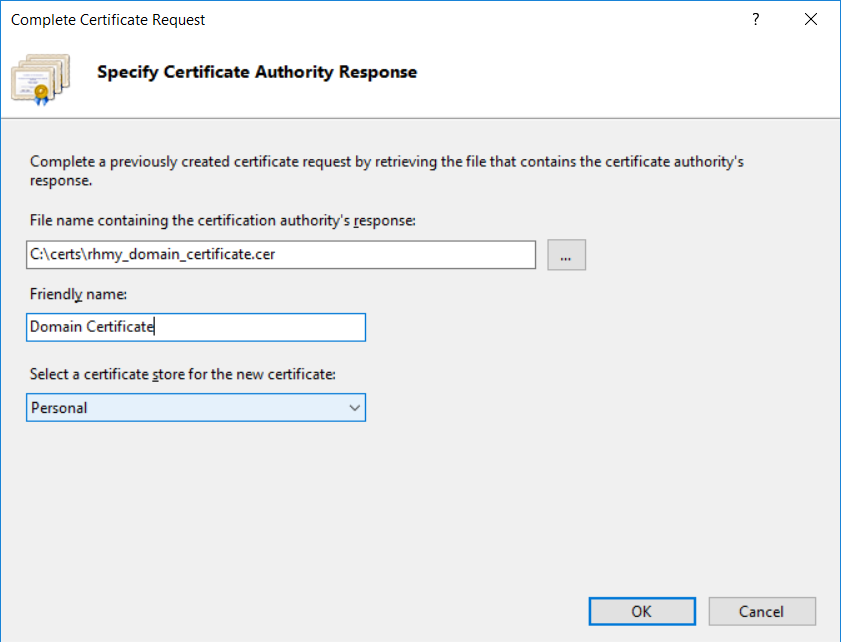

1. Click **OK**. The installation of the certificate begins. Once the SSL Certificate is successfully installed to the server, you need to assign it to the appropriate website.
1. At the **Connections** menu on the left side, select the name of the server on which you installed the certificate, and expand its tree.
1. Expand the **Sites** element below and select the site to secure with SSL.
1. At the **Actions** menu on the right side, click on **Bindings...**

    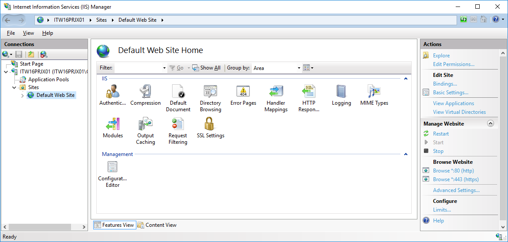

    The **Site Bindings** window opens.

    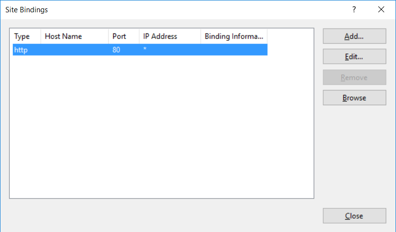

1. In the Site Bindings window, click the **Add...** button. The **Add Site Binding** window opens.

    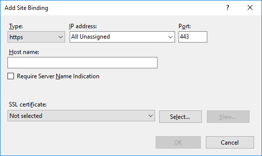

1. Fill out the following information:

    * In the **Type** drop-down menu choose **https**.

        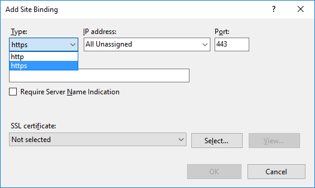

    * Insert the **IP address** of the site or choose All Unassigned.

    * Insert the Port for SSL traffic: **443**.

    * In the **SSL Certificate** drop-down menu, select the friendly name of the certificate that you installed in the previous steps.

        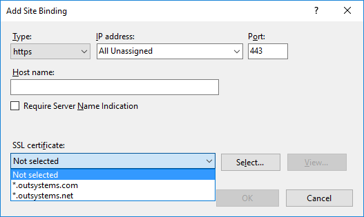

    * Click **OK**.
    
        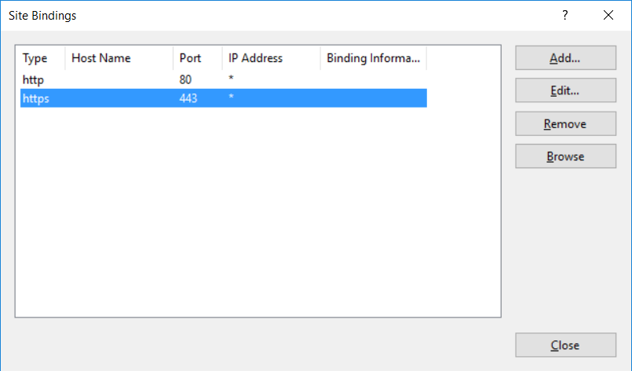

1. Your SSL Certificate is now installed and the website configured to accept secure connections. You may have to restart the IIS or the server for it to recognize the new certificate.

## Configuring applications to use HTTPS

Once you've installed the certificate, you're able to access your OutSystems applications using HTTPS.

If you can force HTTPS redirection of all accesses via HTTP. You can control this behavior at Flow or Screen level, but also [for the whole environment](../../managing-the-applications-lifecycle/secure-the-applications/enforce-https-security.md), which applies to all apps in the environment, or for specific apps.

HTTP requests are always secure in mobile apps (HTTPS), therefore this configuration doesn't apply to mobile apps.

