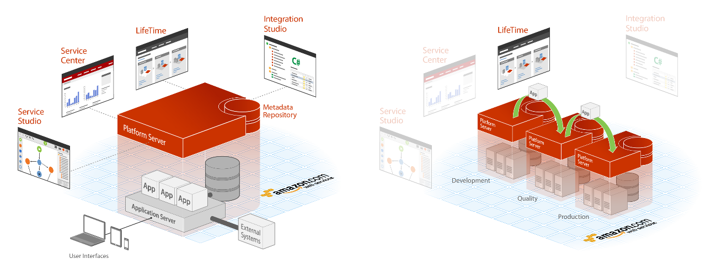

# Setting Up OutSystems

This article applies to: **OutSystems 11**&#8195;&#8195;Other versions available: [10](https://success.outsystems.com/Documentation/10/Setting_Up_OutSystems)

This article explains the several components of OutSystems. It also explains how to set up OutSystems on the cloud or as self-managed.

## OutSystems Overview

### Components

OutSystems has the following components:

* **Platform Server:** The component that orchestrates all runtime, deployment, and management activities for all applications. This tool is installed in each environment.

* **LifeTime:** This is the centralized console for managing the infrastructure, environments, applications, IT users, and security.

* **Service Center:** The administration console for an environment of the infrastructure.

* **Service Studio:** The visual development tool to create, change, and deploy your applications. This tool is installed in the developers desktop.

* **Integration Studio:** The development tool to create connectors to integrate OutSystems applications with other enterprise systems. This tool is installed in the developers desktop. See this [online course](https://www.outsystems.com/training/courses/118/integration-studio-overview/) for information about using **Integration Studio**.

### Typical infrastructure

OutSystems covers the full application lifecycle, from development to deployment. For this reason, a typical OutSystems infrastructure has four environments:

* **Development Environment:** The environment where applications are initially developed and tested.

* **Quality Environment:** The environment where testers and business users experiment applications to perform quality assurance. This environment usually has few scalability and redundancy requirements.

* **Production Environment:** The environment that hosts the application version end users are interacting with. Usually, this environment is only accessible by the operations team.

* **Management Environment:** The environment that hosts LifeTime application, which is the infrastructure management console. Given its requirements, LifeTime application must run in a **dedicated** environment. **Installing LifeTime in an existing environment is not a supported scenario.** Learn how to [size an environment for the infrastructure management console](https://success.outsystems.com/Support/Enterprise_Customers/Installation/Size_an_environment_to_run_the_infrastructure_management_console).

You can have your infrastructure on the cloud or as self-managed. [Learn more about the possible OutSystems infrastructure configurations.](./possible-setups/intro.md)

### Licensing

If you're using OutSystems Cloud, you don't need to worry about installing or licensing your infrastructure. Once you receive your OutSystems Cloud, it is ready for you to develop your apps.

If you're installing OutSystems as self-managed, be sure you have a valid activation code, or license files. Without them you won't be able to deploy applications to your environments. So be sure to [check how OutSystems licensing works.](https://success.outsystems.com/Support/Licensing/Identify_OutSystems_infrastructure_and_runtime_environments)

## Installation alternatives

### Cloud

If you selected to setup OutSystems infrastructure using our Cloud offering you do not have to do any of the initial platform setup yourself. Your servers will be automatically set up for you and you will receive an email with access details such as address and usernames.

Nevertheless, when managing a single environment or infrastructure on the OutSystems cloud, you should take into account the following considerations:

* Currently, it's not possible to customize the time zone. The timezone is always UTC. Conversions need to be done programmatically from UTC to the desired time zone.

* Custom database objects such as stored procedures are not supported. You can either implement the same logic using "Advanced Queries" (standard SQL) or through Extensions (by implementing your own C# code).

* The Multiple Database Catalogs and Schema feature is not available. This means that all applications store their data in the same database Catalog/Schema.

* The Zones feature is not available. All applications running on an environment are available in all front-end servers of that environment. However, applications can be set up to only be accessible from the internal network.

* Using the built-in SMS mechanism is not supported. You can send SMS’s by using webservices or extensions available in OutSystems Forge.

### Self-managed

A self-managed OutSystems infrastructure is located on the customer’s datacenter and is managed by the customer.

## Installation prerequisites

Before installing any component of OutSystems, make sure your hardware and software comply with the minimum requirements. For this, be sure to check:

* [System requirements](./system-requirements.md): the supported hardware and software for installing OutSystems.

* [Network requirements](./network-requirements.md): the network requirements for an environment where OutSystems is installed.

* [Default Platform Server and database configurations](./default-configurations.md): to install and run OutSystems, you need permission to change files in the file system, run services, and make changes to the database.

## Installation steps

To install OutSystems in your infrastructure:

1. Download the Platform Server installation binaries.
1. Install the Platform Server in each environment that will host your applications (for example, Development, Quality and Production).
1. Download the infrastructure management console (LifeTime) installation binaries.
1. Install the infrastructure management console in a dedicated environment.
1. Configure the infrastructure management console.
1. Install and configure the development tools.

### 1. Download the Platform Server installation binaries

Download the latest [Platform Server installation binaries](https://www.outsystems.com/Downloads/search/Platform-Server/11/) from the downloads area. To download, you need an OutSystems account. If you don't have one, register for free at [www.outsystems.com](http://www.outsystems.com).

If you're looking for a specific OutSystems version, be sure to [check the Downloads repository](https://www.outsystems.com/Downloads/search/).

To perform an offline installation of Platform Server you might need to download a few additional files. Check [Offline Installation](#offline-installation) for more information.

### 2. Install the Platform Server { #install-the-platform-server }

Install the Platform Server in each environment of your infrastructure that will host your applications (eg. Development, Quality and Production). For this, follow the Platform Server installation checklist that is launched when you run the Platform Server installation binary.

The installation package can automatically install most of the prerequisites and perform configuration tuning after installing Platform Server.  
Check [Automatic Prerequisites Installation and Configuration Tuning](#prerequisites) for more information.

### 3. Download the infrastructure management console installation binaries

Download the latest [LifeTime Management Console binaries](https://www.outsystems.com/Downloads/search/LifeTime) from the downloads area.

To perform an offline installation of the LifeTime Management Console you might need to download a few additional files. Check [Offline Installation](#offline-installation) for more information.

### 4. Install the infrastructure management console

Install LifeTime management console in a **dedicated** environment. **Installing LifeTime in an existing environment isn't a supported scenario**.

For this, follow the LifeTime installation checklist launched when you run the LifeTime installation binary. As LifeTime **doesn't support farm configuration**, you must select the combination "Deployment Controller + Server" in the checklist to install a single server with both roles.

The OutSystems Scheduler service must be running in the LifeTime environment.

Learn how to [size an environment for the infrastructure management console](https://success.outsystems.com/Support/Enterprise_Customers/Installation/Size_an_environment_to_run_the_infrastructure_management_console).

### 5. Configure the infrastructure management console

Now it's time to configure the infrastructure management console. This will allow you to register the several environments you have, so that you can manage them from a centralized console.

[Check here how to configure the management console.](lifetime-configure.md)

### 6. Install and configure the development tools

OutSystems is now ready for you to start developing. The only thing missing is to [install the development tools](http://www.outsystems.com/home/downloads/) on your developers' desktops. Be sure to install a version of the development tools that is compatible with the version of the Platform Server installed in your environments.

After installing the development tools, [configure them for developing your own extensions](http://www.outsystems.com/goto/howto-configure-integration-studio).

## Automatic Prerequisites Installation and Configuration Tuning { #prerequisites }

The OutSystems Platform Server and LifeTime installation packages can automatically install most of the prerequisites (as described in the Installation Checklist) when you select the **Install Prerequisites** option in the installer. You may need to reboot your system to finish the installation of some prerequisites.

The installation package will automatically download the required binaries for installing the prerequisites from the official Microsoft sources. However, you can also perform an [offline installation](<#offline-installation>).

Before starting the installation of the component, the installation package will validate if all the prerequisites are available on your system. The installation **will not proceed** if any prerequisites are missing.

If you select the **Perform Tuning** option in the installer, and after checking that the prerequisites are correctly installed, the installation package will also check if it can automatically apply most of the mandatory steps in the **Tuning and Security checklist** section of the Installation Checklist.  
The process will not make any modifications to user-defined configurations; it will only change any default values to the recommended values, as described in the referenced section in the Installation Checklist.

The configuration tuning option is also available as a command-line switch when running the installer in [unattended mode](unattended-install/intro.md): `/DoTuning=<factory_size>`.  
When you provide this switch, the installer will change any default values to the ones recommended for the specified `<factory_size>`. These recommended values for each factory size are described in the subsections **Tuning .NET Framework Runtime** and **Tuning Internet Information Services** in the Installation Checklist.  
The available options for `<factory_size>` are `small`, `medium` and `large`. Any other option text will map to the `small` option.

## Offline Installation { #offline-installation }

To perform a fully offline installation you should download some binaries beforehand so that the installation package can [automatically install most of the prerequisites](#prerequisites).

Do the following:

1. Create a folder named `bin` to place the required Microsoft installers:

    * For the **Platform Server** offline installation, create the `bin` folder at the same folder level as the Platform Server installation package.

    * For the **LifeTime Management Console** offline installation, create the `bin` folder inside the Platfor Server installation path. The default path is `C:\Program Files\OutSystems\Platform Server`, but you can use a different one.

1. Download and place the required Microsoft installers in the `bin` folder.

    * **Microsoft .NET Framework 4.7.2**  
    1\. [Download the Offline Installer for the Runtime](https://go.microsoft.com/fwlink/?LinkID=863265) from Microsoft.  
    2\. Rename the Microsot .NET Framework Installer to `DotNet.exe`.  
    _Note:_ If you're installing a Platform Server version earlier than 11.9, rename the installer to `NDP472-KB4054530-x86-x64-AllOS-ENU.exe` instead.
    
    * **.NET 6.0 Runtime & Hosting Bundle for Windows**  
    1\. [Download the .NET 6.0 Runtime & Hosting Bundle for Windows](https://download.visualstudio.microsoft.com/download/pr/0d000d1b-89a4-4593-9708-eb5177777c64/cfb3d74447ac78defb1b66fd9b3f38e0/dotnet-hosting-6.0.6-win.exe) from Microsoft.  
    2\. Rename the .NET Core Installer to `DotNet_WindowsHosting_6.exe`.
    
    * **Build Tools 2015**  
    1\. [Download the Installer](https://www.microsoft.com/en-us/download/details.aspx?id=48159) from Microsoft.  
    2\. Rename the Build Tools Installer to `BuildTools_Full.exe`.

1. Run the installation package as usual. The binaries you downloaded from Microsoft will be detected by the installation package.

## More Information

If you are having trouble installing or setting up OutSystems, check the [OutSystems Community](http://www.outsystems.com/forums/) for help, or reach out to the [OutSystems technical support](https://www.outsystems.com/legal/success/contact-outsystems-technical-support/).
