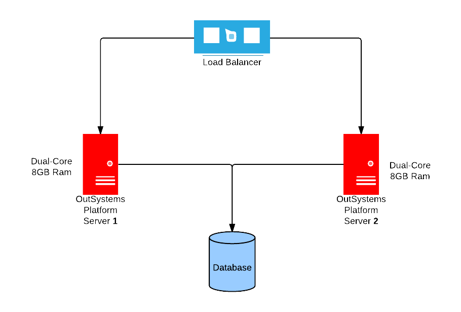
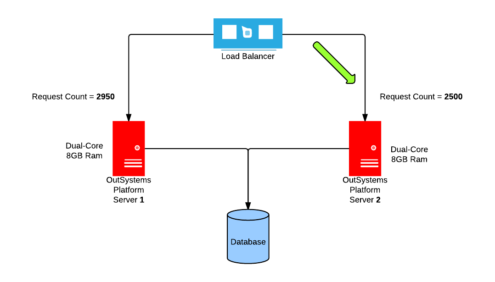
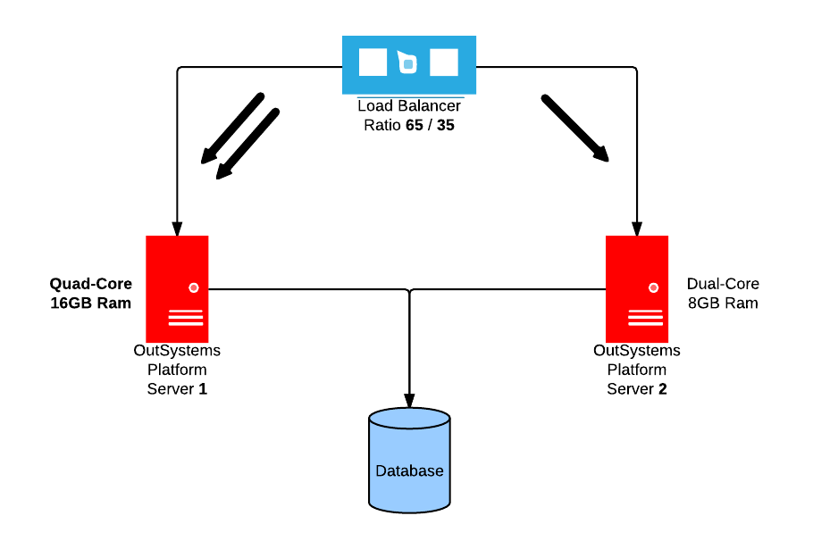
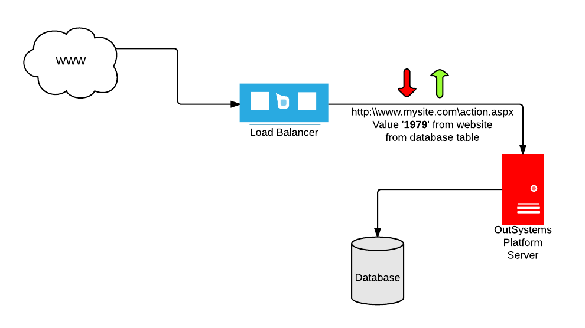

---
summary:
en_title: 01 Recommended configurations for Load Balancing
locale: en-us
guid: 5a9bef4d-746b-40d7-a553-e677b99a8398
app_type: traditional web apps, mobile apps, reactive web apps
platform-version: o11
---

# Recommended configurations for Load Balancing

This guide applies only to self-managed installations. It doesn't apply to OutSystems Cloud, where the load balancing mechanism is provided by OutSystems.

[OutSystems scales horizontally with the addition of front-ends to suit the needed capacity](https://success.outsystems.com/Documentation/Best_Practices/Infrastructure_management/Designing_OutSystems_Infrastructures/Scaling_and_high_availability_for_OutSystems_Platform_servers). In a farm environment, balancing the application load across multiple front-ends is a basic requirement to ensure higher availability.

OutSystems as self-managed doesn't include a load balancing mechanism of its own. To balance load between front-ends in an OutSystems Platform farm, you must resort to one of many load balancing mechanisms on the market. 

OutSystems supports both **layer 4** and **layer 7** load balancers. This is possible since the session model is stored in a centralized database which is accessed by all the Front-ends. Therefore, requests from individual end-users can be distributed across Front-ends without any impact.

OutSystems strongly recommends the use of a load balancer that doesn’t manipulate the traffic in any way.

If a layer 7 load balancer is available, it can be used for a more intelligent load validation if it doesn’t manipulate traffic. Within the layer 4 load balancing scope, there are several techniques to guarantee an effective distribution of the load.

## Global Layer 4 / 7 Load Balancers

### Round-robin (**Recommended**)

Requests are processed sequentially in a circular manner. [Front-end machines have the same hardware configuration](https://success.outsystems.com/Support/Enterprise_Customers/Maintenance_and_Operations/Designing_OutSystems_Infrastructures/02_Sizing_OutSystems_Platform), equal number of applications and the same target audience.

### Least Connections

[Front-end machines have the same hardware configuration](https://success.outsystems.com/Support/Enterprise_Customers/Maintenance_and_Operations/Designing_OutSystems_Infrastructures/02_Sizing_OutSystems_Platform). The connection requests are sent to the server with least connection requests.

### Ratio

[Front-end machines have different hardware configuration](https://success.outsystems.com/Support/Enterprise_Customers/Maintenance_and_Operations/Designing_OutSystems_Infrastructures/02_Sizing_OutSystems_Platform), equal number of applications and the same target audience. The load balancing is based on a ratio where the more powerful server receives a larger number of connection requests,

The ratio load balancer can also be dynamic, where several monitoring checks are actively done to gather server performance and decide on the best node to serve the connection request.

### Specifics for Layer 7

Load balancers with Layer 7 capabilities have a mechanism to manage user sessions (sticky sessions) and it shouldn't be used in OutSystems web-farms to avoid uneven load distribution. OutSystems manages all user sessions in the session database.

Sticky session refers to the feature of many load balancing solutions for web-farms to route the requests for a particular session to the same physical machine that serviced the first request for that session. This is mainly used to ensure that a session isn't lost due to routing requests for a session to different servers. Since requests for a user are always routed to the same machine that first served the request for that session, sticky sessions can cause uneven load distribution across servers.

## Detecting OutSystems server and app availability

To detect that a front-end is up and running in your on-premises/private cloud installation, you can monitor the TCP port that's serving the applications or web services, the most common ones are TCP port 80 (HTTP) and TCP port 443 (HTTPS).

With an L7 load balancer you get a more complete form of monitoring, going beyond the simple check whether the server is up or down.

A best practice is to create a specific screen in your application that performs basic business validations. This ensures the system is up and outputs a specific string when everything is OK. In this screen you should test critical integrations (for example, web-services, external databases).

By implementing this in a screen, by default, you perform a test that OutSystems platform is working, for the whole stack, in that Front-end (for example, app server, database).

If the load balancer supports it, you can use this screen to create a web check and test it by looking for a specific string the page writes if all tests pass.
