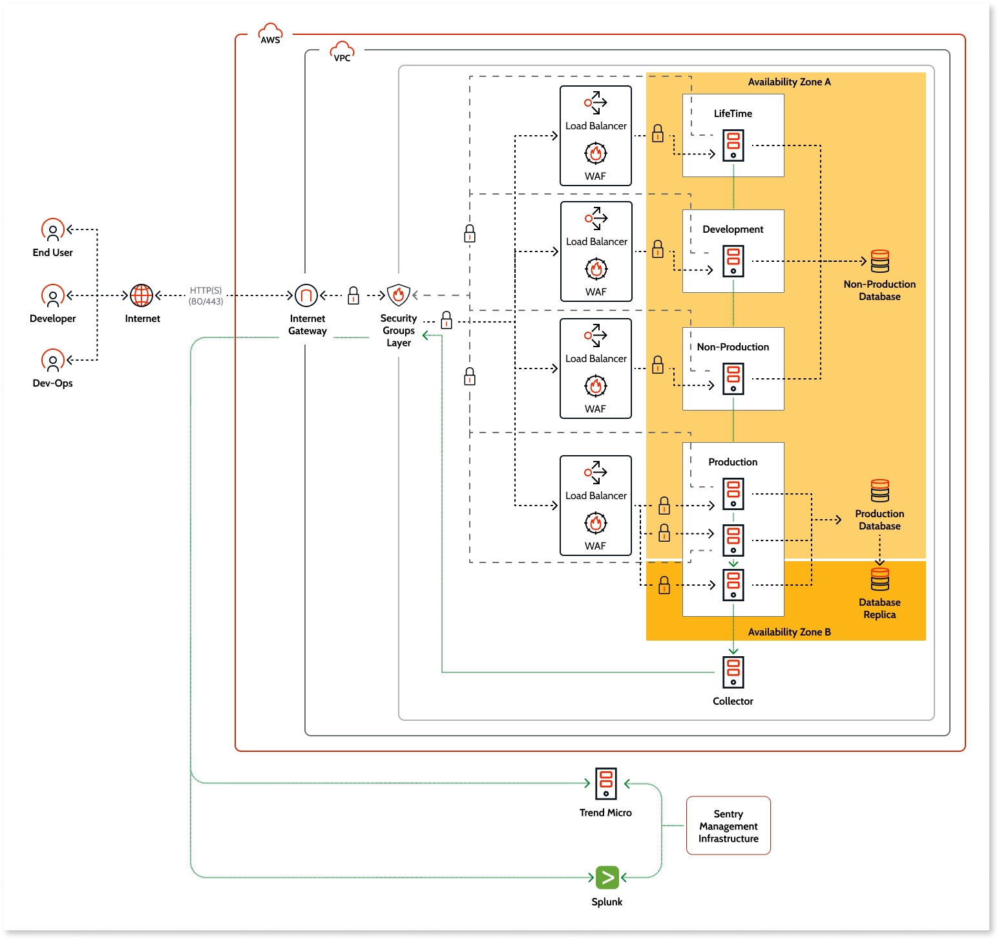

# OutSystems Cloud network architecture

OutSystems Cloud is a public cloud having the physical infrastructure hosted in [Amazon Web Services (AWS)](https://aws.amazon.com/) data centers.

## Dedicated cloud

Each customer has a **dedicated set of virtual machines and database instances** protected inside a dedicated [Virtual Private Cloud (VPC)](https://aws.amazon.com/vpc/), which is logically isolated from the internet and other virtual networks in the AWS cloud.

OutSystems provides **segregated environments** for development, testing, and production, running on different virtual server instances.

OutSystems Cloud uses a layer of [AWS Security Groups](https://docs.aws.amazon.com/vpc/latest/userguide/VPC_SecurityGroups.html), acting as firewalls, to control the traffic allowed between the customer environments and the internet. The several Security Groups define a granular access control per environment and per asset.

Additionally, OutSystems shields each environment using a **Web Application Firewall (WAF)**, which blocks malicious traffic from reaching the running web applications. To ensure that OutSystems keeps full flexibility on the reaction to evolving security threats, maximum availability, and compatibility with OutSystems product evolution, the same WAF's policies apply to all customers.

The diagram below shows the **network architecture** of the base setup for an OutSystems Cloud Standard Edition, including the set of **servers** and the **inbound/outbound communications** between the customer’s infrastructure and the internet:

Depending on the [OutSystems Cloud edition](https://www.outsystems.com/legal/success/cloud-services-catalog/), customers can expand their base setup with the following:

* Additional non-production environments, with a dedicated database.
* Additional pipelines, that enable the independent release of one or more related applications.

### Communications with OutSystems tools

Besides the communication flow shown in the above diagram, there are specific communications between the **environments** within the OutSystems Cloud and the several **OutSystems tools**. The diagram below shows the communication flow to the [Mobile Apps Build Service](../../../deliver-mobile/mobile-apps-build-service/intro.md), [AI Mentor Studio](../../../managing-the-applications-lifecycle/manage-tech-debt/intro.md), [Integration Builder](../../../extensibility-and-integration/integration-builder/intro.md),[Workflow Builder](../../../develop/case-management-workflow/workflow-builder/intro.md), and [Experience Builder](../../../develop/experience-builder/intro.md):

For more details, check the [OutSystems network requirements](../network-requirements.md).

### Administration-level communications

The administration of the OutSystems Cloud technology stack also requires direct access to the customer's servers and databases. There are two levels of access:

* Automated operations performed over the customer's infrastructure by the **OutSystems orchestration system**. This system automates the installation and operation of the OutSystems Cloud environments.

* Direct access performed by the **OutSystems Cloud administration team** in the scope of a support ticket or to troubleshoot an issue with automated operations. The credentials for the operating system and database administration access are specific for each server and accessible only to authorized OutSystems engineers after successful authentication, using one-time passwords obtained from a console accessed through multi-factor authentication.

## Additional network restriction

On top of VPC specific network architecture, customers can restrict access by IP address to the OutSystems management consoles and connections from the development tools. Customers must submit a request to [OutSystems Support](https://www.outsystems.com/legal/success/contact-outsystems-technical-support/) to set this configuration, indicating the internal range of IP addresses allowed to have that access.

## Communication with on-premise systems

Depending on the [OutSystems Cloud edition](https://www.outsystems.com/legal/success/cloud-services-catalog/), customers can set up secure connections between OutSystems Cloud environments and their on-premises systems, enabling teams to integrate and expose core system data in a secure way.

The most common option is to [set up a site-to-site Virtual Private Network (VPN) connection](https://success.outsystems.com/Support/Enterprise_Customers/Maintenance_and_Operations/Set_Up_a_VPN_to_your_OutSystems_Cloud) between the on-premises network and OutSystems Cloud using Internet Protocol security (IPSec):

To accommodate more advanced integration scenarios and troubleshooting needs, customers can [request direct access to the application databases](https://success.outsystems.com/Support/Enterprise_Customers/Maintenance_and_Operations/Access_the_database_of_your_OutSystems_Cloud) and use database client tools to perform the needed operations.

For scenarios that require the use of high bandwidth and a steady connection without network congestion, it’s also possible to [set up AWS Direct Connect](https://success.outsystems.com/Support/Enterprise_Customers/Maintenance_and_Operations/AWS_Direct_Connect_on_OutSystems_Cloud) linking the customer’s private network with OutSystems Cloud over a dedicated line.

To set up a private connection between the OutSystems Cloud and other corporate systems running on AWS, customers should [connect to OutSystems Cloud using an AWS Transit Gateway](https://success.outsystems.com/Support/Enterprise_Customers/Maintenance_and_Operations/Connect_to_your_OutSystems_Cloud_using_AWS_Transit_Gateway).

## High-availability and compliance options

The OutSystems Cloud high-availability option enables customers to deploy front-end servers across different [AWS Availability Zones](https://docs.aws.amazon.com/AWSEC2/latest/UserGuide/using-regions-availability-zones.html#concepts-availability-zones) and set up a database replica in a different Availability Zone than the primary database.

Additionally, customers who need extra layers of compliance have the option to upgrade to a [high-compliance OutSystems Cloud](https://www.outsystems.com/sentry/), which reinforces security, risk management, and monitoring for a [SOC2 Type II compliant cloud platform](https://www.outsystems.com/trust/). From an infrastructure perspective, this option adds:

* The deployment of [Trend Micro Deep Security](https://www.trendmicro.com/) anti-virus and intrusion detection software on all OutSystems Cloud servers.

* Log collection from all system components and corresponding feed into [Splunk SIEM](https://www.splunk.com/) (Security Information and Event Management) service. Only a limited number of OutSystems staff with security responsibilities has privileged access to the SIEM.

* Enforced HTTPS communications.

The diagram below shows the architecture of the base setup for a Standard Edition with high-availability option in a high-compliance OutSystems Cloud:

