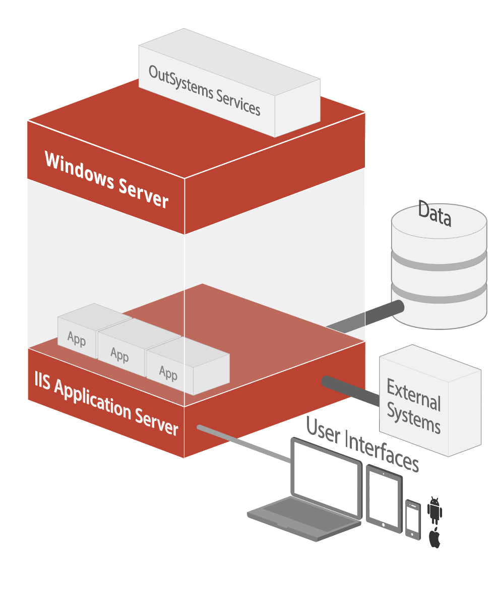

# Infrastructure architecture and deployment options

The OutSystems architecture is a layered ecosystem that enables developers to
build applications fast, build them right, and build them for the future.

The top layer of the architecture includes tools, a repository, builders,
processes, and components that simplify challenging aspects of integration.
These architecture components help manage the software development life cycle
(SDLC).

Underpinning this architecture, are services for automating complex change
management and architectural review processes, removing repetitive tasks and
guesswork involved in application development, security, code generation, and
logging. The runtime layer offers the option of deployment either in the
OutSystems Cloud or on your own systems.

## Standard, reliable technologies

OutSystems runs on standard and scalable technology and doesn't need special
runtime engines or interpreters. It takes your visual application models and
generates a fully standard, and optimized set of server (.NET) and client
components (HTML, CSS, JavaScript) deployable to standard application servers.

OutSystems implements standard server architecture for deployment on the
OutSystems Cloud, on your own on-premises servers, or on public clouds such as
AWS or Azure.

* App deployment is on IIS application servers running Microsoft Windows
Server.

* Standard relational databases store application data and Platform Server
metadata that your applications use. The currently supported database
management systems are Microsoft SQL Server, Azure SQL Database and Oracle. You
can also integrate with other databases.

For more information about the supported software versions, check [OutSystems
system
requirements](https://success.outsystems.com/Documentation/11/Setting_Up_OutSystems/OutSystems_system_requirements).

## Environment architecture

An OutSystems environment provides all the necessary infrastructure to allow
you to develop and deliver applications. The [available
editions](https://www.outsystems.com/pricing-and-editions) provide at least
three environments suited for development, test and, production.

An environment includes a fully functional set of components that allow you to:

* develop visual code and integrations
* compile and deploy the code
* access and use the deployed applications in a browser or mobile device simulator

Environment deployment uses several underlying infrastructure components.

* One or more application servers for the app runtime.
* A database to store metadata and app data.
* An OutSystems Platform Server installation.

### Application Server

Each environment has its own application servers running multiple applications.
Application servers aren't shared with other environments. App deployment is on
Microsoft IIS and Windows Server.

At runtime, virtual directories map onto application domains. Multiple
application domains run in a worker process.

### Database

You can choose to deploy your environment databases on Microsoft SQL Server,
Azure SQL Database or Oracle. For SQL and Azure databases you need to configure
three catalogs, for Oracle, three schemas:

* Platform database
* Log database
* Session database

The catalogs or schemas can reside in the same database instance or server.
Distinct environments have distinct catalogs or schemas. Frequently,
non-production environments share the same database server so this helps
maintain separation between the environments.

You have the flexibility to choose which environments should have dedicated
database servers. As best practice you should deploy dedicated
database servers in production environments:

#### Integration with external databases

To build applications using existing data sources, use OutSystems [Integration
Builder](https://success.outsystems.com/Documentation/11/Extensibility_and_Integration/Create_connectors_with_Integration_Builder).
Supported databases are:

* SQL Server
* SQL Azure
* Oracle
* MySQL
* PostgreSQL
* DB2 iSeries

Developers can combine local and external data sources without spending
unnecessary time on complex integration projects.

### Platform Server

The Platform Server in each environment orchestrates compilation, deployment,
and management activities for all applications. It's installed on all
application servers that compose an environment.

#### OutSystems services

The Platform Server installs specific OutSystems services that deliver the
platform’s core functionality. They can either run as a Windows service, a .NET
Core app managed by IIS or as a library included in the applications
themselves.

* **Deployment controller service:** Enables the compilation of OutSystems
applications and the automated deployment of the code to multiple servers.

* **Deployment service:** Enables the deployment of OutSystems applications in
the current server.

* **Scheduler service:** is responsible for triggering asynchronous processes
and manages timers, business processes and emails.

* **Server.API:** responsible for exposing some platform functionality
as services.

* **Server.Identity:** responsible for authenticating users and access control
for the APIs exposed by the Server API.

### Standalone and server farm configurations

As load increases and high availability needs become apparent, it’s possible to
add application servers (also referred to as front ends) to horizontally scale
an environment.

A distributed environment architecture allows you to balance costs in non
production environments with a minimum set of servers while allowing you to
horizontally scale up highly loaded production environments. On the top access
layer support for load balancing removes single points of failure.

To accommodate differing needs of each of the environments there are two
configurations, standalone and server farm.

#### Standalone

The usual architecture for non-production environments is standalone. In this
configuration:

* Deployment of Apps is to a single application server.

* A single queue serves all requests.

* The database installation can reside on the same physical server or it’s
own server.

#### Server farm

The server farm uses automated resource optimization and management to ensure
an application consumes few resources, while freeing unused resources. This is
the typical configuration for production environments and possibly large
non-production environments. In a server farm:

* Provisioning of multiple front ends deals with increased load and high
availability requirements.

* The OutSystems Deployment Controller service automatically ensures that
applications are consistently installed across all front end servers.

* Multiple queues handle service requests.

* This configuration requires a load balancer.

* The requirements of the apps it hosts would typically imply a dedicated
database server.

For more in depth information about OutSystems scalability and availability options, visit [this page](https://success.outsystems.com/Support/Enterprise_Customers/Availability_and_scalability).

## Infrastructure architecture

The OutSystems infrastructure is a set for environments that comprise the
lifecycle of a portfolio of applications, managed using the LifeTime
infrastructure management console. An OutSystems infrastructure includes the
following components:

* **Environments** for the product lifecycle management - to deploy your
infrastructure with a separate environment for each phase: development,
functional testing, user acceptance testing (UAT), and production.

* **LifeTime management console** - manages the infrastructure, environments,
applications, IT users, and security. A LifeTime deployment has its own
environment with its own server, database catalogs, and a central console.

* **Pipelines** - to isolate applications based on common characteristics.

* **OutSystems SaaS tools** - that support optional functionality and
accelerate app development.

### Pipelines

Not all apps are the same, they have different business goals and different
non-functional requirements (NFR).

With OutSystems you have the option to deploy additional pipelines that allow
you to isolate a portfolio of applications that have the same characteristics.

They include a set of environments to enable independent development and
release. Pipelines can help you with governance, compliance and maintaining
quality standards by allowing you to:

* Isolate lines of **apps with different lifecycle stages** into pipelines.
Each one can have a different set of environments where one pipeline has an
additional environment for an extra stage, such as mobile device testing.

* Group applications with **similar scalability and high availability needs**.

* **Address compliance** with data segregation policies with separate databases
for more sensitive data.

* **Isolate mission-critical apps**. Pipelines help isolate your
mission-critical applications, catering for data isolation and additional
lifecycle stages (perhaps, additional testing).

All while **maintaining the reusability** of your components across an entire
portfolio.

### OutSystems SaaS tools

OutSystems provides several tools served as SaaS that can be optionally used.
Installation of the tools isn't on your own servers and requires connectivity
to your OutSystems infrastructure. On OutSystems Cloud, connectivity is always
ensured but on your self-managed infrastructure you’ll need to be aware of
this:

* [Mobile Apps Build
Service](https://www.outsystems.com/blog/posts/how-mobile-apps-build-service-works/):
generates mobile packages for installation on mobile devices.

* [Architecture
Dashboard](https://www.outsystems.com/platform/architecture-dashboard/):
technical debt monitoring tool that enables you to visualize complex
cross-portfolio architectures, identify problems and help developers follow
best practices.

* [Workflow
Builder](https://www.outsystems.com/blog/posts/workflow-builder-workflow-app-minutes/):
creates workflows to build apps for task management and automation.

* [Experience
Builder](https://www.outsystems.com/platform/experience-builder/): prototype
pixel-perfect mobile applications and turn them into production-ready apps.

The complete OutSystems network requirements are
[here](https://success.outsystems.com/Documentation/11/Setting_Up_OutSystems/OutSystems_network_requirements).

### Infrastructure architecture examples { #infra-examples }

OutSystems provides the flexibility to start with a simple infrastructure.
Edition upgrades and scale ups are available to accommodate growing needs. The
following examples shows different infrastructure architectures compositions,
from simple to a complex.

Read more about OutSystems editions and pricing
[here](https://www.outsystems.com/pricing-and-editions/).

Addons are available in addition to the default configurations. Information on
addons is available here
[here](https://success.outsystems.com/Support/Enterprise_Customers/OutSystems_Support/Cloud_services_catalog).

#### Basic edition infrastructure

Use OutSystems Cloud's Basic edition to deploy **departmental apps** used only
by your employees, such as an HR onboarding app.

These apps all **share a simple life cycle** so three environments and a single
pipeline suit the needs. They’re also apps that aren’t mission critical and a
high-availability setup is unnecessary.

For this setup, use these underlying servers:

**Two database servers:**

* A shared database server or instance that carries all the catalogs for the
LifeTime, Development and Test environments.

* A dedicated database server for the Production environment.

**Four front end servers:**

* 1 for LifeTime
* 1 for Development
* 1 for Test
* 1 for Production

#### Standard edition infrastructure

In this scenario, apart from **departmental apps** (like a sales representative
tablet app and productivity apps), this infrastructure is also capable of
delivering a **mission critical mobile banking app**.

The lifecycle of this portfolio requires a stage for device testing so an
**additional UAT environment** supports it.

The mobile banking app requires **additional front ends** to support a B2C
expected usage. A mission critical application translates to a high
availability infrastructure, so distribution of front-ends is between two
data centers and the database has a stand-by replica.

As a result, this factory required:

**Four database servers:**

* A shared database server or instance with all the catalogs of LifeTime,
Development, and Test.

* One dedicated for UAT.

* A database server for the Production environment.

* A standby database replica of the Production database

**Eight front end servers:**

* 1 for LifeTime
* 1 for Development
* 1 for Test
* 1 for UAT
* 4 for Production with a load balancer

#### Enterprise edition infrastructure

With this edition it's possible to have **multiple pipelines**.

This scenario has a portfolio of departmental applications and another of
external facing applications that have **different scaling needs**. The
portfolio of external apps also handles **sensitive data with strict policies**
and requires high availability.

Due to the fundamental differences between the two portfolios they're split
into 2 pipelines. One of the pipelines needs 2 front ends in Production and the
other needs 4 front ends. The pipelines may require **further scaling** in the
future. Any **specific data access rules** take place in one of the pipelines.

For this infrastructure 2 pipelines are necessary:

**Six database servers:**

* 1 shared database server or instance with all the catalogs of LifeTime and
Development.

* 2 databases for the 2 Test environments of both pipelines.

* 1 database server for the Production environment of the pipeline on the left.

* 2 database servers (primary and replica) for the Production environment of
the pipeline on the right

**Ten front end servers:**

* 1 for LifeTime.

* 1 in Development.

* 2 for Test (one for each pipeline).

* 2 in the Production environment that hosts the departmental applications.

* 4 for the Production environment comprising the mission critical external
facing apps.

## Deployment options

OutSystems builds on reliable technologies and it's scalable architecture
allows adjustments of infrastructure configurations to your needs. OutSystems
supports the infrastructure provider of your choice such as AWS and Azure.
Application code and data are always under the customer’s control.

In the OutSystems Cloud, managed infrastructure frees developers to focus on
developing applications on the OutSystems platform.

There’s also the option to deploy in a self-managed infrastructure, on your own
data center or on a public cloud. In these two self managed options, the
runtime application server (IIS) and the operating system are always managed by
you.

Both OutSystems Cloud and self-managed environments build on the same reliable
technology and components described in this document.

Learn more about deploying infrastructure on OutSystems Cloud here:

