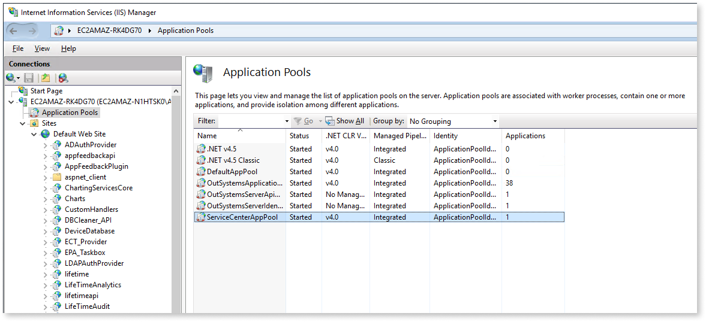
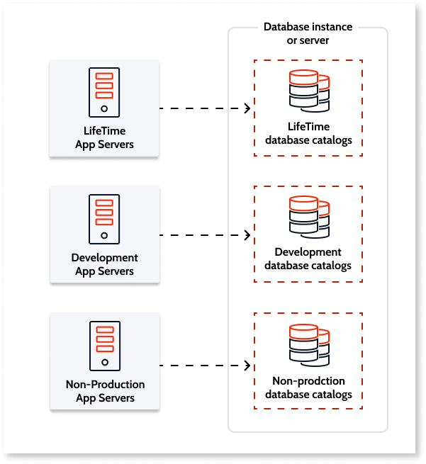
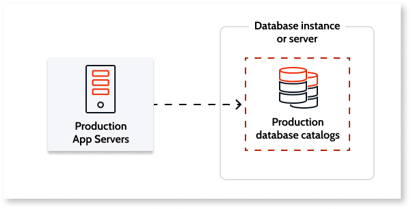
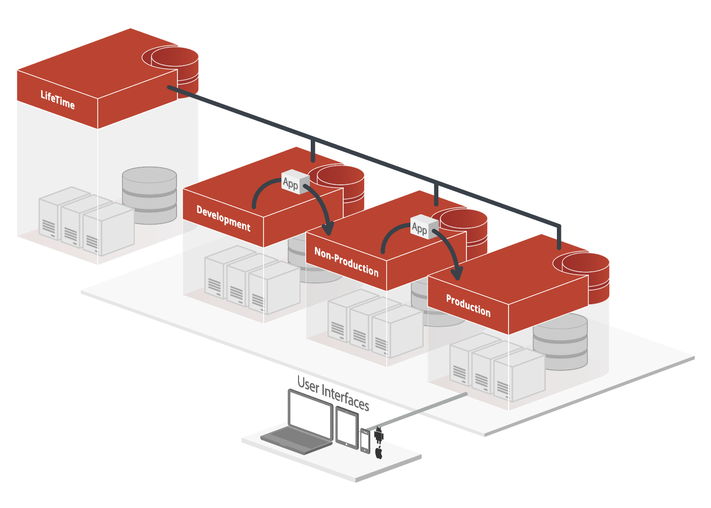
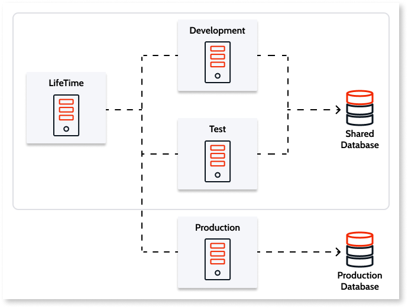
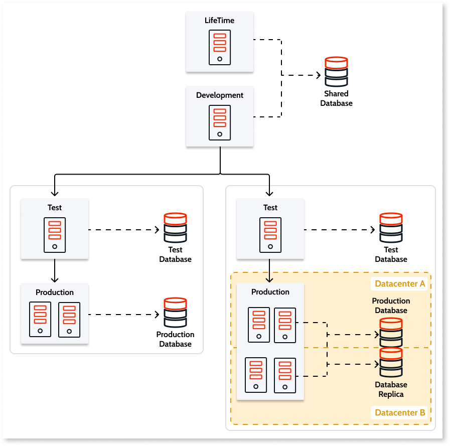
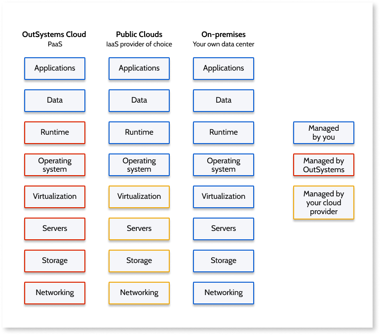

# Infrastructure architecture and deployment options

The OutSystems architecture is a layered ecosystem that enables developers to build applications fast, build them right, and build them for the future.

The top layer of the architecture includes tools, a repository, builders, processes, and components that remove the challenging aspects of integration, managing the development lifecycle (SDLC) and  application design. 

This layer is underpinned by services for automating complex change management and architectural review processes, removing repetitive tasks and guesswork involved in application development, security, code generation, and logging. The runtime layer offers the option of deployment either in the OutSystems Cloud or on your own systems as a self-managed deployment.

## Standard reliable technologies

OutSystems runs on standard and scalable technology. Without requiring any special runtime engines or interpreters, takes your visual application models and generates a fully open, standard and optimized set of server (.NET) and client components (HTML, CSS, JavaScript) deployable to standard application servers.

We implement standard server architecture for deployment on OutSystems managed Cloud, on your own on-premises servers, or on public clouds such as AWS or Azure:

* Apps are deployed on IIS application servers running Microsoft Windows Server.
* Standard relational databases store application data and Platform Server metadata that your applications use. The currently supported database management systems are Microsoft SQL Server, Azure SQL Database and Oracle. You can also integrate with other databases.

For more information about the supported software versions, check [OutSystems system requirements](https://success.outsystems.com/Documentation/11/Setting_Up_OutSystems/OutSystems_system_requirements).

## Environment architecture

An OutSystems environment is the single unitary functional piece of an OutSystems infrastructure. The [available editions](https://www.outsystems.com/pricing-and-editions) provide at least three environments suited for non-production (for example: development and test) and production.

An environment includes a fully functional set of components that allow you to:

* develop visual code and integrations
* compile and deploy the code
* access and use the deployed applications on the browser / mobile device

For each environment to be deployed there are several underlying infrastructure components. 

* One or more application servers for the app runtime.
* A database to store metadata and app data.
* An OutSystems Platform Server installation.

### Application Server

Each environment needs its own application servers which can’t be shared with other environments. A Windows Server is required and apps are deployed on Microsoft IIS where the logical organization of the website includes multiple applications mapped into virtual directories. 

In the runtime context, virtual directories are mapped into application domains. Multiple app domains run in a worker process.

### Database

You can choose to deploy your environment databases as Microsoft SQL Server, Azure SQL Database or Oracle. For SQL server you need to configure three catalogs, for Oracle-three schemas. They include:

* Platform database
* Log database
* Session database

The catalogs or schemas may reside in the same database instance or server but need to be maintained as distinct catalogs or schemas. Frequently, non-production environments share the same database server:

You have the flexibility to choose which environments should have dedicated database servers. However, as a best practice you should deploy dedicated database servers in production environments:

#### Integration with external databases

To build your apps on top of existing data, OutSystems integrates natively with major database systems: SQL Server, SQL Azure, Oracle, MySQL, PostgreSQL and DB2 iSeries.
It also has a database integration SDK, so that organizations can integrate with a database of choice. Developers can combine local and external data sources without spending much time on complex integration projects.

### Platform Server

The OutSystems Platform Server is installed in each environment, and orchestrates compilation, deployment, and management activities for all applications. It’s binaries are installed on all application servers that compose an environment.

#### OutSystems services 

The Platform Server installs specific OutSystems services that ensure the platform’s core functionality. They can either run as a Windows service, a .NET Core app managed by IIS or as a library included in the applications themselves.

* **Deployment controller service:** Enables the compilation of OutSystems applications and the automated broadcasting of the code to multiple servers.
* **Deployment service:** Enables the deployment of OutSystems applications in the current server.
* **Scheduler service:** is responsible for triggering asynchronous processes and manages timers, business processes and emails.
* **Server.API:** responsible for exposing some of the platform’s functionality as services.
* **Server.Identity:** responsible for authenticating users and access control for the APIs exposed by the Server.API

### Standalone and server farm configurations

As load increases and high availability needs surface, it’s possible to add application servers (also referred to as front ends) to horizontally scale an environment.

A distributed environment architecture allows you to balance costs in non production environments with a minimum set of servers while allowing you to horizontally scale up highly loaded production environments. On the top access layer, support for layer 4 and layer 7 load balancers remove single points of failure.

To accommodate for the needs of each of the environments, two configurations can be used: standalone and server farm.

#### Standalone

The usual architecture for non-production environments is as a standalone. In this configuration:

* All applications are deployed to a single application server.
* All requests are served through a single queue.
* The database installation can reside on the same physical server or on it’s own server.

#### Server farm

The server farm uses automated resource optimization and management to ensure an application consumes few resources, while freeing the resources not being used.
This is the typical configuration for production environments but it can be used in non-production environments as well. In a server farm:

* Multiple front ends are provisioned to deal with increased load and high availability requirements.
* The OutSystems Deployment Controller service automatically ensures that applications are consistently installed across all front end servers.
* Requests are served by multiple queues.
* A load balancer is required.
* The requirements of the apps it hosts typically imply a dedicated database server.

For more in depth information about OutSystems scalability and availability options, visit [this page](https://success.outsystems.com/Support/Enterprise_Customers/Availability_and_scalability).

## Infrastructure architecture

The OutSystems infrastructure is a set for environments that represent the lifecycle of a portfolio of applications and is managed by LifeTime, infrastructure management console.
An OutSystems infrastructure includes the following components:

* **Environments** for the product lifecycle management - to deploy your infrastructure with a separate environment for each phase: development, non-production (for example: test and UAT), and production. 
* **LifeTime management console** - manages the infrastructure, environments, applications, IT users, and security. LifeTime is deployed as its own environment with its own server, database catalogs, and a central console.
* **Pipelines** - to isolate applications based on common characteristics.
* **OutSystems SaaS tools** - that support optional functionality and accelerate app development.

### Pipelines

Not all apps are the same, they have different business goals that, more often than not, translate to different NFRs.

This is why with OutSystems you have the option to deploy additional pipelines that allow you to isolate a portfolio of applications that have the same characteristics. 

They include a set of environments to enable independent development and release. Pipelines can help you with governance, compliance and maintaining quality standards by allowing you to:

* Isolate lines of **apps with different lifecycle stages** into pipelines. Each one can have a different set of environments where one pipeline has an additional environment for an extra stage, such as mobile device testing.
* Group applications with **similar scalability and high availability needs**.
* **Address compliance** with data segregation policies with separate databases for more sensitive data.
* **Isolate mission-critical apps**. While pipelines weren't really designed to isolate each and every application, mission-critical core systems that support a substantial part of your business may require its own pipeline. Not just to ensure it’s not impacted by noisy neighbors, but also because they often require additional lifecycle stages and data isolation.

All while **maintaining the reusability** of your components across an entire portfolio, and  continue to benefit from impact analysis to ensure unbreakable deployments.

### OutSystems SaaS tools

OutSystems provides several tools served as SaaS that can be optionally used. If used, they require connectivity to your OutSystems infrastructure since they can’t be installed on your own servers. On OutSystems Cloud, connectivity is always ensured but on your self-managed infrastructure you’ll need to be aware of them:

* [Mobile Apps Build Service](https://www.outsystems.com/blog/posts/how-mobile-apps-build-service-works/): generates mobile packages for installation on mobile devices.
* [Architecture Dashboard](https://www.outsystems.com/platform/architecture-dashboard/): technical debt monitoring tool that enables you to visualize complex cross-portfolio architectures, identify problems and help developers follow best practices.
* [Workflow Builder](https://www.outsystems.com/blog/posts/workflow-builder-workflow-app-minutes/): creates workflows to build apps for task management and automation.
* [Experience Builder](https://www.outsystems.com/platform/experience-builder/): prototype on a web interface pixel-perfect mobile applications and turn them into production-ready apps.

The complete OutSystems network requirements can be found [here](https://success.outsystems.com/Documentation/11/Setting_Up_OutSystems/OutSystems_network_requirements).

### Infrastructure architecture examples { #infra-examples }

OutSystems provides the flexibility to start with a simple infrastructure. Edition upgrades and scale ups are available to accommodate growing needs. To show how all the pieces can compose different infrastructure architectures, we’ll go through some examples, spanning from a simple setup to a complex one.

More about OutSystems editions [here](https://www.outsystems.com/pricing-and-editions/).

Addons are available in addition to the default configurations. For information on the services and addons, visit [this page](https://success.outsystems.com/Support/Enterprise_Customers/OutSystems_Support/Cloud_services_catalog). 

#### Basic edition infrastructure

OutSystems Cloud on its Basic edition is used to deploy **departmental apps** that are used only by your employees, such as an HR onboarding app or even an ERP system.

These apps all **share a simple life cycle** so three environments and a single pipeline suit the needs.They’re also apps that aren’t mission critical and a high-availability setup is not required.

For this setup, the following underlying servers are provisioned:

**Two database servers:**

* A shared database server or instance that carries all the catalogs for the LifeTime, Development and Test environments.
* A dedicated database server for the Production environment.

**Four front end servers:**

* 1 for LifeTime
* 1 for Development
* 1 for Test
* 1 for Production

#### Standard edition infrastructure

In this scenario, apart from **departmental apps** (like a sales rep tablet app and omnichannel productivity apps), this infrastructure carries also a **mission critical mobile banking app**.

The lifecycle of this portfolio requires a stage for device testing and an **additional UAT environment** was added to support it.

The mobile banking app requires **additional front ends** to support a B2C expected usage. A mission critical application translates to a high availability infrastructure, so the front-ends are distributed between two datacenters and the database has a stand-by replica.

As a result, this factory required:

**Four database servers:**

* A shared database server or instance with all the catalogs of LifeTime, Development, and Test.
* One dedicated for UAT
* A database server for the Production environment.
* A standby database replica of the Production database

**Eight front end servers:**

* 1 for LifeTime
* 1 for Development
* 1 for Test
* 1 for UAT
* 4 for Production with a loadbalancer

#### Enterprise edition infrastructure

With this edition comes the possibility to have **multiple pipelines**. 

We depict next a scenario where there’s a portfolio of departmental applications and another of external facing applications that have *different scaling needs**. The portfolio of external apps also handles **sensitive data with strict policies** and requires high availability.

Due to the fundamental differences in these two portfolios they were separated into 2 pipelines. One of the pipelines can bear with only 2 front ends in Production and the other one requires currently 4 front ends and may require **further scaling** in the future. **Specific data access rules are implemented** in one of the pipelines. 

For this infrastructure with 2 pipelines were necessary:

**Six database servers:**

* 1 shared database server or instance with all the catalogs of LifeTime and Development.
* 2 databases for the 2 Test environments of both pipelines.
* 1 database server for the Production environment of the pipeline on the left.
* 2 database servers (primary and replica) for the Production environment of the pipeline on the right

**Ten front end servers:**

* 1 for LifeTime
* 1 in Development.
* 2 for Test (one for each pipeline).
* 2 in the Production environment that hosts the departmental applications.
* 4 for the Production environment where the mission critical external facing apps are deployed.

## Deployment options

Standing on top of reliable technologies and with a scalable architecture that allows to adjust infrastructure configurations to your needs, OutSystems is built to support the infrastructure provider of your choice.
Choosing the deployment option implies different levels of responsibility over the systems. But in all of them, application code and data are always under our customer’s control, that can manage them fully.

In the OutSystems Cloud, we manage all components and servers, freeing developers to focus on your core business, and develop native applications on the OutSystems platform. 

There’s also the option to deploy in a self-managed infrastructure, on your own datacenter or on a public cloud of your choice such as AWS or Azure, for example. In these two self managed options, the runtime application server (IIS) and the operating system are always managed by you. 

Both OutSystems Cloud and self-managed stand on top of the same reliable technology and components that we described on this document.

Know more about deploying an infrastructure on OutSystems Cloud:

