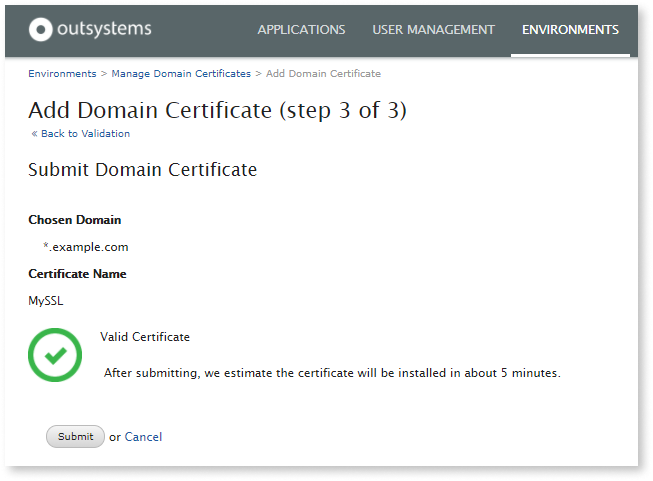

# Use your SSL domain in OutSystems Cloud

Your OutSystems cloud environments include a valid SSL certificates with the `outsystemsenterprise.com domain`. It's also possible to use your own domain by assigning your SSL certificate to the environments.

The steps of setting up your environments with your company domain include:


<div class="info" markdown="1">

Setting up a different SSL domain changes the endpoint URL of the web services exposed by the environment, that will include the new domain instead. This change requires consumer applications to start using the new endpoint URLs.

OutSystems applications consuming your [REST APIs](https://success.outsystems.com/Documentation/11/Extensibility_and_Integration/REST/Consume_REST_APIs/Configure_a_Consumed_REST_API_at_Runtime) or [SOAP Web Services](https://success.outsystems.com/Documentation/11/Extensibility_and_Integration/SOAP/Consuming_SOAP_Web_Services/Configure_a_SOAP_Web_Service_at_Runtime) can configure the new endpoint URLs at runtime in the Service Center console.

</div>

## SSL domain requirements

You'll first need a valid SSL certificate for your chosen domain, this allows your end users to access apps using HTTPS. To acquire a valid certificate, you must own the desired domain address (for example, www.example.com) and:

1. Obtain an SSL certificate from a trusted Certificate Authority with the desired domain. The supported formats are either **PEM** or **PFX** with a maximum private key size of 4096 bits. Contact your Certificate Authority if none of these formats are supplied.

1. Create a CNAME Record for the domain address that points directly to the OutSystems Enterprise address your environment uses. An example is acme.outsystemsenterprise.com.

<div class="info" markdown="1">

**Multi-domain (SAN) certificates:** While you can only have one certificate at a time applied to your environment, it's possible to use multiple domains. If this is the case, you can opt for a multi-domain (SAN) certificate.

</div>

## Upload the certificate in LifeTime { #upload-certificate }

To use your domain on OutSystems Cloud, you'll need to upload the SSL certificate before assigning it to the environments:

1. Navigate to the infrastructure management console at *`https://<yourlifetimeenvironment>/lifetime`* and go to the **Environments** tab.

1. Select the environment you want to use your own HTTPS domain.

1. Click **Change** under the **SECURE ENDPOINT** section.

    

1. Click **Add a new Domain Certificate**.

    

You'll have 3 possible options on the next screen:

* [My Domain Certificate is in PEM format](#PEM-certificate)
* [My Domain Certificate is in PFX format](#PFX-certificate)
* [I don't really know in what format my Domain Certificate is](#ZIP-bundle)

<div class="info" markdown="1">

Prefer **PEM** and **PFX** certificates, these file types ensure a correct and complete certificate format.

</div>

A wizard will guide you on the next steps, depending on the certificate file format.

### My domain certificate is in PEM format { #PEM-certificate }

A PEM certificate is commonly presented as a set of .PEM files (namely a certificate, a private key and a chain), that contain text. The following information is required for submitting a new PEM certificate:

* **Domain:** The domain the certificate was signed for. Add `*.` for wildcard certificates, for instance: *.example.com. If you are submitting a multi-domain certificate (SAN) you must fill the Domain field with one of the DNS Names that your certificate is signing.

* **Certificate Name:** A unique name for the certificate of your choice.

* **Private Key:** The certificate's private key that's generated when the certificate is requested.

* **Public Key Certificate:** The public certificate issued by the Certificate Authority.

* **Certificate Chain:** The intermediate certificate trust chain. This field is optional, however, if the Certificate Authorities isn't already trusted on all browsers by default, this is mandatory.

* **PEM Password:** If the private key is protected with a header such as ```----- BEGIN ENCRYPTED PRIVATE KEY -----```, the password must be entered.


### My domain certificate is in PFX format { #PFX-certificate }

The PFX certificate format is commonly used and it's identified by a single '.PFX' file with all the certificate information, including the private key, public certificate and chain.

When submitting a PFX certificate you'll need to fill in the following fields:

* **Domain:** The domain the certificate was signed for. Add `*.` for wildcard certificates, for instance: *.example.com. If you are submitting a multi-domain certificate (SAN), fill the **Domain** field with one of the DNS Names that your certificate is signing.

* **Certificate Name:** A unique name for the certificate at your choice.

* **Certificate File:** The PFX file.

* **PFX Password:** The file is commonly protected with a password that's supplied by the Certificate Authority or your IT department.


### I don't really know in what format my Domain certificate is { #ZIP-bundle }

<div class="warning" markdown="1">

This option should only be used only when it's impossible to use the two previous options. 

If you have a ZIP file, try unpacking it first and check if inside there is a .PFX or .PEM file. If there is, choose the corresponding option on the wizard and use the .PFX or .PEM files instead.

</div>

It's possible to submit a ZIP file (must be .zip extension) containing the files you currently have for validation.

The following information is required when submitting a bundle:

* **Domain:** The domain the certificate was signed for. Add `*.` for wildcard certificates, for instance: *.example.com. If you are submitting a multi-domain certificate (SAN) you must fill the Domain field with one of the DNS Names that your certificate is signing.

* **Certificate Name:** A unique name for the certificate of your choice.

* **ZIP File:** The ZIP file with all the information required. The file must have a *.zip extension.

* **ZIP Password:** The password of the ZIP file, if there is one.

* **Notes:** Additional information or required passwords that can help OutSystems determine the submitted information.


### Certificate validation { #validate-certificate }

To finish the wizard, click **Validate**. Our systems will check the certificate. 

Once successful, click **Submit**.



If the certificate isn't considered valid you'll see this warning:


It's advised to double check your certificate and submit for a new validation. Check [these guidelines](https://success.outsystems.com/Support/Troubleshooting/Infrastructure_management/Possible_errors_when_validating_your_SSL_domain_certificate) to know how you should proceed for a specific validation error.

You may instead choose to submit anyway but note that in this case, OutSystems will do the validation manually. This can take several days to complete, according to our [target delivery](https://www.outsystems.com/legal/success/cloud-services-catalog/).

In the meanwhile, you can check the status of the certificate validation at **Environments** > **Options** > **Manage Domain certificates**.


While the certificate isn't validated you'll see the **Status** as loading:


When this happens, it won't be possible to apply the certificate to the environments.
OutSystems Support will only contact you if the certificate is missing any information. You'll only be able to apply assign the certificate to an environment once this process is completed.


## Assigning the certificate to an environment

You can now assign the certificate to an environment, directly from the **Environments** dashboard:

1. Select the environment and click **Change** in the Secure Endpoint section. 

    

1. Select the desired certificate from the drop-down box and click **Next**.  
    
    

1. Chose the hostname for the environment and tick "I have created a CNAME record on my chosen hostname".
1. Click **Update Secure Endpoint**.

    

    Updating the hostname takes approximately 5 minutes.

## Assigning a domain certificate to LifeTime { #lifetime-certificate }

Customizing the domain of the LifeTime environment is possible. However, it's only available with a support ticket because it has a direct impact on the user session.

Follow these steps:

1. Upload the domain certificate successfully on another environment, as shown [here](#upload-certificate). If you're using a wildcard certificate that's already uploaded (because it's also used on another environment, for example), you can skip this step.

1. Create a new [support ticket](https://www.outsystems.com/goto/submit-support-case) and let us know the certificate name and the hostname to assign to LifeTime.

1. Wait for a confirmation, this is a manual operation that's done by OutSystems and can take several days to complete.

1. Make sure you [configure your DNS](#configure-dns)


## Configure your DNS { #configure-dns }

You'll need to configure your DNS to point the hostname that was chosen for an environment to it's default `outsystemsenterprise.com`. You may also do this before uploading the certificate but note that your apps will only use your domain with HTTPS after completing all the steps.

An example : 

* Our environment had the `my-environment.outsystemsenterprise.com` hostname.
* We assigned the new hostname to be `dev.example.com` after uploading a wildcard certificate valid for `*.example.com`.
* We now have to, on our DNS service, create a CNAME record where `dev.example.com` will point to `my-environment.outsystemsenterprise.com`.

<div class="warning" markdown="1">

You should never create on your DNS an A record pointing to an OutSystems Cloud server's IP address.

</div>


## Renew the certificate

When a certificate is about to expire, a warning appears for the environment:


1. Click **Manage Domain Certificates**.
1. On the next screen, click **Renew**.


### LifeTime certificate renewal

Just like the [initial configuration of a LifeTime certificate](#lifetime-certificate), the renewal requires the same process by creating a support ticket.

