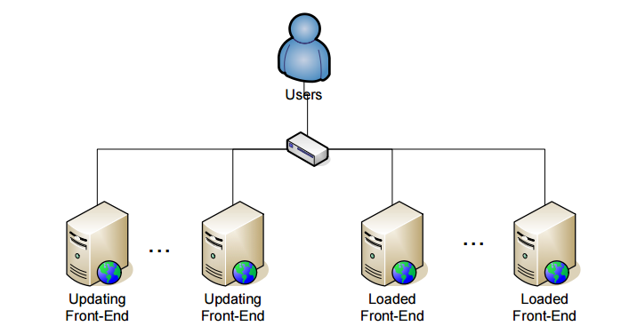

# Balanced Platform Upgrade on Highly Loaded OutSystems Farms

**This guide applies exclusively to Platform Server upgrades/updates**. If you are also deploying application changes while performing a Platform Server upgrade/update, you will need to take extra steps which are outside the scope of this guide. For more information, see [Balanced Application Deployment on Highly Loaded OutSystems Farms](https://success.outsystems.com/Documentation/11/Managing_the_Applications_Lifecycle/Deploy_Applications/Balanced_application_deployment).

To follow this procedure the servers must be running at least OutSystems Platform Server version 4.2 or, if you are running the J2EE stack, the servers must be running at least OutSystems Platform Server version 4.2.4.79.

**This guide presents the steps required to successfully upgrade Platform Server in an existing highly loaded OutSystems farm environment. The upgrade and deployment process is balanced throughout the existing front-ends, guaranteeing no downtime for the applications.**

In this procedure, some front-ends are disabled from the load balancer, thus not receiving new requests. Then, the front-ends which are not receiving traffic are upgraded.

When the upgrade process is finished, the load balancer is configured to only redirect traffic to the front-ends which are already upgraded, while the upgrade is performed to the remaining front-ends.

Once all front-ends are running the new version of the OutSystems Platform, the load balancer is configured to redirect traffic among all of them. By performing an incremental deployment, this process ensures no downtime.

This procedure requires operations to be executed in Service Center and at Operating System level (in the services management console). Additionally, it also assumes the existence of a network load balancing mechanism for distributing the application traffic between the front-ends.

In order to identify the several server profiles in the farm environment, please consider the following diagram, where the users access the applications through a load balancing mechanism. During the deploy procedure we will identify each of the front-end as **updating** or **loaded**:

* An **updating** front-end will not have users accessing the Applications but will allow the platform and Application upgrade and deployment process to execute;

* A **loaded** front-end will have users accessing its applications but will not allow the Application deployment process to execute. 

 

Note that, if the environment uses **Zones** for application segmentation, you must consider **updating** and **loaded** front-end profiles in each Zone. In that case, think of each Zone as if it were a distinct environment.

Also, the Controller server (the one running the Deployment Controller Service) must be included as part of the initial **updating** set. 

With this definition in mind, choose your updating and loaded front-ends. To improve the reliability of the procedure we recommend that the sets of updating and loaded front-ends are defined before the procedure and that the procedure is annotated to have actual front-end/machine names so that it can be referenced during the execution of the upgrade.

To execute the upgrade, use the following steps:

| Step |Description | Server |
|-------|-------|---------|
| **1** | **Set traffic on the load balancer to the loaded front-ends (remove the updating ones)**  Access your load balancing management tool and remove application traffic from the **updating**  front-ends.| Load Balancer |
| **2** | **Disable deployment to loaded front-ends in Service Center**  Access the environment’s Service Center and log in with administrative privileges. Go to the **Administration  -> Front-end Servers**  page and, for each **loaded** front-end, access its details and press the **Disable** button.  | Loaded Front-ends|
| **3** | **Follow the Platform Server installation checklist and upgrade the Deployment Controller Server and the updating front-ends**  Follow the appropriate steps on a single  updating front-end.| Any Updating Front-end |
| **4** | **Test your applications on the updating front-ends**  Access the applications on your **updating**  front-ends to confirm their availability.| Updating Front-ends|
| **5** | **Set traffic on the load balancer to the updating front-ends**  Access your load balancing management tool. Add the **updating**  front-ends to **start**  receiving application traffic. Remove the **loaded**  front-ends so that they **stop**  receiving application traffic.| Load Balancer|
| **6** | **Follow the Platform Server installation checklist and upgrade the loaded front-ends**.| Loaded Front-ends |
| **7** | **Ensure that the OutSystems Deployment Service is running**  **.NET Stack:** In Windows’ Services management console (**services.msc** ), ensure that the OutSystems Deployment Service’s startup type is configured as Automatic. Start the service if it is stopped.  **J2EE Stack:** In a command line, as user root, run the following command: **# service outsystems start DEPLOYER** | Loaded Front-ends |
| **8** | **Access Service Center**  In the **Monitoring  -> Platform Monitoring**  page, click the **detail**  link for the **Deployment**  service in each loaded front-end. Wait until the status of all threads is ‘Sleeping’. When this happens, the deployment process has finished to the loaded front-ends.| Loaded Front-ends|
| **9** | **Reset traffic on the load balancer to all Front-ends**  Access your load balancing management tool and add the **loaded**  front-ends to start receiving application traffic again.| Load Balancer|

## More information

Check the [OutSystems Platform installation guide](https://success.outsystems.com/Documentation/11/Setting_Up_OutSystems) to learn more about the requirements and recommended steps to install the OutSystems platform.

