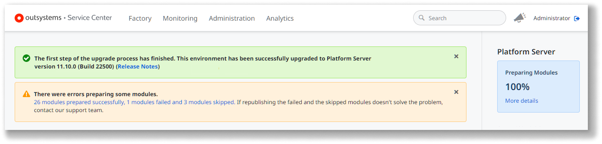
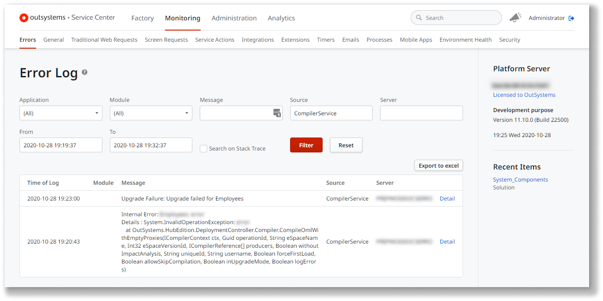
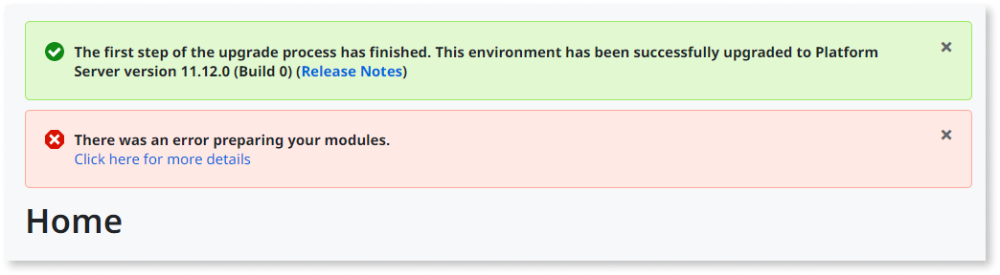
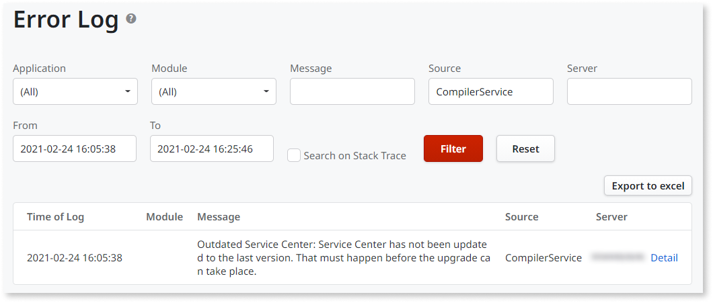
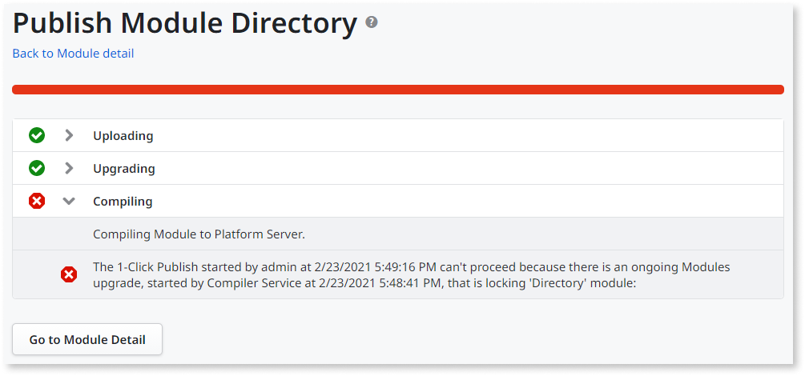
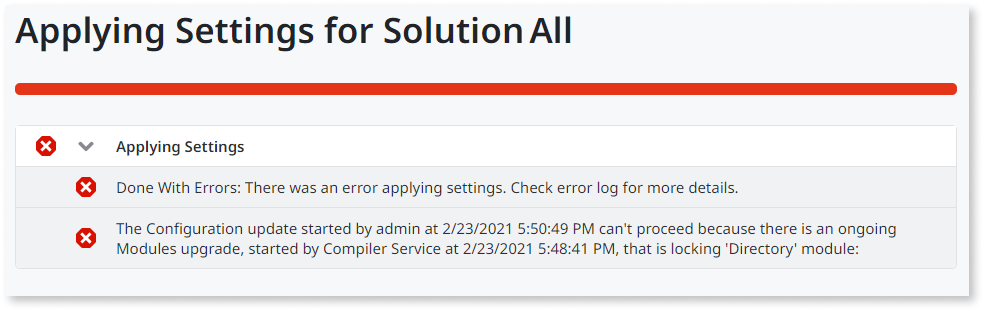
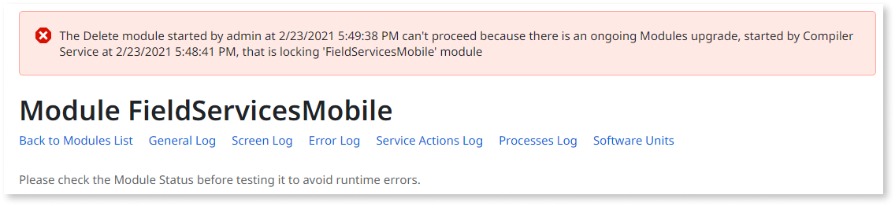
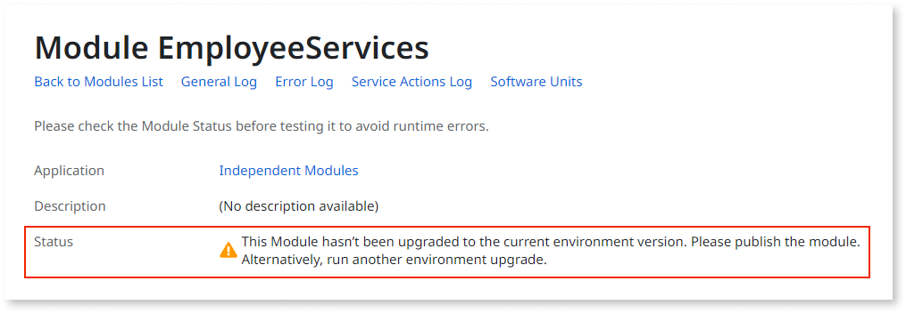
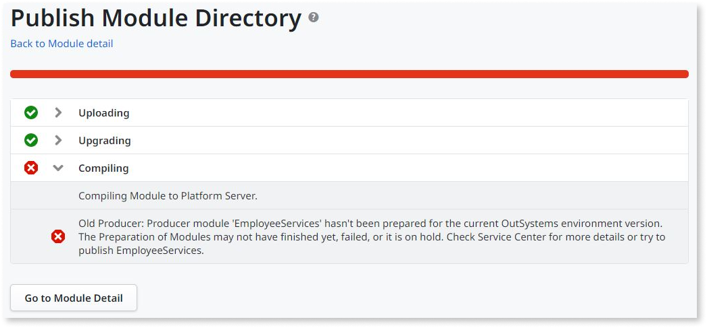

# Possible errors related to modules preparation

Starting from **Platform Server 11.12.0**, the [upgrade process](upgrade-platform.md) includes a new **modules preparation** step.

This article describes the possible errors that you can get during or after a [Platform Server upgrade](upgrade-platform.md) to Platform Server 11.12.0 or later, and the guidelines on how to proceed for each case.

Message
:   `There were errors preparing some modules.`

    

Cause
:   There were errors preparing some modules during the [modules preparation step](upgrade-platform-module-prep.md) of the upgrade. These errors are usually related to changes in the compiler of the new Platform Server version. They're non-expected breaking changes introduced by the platform upgrade.

    When the preparation of a producer module fails, the Platform Server automatically skips the preparation of all its consumer modules. In Service Center's error notification, you can see how many modules **failed** the preparation step and how many were **skipped** because they consume the modules with errors.

Recommendation
:   Click the link under the **There were errors preparing some modules** notification to see the error details for the modules that failed the preparation step. This link takes you to the **Error Log** screen:

    

    Publish each of the failed or skipped module. If the problem persists, [contact OutSystems Support](https://success.outsystems.com/Support/Enterprise_Customers/OutSystems_Support/01_Contact_OutSystems_technical_support).

---

Message
:   `There was an error preparing your modules.`

    

Cause
:   The [modules preparation step](upgrade-platform-module-prep.md) of the upgrade failed. Possible causes are:

  * **[Self-managed installations only]** An unattended upgrade process triggered the modules preparation step manually, using the `ConfigurationTool.com /UpgradePublishedApplications` parameter, but the installation of the Service Center or the System Components hasn't run yet.
    
  * An internal error occurred during the process.

Recommendation
:   Click the link **Click here for more details** to see the details of the error. This link takes you to the **Error Log** screen:

    

    * **[Self-managed installations only]** If you are executing an unattended upgrade, make sure you follow the steps described in [Unattended Installation and Upgrade](https://success.outsystems.com/Documentation/11/Setting_Up_OutSystems/Unattended_Installation_and_Upgrade#Upgrade) documentation. If the problem persists, [contact OutSystems Support](https://success.outsystems.com/Support/Enterprise_Customers/OutSystems_Support/01_Contact_OutSystems_technical_support).

    * **[OutSystems Cloud]** Contact [OutSystems Support](https://success.outsystems.com/Support/Enterprise_Customers/OutSystems_Support/01_Contact_OutSystems_technical_support).

---

Message
:   `The 1-Click Publish started by <user> at <time> can't proceed because there is an ongoing Modules upgrade, started by Compiler Service at <time>, that is locking '<module>' module.`

    

Cause
:   The environment is being upgraded, and the [modules preparation step](upgrade-platform-module-prep.md) hasn't finished yet. You can't publish any application or module in the environment while the modules preparation step is in progress.

Recommendation
:   Wait for the modules preparation step to finish before you publish your applications or modules. You can [check the progress](upgrade-platform-module-prep.md#progress) of the modules preparation step in the Service Center console.

---

Message
:   `The Configuration update started by <user> at <time> can't proceed because there is an ongoing Modules upgrade, started by Compiler Service at <time>, that is locking '<module>' module.`

    

Cause
:   The environment is being upgraded, and the [modules preparation step](upgrade-platform-module-prep.md) hasn't finished yet. You can't apply settings in the environment while the modules preparation step is in progress.

Recommendation
:   Wait for the modules preparation step to finish before you apply settings to the environment. You can [check the progress](upgrade-platform-module-prep.md#progress) of the modules preparation step in the Service Center console.

---

Message
:   `The Delete module started by <user> at <time> can't proceed because there is an ongoing Modules upgrade, started by Compiler Service at <time>, that is locking '<module>' module.`

    

Cause
:   The environment is being upgraded, and the [modules preparation step](upgrade-platform-module-prep.md) hasn't finished yet. You can't delete a module while the modules preparation step is in progress.

Recommendation
:   Wait for the modules preparation step to finish before you delete the module. You can [check the progress](upgrade-platform-module-prep.md#progress) of the modules preparation step in the Service Center console.

---

Message
:   `This Module hasn't been upgraded to the current environment version. Please publish the module. Alternatively, run another environment upgrade.`

    

Cause
:   The environment has been or is being upgraded to a new Platform Server version, but this module hasn't been compiled in the new platform version yet. Possible causes are:

    * The environment is still being upgraded, and the [modules preparation step](upgrade-platform-module-prep.md) hasn't finished yet.

    * During the modules preparation step of the upgrade, the compilation of this module in the new version failed.

    * During the modules preparation step of the upgrade, the compilation of this module was skipped because a producer module failed to compile.

    * **[Self-managed installations only]** An unattended upgrade process didn't trigger the modules preparation step.

Recommendation
:   [Check the progress](upgrade-platform-module-prep.md#progress) of the modules preparation step in the Service Center console. If the step is still ongoing, wait for it to finish.

    If the modules preparation step finished with errors, [see above](#error-prep-modules) how to proceed.

    **[Self-managed installations only]** If you are executing an unattended upgrade, make sure you follow the steps described in [Unattended Installation and Upgrade](https://success.outsystems.com/Documentation/11/Setting_Up_OutSystems/Unattended_Installation_and_Upgrade#Upgrade) documentation. If you opted to skip the preparation step, or if you are upgrading from Platform Server 10 or previous, you must republish all your applications right after the upgrade.

---

Message
:   `Producer module '<producer module name>' hasn't been prepared for the current OutSystems environment version. The Preparation of Modules may not have finished yet, failed, or it is on hold. Check Service Center for more details or try to publish '<producer module name>'.`

    

Cause
:   The module you are trying to publish has a dependency to a producer module that hasn't been compiled in the new platform version yet. Possible causes are:

    * The environment is still being upgraded, and the [modules preparation step](upgrade-platform-module-prep.md) hasn't finished yet.

    * During the modules preparation step of the upgrade, the compilation of the producer module in the new version failed or was skipped.

    * **[Self-managed installations only]** An unattended upgrade process didn't trigger the modules preparation step.

Recommendation
:   [Check the progress](upgrade-platform-module-prep.md#progress) of the modules preparation step in the Service Center console. If the step is still ongoing, wait for it to finish.

    If the modules preparation step finished with errors, [see above](#error-prep-modules) how to proceed.

    **[Self-managed installations only]** If you are executing an unattended upgrade, make sure you follow the steps described in [Unattended Installation and Upgrade](https://success.outsystems.com/Documentation/11/Setting_Up_OutSystems/Unattended_Installation_and_Upgrade#Upgrade) documentation. If you opted to skip the preparation step, or if you are upgrading from Platform Server 10 or previous, you must republish all your applications right after the upgrade.
