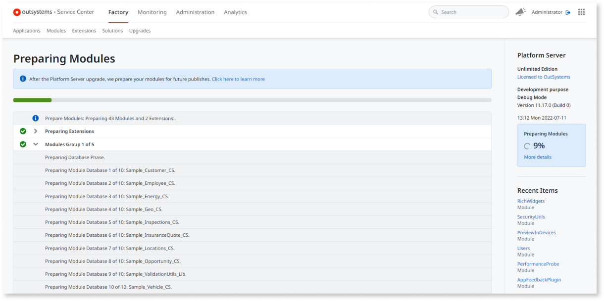

# Modules preparation step during Platform Server upgrade

Starting from **Platform Server 11.12.0**, the upgrade process includes a new **modules preparation** step.

When [upgrading your OutSystems environment](upgrade-platform.md#upgrade-ps) from **Platform Server 11.x** to **Platform Server 11.12.0 or later**, the Platform Server installation starts **preparing your modules** for the new version.

During this step, the Platform Server performs a **background compilation** of all your modules using the new platform version, but it doesn't deploy them. Your running applications aren't changed during the upgrade, until a deployment takes place. In other words, existing modules continue to run using the previous system components version. The compilation process updates all module dependencies, including the new system components version, and then compiles the module. To use the latest system components you must deploy the module.

This enables you to **publish your applications gradually**, following your teams' pace, after the Platform Server upgrade.

The modules preparation only has effect over the **modules that were previously published with success** in the environment. Modules that were only uploaded, or never published successfully won't be compiled during this step.

For OutSystems Cloud environments, the modules preparation takes place outside your maintenance window, as it doesn't require any downtime.

## Continuous improvement of modules preparation

OutSystems is continuously improving modules preparation. Thus, depending on the Platform Server version you are upgrading to, you might get different behaviors:

* **From Platform Server 11.12.0 to 11.14.1**: The Platform Server executes the **preparation** of all the environment's modules sequentially. This step enables you to **publish your applications gradually** after a Platform Server upgrade, following your teams' pace. It's not mandatory anymore to publish all the modules after the upgrade.

* **From Platform Server 11.15.0 to 11.16.1**: The modules preparation executes **progressively**. The Platform Server uses an improved algorithm that divides the preparation of all modules into **small groups of modules**, adding [several key improvements](#key-improvements). OutSystems enabled the **progressive modules preparation** for some Cloud customers from Platform Server 11.15.0.

* **From Platform Server 11.17.0 or later**: Progressive modules preparation is available for all customers with an improved UI.

## Progressive modules preparation { #key-improvements }

Having the progressive modules preparation enabled, after upgrading your OutSystems environment, the Platform Server uses an improved algorithm to perform the preparation of small groups of modules. This approach introduces the following key improvements:

* **Overall performance improvement**: The global step of preparing all the environment's modules was optimized. The average preparation time per module is now lower.

* **Faster development resume**:
    * The modules are prepared by order of the number of references to them, thus the most consumed modules in the environment are compiled first. This contributes to a faster resume of the development, as a developer can publish a module as soon as all modules it consumes are successfully prepared.

    * The Platform Server no longer locks all the environment modules during the whole preparation step. As modules are now compiled in groups, only the modules within a group are locked during the period that group is being prepared.

* **Faster preparation retry**: If the modules preparation is re-executed after an error occurs, the Platform Server no longer restarts the preparation from scratch. Modules that were already prepared successfully on a previous preparation execution won't be prepared again.

## During the modules preparation

While the modules preparation is taking place, Service Center displays the step progress:

During this period, the Platform Server performs the preparation of small groups of modules. See below how to [check the progress](#progress) of the modules preparation in more detail, including which group of modules is currently being prepared.

Until the modules preparation finishes for a group, **you cannot** perform the following operations for the modules in that group:

* Publish module
* Apply configurations
* Delete module

The attempt to execute any of the above operations for a module while the preparation is in progress for the corresponding group, results in an error. See [the possible errors](upgrade-platform-errors.md) related to modules preparation.

When the preparation of a group completes, you can resume the development for the modules of that group.

During the preparation step, if you go to the detail screen of a module that hasn't yet been compiled with the new platform version, the module Status is the following:

### Checking the progress of the modules preparation { #progress }

This section applies to Platform Server 11.17.0 or later. If you are upgrading to Platform Server 11.16.1 or earlier, [see the section below](#preparation-11-16-1).

You can check the progress of the modules preparation in any screen of the environment's Service Center console (`https://<your_environment>/ServiceCenter`).

While the modules preparation is in progress, Service Center notifies you that the environment has been successfully upgraded to a new Platform Server version, and the modules preparation is taking place, showing the status of the operation.

To see the details of the modules preparation, click the **current preparation details** link on the blue banner, or the **More details** link on the sidebar.

On this screen, you can see which group of modules is currently being prepared and the details of the preparation.

Too see the status of the current modules preparation and the progress of the already prepared modules, click the **Upgrades** tab.

In **self-managed installations**, you can also see the progress of the modules preparation in the Configuration Tool, in the window that appears after pressing **Apply/Exit**:

## After the modules preparation finishes

This section applies to Platform Server 11.17.0 or later. If you are upgrading to Platform Server 11.16.1 or earlier, [see the section below](#preparation-11-16-1).

Once the modules preparation finishes successfully, your environment is ready and you can publish your applications in the new version.

When you publish a module after the modules preparation, the Platform Server uses the producers compilation generated during the preparation phase. This ensures all the code is updated, even if you haven't published those producers since the upgrade.

Starting from Platform Server 11.18.0, a new [Deploy All](upgrade-platform-module-deploy.md) feature is available.

Due to known issues found in Platform Server 11.18.0, we advise all customers **not to use** the [Deploy All](upgrade-platform-module-deploy.md) feature. In the OutSystems Cloud, we've made this feature unavailable.

Check [Platform Server 11.18.0 release notes and known issues](https://success.outsystems.com/Support/Release_Notes/11/Platform_Server#platform_server_11.18.0) for more details. In Platform Server 11.18.1 we've turned off this feature. These issues will be fixed in a next release and the feature will be again available for use.

To see the upgrades report, click the **go to Upgrades** link on the banner.

After the modules preparation finishes, you can access the upgrades report by clicking the **Upgrades** tab under the **Factory** section. In the report table, you see all the previous preparation executions and the corresponding status. You can access the preparation details of each execution by clicking its **Preparation** link.

If error occurs during the modules preparation, you can relaunch the preparation step by clicking the **Prepare** button. Subsequent executions of modules preparation will only apply to the modules that failed the preparation during the previous run.

If the error persist, [see here](upgrade-platform-errors.md) how to proceed.

## Modules preparation with Platform Server 11.16.1 or earlier { #preparation-11-16-1 }

If you are upgrading to **Platform Server 11.16.1 or earlier**, you can see the details of the modules preparation by clicking the **Click here for more details** link on the blue banner, or the link **More details** on the sidebar, in Service Center.

If the **progressive modules preparation** is enabled in your environment, you’ll see the sequence of actions that are part of the modules preparation repeated once per group of modules.

Until the modules preparation finishes for a group, **you cannot** perform the following operations for the modules in that group:

* Publish module
* Apply configurations
* Delete module

When the preparation of a group completes, you can resume the development for the modules of that group.

If the new progressive modules preparation hasn’t been enabled in your environment yet, you must wait until the whole preparation step finishes to start using the modules.

After the modules preparation finishes, you can access the latest preparation report going to the Service Center's screen `https://<your_environment>/ServiceCenter/PrepareModules.aspx`.

## Known issues with Modules Preparation { #known-issues }

If you are directly upgrading from Platform Server 11.10.0 or earlier to a version that includes the Flexible Upgrades feature (from version 11.12.0 onwards), we recommend that you publish all your applications instead. 

This is due to an issue found when running applications compiled in previous versions and are using new configurations added in Platform Server 11.10.0. This combination has proven to cause High CPU usage on Frontends until all the applications are republished in the new version.

As a workaround, publishing all your applications is recommended.
