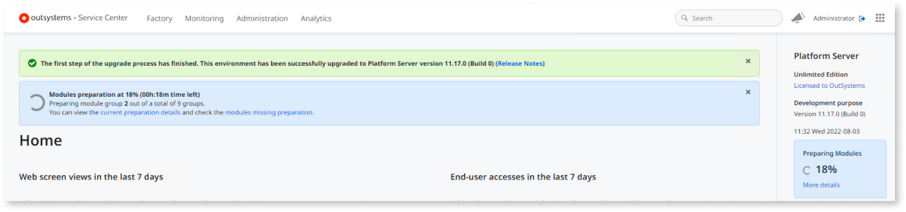
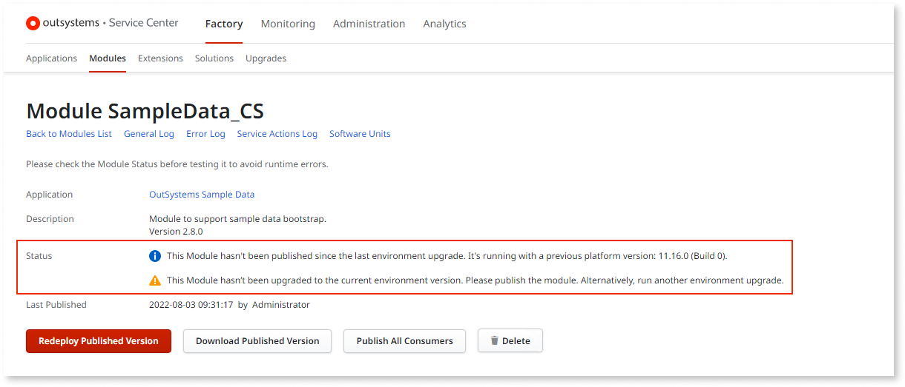
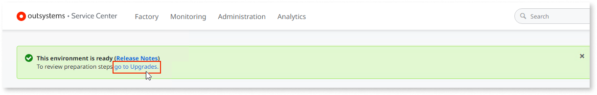

# Modules preparation step during Platform Server upgrade

Starting from **Platform Server 11.12.0**, the upgrade process includes a new **modules preparation** step.

When [upgrading your OutSystems environment](upgrade-platform.md#upgrade-ps) from **Platform Server 11.x** to **Platform Server 11.12.0 or later**, the Platform Server installation starts **preparing your modules** for the new version.

During this step, the Platform Server performs a **background compilation** of all your modules using the new platform version, but it doesn't deploy them. Your running applications aren't changed during the upgrade.

This enables you to **publish your applications gradually**, following your teams' pace, after the Platform Server is upgraded.

The modules preparation step only has effect over the **modules that were previously published with success** in the environment. Modules that were only uploaded, or never published successfully will not be compiled during this step.

For OutSystems Cloud environments, the modules preparation step takes place outside your maintenance window, as it doesn't require any downtime.

You must wait until the modules preparation step finishes to start publishing your applications. If you are upgrading to **Platform Server 11.15.0**, see how the [progressive modules preparation](#progressive-preparation) works.

See below how to [check the progress](#progress) of the modules preparation step.

## During the modules preparation step

While the modules preparation step is taking place, Service Center displays the step progress:

During this period, if you go to the detail screen of a module that hasn't yet been compiled with the new platform version, the module Status is the following:

Until the modules preparation step finishes, **you cannot** perform the following operations in the environment:

* Publish any application or modules
* Apply configurations
* Delete modules

The attempt to execute any of the above operations while the modules' preparation is in progress, results in an error. If you are upgrading to **Platform Server 11.15.0**, see how the [progressive modules preparation](#progressive-preparation) works.

### Checking the progress of the modules preparation step { #progress }

You can check the progress of the modules preparation step in any screen of the Service Center console of the environment (`https://<your_environment>/ServiceCenter`).

While the modules preparation step is in progress, Service Center notifies you that the environment has been successfully upgraded to a new Platform Server version, and the modules preparation step is taking place, showing the status of the operation:

To see the details of the modules preparation step, click the link **Click here to learn more** on the blue banner, or the link **More details** on the sidebar:

In **self-managed installations**, you can also see the progress of the modules preparation step in the Configuration Tool, in the window that appears after pressing **Apply/Exit**:

## After the modules preparation step finishes

Once the modules preparation step finishes successfully, your environment is ready and you can start publishing your applications in the new version.

When you publish a module after the modules preparation step, the Platform Server uses the producers compilation generated during the preparation phase. This ensures all the code is updated, even if you haven't published those producers since the upgrade.

If some error occurs during the modules preparation step, [see here](upgrade-platform-errors.md) how to proceed.

After the modules preparation step finishes, you can always access the latest preparation step report going to the Service Center's screen `https://<your_environment>/ServiceCenter/PrepareModules.aspx`.

## Progressive modules preparation { #progressive-preparation }

Starting from **Platform Server 11.15.0**, the modules preparation step is executed progressively: instead of preparing all modules at once, the Platform Server performs the preparation of smaller batches of modules.

This approach introduces the following key improvements:

* **Lower modules lock period**: As modules are now compiled in smaller batches, only the modules within a batch are locked during the period that the batch is being prepared. The Platform Server no longer locks all the environment modules during the whole modules preparation step.

* **Top consumed modules prepared first**: The modules are prepared by order of the number of references to them, thus the most consumed modules in the environment are compiled first. This contributes to a faster resume of the development of the most environment modules.

* **Faster retry execution on errors**: If an error occurs during the modules preparation step, the Platform Server no longer restarts the compilation from scratch. The subsequent retry executions will not include the modules that were already successfully prepared.

* **Overall performance improvement**: The global step of preparing all the enviroment modules now runs faster.

The new progressive modules preparation process released in Platform Server 11.15.0 will be gradually rolled out to OutSystems customers, it’s not available by default when upgrading to this version.

This option will be gradually rolled out to OutSystems Cloud environments first. It will be available to self-managed environments after reaching general availability in OutSystems Cloud.

When OutSystems enables the new progressive modules preparation process in your environment, you’ll see the sequence of actions that are part of the modules preparation step repeated once per batch, as you can see below:

When the preparation of a batch completes, the following operations will be available for the modules within that batch:

* Publish the module in the new upgraded version
* Apply configurations
* Delete the module

If the new progressive modules preparation hasn’t been enabled in your environment yet, you must wait until the whole preparation step finishes to start using the modules.
