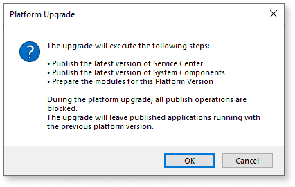

# Upgrade OutSystems platform

If you are using a personal environment and you would like to upgrade it to the latest version, refer to the article [Upgrade a personal environment to the latest version](https://success.outsystems.com/Support/Personal_Environment/Upgrade_a_personal_environment_to_the_latest_version).

## Overview { #overview }

The OutSystems ecosystem is divided into components with different [release cycles](https://success.outsystems.com/Support/Enterprise_Customers/Upgrading/OutSystems_Release_Cycle): Platform Server, Development Environment (Service Studio and Integration Studio) and LifeTime Management Console. This article focuses on the upgrade of the core server part of OutSystems product, the **Platform Server**.

Upgrading your OutSystems environments to a new Platform Server version is a four-step process that requires preparation, as it may impact your applications (all your applications will have a new version after the upgrade). The steps for this process are:

* Analysis and Preparation
* Planning
* Execution
* Testing

This information is also available offline, see the [Upgrade datasheet](resources/platform-upgrade.pdf).

### LifeTime upgrade { #lt-upgrade }

Up to version **OutSystems 10**, upgrading OutSystems to a new major version means upgrading all the infrastructure - LifeTime management console and the application environments.

From version **OutSystems 11 onwards**, [LifeTime is distributed independently](https://success.outsystems.com/Support/Enterprise_Customers/Upgrading/OutSystems_Release_Cycle#Release_cycles) from the Platform Server, which enables both components to have different upgrading paces. For further details on the LifeTime upgrade process, see [this article](upgrade-lifetime.md).

**When upgrading your infrastructure, make sure that LifeTime is the most up-to-date environment.** If you’re running OutSystems 11, LifeTime's [continuous release cycle](https://success.outsystems.com/Support/Enterprise_Customers/Upgrading/OutSystems_Release_Cycle#Release_cycles) enables you to benefit quicker from the latest features and fixes. If you are running OutSystems 10 or previous, first you must [upgrade your LifeTime Management console](https://success.outsystems.com/Support/Enterprise_Customers/Upgrading/Upgrade_LifeTime_management_console) to the latest version.

Starting on version 11, LifeTime is only supported when installed in a dedicated environment. If you still have it installed in an application environment, see [how to reinstall LifeTime in a dedicated environment](https://success.outsystems.com/Support/Enterprise_Customers/Maintenance_and_Operations/Reinstall_the_infrastructure_management_console_in_a_dedicated_environment).

## Analysis and preparation { #analysis }

Before you start the upgrade of your OutSystems infrastructure, you should consider the new features, improvements, security, and bug fixes of that release:

* [What's new (OutSystems 11)](https://success.outsystems.com/Documentation/11/New_in_OutSystems_11)
* [Release Notes](https://success.outsystems.com/Support/Release_Notes)

You should also assess the impact that the upgrade may have in your applications, checking the Side Effects and Breaking Changes documents:

* [Side Effects and Breaking Changes in OutSystems 11](http://www.outsystems.com/goto/breaking-changes-11)
* [Side Effects and Breaking Changes in OutSystems 10](http://www.outsystems.com/goto/breaking-changes-10)

Be sure to read all the documents that might impact your upgrade. For example, if you're upgrading from OutSystems platform 9.1 to 11, read the breaking changes for versions 10 and 11.

## Planning { #planning }

The second phase is the planning. Based on the breaking changes identified on the previous step, you should estimate how long it will take to perform the needed code fixing, and to publish your applications in the new version.

If you are upgrading from **Platform Server 11.x** to **Platform Server 11.12.0 or later**, after the Platform Server is upgraded, you can **publish your applications gradually**, following your teams' pace.

In the following upgrade scenarios, you must **publish all your applications** after the Platform Server is upgraded:

* Upgrading from **Platform Server 10 or previous** to **Platform Server 11**
* Upgrading from **Platform Server 11.x** to **Platform Server 11.11 or earlier**

Make sure you involve your teams (you will need your development and test teams) and plan ahead to align the upgrade with your release cycle.

 An upgrade sprint should never break a development sprint!

 An upgrade should always happen between development sprints (if you have teams at a different speed, make the necessary adjustments).

Validate the best time to upgrade the Production environment and plan the remaining environment upgrades from there.

When upgrading your OutSystems environments, we recommend that you follow the staging lifecycle of the applications in the infrastructure. This is the order you push your developments to production, for example, **Development > Testing > Pre-Production > Production**.

You always have the freedom to choose the order that's most convenient for you. Sometimes, to best coordinate with the development teams and ongoing projects, you can start with another non-production environment (for example, Pre-Production) to fully validate the applications upgrade, and then upgrade the Production environment. Only after, upgrade the Development environment according to the development teams delivery sprints. **Bottom line is, you should always upgrade and test your applications in a non-production environment before proceeding to the Production environment**.

For pre-production, you should create a custom checklist containing all the requirements and steps to execute in production, following a [downtime](#downtime) or [zero-downtime](#zero-downtime) approach.

#### Go live strategies { #go-live }

When upgrading the Platform Server you should consider that the environment is literally under maintenance. Therefore, if you already have live applications, this process may impact them and, as such, you should define a strategy for the upgrade of your Production environment, based on the priority of your applications.

##### Downtime upgrade { #downtime }

A Downtime approach is the safest way to perform an upgrade and advised when there are no business requirements for zero-downtime. By stopping the Production environment and preventing end-users access, the Upgrade process consistency is guaranteed, and a rollback can happen with no data loss.

##### Zero-downtime upgrade { #zero-downtime }

Choosing to do a Zero-Downtime Upgrade means that if you need to rollback, you will most certainly have data loss. To successfully perform a Zero-Downtime Upgrade, your environment requires multiple Front Ends in each OutSystems Zone. **If you don’t have this feature enabled you cannot proceed with this solution**. The Upgrade process is done by:

1. Disabling the Front-end servers in Service Center.
1. Upgrade the platform in the controller node.
1. In the load balancer disconnect half of front-end servers in each zone.
1. Upgrade those servers and then enable them in Service Center
1. Switch the active Front-End servers in the Load Balancer to the upgraded ones
1. Upgrade the remaining Front-End servers.
1. Finally, reconnect all servers to the Load Balancer.

## Execution { #execution }

Once you have your upgrade plan defined, and the development and test teams allocated, you can proceed with the upgrade execution.

For each environment, the upgrade consists in the following steps:

1. Upgrade the **Platform Server component**.

2. Upgrade the **development tools** of the developers publishing applications in that environment.

3. Upgrade the **applications** to the new version. Depending on your upgrade scenario, you might need to publish all your applications, or opt to publish your applications gradually, following your teams' pace. See the [details below](#upgrade-apps).

### Step 1. Upgrade the Platform Server component { #upgrade-ps }

Depending on if your environment is in the OutSystems Cloud or in your datacenter (on-premises/private cloud), follow the relevant procedure below:

#### OutSystems Cloud { #upgrade-cloud }

In the OutSystems Cloud, the process of upgrading the Platform Server is handled by OutSystems, coordinating with you in every step of the way. This guarantees a successful and painfree procedure as possible:

1. Make your upgrade request by opening a support ticket using [any of the available mechanisms](https://success.outsystems.com/Support/Enterprise_Customers/OutSystems_Support/01_Contact_OutSystems_technical_support) and provide the following:

    * An [infrastructure admin's](https://success.outsystems.com/Support/Enterprise_Customers/OutSystems_Support/Managing_your_company_permissions_on_outsystems.com#Infra_Admin) approval. If you're an infrastructure admin, your request is authorized. If you're not an admin either ask your admin to submit the ticket or to leave a reply on the ticket stating the approval.
    * What are the **environments** you want to upgrade and to what **version**. You can check [OutSystems release notes](https://success.outsystems.com/Support/Release_Notes) for a list of available versions for Platform Server and LifeTime. We advise you to choose the latest version.
    * Let us know **when** (date and time) you wish to upgrade each environment, make sure to refer the time zone. We advise to allow at least a day between the schedule of each environment to accommodate for testing. If you have any special needs, let us know.

1. OutSystems will promptly contact you to discuss the schedule and plan for the upgrade.

1. OutSystems proceeds with the upgrade of the environment on the agreed schedule. 
    
    1. When upgrading the **Development environment** of your infrastructure to **Platform Server 11.11.3 or earlier**, OutSystems also installs the latest version of the following components:

        * [OutSystems UI](https://www.outsystems.com/forge/component-overview/1385/silk-ui-mobile)
        * [OutSystems UI Web](https://www.outsystems.com/forge/4143/)
        * [OutSystems Charts](https://www.outsystems.com/forge/4141/)
        * [OutSystems Charts Web](https://www.outsystems.com/forge/4142/)
        * [OutSystems Maps](https://www.outsystems.com/forge/component-overview/9909/)
        * [OutSystems UI Templates Mobile](https://www.outsystems.com/forge/4148/)
        * [OutSystems UI Templates Reactive](https://www.outsystems.com/forge/6335/)
        * [OutSystems UI Web Screen Templates](https://www.outsystems.com/forge/4146/)
        * [OutSystems Sample Data](https://www.outsystems.com/forge/4145/)
    
    1. When upgrading to **Platform Server 11.12.0 or later**, you're reponsible for updating those components.

1. If you are upgrading from **Platform Server 11.x** to **Platform Server 11.12.0 or later**, you receive an email indicating that the Platform Server has been upgraded in your environment, and OutSystems is now [preparing your modules](upgrade-platform-module-prep.md) for the new version. This operation takes place outside your maintenance window as it doesn't require any downtime. Once the modules preparation step finishes, you are able to [publish your applications in the new version](#upgrade-apps), at your own pace.

**OutSystems is responsible only for the Platform Server upgrade**. Once the OutSystems software (System Components included) is updated in the environment, the **customer is responsible for**:

* Publishing your applications in the new version ([Upgrade Applications to the new version](#upgrade-apps))
* Resolving any breaking changes

#### Self-managed (private cloud / on-premises) { #upgrade-premises }

If the environment is self-managed (running in your own private cloud or on-premises) the upgrade process is fully managed by you, without the direct involvement of OutSystems. However, you can [contact OutSystems Support](https://success.outsystems.com/Support/Enterprise_Customers/OutSystems_Support/01_Contact_OutSystems_technical_support) at any time for assistance.​

While upgrading the Platform Server component, consider [enabling maintenance mode in the environment](https://success.outsystems.com/Documentation/11/Managing_the_Applications_Lifecycle/Manage_Your_OutSystems_Infrastructure/Environment_in_maintenance_mode) to avoid unnecessary communication attempts from the LifeTime console.

The process is the following:

1. Download the latest version of the [Platform Server installer](https://www.outsystems.com/home/downloads/).

1. Follow the [Installation Checklist](https://www.outsystems.com/home/downloads/) for the corresponding Platform Server version.
In the Installation Checklist, select the corresponding upgrade option, and follow the instructions.

    

If you are upgrading from **Platform Server 11.x** to **Platform Server 11.12.0 or later**, the Platform Server installer starts [preparing your modules](upgrade-platform-module-prep.md) for the new version.

When you click **Apply and Exit** in the Configuration Tool, as described in the Installation Checklist, you must confirm the execution of the following steps:

* Publish the latest version of Service Center
* Publish the latest version of System Components
* Start the modules preparation step

Pressing **OK** publishes the latest version of Service Center and System Components, and starts running the [modules preparation step](upgrade-platform-module-prep.md) in the background. You can see the progress of the operation in the Configuration Tool window, or in [the Service Center console](upgrade-platform-module-prep.md#progress).

Closing the Configuration Tool during the modules preparation step doesn't interrupt the operation.

Once the modules preparation step finishes, you are able to [publish your applications in the new version](#upgrade-apps), at your own pace.

### Step 2. Upgrade the development tools { #upgrade-dev-tools }

If you haven't already, download and install the corresponding version of the [Service Studio and Integration Studio](http://www.outsystems.com/home/downloads/) (Service Studio and Integration Studio) in the workstations of the developers publishing applications in the environment.

### Step 3. Upgrade applications to the new version { #upgrade-apps }

At this stage, it's important you have your teams' availability to perform the needed code fixing resulting from possible breaking changes.

If you are upgrading from **Platform Server 11.x** to **Platform Server 11.12.0 or later**, after the upgrade, you can **publish your applications gradually**, following your teams' pace. You can only start publishing your applications after the [modules preparation step](upgrade-platform-module-prep.md) finishes. [Check the progress](upgrade-platform-module-prep.md#progress) of the modules preparation step in Service Center. You can also opt to **publish all your applications** by this time, but it's not a mandatory step.

In the following upgrade scenarios, you must **publish all your applications** after the Platform Server is upgraded:

* From **Platform Server 10 or previous** to **Platform Server 11**
* From **Platform Server 11.x** to **Platform Server 11.11.3 or earlier**

[See below](#publish-all) for the possible approaches to publish all the applications in your upgraded environment.

For **mobile apps**, upon a Platform Server version upgrade in your **Production environment**, it's expected that many of the mobile app resources carry differences, which will trigger over-the-air (OTA) upgrades to all the end users. **Generating and distributing a new build** eliminates the need for OTA upgrades so it's an advisable practice that improves the end-user experience.

Starting from Platform Server 11.18.0, a new [Deploy All](upgrade-platform-module-deploy.md) feature is available.

Due to known issues found in Platform Server 11.18.0, we advise all customers **not to use** the [Deploy All](upgrade-platform-module-deploy.md) feature. In the OutSystems Cloud, we've made this feature unavailable.

Check [Platform Server 11.18.0 release notes and known issues](https://success.outsystems.com/Support/Release_Notes/11/Platform_Server#platform_server_11.18.0) for more details. In Platform Server 11.18.1 we've turned off this feature. These issues will be fixed in a next release and the feature will be again available for use.

#### Publish all applications { #publish-all }

Having the Platform Server upgraded in the environment, consider the following scenarios when publishing all the modules in the new version:

* On the **Development environment**, the fastest way to upgrade all your applications is by [creating a Solution with all modules](https://success.outsystems.com/Documentation/How-to_Guides/DevOps/Creating_and_using_an_All_Components_solution) and publish the "Current Running Version". If you get any errors publishing the solution, use the appropriate development tool to open the correspondent module and fix the problems. In the end, you can publish the whole solution again to make sure all issues and dependencies are properly resolved.

* For all **non-development environments** (for example, Testing, Production, etc.), it’s recommended to stage the application modules from a previously upgraded environment. Use the LifeTime management console to stage applications, when the lifecycle of the applications is perfectly aligned with the upgrade.

    

    Keep in mind that this approach for non-development environments is only applicable when the version of the applications on the previous environment is stable and ready to be staged to the next environment (upgrade must be aligned with your release cycle). If that’s not the case, you should perform a code-based upgrade, doing all the fixing and testing directly in each environment, following the same procedure as in the **Development environment**.

    

For **mobile apps**, upon a Platform Server version upgrade in your **Production environment**, it's expected that many of the mobile app resources carry differences, which will trigger over-the-air (OTA) upgrades to all the end users. **Generating and distributing a new build** eliminates the need for OTA upgrades and it's an advisable practice that improves the end-user experience.

For **Forge components**, it's a good practice to take the opportunity to upgrade them if there are new versions. Not only you can benefit from any bug fix but also the component might already be adjusted to any new feature or breaking change, saving you the effort to adjust the component. Make sure to validate any changes in the Forge components.

## Testing { #testing }

After publishing your applications in the new version, create and run tests to ensure that your applications hot-points aren't affected by the upgrade. Test your applications (screens, workflows, operations, etc.), and check for application errors or background issues in [Service Center's Error Log](https://success.outsystems.com/Documentation/11/Managing_the_Applications_Lifecycle/Monitor_and_Troubleshoot/View_the_Environment_Logs_and_Status), to guarantee that all applications are running as expected.

## Doing maintenance while upgrading environments { #maintenance }

While upgrading, if you need to do some bug fixing in an application that's running on an environment that hasn't been upgraded, you'll need to do it on that environment. It won't be possible to go through the usual development-production pipeline, because you can't stage applications between environments in different versions.

The solution is to make the fix directly in the environment that hasn't yet been upgraded.

As an example, imagine that you already upgraded Development and Test environments. There are still Pre-Production and Production environments to upgrade. You have to do a critical fix on an application in Production. In this case, use the development tools in Pre-Production to do the fix, publish, and test. Then, move the application to Production. Don't forget to backport the fix to the other environments.
