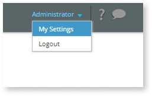

# Set Up OutSystems on Microsoft Azure

This article describes the steps to deploy and set up OutSystems on Microsoft Azure.

Prerequisites: OutSystems on Microsoft Azure solution template is available on Microsoft Azure Marketplace under Bring-Your-Own-License (BYOL) pricing model. To deploy OutSystems on Microsoft Azure, start by [contacting OutSystems](https://www.outsystems.com/pricing-and-editions/#contact-us) and get your license.

To deploy and set up OutSystems on Microsoft Azure you must execute the following steps:

1. [Run the solution template wizard in Azure Portal to deploy your OutSystems infrastructure.](#run-the-solution-template-wizard)
1. [Apply your OutSystems license to the deployed environments.](#apply-your-outsystems-license)
1. [Add a valid certificate to the environments.](#add-a-valid-certificate-to-the-environments)
1. [Register the environments on your OutSystems deployment management console (LifeTime).](#register-the-environments-in-lifetime)
1. [Install the extended product components.](#install-the-extended-product-components)

## Run the Solution Template Wizard

1. Go to [Azure Marketplace](https://azuremarketplace.microsoft.com "Azure Marketplace") or your [Azure Portal](https://portal.azure.com) and search for **OutSystems on Microsoft Azure** solution template.

1. On your [Azure Portal](https://portal.azure.com), in the OutSystems on Microsoft Azure solution template, click the **Create** button to proceed to the deployment wizard.

1. Fill in the information for the **Basics** blade and click OK to proceed to the next blade. The **Solution Identifier** you choose will be used to prefix the name of all resources created during the deployment, such as virtual machines or databases. In the **Resource Group** section click **Create new** and enter a name.

    

1. In the **Virtual Machine Size** blade, choose between a Standalone (1 VM) or a Farm (1 VM and 1 scale set) production environment. Select the size of each virtual machine, using one of the recommended sizes. Click **OK** to proceed to the next blade.

    

1. In the **Virtual Network Size** blade, confirm the values for the **Virtual network** and **Subnets** sections, and click **OK** in the **Subnets** section. Click **OK** to proceed to the next blade.

      

1. Click **OK** in the **Summary** blade.

      

1. Click the **Create** button in the **Buy** blade to start the deployment.

The deployment process might take about 1 hour to complete. You can check the deployment status in the **Deployments** section of the resource group. OutSystems deployment is finished when all the listed deployments are successful.

In your Azure Portal, you will now find a resource group with the name that you defined in the deployment wizard grouping all the newly created resources. All the [resources deployed](quick-reference.md#azure-resources "OutSystems on Microsoft Azure - Quick Reference") by OutSystems on Microsoft Azure solution template are prefixed with the solution identifier:

## Apply your OutSystems License

The next step is to apply your OutSystems license to each environment:

* Development
* Test
* Production
* LifeTime deployment management console

To set up OutSystems on Microsoft Azure you must have a valid [OutSystems license](https://www.outsystems.com/licensing).

To apply your OutSystems license to the **development** environment, do the following:

1. Go to the details of the **application gateway** created for the development environment to get the **DNS name** of its public IP address. For example, if your solution identifier is "myid", the application gateway of the development environment is "myid-dev-appgw". Click on the Frontend public IP address field to go to the details page of the public IP address.

      

1. You will access the environment through the **DNS name** of the public IP address. In the Public IP address details page, use the "Click to copy" option to copy the DNS name.

      

1. Using the DNS name from the previous step, access the Service Center management console of the environment with the following URL: `http://<DNS_name>/ServiceCenter`.

1. Log on using the default credentials (admin/admin). Don’t change the "admin" user password at this stage, you will do it at the end of the setup process.

1. Go to the Administration section and select the Licensing tab.

1. Take note of the **Serial Number** of the environment. You will need it to get the license file from OutSystems Licensing portal.

      

1. Go to [OutSystems Licensing portal](http://www.outsystems.com/licensing), select your infrastructure and choose ACCESS LICENSING.

      

1. Register your environment using the serial number you obtained in step 6.

1. If you are an authorized contact for licensing purposes, proceed with downloading the license file. Otherwise, the license file will be sent to an authorized contact via email.

    

1. Once you have the license file (`*.lic`), go back to the Licensing tab of the Service Center management console of your environment and select **Upload New License** to upload the license file.

    

Repeat the same procedure to apply the license to the remaining environments - Test, Production, and LifeTime.

## Add a valid certificate to the environments

To register the Development, Test, and Production environments in the LifeTime deployment management console, you have to first install valid certificates (signed by a Certificate Authority) in the Application Gateways of all the environments.

To add the trusted certificate to the Application Gateway of each environment (including LifeTime) do the following:

1. Go to the details of the **Application Gateway** that was created for the environment.

1. From the Settings menu, select **Listeners**.

      

1. Select the **appGatewayHttpsListener**.

      

1. Add a new certificate by uploading the .pfx file along with the password and a name of your choice.

    

## Register the environments in LifeTime

To register your environments in the LifeTime deployment management console, do the following:

1. Go to the details of the **application gateway** created for the LifeTime environment to get the **DNS name** of its public IP address. For example, if your solution identifier is "myid", the application gateway of the LifeTime environment is "myid-life-appgw". Click on the Frontend public IP address field to go to the details page of the public IP address.

      

1. You will access the environment through the **DNS name** of the public IP address. In the Public IP address details page, use the "Click to copy" option to copy the DNS name.

      

1. Using the DNS name from the previous step, access the LifeTime console with the following URL: `http://<DNS_name>/LifeTime`.

1. To register the development environment, we will use the **DNS name** of the public IP address associated to its application gateway, for example "myid-devappgw-PIP". Go to the details of the **public IP address** and use the "Click to copy" option to copy the DNS name.

      

1. Follow the instructions on [registering an environment in LifeTime](../lifetime-configure.md#register-an-environment), using the DNS name you copied in the step below as the Environment Address in the environment registration wizard.

1. The development environment is now registered in LifeTime. Repeat the process for the Test and Production environments.

At this point, we recommend that you change your password for the LifeTime administration user (admin). Choose **My Settings** on the top right side of the LifeTime header to go to your settings page where you can change your password. Changing the admin password on LifeTime automatically changes the admin password of the Service Center management console of each registered environment.

## Install the extended product components

In this step you install the extended product components, a set of OutSystems modules that provide essential features for development. These components are available on the Forge repository. To install them, you need the OutSystems Community user name and password - which you can get [here](https://www.outsystems.com/home/signup.aspx).

There are eight components that you need to set up in your **development environment only**. What follows is an example on how to install the Charts Web component. Follow the steps for the remaining components.

1. Open Service Studio and click **Connect to environment**. In the **Environment** field enter the DNS name of the public IP address that belongs to your development environment. Enter your user name and password. Click **Connect**.

1. Click the **OutSystems** tab in the upper-left corner to open the Forge repository tab. If not logged in already, log in with your credentials for the OutSystems Community profile.

1. Go to the search field. Enter "Charts Web" and click **Search**. Click the result "Charts Web" to navigate to the details screen.

1. Click **Install**. After the system verifies the prerequisites the message "Application is ready to be installed" shows.

    

1. Again, click **Install**. The application list in Service Studio opens, with a progress bar under the icon of the Charts Web component. The icon disappears after the installation finishes.

    

1. Follow the steps 2 to 5 to install the remaining extended product components.

### The list of the extended product components

Here is the list of all extended product components that you need to install, in the order as shown:

1. [Charts Web](https://www.outsystems.com/forge/4142/) (we used it in the installation example)
1. [Charts Mobile](https://www.outsystems.com/forge/4141/)
1. [OutSystems UI Web](https://www.outsystems.com/forge/4143/)
1. [OutSystems UI Mobile](https://www.outsystems.com/forge/component/1385/silk-ui-mobile/)
1. [OutSystems Sample Data](https://www.outsystems.com/forge/4145/)
1. [OutSystems Template Screens Web](https://www.outsystems.com/forge/4146/)
1. [OutSystems Template Screens Mobile](https://www.outsystems.com/forge/4148/)
1. [OutSystems Now](https://www.outsystems.com/forge/component/580/outsystems-now/)

And you are done! At this point, your OutSystems on Microsoft Azure is ready to use. Check [additional configurations](<additional-configurations.md> "OutSystems on Microsoft Azure - Additional Configurations") to learn more about configurations you might want to execute in your OutSystems infrastructure.
