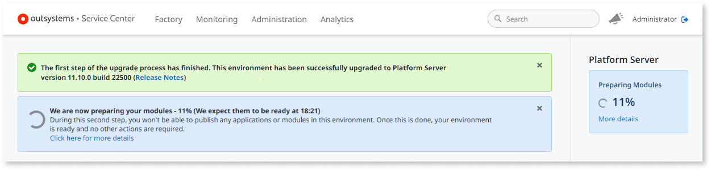
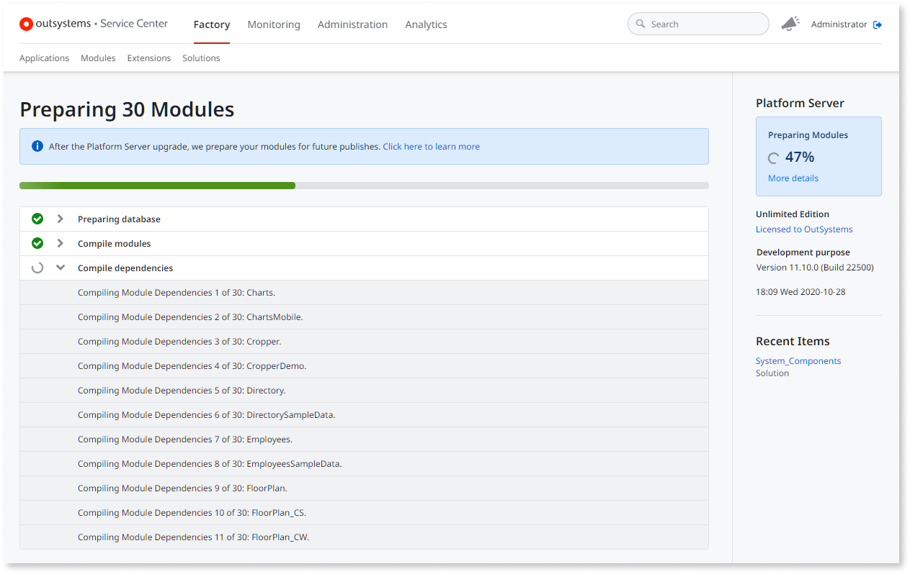
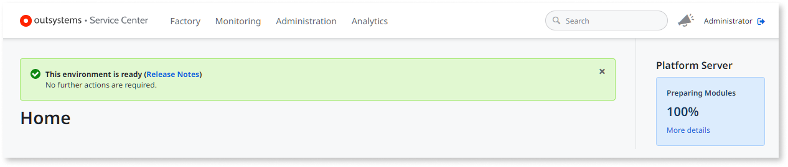
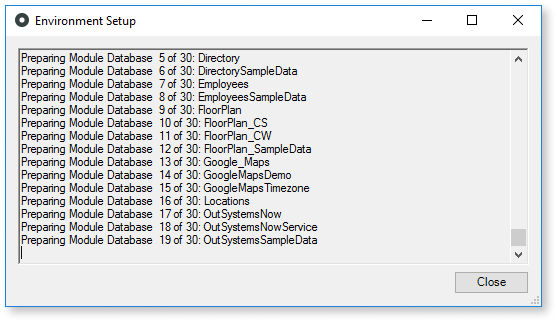
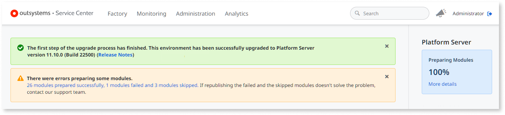
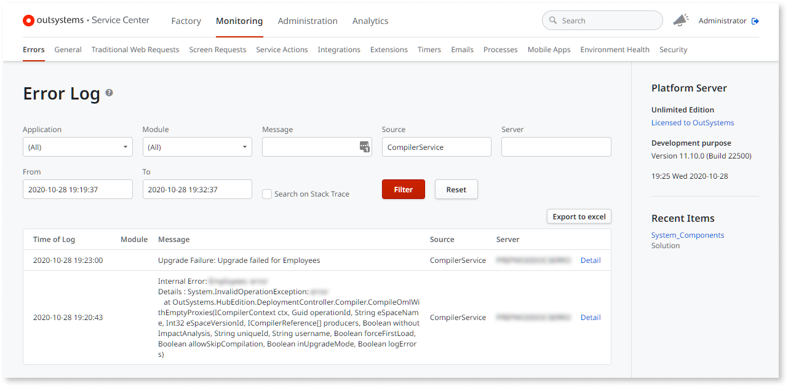

# Flexible Upgrades EAP

Flexible Upgrades is a feature currently available under an [Early Access Program](https://www.outsystems.com/eap/).

Flexible Upgrades is a feature that allows you to skip the "republish all modules" operation in your factory after upgrading the OutSystems platform to a new **minor version** (also known as a "platform update"). Instead, there's a new step called **module preparation** after upgrading Platform Server, where the platform compiles all your modules in the background using the new platform version, but without deploying them.

## Prerequisites

The Flexible Upgrades feature is available:

* in all OutSystems editions except Free
* when updating from OutSystems version 11.x to version 11.9 or later

## Module preparation

Upgrading the OutSystems platform to a new minor version now consists of two steps:

* the Platform Server upgrade step
* the module preparation step

The **module preparation** step occurs after updating Platform Server to a new version. In this new step, Platform Server compiles all your modules in the background using the new platform version. For customers in the OutSystems Cloud, this operation takes place outside your maintenance window, since it doesn't require any downtime.

While the module preparation is in progress, you can't publish any applications/modules in the environment, and you can't apply configurations. Once the module preparation step ends, your environment is ready and you can publish applications or modules again. You can follow the progress of module preparation in Service Center. For more information, see [Checking the progress of the module preparation step](#progress).

Since you're not republishing your applications or modules during module preparation, your running applications aren't changed during the platform upgrade — you'll publish your applications later, according to your own schedule. When you publish a module after the module preparation step, the platform reuses the compilation artifacts (for producer modules only) generated during this step.

## Starting the module preparation step

In the **OutSystems Cloud**, the module preparation step starts automatically during the upgrade process. See how to [check the progress of the module preparation step](#progress).

When updating an on-premises Platform Server installation, the module preparation step starts after you install the new Service Center version and publish System Components.

When you click **Apply and Exit** in Configuration Tool, as mentioned in the installation checklist, the Configuration Tool asks you if you wish to go ahead with the following tasks:

* Publishing the latest version of Service Center
* Publishing the latest version of System Components
* Prepare modules

Press **OK** to start the publishing and module preparation tasks.

Note: Closing the Configuration Tool during the module preparation step doesn't interrupt the operation.

## Checking the progress of the module preparation step { #progress }

You can check the progress of the module preparation step in **Service Center**.

After a successful Platform Server upgrade (after installing the binaries) and while there's an ongoing module preparation, Service Center displays the following messages:

`The first step of the upgrade process has finished. This environment has been successfully upgraded to Platform Server version (...)`

`We are now preparing your modules - NN%`

To check the details of the module preparation step, click on the link **Click here for more details** on the blue banner, or click **More details** on the sidebar:

When module preparation finishes and there are no errors, Service Center displays the following message:

`This environment is ready (Release Notes)`  
`No further actions are required.`

Sometimes there are errors during the module preparation step — learn how to [check for module preparation errors](#check-for-errors) and what you should do to fix them.

In **on-premises installations**, you can also check the progress in Configuration Tool, in the window that appears after pressing **Apply/Exit**:

## Checking for module preparation errors { #check-for-errors }

When there are errors in module preparation step, Service Center displays a message similar to the following:

`There were errors preparing some modules.`  
`MM modules prepared successfully, NN modules failed and PP modules skipped.`

When the preparation of a producer module fails, the platform automatically skips the preparation of all its consumer modules. Service Center tells you how many modules **failed** the preparation step and how many were **skipped** because they consumed the modules with errors.

To check the error details for the modules that failed the preparation step, click the link in the **There were errors preparing some modules** message:

Errors in the module preparation step are usually due to issues in the OutSystems platform. They would probably also occur if you had republished all modules.

First, check if republishing the failed and skipped modules solves the errors. If this doesn't help, [contact OutSystems Support](https://success.outsystems.com/Support/Enterprise_Customers/OutSystems_Support/01_Contact_OutSystems_technical_support).
