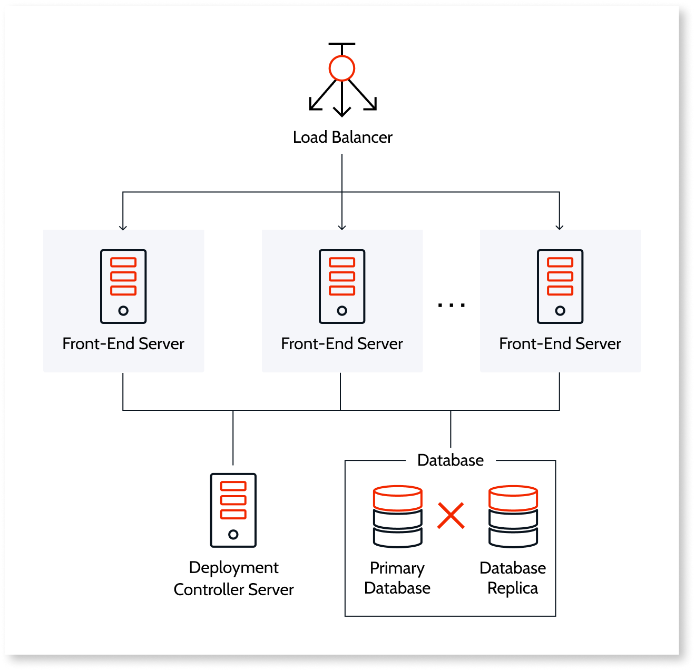
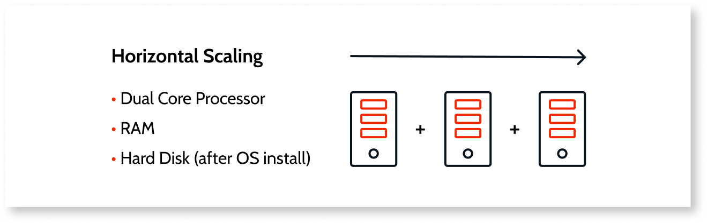
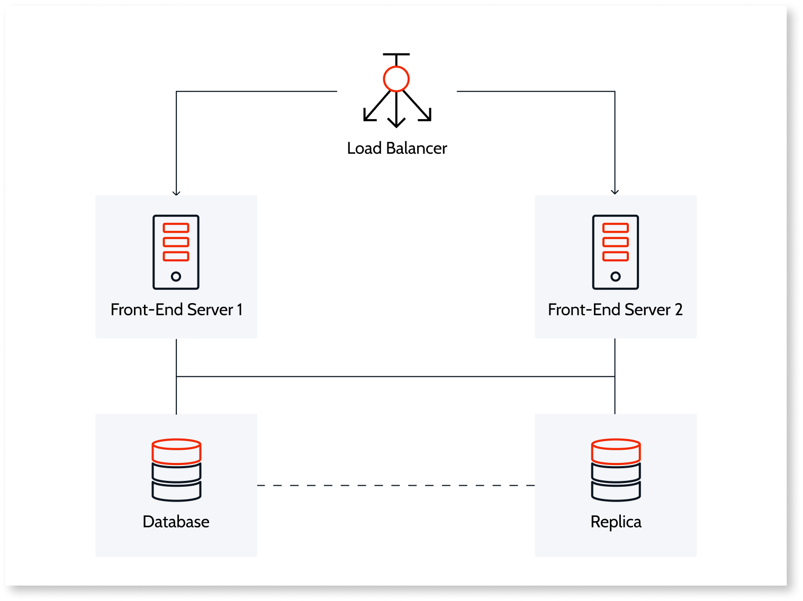
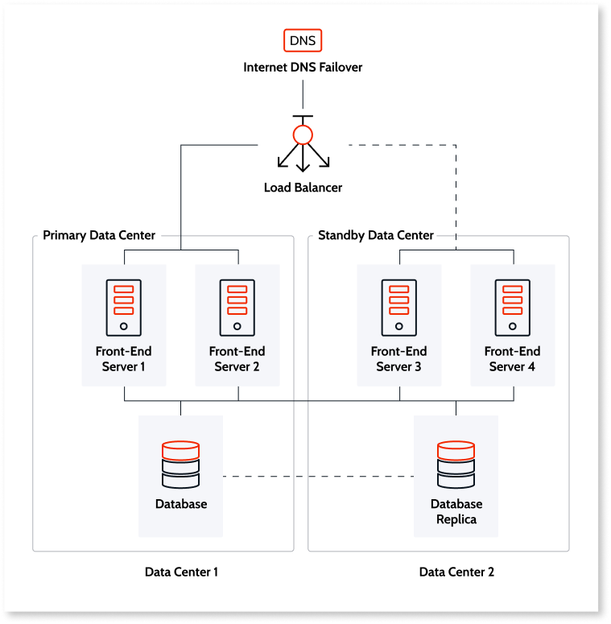
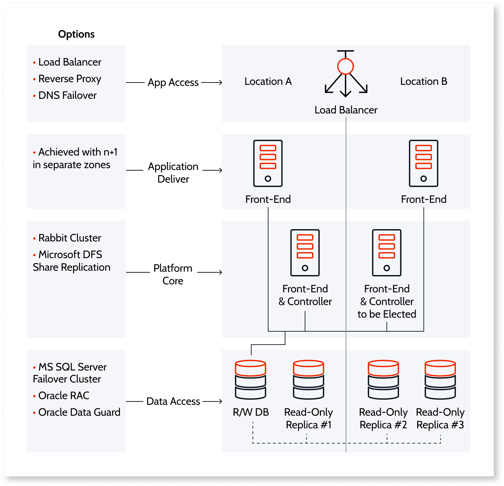
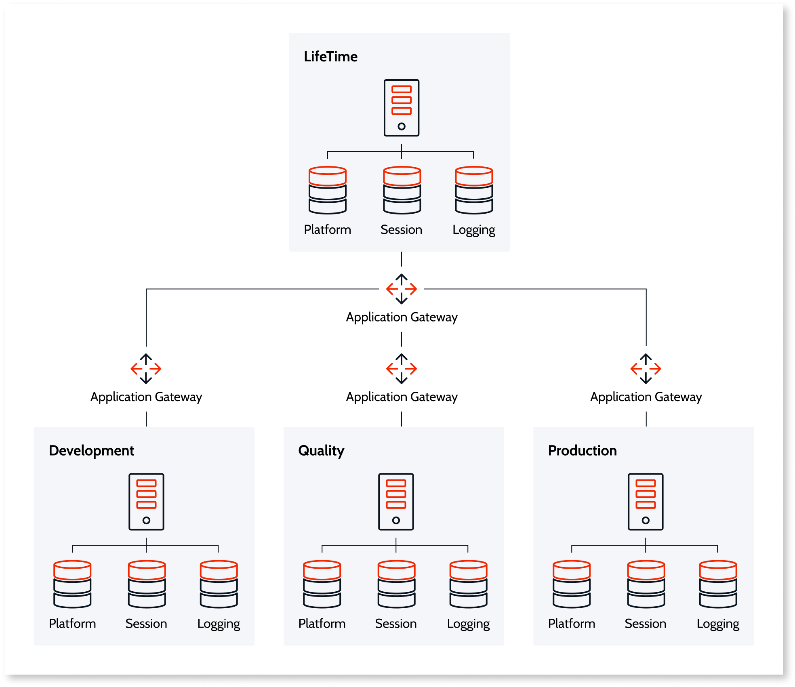

# High availability and scalability strategies

Download the whitepaper version of this document by clicking [here](images/availability-scalability.pdf).

For enterprise applications, OutSystems believe that customers should have as much control as possible. That’s why OutSystems is designed not to be a *deep void* where you cannot see or control what lies beneath the interface. Instead, it simplifies all operations, while still providing several extension points and control options over the underlying infrastructure.

When you use OutSystems in the Cloud, OutSystems manages your environments to guarantee availability while still maintaining the flexibility you need to carry out operations on your self-managed installations.

When you have OutSystems as a self-managed installation, it sits on top of the preferred application server and database management system (DBMS). Your IT team controls the entire underlying infrastructure and defines its own policies and processes to access it.

**High availability** (HA) is all about uptime even in the presence of individual component faults. The goal is to create a redundancy in your infrastructure that can respond to, for example, server failure and increased loads, preventing it from impacting your business. Depending on your configuration, having a redundancy in your infrastructure can respond to component faults at a server level and at an entire data center level.

**Scalability** is a system's capability to handle an increasing number of users or an increase in server requests without adversely affecting response time and throughput. OutSystems is designed with a strong focus on scalability and an architecture that supports a wide range of options including **vertical scalability** and **horizontal scalability**. Vertical scaling provides growth of computational power within one operating environment whereas horizontal scaling leverages multiple systems to work together on a common problem in parallel.

## Distributed architecture

To sustain high scalability, the OutSystems **distributed architecture** supports load balancing and removes single points of failure in the execution environment. This is achieved by configuring more front-end servers and adding them to the appropriate cluster. All required applications are automatically installed and configured.

The OutSystems distributed architecture consists of a deployment server that performs all code generation, configuration, and version updates as well as horizontal scalability that enables the addition of as many front-end servers as needed, all of which are accessed by end users via a load balancer. The deployment controller server ensures that applications are consistently installed across all front end servers.

A **load balancer** automatically distributes incoming application traffic across multiple front-end servers to spread the request load. The load balancer also detects any unhealthy front-end servers in the production environment and automatically reroute traffic to healthy instances until health is restored, increasing the fault tolerance of all applications. OutSystems stores mobile and web user sessions in the session database, allowing multiple requests from the same user to be handled by any front-end server in a farm environment. For improved performance and operation, the session database elements are configured on a dedicated database schema. OutSystems uses the native session management services of the application server stack.

To sustain scalability, Outsystems also uses **automated resource optimization and management**. The risk of creating highly scalable applications with traditional technology is human error. If an application handles millions of hits, a small mistake, such as forgetting to close a reader, can take the whole system down. OutSystems avoids human error by assuring that no reader, connection, or transaction is left open. It optimizes the source code it generates to ensure that applications use as few resources as possible. Enterprises, large or small, don't need expensive distributed systems or technical knowledge to get the best performance. 

## Vertical scaling

Self-managed and OutSystems Cloud installations allow you to **scale vertically** by increasing the computing power of front-ends and databases. This helps with the following:

* Better support for developers as a team grows
* Temporarily increase the computing power of front-ends to finish processing computation-intensive jobs
* Enhance the processing power of the database as an application portfolio grows to handle an increased load

## Horizontal scaling

OutSystems also allows you to **scale horizontally** (in any hosting option) by adding more front-end servers to any production environment. This helps with the following:

* High availability
* Increased user load with more users or more frequent usage
* Increased business logic complexity and load
* Increased volume of batch processing
* Increased data volume or number of transactions (database clustering)

## Common use cases

The following section outlines some common use cases of how both horizontal and vertical scalability can help achieve high availability when facing an increased load or server failure.

### Responding to an increased demand or users on your apps

Both vertical and horizontal scaling can be used, either separately or in combination, to respond to an increase in demand.

**Option 1:** You can **scale vertically** by adding more computing power to deal with the increase in load. In the OutSystems Cloud, servers can be scaled on demand and OutSystems takes care of all the provisioning for you. If you have a self-managed installation of OutSystems, you can scale vertically as needed without the need to perform any additional steps on the OutSystems platform.

**Option 2:** You can also respond to an increased demand on your apps by **scaling horizontally**. You do this by adding more front-end servers and distributing the load between them using a load balancer. OutSystems deployment services ensure that applications are deployed automatically to new servers.

### Recover from a server failure (disaster recovery)

For this use case, you can **scale horizontally** by adding more servers, distributed geographically or not. This means that if one server fails, there are others that can be used as a backup. You can use horizontal scaling, along with clustering capabilities and database replication solutions, to customize your high availability design.

Using the horizontal scalability cloud service, OutSystems places additional front ends in separate and isolated availability zones (but always in the organization-specified region). This has no major performance impact on applications since all availability zones in the same region are connected by special low-latency links. In the rare scenario of a data center disaster or failure, the availability of other front-end servers isn't likely to be affected.

For the high-availability configuration, an organization's production database instance has a *standby* replica in a different availability zone, which automatically fails over to the up-to-date standby. Database operations can resume quickly after a failure or planned maintenance.

## High availability design

High availability solutions can be divided into two basic designs: 
1. **Localized** high availability design 
2. **Geographic** high availability design.

**Localized high availability design** prevents localized hazardous events. By having redundancy, you can balance your load to respond to any existing events.

**Geographic high availability design** prevents geographic system events. By having redundancy, both at the data center level and within the data center, you can manage geographical system events.

To scale horizontally in the OutSystems Cloud, OutSystems deploys additional front-end servers in a farm configuration and automatically syncs the applications of the environment to the new front-end server. The OutSystems Cloud high-availability option allows you to deploy front-end servers across different AWS Availability Zones. It also allows you to set up a database replica in a different availability zone than the primary database.

## High availability infrastructure overview

When considering a high availability infrastructure, there are different layers to keep in mind. Each layer serves a different function and requires distinct technologies to handle redundancy. 

An infrastructure is composed of several environments, and you can decide to have redundancy on all of them or just some of them. For example, production environments are critical to be readily available while non-production environments, like development and testing, may not. It all depends on your specific needs.

The following diagram depicts all the layers in the scope of a single environment.

For more information about the layers and components outlined in this graphic, see the corresponding App Access, Application Delivery, Platform Core, and Data Access sections below. 

### App access

The app access layer routes and distributes incoming requests of end users to the applications' servers. At this top layer, load balancers and reverse proxies can be used along with their redundancy capabilities.

The following considerations are important when configuring the app access layer.

#### Load balancer

The OutSystems platform scales horizontally with the addition of front ends to suit the needed capacity. In a farm environment, to ensure higher availability, balancing the application load across multiple front ends is a basic requirement. OutSystems supports both layer 4 and layer 7 load balancers. The session model is stored in a central database and accessed by all the front ends. Requests from the end users can be distributed across front ends without them having to log in again. If a layer 7 load balancer is available, it can be used for a more intelligent load validation if it doesn’t manipulate traffic. Within the layer 4 balancing scope, there are several techniques to guarantee an effective distribution of the load.

The following are the load balancer policies:

* **Round-robin** (recommended): Requests are processed sequentially in a circular manner. Front-end machines have the same hardware configuration, an equal number of applications, and the same target audience.

* **Least connections**: Front-end machines have the same hardware configuration. The connection requests are sent to the server with the least connection requests.

* **Ratio**: The load balancing is based on a ratio where the more powerful server receives a larger number of connection requests. The ratio load balancer can also be dynamic, where several monitoring checks are actively carried out to gather server performance information and decide on the next node to serve the connection request. Because OutSystems recommend maintaining the same hardware specifications across the front-end servers of an environment, this policy is not recommended.

To learn more about how to load balance your OutSystems platform, see [Load Balancing OutSystems Applications](https://success.outsystems.com/Support/Enterprise_Customers/Maintenance_and_Operations/Load_Balancing_OutSystems_Applications) guide.

#### Reverse proxies

Reverse proxies can also be used to serve OutSystems applications. In this case, the following requirements must be guaranteed:

* Maintain original host header of the request
* Referenced content availability
* Only the default ports for protocols HTTP and HTTPS are supported
* Disable NEGOTIATE protocol for Windows Integrated Authentication

Additionally, when the back-end of one or more OutSystems mobile or reactive apps is hosted behind a reverse proxy, the following requirements must also be met:

* Applications available externally using the domain name configured in Service Center and via HTTPS
* URL paths of applications must be kept unchanged
* No caching of mobile/reactive app resources in the reverse proxy
* When using keep-alive/persistent connections, review the connection timeout configuration

For additional information, see [Using OutSystems in Reverse Proxy Scenarios](https://success.outsystems.com/Support/Enterprise_Customers/Maintenance_and_Operations/Using_OutSystems_in_Reverse_Proxy_Scenarios) guide.

### Application deliver

This layer is responsible for hosting the applications and is composed of the several front-end servers of an environment.

In a cluster scenario, the front-end role scales best horizontally. Depending on the implementation, balancing the load across nodes provides a failover and several levels of disaster recovery. The design can range from a segmented distribution of front ends that contain small incidents, to a geographical distribution aimed at containing high-risk events.

To properly scale your front-end horizontally, OutSystems recommends that you decide on a suitable set of hardware specs for the front-end server and replicate that configuration on subsequent front-end machines.

Several front-ends comprise a farm environment. Applications are deployed in every front-end by a controller server, which must be up to receive compiled application.

### Platform core

The platform core layer is composed of services necessary for the platform server's core functionalities.

#### RabbitMQ

The RabbitMQ executes cache invalidation across the environment. It can be placed in any server but is typically located in the controller server. This service [supports clustered configuration](../../cache-invalidation/high-availability.md).

#### Controller

The controller server has no cluster capability so it can only grow vertically. Adding CPU cores, memory, and increasing disk I/O provides faster compile times for large and very active teams.

In an environment, the controller is responsible for compiling the application’s code and is only in use when new application versions are published. Runtime isn't affected for a period in the case of a fault.

Because the controller isn't clusterable nor can it be set in a farm configuration, there’s no out-of-the-box recovery automation. However, manual or semi-automated steps can be taken to [promote one of the front ends to the controller role](https://success.outsystems.com/Support/Enterprise_Customers/Maintenance_and_Operations/OutSystems_Platform_Server_failover_procedures#Move_controller_and_front-end_roles_to_a_different_server).

### Data Access

OutSystems Cloud offers a high availability configuration for production databases on select editions, whereby the production database instance has a *standby* replica in a different availability zone. 

Database updates are made concurrently on the primary and standby databases to prevent replication lag. Should there be a database instance failure, planned database maintenance, or an availability zone failure, OutSystems automatically fails over to the up-to-date standby, so that database operations can resume quickly without administrative intervention. (Prior to failover, it isn’t possible to directly access the standby database, nor can it be used to serve read traffic.)

OutSystems on self-managed servers supports SQL Server and Oracle as database options and allows the flexibility of any high-availability database solution that guarantees the following:

* Single end point configured in the OutSystems configuration tool on each server
* Data consistency independent of the side on which the replica is active
* Data integrity

We’ll go next into more detail about common solutions used with OutSystems for database high availability. It’s important to keep in mind that these aren't the only solutions available. Any solution can be used just as long as it guarantees the three points mentioned.

#### SQL Server

Microsoft SQL Server has the following solutions that provide the minimum downtime, depending on the desired RTO/RPO and on automatic or manual failover:

* Log shipping
* Transactional replication
* Database mirroring
* **Always-on failover cluster**: An instance-level high availability solution that's built over the Windows Server Failover Clustering functionality where a server, known as cluster nodes, provides high availability through redundancy. The SQL Server services and the resource groups, including the shared storage, the network name, and the virtual APIs, can be owned by only one of the cluster nodes at a given time.
* **Always-on availability groups**: A database-level high availability solution, that is built over the Windows Server Failover Clustering functionality. It consists of a number of primary servers (known as primary replicas), in which the databases are available to serve read-write connections as well as up to eight secondary servers (known as secondary replicas), that can be used to serve read-only connections for reporting purposes. To make it easier for database users to connect to the availability group, without the need to know which SQL Server instance is hosting the primary replica, an availability group listener can be created. An availability group listener is a virtual network name that consists of a unique DNS name. This name is configured in the platform configuration tool.

For more information about the SQL Server, see the [SQL Server documentation](https://msdn.microsoft.com/en-us/ms190202.aspx).

#### Oracle

Oracle has the following solutions to provide the minimum downtime depending on the desired RTO/RPO and on automatic/manual failover:

* Real application cluster (RAC)
  
  A cluster configuration where the database instance nodes are distributed locally sharing storage or distributed geographically with storage synced by the cluster interconnect. In this configuration, all nodes process application workload. A single end-point DNS name is configured at the cluster level and used in the platform configuration tool.

* Oracle Data Guard
  
  Oriented to disaster recovery, Oracle Data Guard automatically maintains transactional copies of the production database. These copies are on stand-by. If the primary database becomes unavailable, a stand-by copy is activated. The Oracle Data Guard can be combined with RAC to achieve high availability.

For more information, see the [Oracle documentation](http://docs.oracle.com/cd/B19306_01/server.102/b14210/hafeatures.htm).

#### Database storage

OutSystems allows you to scale the storage resources of your database as they grow, which eliminates huge upfront investments and the need to plan costly database migrations. In the OutSystems Cloud, additional database storage capacity is added as needed, while maintaining database availability and with minimal impact to your running applications.

### Network redundancy

Without any backup systems in place, it only takes one point of failure in a network to disrupt or bring an entire system down. Network redundancy is the process of adding more instances of network devices and lines of communication within the network infrastructure. This helps to ensure network availability and decrease the risk of failure along the critical data path.

#### Cloud network redundancy

The following are the OutSystems Cloud network redundancy options available for connections to your assets:

* **VPN**: If your VPN gateway supports asymmetric routing, you can configure the two VPN tunnels to ensure high-availability of the VPN connection. Amazon performs routine maintenance on the virtual private gateways, which can disable one of the VPN tunnels for a brief period. Having two VPN tunnels configured ensures the failover to the second VPN tunnel if the first VPN tunnel goes down. It’s also possible to achieve redundancy in a private network connection by using other networking solutions such as Direct Connect and Transit Gateway.

* **Direct Connect**: [AWS Direct Connect](https://success.outsystems.com/Support/Enterprise_Customers/Maintenance_and_Operations/AWS_Direct_Connect_on_OutSystems_Cloud) is a highly available service that links an internal network to an AWS account over a dedicated circuit. For scenarios which require the use of high bandwidth and a steady connection without network congestion, you can use AWS Direct Connect to link your private network to your OutSystems Cloud over a dedicated line. 

* **Transit Gateway**: For seamless integration with your corporate systems, OutSystems allows you to connect to your OutSystems Cloud VPC using your own [AWS Transit Gateway](https://success.outsystems.com/Support/Enterprise_Customers/Maintenance_and_Operations/Connect_to_your_OutSystems_Cloud_using_AWS_Transit_Gateway#:~:text=AWS%20Transit%20Gateway%20and%20your,networks%20to%20a%20single%20gateway.). This service enables you to connect your multiple AWS accounts, Virtual Private Clouds (VPCs), and your on-premises networks to a single gateway. AWS Transit Gateway is a service with high availability by design.

#### Self managed network redundancy

Any network redundancy can be used provided that:

* [OutSystems network requirements](https://success.outsystems.com/Documentation/11/Setting_Up_OutSystems/OutSystems_network_requirements) are always met.

* The application servers (controller and front-ends) can maintain the same IP address or use hostnames. This is to avoid any further manual steps on [OutSystems configuration tool](https://success.outsystems.com/Documentation/11/Reference/Configuration_Tool) when failing over to another network.

* The databases can maintain a single endpoint.

## Automating horizontal scalability

In OutSystems Cloud, [new front-ends](https://success.outsystems.com/Support/Enterprise_Customers/Installation/Add_a_new_front-end_server_to_your_environment) can be added autonomously and are automatically provisioned. The new front-end server is created and automatically added to the load balancer and is available immediately after provisioning ends.

For self-managed installations, OutSystems allows you to perform unattended or [automated Platform Server installations to add new front-end servers](https://success.outsystems.com/Documentation/11/Setting_Up_OutSystems/Unattended_Installation_and_Upgrade#Adding_a_Front-End). OutSystems provides built-in command lines that you can use to create automated installation PowerShell scripts that assist with Platform Server setup tasks. These can be used after auto scaling mechanisms to ensure a consistent OutSystems installation. The OutSystems distributed architecture also ensures that all applications are automatically deployed to new front ends.

To avoid over- or under-provisioning, cloud computing elasticity features can be used, along with OutSystems automated installation scripts, to adapt to workload changes by provisioning and de-provisioning resources in an automatic manner. 

### Elasticity setup

In cloud computing elasticity, a key component is the virtual machine (VM) image which is used as a base for all new front ends to be deployed. The following scenarios and guidelines can apply to any cloud computing autoscaling technology such as, [AWS Auto Scaling](https://aws.amazon.com/autoscaling/) or [Azure Scale Sets](https://docs.microsoft.com/en-us/azure/virtual-machine-scale-sets/overview).

Typically, two scenarios are considered in this process:

#### Scenario 1: Base VM image has OutSystems installed

OutSystems recommend this setup as the provisioning of new front-end servers is **up to twice as quick** as when OutSystems is not installed. In this scenario, the base VM image already has OutSystems Platform Server and the development tools (Service Studio and Integration Studio) installed.

For **VM provisioning**, the OutSystems image must be identical to the running front-end servers of the environment in regards to hardware, operating system, and software versions (including the Platform Server version). This ensures that all requirements and prerequisites are already met.

To create the PowerShell script to **associate the server to the environment**, follow the [unattended installation to add a new front end](https://success.outsystems.com/Documentation/11/Setting_Up_OutSystems/Unattended_Installation_and_Upgrade#Adding_a_Front-End) instructions. Because the image already has an OutSystems installation, you can **skip step 1 - Install the Platform Server binaries**.

#### Scenario 2: Base VM image with Windows Server only

In this scenario, the base VM image only carries an installation of Windows Server and doesn’t have the OutSystems Platform Server installed. Compared to scenario 1, it brings the overhead of installing the Platform Server as well as ensuring all the prerequisites.

For **VM provisioning**, you’ll need to ensure the following:

* The OutSystems [system](https://success.outsystems.com/Documentation/11/Setting_Up_OutSystems/OutSystems_system_requirements) and [network](https://success.outsystems.com/Documentation/11/Setting_Up_OutSystems/OutSystems_network_requirements) requirements are met.

* The base VM image has the same Windows Server version as the running front ends.

* It’s also recommended that the same hardware specifications (CPU, RAM, disk space) are maintained across all the front ends of an environment.

To automate **installing the pre-requirements and Platform Server**, you can have the necessary binaries readily available on a storage account. By running the PowerShell scripts created from the commands of the [unattended installation of a new front end](https://success.outsystems.com/Documentation/11/Setting_Up_OutSystems/Unattended_Installation_and_Upgrade#Adding_a_Front-End) steps, the **server is associated to the environment**. 

#### Example with Azure scale sets

The [OutSystems solution template for Microsoft Azure Marketplace](https://success.outsystems.com/Documentation/11/Setting_Up_OutSystems/OutSystems_on_Microsoft_Azure/Set_Up_OutSystems_on_Microsoft_Azure) provides you with a quick deployment of a full OutSystems 11 infrastructure configured according to OutSystems best practices.

The deployed OutSystems infrastructure is summarized in the following diagram:

Production environments, when deployed in farm mode, are ready for **horizontal scaling** with [Azure scale sets](https://docs.microsoft.com/en-us/azure/virtual-machine-scale-sets/overview). This scaling operation is exclusively done in the Azure Portal, so you don’t have to make any changes in OutSystems to register the new front-end servers. This allows your farm to distribute the workload evenly across the scale set servers. 

In Azure, even when you’re not using the OutSystems solution template for Microsoft Azure Marketplace, elasticity can still be accomplished by using Virtual Machine Scale Sets (VMSS). VMSS allows you to create and manage a group of load-balanced virtual machines (VM). The number of VM instances can automatically increase or decrease in response to demand or a defined schedule.

Scale sets allow you to centrally manage, configure, and update a large number of VMs. Both scenarios described previously can be used with VMSS, by creating your own [custom VM images](https://docs.microsoft.com/en-us/azure/virtual-machines/windows/capture-image-resource) and managing them using an [Azure Shared Image Gallery](https://docs.microsoft.com/en-us/azure/virtual-machines/windows/shared-images-portal).
