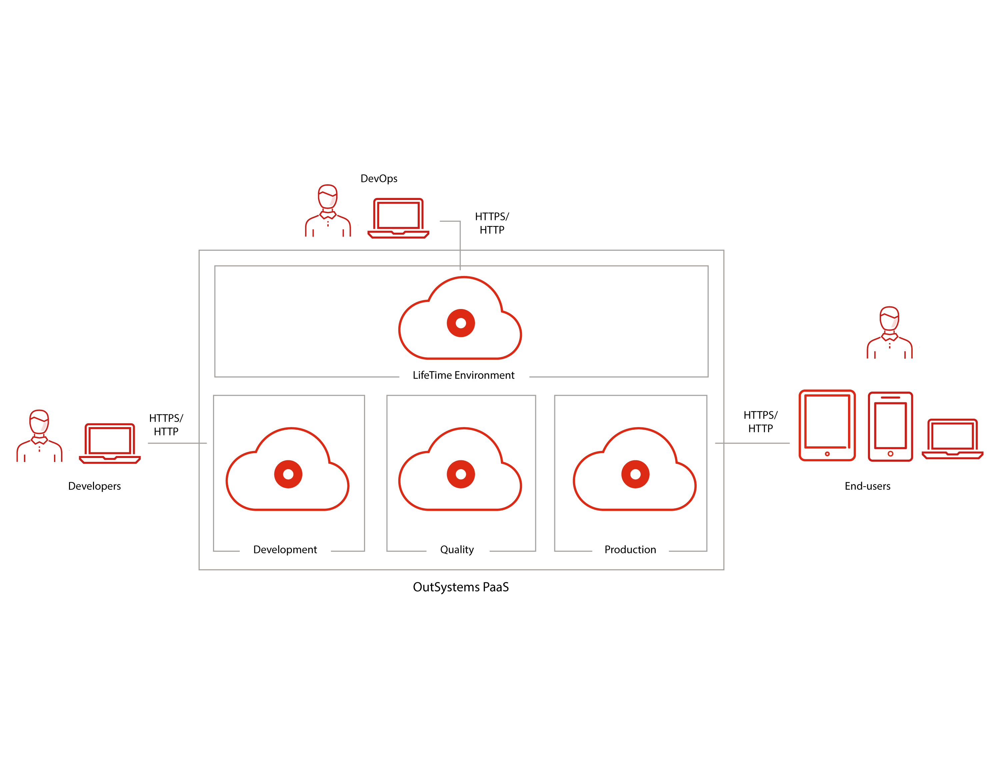

# Possible setups for an OutSystems infrastructure

This article applies to: **OutSystems 11**&#8195;&#8195;Other versions available: [10](https://success.outsystems.com/Documentation/10/Setting_Up_OutSystems/Possible_setups_for_an_OutSystems_infrastructure)

OutSystems allows delivering enterprise web and mobile applications that run OutSystems Cloud environments. Since it covers the full application lifecycle, from development to deployment, a typical OutSystems installation is comprised of an infrastructure with four environments:

* **Development Environment:** In development you create accounts for all developers and development managers of the Development Team.

* **Quality Environment:** In quality environment is where testers and business users experiment the production candidate applications or the application versions resulting from (agile) sprints. There are usually few scalability and redundancy requirements for this environment.

* **Production Environment:** In production, full control is given to the Operations team but is advisable to setup read-only access accounts for development/maintenance teams to have access to analytics information on performance and application errors.

* **LifeTime Environment:** LifeTime is the console for managing the infrastructure, environments, applications, IT users, and security.

Even though this is the typical OutSystems infrastructure, your current setup may have more or fewer environments. 
You can always adjust the infrastructure to add and remove environments, since OutSystems is made to scale with your own needs.

## Cloud infrastructure

Since OutSystems runs on the cloud, it's possible to set up your infrastructure with a mouse-click. You only have to install Service Studio and Integration Studio development tools to start developing and deploying your applications. Learn more at [www.outsystems.com](https://www.outsystems.com).

