# How to Automate Unit Testing and API Testing

## Goal

The goal of this guide is to share testing experience, knowledge and test patterns to ease the adoption of testing in OutSystems projects.

This guide use the “[Cases](https://www.outsystems.com/forge/component/584/cases/)” demo application and the “[Cases_Tests](https://www.outsystems.com/forge/component/2552/cases-tests/)” application. Both can be downloaded from the Forge.

## Where to Start?

For effective testing, 5 main elements should be in place. These are:

* A good **test strategy** that defines the types and amount of testing 

* A **test plan** that indicates the tasks to be done to implement the test strategy 

* **Test cases** with detailed usage examples that will be used to check that the software meets the requirements 

* **Test data** definition, that includes both input data and existing “production like” data, used during the test execution activities; 

* **Test environment** where the application to be tested is deployed, and where testing cycles are carried out without external interference that may impact testing activities. 

If one of these elements is missing, testing efficiency will be dramatically reduced.

## Testing Basics

Software systems are built using layers of functionality. It’s impossible for most current systems to be 100% tested. In order to maximize results, experience has proven that the testing effort should be distributed, in a proportional way, according to the [Test Pyramid](https://martinfowler.com/bliki/TestPyramid.html).

There are many testing “types”: in this guide we shall create:

* Unit tests (tests for small independent pieces of functionality), 

* API tests (for component APIs), 

The application that is being tested is designated as the AUT (Application Under Test).

We will be using different testing tools for different test types. We are more focused on the concepts than on a specific tool, so you may use other tools to achieve the same goals.

Manual tests will not be covered because this guide is oriented to test automation.

For additional testing guidance on an OutSystems project, please visit the OutSystems website.

## Test Strategy and Test Plan

If your application is already built according to the [Architecture Canvas](https://success.outsystems.com/Support/Enterprise_Customers/Maintenance_and_Operations/Designing_the_architecture_of_your_OutSystems_applications/01_The_4_Layer_Canvas), you can proceed to the [Unit testing approach](#unit-testing-approach) section below. If not, continue reading to understand how to set up a Test Strategy.

The first task is to divide the application functionality from the most simple, to the most complex. Create a list of modules, server actions, screens, web blocks, API methods, etc. in a spreadsheet with the following columns: object type (server action, webscreen, etc.), folder (or UI Flow), name, risk. You can also use OutDoc to extract this information.

Once the list is complete, classify each item in terms of risk. If a component or an action fails, how serious would this be for the application? For example, business entities should be robust because they’re the underpinning for business rules, while “sysadmin” functionality that is rarely used doesn’t need to be that robust.

The higher the risk of the application functionality, the more thoroughly it should be tested.

For every piece of application functionality, one or more testing types may be selected. For instance, a server action could be tested with a unit test or with an integration test (because the server action invokes many other functionalities) or with both (because it is possible to skip “external” functionality for unit testing and because it is tested in a business process). A screen must be tested by a UI test.

Once you have categorized all of the application functionality it is time to design test cases. There is plenty of information about designing test cases on the internet ( [tutorialspoint.com](http://www.tutorialspoint.com), [stackoverflow.com](http://www.stackoverflow.com) and [martinfowler.com](https://martinfowler.com/) are good starting points).

Just keep in mind that every test case has the following attributes:

* Title 

* Understandable description 

* Assumptions and/or pre-conditions 

* A set of test steps 

* Test data to be used to execute the functionality 

* Expected result 

All information should be simple and precise. Keep test cases as simple and small as possible.

Understand that having large numbers of small test cases is usually better than having small numbers of large test cases, because large test cases tend to become very difficult to maintain.

Here is an excerpt of the Test Strategy for the Cases application.

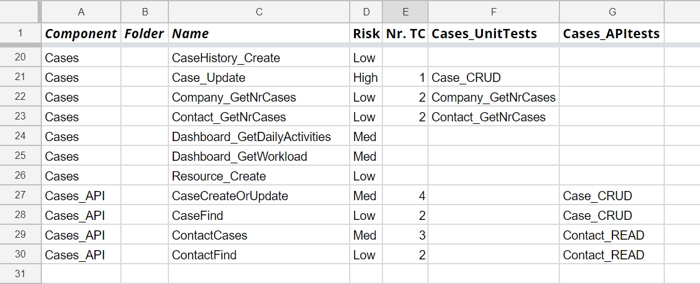

Tests are usually conducted in testing cycles, during which test cases are executed and the actual results compared with expected results. At the end of a test cycle, undesired side effects should be removed (also called test teardown).

Here is a simple diagram relating these concepts.

Failed tests have to be analyzed and the defects found should be registered in a Defect Management Tool.

## Test Management

Before we get to test creation, let’s introduce Test Framework, a tool built with OutSystems to manage automated tests. This tool is available in the [Forge](https://www.outsystems.com/forge/component/2464/test-framework/) and supports the most common testing needs. For a richer set of testing features, consider commercially available testing platforms.

Test Framework supports two types of test cases:

* [Unit tests](#unit-testing-approach), for fast feedback on small pieces of code (server actions) 

* [API tests](#api-testing-approach), for feedback on REST or SOAP APIs 

Test Framework structures testing according to the following hierarchy:

* Test Suites, a group of related Test Cases; 

* Test Cases are the actual tests; each Test Case is contained inside one Test Suite and can have one or more Test Steps; 

* Test Steps are testing actions that are executed by a “test engine”. 

It is possible to create variables for Test Suites. These may be used to provide data to the tests being executed. Test Suite variables have a default value, but it is also possible to redefine the value at the Test Case level, or even at the Test Step level.

The Test Cases inside a Test Suite are executed in sequence. Test Framework allows the passing of output values from a previous Test Case into the next Test Case. This can also be done at Test Step level.

Please keep in mind that automated tests are most effective for APIs and unit level testing.

Test Framework allows the execution of tests either by manually pushing the “1-Click Test” button, or by using the built-in scheduling mechanism. A REST API is also provided for triggering Test Framework tests as part of a Continuous Integration pipeline. The API allows tests to be started and the results to be collected.

Some features were added to Test Framework that accelerate the testing of an OutSystems project. 
These include scanning for BDD eSpaces and UTF eSpaces, or generating tests from the web service documentation generated by OutSystems.

## Unit Testing Approach

Unit testing is most useful for fast feedback, that is, tests that run quickly on small pieces of functionality. These tests are usually created by developers to assure correct implementation and stability of their work. Therefore, these are great candidates for automation.

OutSystems recommends using the [BDD Framework](https://www.outsystems.com/forge/component/1201/bddframework/) for unit testing, as tests are easy to create and maintain.

### Make Your Applications Testable

You should design your applications to be easy to test by adopting correct architecture and by distributing functionality into small testable pieces. For example, all business entities should be placed inside core modules (refer to the [Architecture Canvas](https://success.outsystems.com/Support/Enterprise_Customers/Maintenance_and_Operations/Designing_the_architecture_of_your_OutSystems_applications/01_The_4_Layer_Canvas) for these concepts) surrounded by the server actions that enforce validations such as correct data, dependencies, calculations, etc. No business logic should be placed inside screen actions because these actions are not testable with unit tests.

Sometimes adding a “test mode” parameter to complex server actions can be very useful. Server actions that perform complex calculations or complex validations may, in the end, commit changes in the database (i.e., change application state). With a “test mode” parameter, these actions can avoid committing the changes if it is a test. This “test mode” parameter does not add significant overhead or complexity but facilitates testing the majority of the code while skipping a small part of it that affects application state.

### How to do Unit Testing

The first step is to create an eSpace for the unit tests. It is very important that this eSpace is placed inside an application that does not have application code so that it is not deployed into a production environment: tests are not to be deployed into production environments. We recommend adopting a simple naming convention for the application modules with functionality, and the test modules responsible for testing the functionality.

For demonstration purposes, we created a Cases_Tests application for the Cases web application.

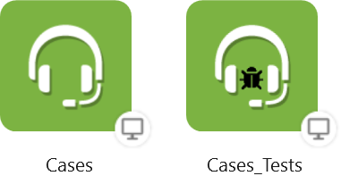

After creating the testing eSpace, add a reference to the BDD Framework (please refer to the [Forge](https://www.outsystems.com/forge/component/1201/bddframework/) for installation of the BDD Framework). You will also need to add a reference to the application module this eSpace will test.

Here are the references for the Cases_UnitTests eSpace:

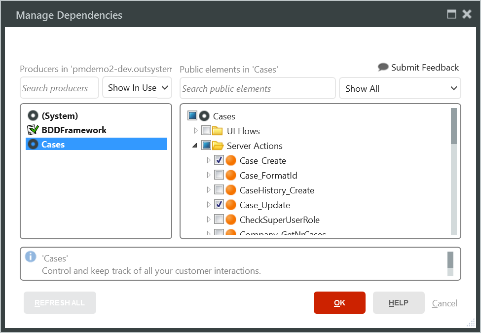

BDD Framework uses a scenario for each test case. Since BDD scenarios are web blocks, they live on web screens. We recommend creating a web screen for a group of strongly related server actions to be tested, with a very understandable name. The web screens should be organized into UI Flows with the same name of the folder where the server action resides inside the application module. As explained in the BDD Framework video, create a scenario for each test case and a “Final Result” to check if all test cases pass.

In the web screen, create the following screen actions: **Given**, **When** and **Then**. If the screen has more than one scenario, then you may want to create 3 screen actions for each scenario, something like: **Create\_Given**, **Create\_When**, **Create\_Then**, **Delete\_Given**, **Delete\_When** and **Delete\_Then**.

Drag and drop “BDD Steps” to each “BDD Scenario” and assign the correct screen actions.

Here is an example for the “Case Create, (Read), Update and Delete” (CRUD) test cases. (For a “Case”, the “delete” is closing the “Case”; there is no specific scenario for reading a “Case”).

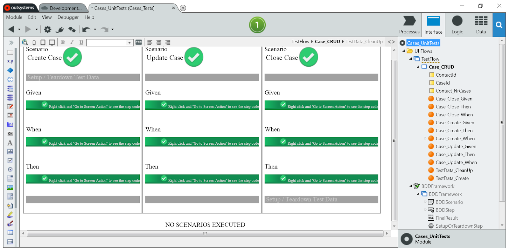

Open the **Given** screen action. Create the code that checks the system is in the initial state. Something like:

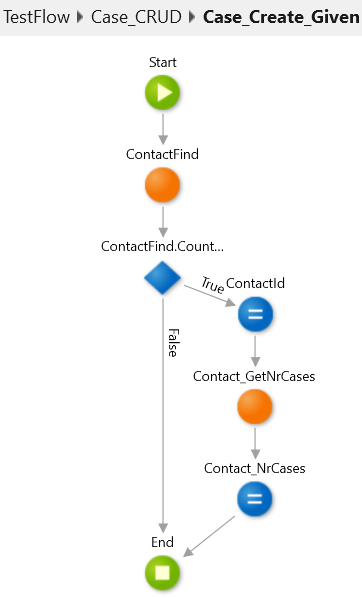

* Assure a Contact exists 

* Verify that the Cases history is in the correct state 

* Get information to validate afterwards - the number of open Cases for example 

* Etc. 

In the Case_Create test case, the given action gets and stores the Id of a contact named “Antonio Moreno” and the number of Cases opened by him.

The “Contact Id” will be used to create a new Case. The number of cases will be used in the validations.

Now, open the **When** screen action and call the target application server action. The **When** action is usually very simple, setup parameters call the server action and store the minimal results for the validations (that will be placed in the **Then** action).

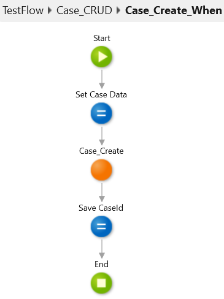

We recommend a black-box approach where the test should rely only on the specification of the behavior. Tests should consider the results obtained for each input data, and not on knowledge of the code “inside” the server action that is being tested.
Only one test should be performed, that is, only one call to one server action.

If the application usually calls other server actions in sequence, for instance, create a “Case” and increment a global counter, then some alternatives should be explored:

* Either change the application to encapsulate all calls into another “higher level” server action or 

* Create an “integration test” that tests the possible sequences of server actions invoked 

Absolutely no validation should be performed in the **When** action.

Finally, open the **Then** screen action and add the validations. This is the most difficult and important step. It should perform all the necessary validations to ensure the test is effective. Remember that this test will be used as a regression test, so even the most simple validations should be included.

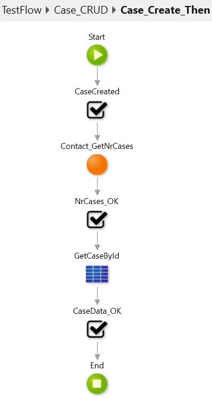

Give precise names to the Assert condition so it is very easy to identify which validation has failed, in the event one does.

Give positive names if you are looking for the condition to be true, or negative names if you are looking for false.

Positive example: “Case was created”

Negative: “History not empty”

Some validations are very difficult, for example, validating the “creation datetime” value. In these situations we use validation functions to help with this task by validating a value within an interval. An example is “IsToday(creation_date)”...

In the Case_Create, we validate that an entity record was created (`Id <> NullIdentifier()`), that the contact has one more “Case” (NrCases\_OK), and that the “Case” actually has the data we supplied, i.e., no data was ignored, no unexpected data truncation, etc. (CaseData\_OK).

### The Importance of Good Test Data

For good tests it is very important to have good test data. Therefore, we recommend that every screen has two test data related screen actions: **TestData\_Create** and **TestData\_CleanUp**.

The **TestData\_Create** action should create all the data required for all the test cases (scenarios) in the web screen. It hides the complexity of creating test data and stores, at screen level, the minimal information required for test data cleanup (usually “Entity identifiers”).

The **TestData\_CleanUp** action cleans used test data.

Test data setup and cleanup actions should not access the database directly so no wrong data is created or cleaned: use available Server Actions from the AUT.

We do not recommend the creation of test data in the “preparation” of a web screen for maintenance reasons.

However there may be some situations where this makes sense - see [Advanced Unit Testing techniques](#advanced-unit-testing-techniques). For these situations create a server action for that purpose, and call it in the preparation. Create a TestData folder under the ServerActions folder and place these server actions inside.

The **TestData_Create** action should be invoked in the setup of the first test scenario while the **TestData\_CleanUp** action should be invoked in the teardown of the last test scenario (see the “SetupOrTeardownStep” web block, as explained in the [video](https://www.youtube.com/watch?v=df6j7J33JT8)).

Do not use exception handlers inside the actions that create test data. If a test setup fails, it prevents the execution of the test, saving time and effort. Every test that is executed and fails requires additional effort to understand what has happened. If the problem is in the creation of test data, an exception handler will hide it, leading to unnecessary analysis tasks.

For some advanced scenarios, it is helpful to create server actions to ease the creation of test data. These auxiliary actions should be placed inside the TestData folder. While these actions may be shared with other test eSpaces (creating a sort of a “business test framework” concept) sharing actions increases the dependency between test eSpaces so we do not recommend it.

### Advanced Unit Testing Techniques

Unit tests are actually OutSystems code. This matches other development platforms where you use the same language to create unit tests. Since unit tests are created with the OutSystems visual language you get the same high- productivity aspects when creating unit test logic in low-code.

The same language structures are available when building tests, including table records. When validating combinations between multiple variables, you may create a list of records with the data for the different test cases, and provide that list to a table record widget. By placing a BDD scenario in the row, multiple test cases are actually executed with minimal effort. Take a look at the next example from the Test Framework unit tests, where the “scenario” is placed inside a “table records”.

Below is the code; notice the scenario inside a Table Records  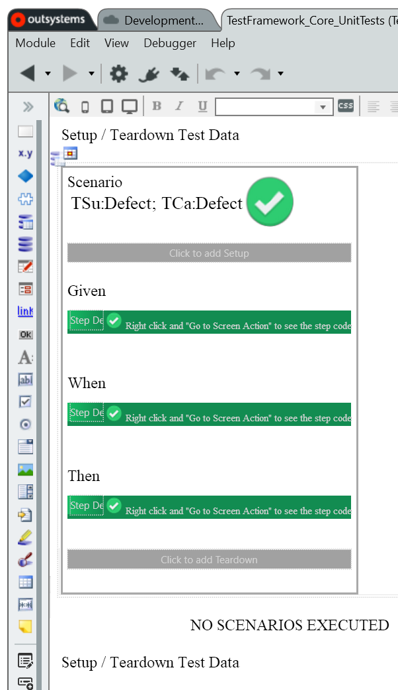 | Below is the result of the execution; notice that many scenarios were executed  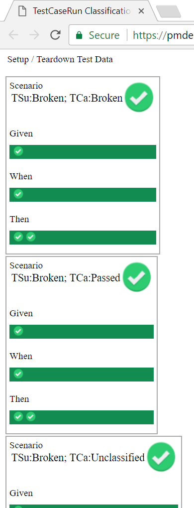 
---|---  
  
### Adding Unit Tests to Test Framework

Now let’s add the unit tests to Test Framework. 

1. The first thing to do is create a new Test Suite for regression tests. To do so, press “Define” on the topmost menu and then press the “New Test Suite” on the right side; the following screen appears.

    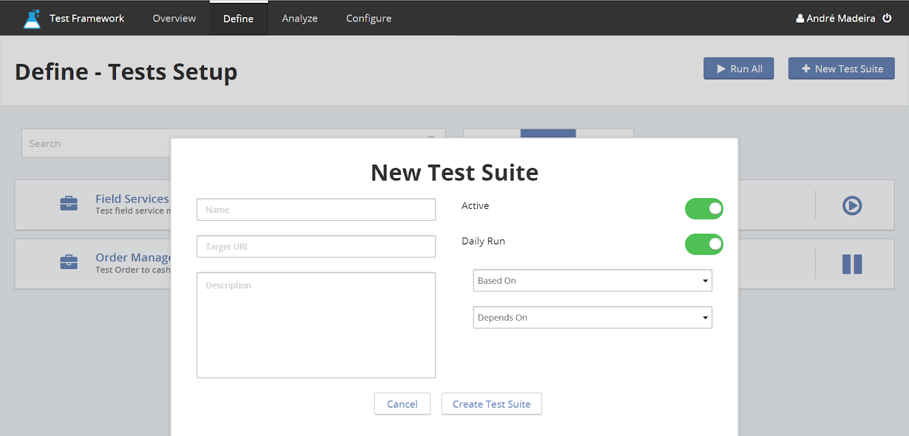

1. Fill in the data and press “Create Test Suite” button; the screen should be similar to the following image.

    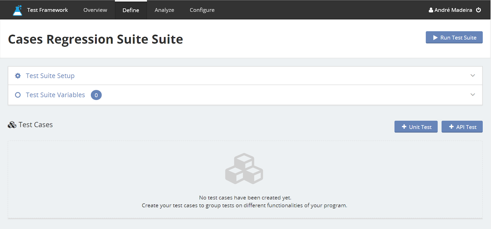

1. You can now create a Unit Test Case. To do so, press the “Unit Test” button, on the upper-right. The following screen appears.

    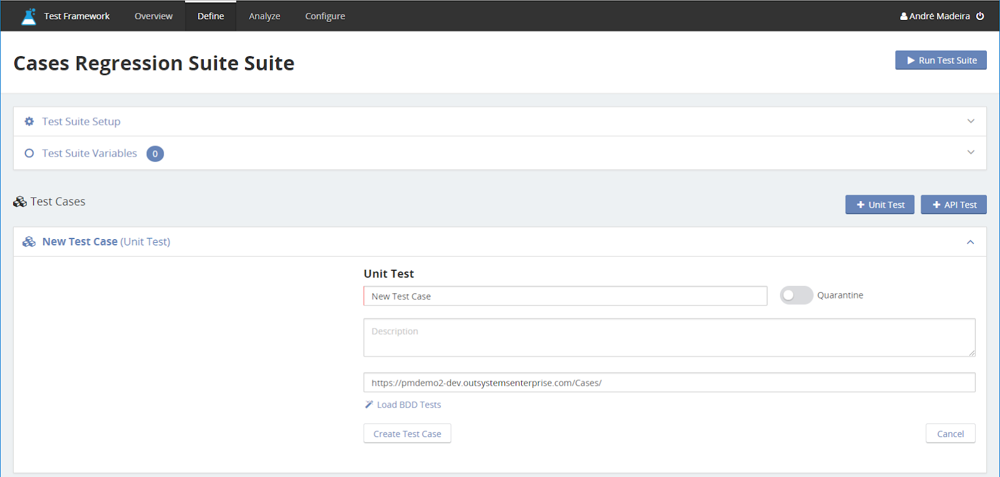

1. Fill in the test case information and press the “Create Test Case” button. The screen is updated and now allows the creation of test steps.

    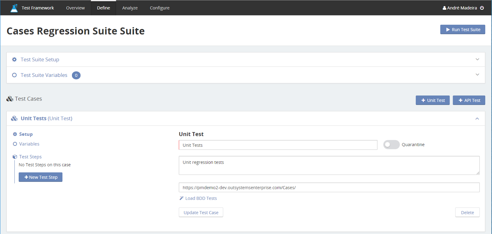

1. You can now create a new Test Step. To do so press the “New Test Step” button on the left. The following screen appears.

    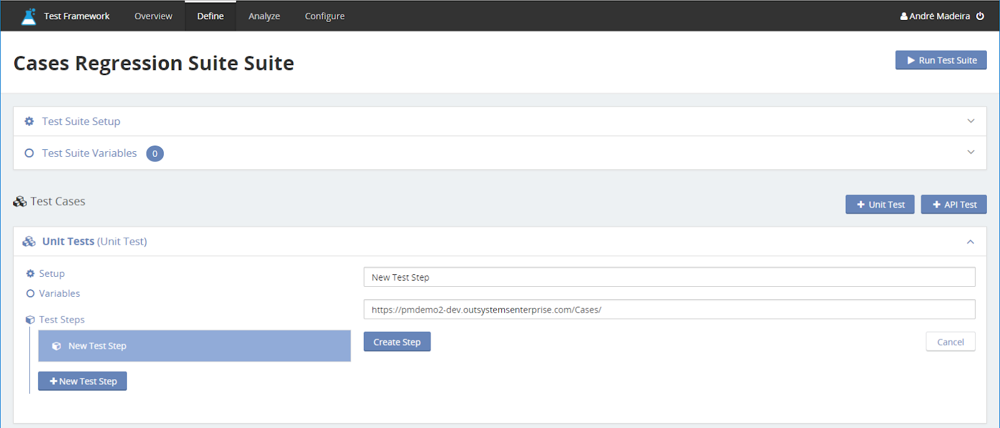

1. To create a unit test step, fill the Target URL with a valid URL, something like `https://<yourserver>/Cases_UnitTests/Case_CRUD.aspx`. Press the “Update Step” button and it’s ready for execution.

    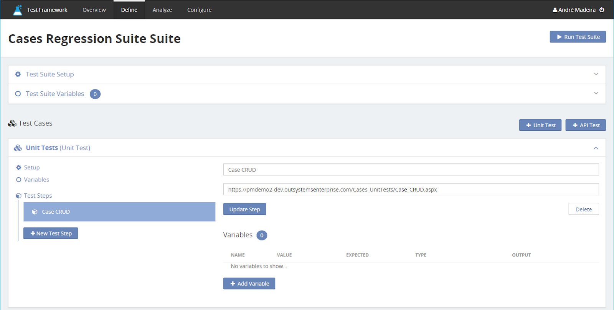

### Using Existing Unit Tests

If there are many unit tests, this may become time consuming. To speed up test creation, Test Framework is able to collect all unit test eSpaces that reference an application. To do so, in the Test Case screen, you may press the “Load BDD Tests” button.

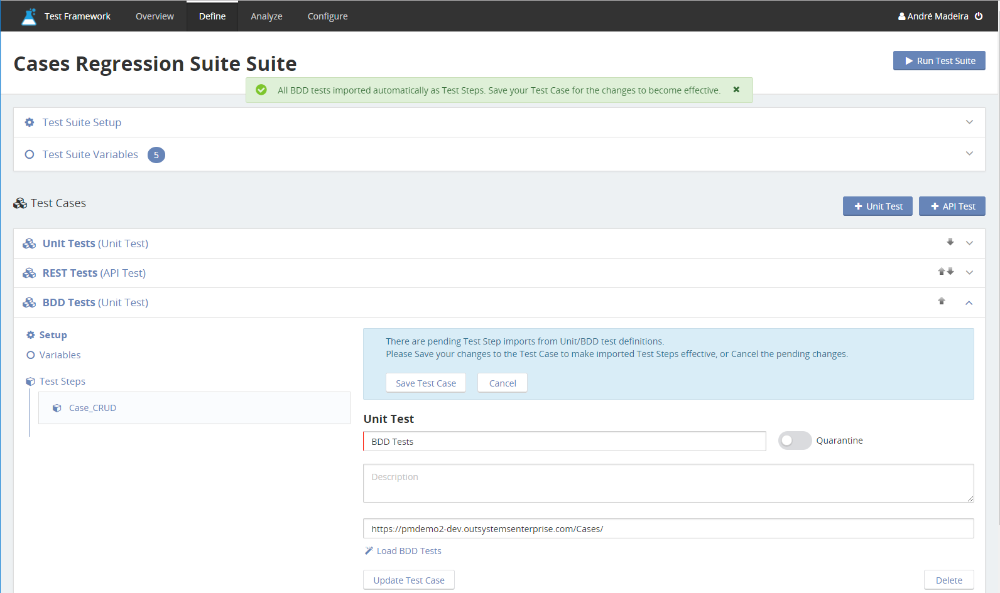

After you press the “Update Test Case” button, all information is updated in the database. Test steps become editable and all counters are updated accordingly.

### Executing Unit Tests

1. To execute a Test Suite go to the list of test suites by pressing the “Define” menu button.

    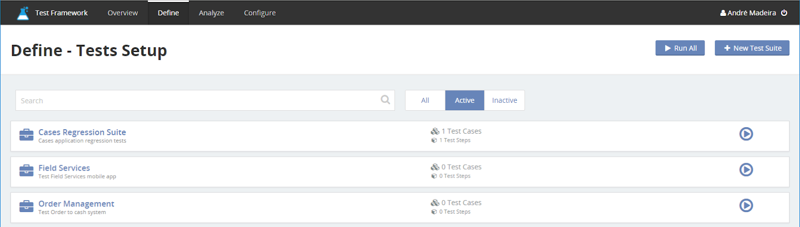

1. Press the “1-Click Test” button for the test suite you want to run. The test starts to run in the background.

1. Press the “Analyze” menu to see the result of the execution of a test suite. Here is an example:

    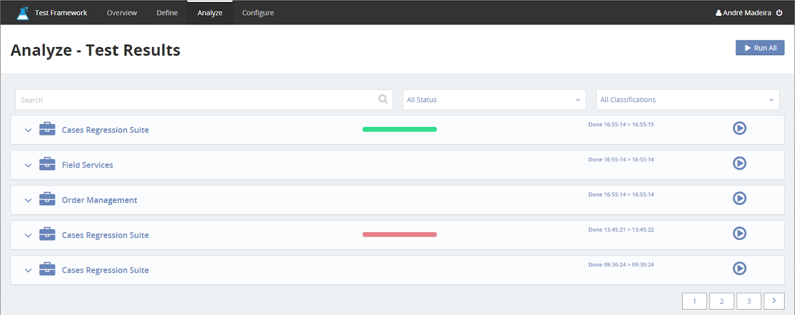

1. Expand the test run to see the details. Here is an example.

    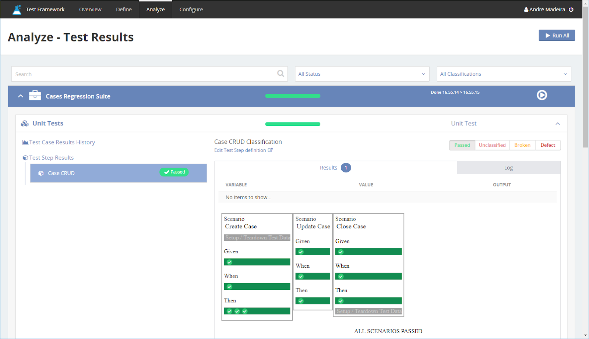

### Classifying the Execution of a Test

We use tests to ensure that an application behaves as expected. Where a test does not pass, it’s important to determine if this is due to a defect or if there is a problem with the test itself - incorrect logic, incorrect data, etc.

It is not possible to automatically classify the cause of a test failure. So, every test that fails requires a manual classification. If it is a defect, the tester must document with as much detail as possible - add detailed description, steps executed, data used, results obtained, expected results, attach logs, images, etc. If it is a mistake in the test itself, wrong assertions for example, the tester should fix it so it does not fail again or, at least, put it into quarantine so no additional classification effort is required until the test is fixed.

Test Framework automatically classifies all tests. The passed tests are classified as “Passed” and the tests that fail as “Unclassified”. For the unclassified tests the tester must provide more information, as displayed in this screen:

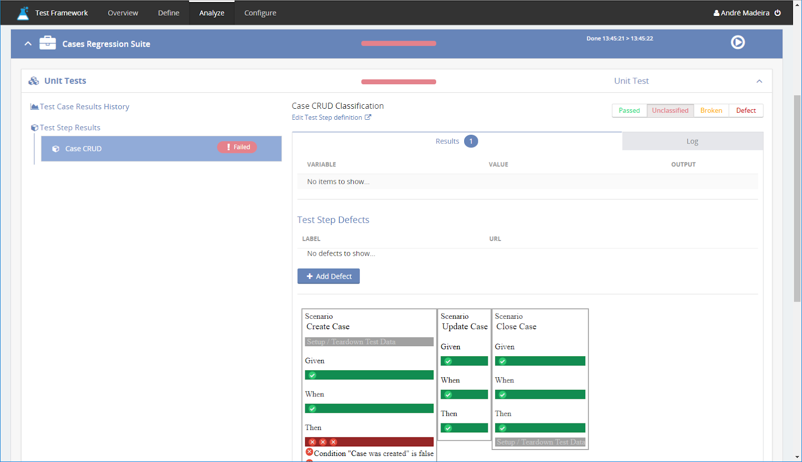

If the test failed due to a malfunction of the application, then it is a defect. The tester should register the defect in the Defect Management Tool, providing as much detail as possible.

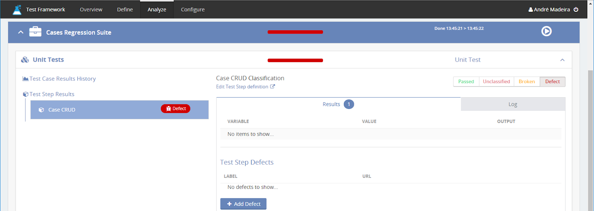

All defects follow a workflow. Below is an example of a typical “Defect Workflow”.

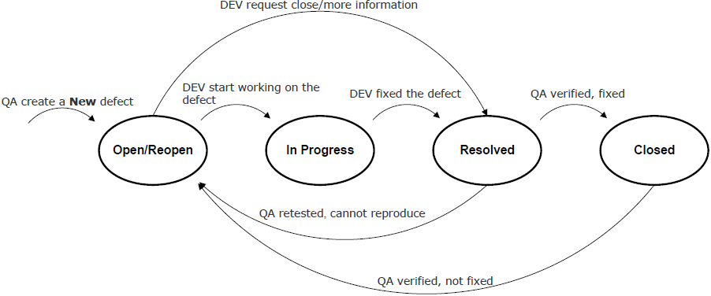

The Defect Workflow is typically configured in your Defect Management Tool. [For demonstration purposes, we will use JIRA as the Defect Management Tool].

Create a defect in JIRA and link it to this test execution. Press the “Add Defect” button and add the name of the defect and the URL from JIRA to establish the link.

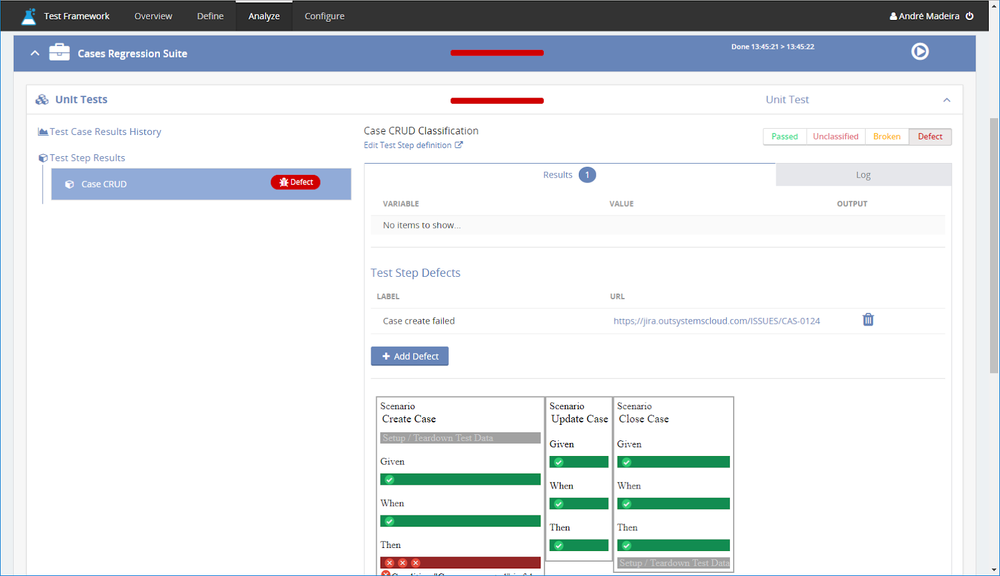

If the test failed due to a mistake in the test itself, then the tester should classify it as “Broken”. The cause may be the test itself or the test data being used.

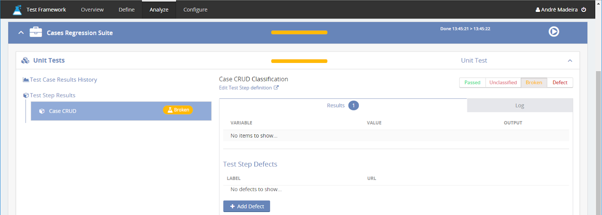

If the tester cannot immediately fix the test step, the test should be placed in quarantine. See the following screen as an example.

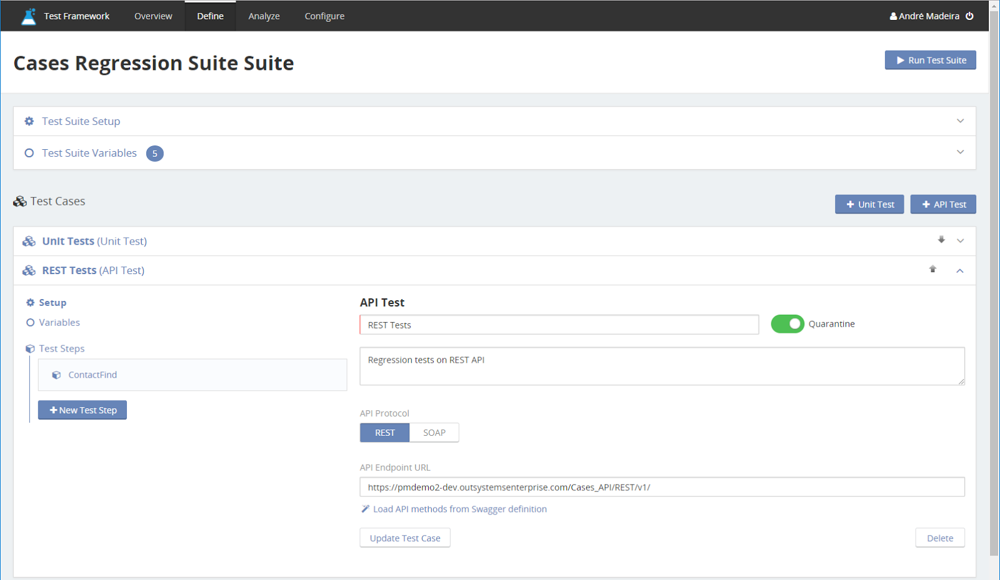

## API Testing Approach

Modern architectures favor system interoperability, composition and reuse. New development software projects focus on creating small, independently versioned, and scalable customer-focused services with specific business goals. These services communicate with each other over standard protocols with well-defined interfaces (APIs). These new software architectures, microservices for example, are considered ideal for supporting a wide range of platforms and devices (web, mobile, IoT, wearables,etc.). They support different speeds of application delivery and are prepared for a large number of simultaneous users.

It has become essential to validate API semantics for effective software production. This can be done through API tests. These tests are usually created by developers as they use the API methods. These tests are very good candidates for automation because APIs should be very stable.

An API test is similar to a unit test with a setup (prepare data for calling the API method), a call to the API method and then checking of the results. The semantics may require multiple calls to the API, producing tests that have more than one step.

## Native API Tests in Test Framework

Test Framework natively supports API testing for APIs that expose REST or SOAP methods. To create an API Test Case, go to the “Cases Regression Tests” test suite. Now press the“API Test” button. Fill out the new test case information. The API Endpoint URL can be found in Service Studio. Press “Update Test Case” button and the following screen appears.

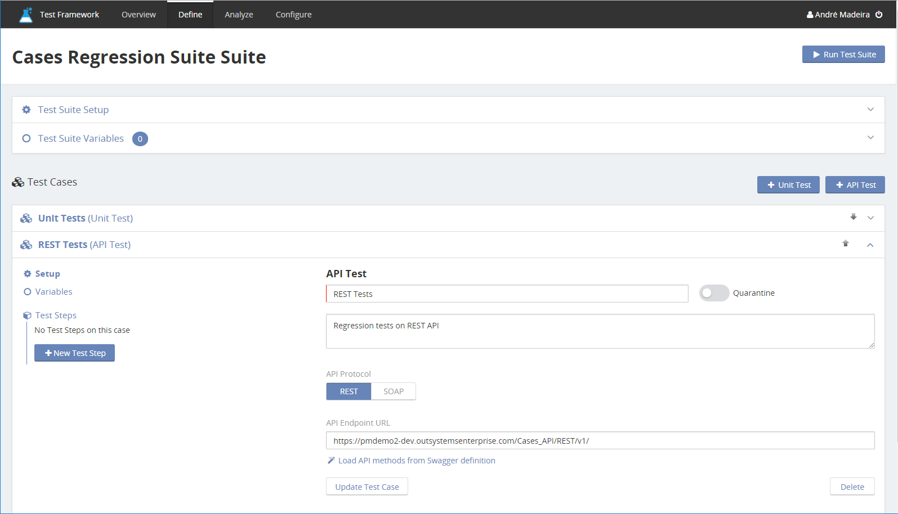

The OutSystems platform allows the creation of WebService API’s with REST and SOAP as the most common protocols.

For REST API’s, OutSystems generates a documentation file in swagger.json format. Simply add `/swagger.json` to the API Endpoint URL.

For SOAP API’s, OutSystems generates a documentation file in WSDL format from the API Endpoint URL by adding `“?WSDL”`.

While you may add API test steps by hand, Test Framework has API discovery built-in for both REST and SOAP interfaces.

To load all methods from the REST API documentation, press the button “Load API methods from Swagger Definition”.

Test Framework imports all methods and creates variables for all parameters used in the methods. These variables allow you to define values for each call and specify expected return values. More on this later.

After loading all API methods, the screen will look something like this:

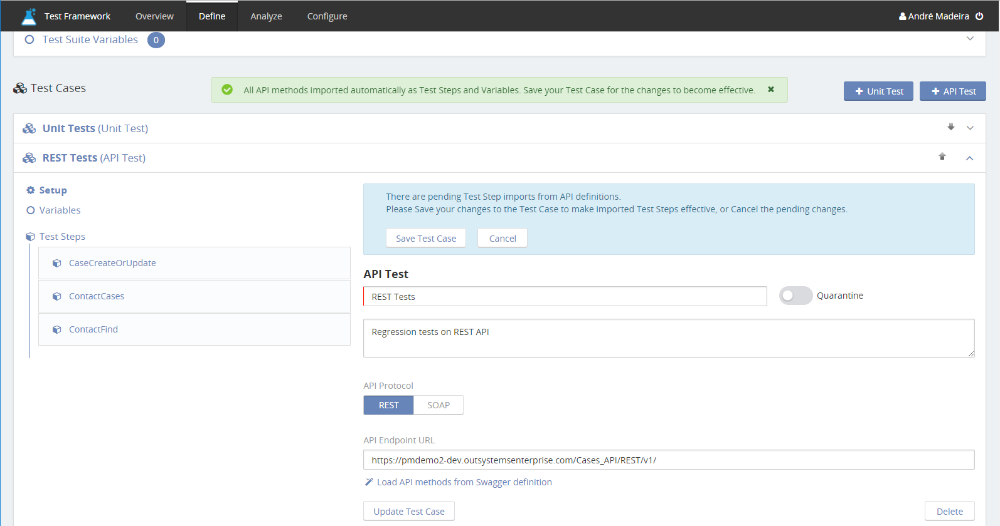

If you do not want to use all API methods, just delete the ones that aren’t required. When you select one of the methods you will see the following screen:

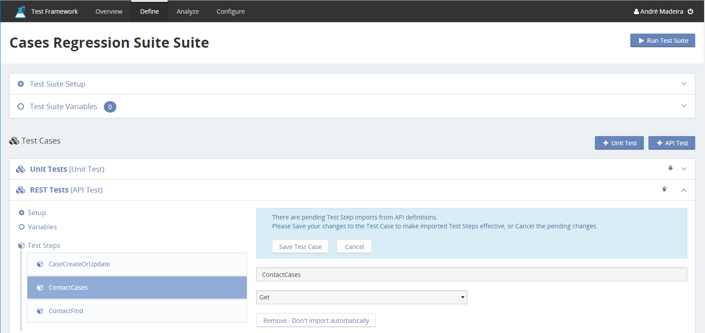

Press button “Remove - Don’t import automatically” to prevent the method from being imported. Repeat this operation for all API methods to be excluded. Now press the button “Save Test Case” to start importing the desired methods as test steps and creating variables for each parameter.

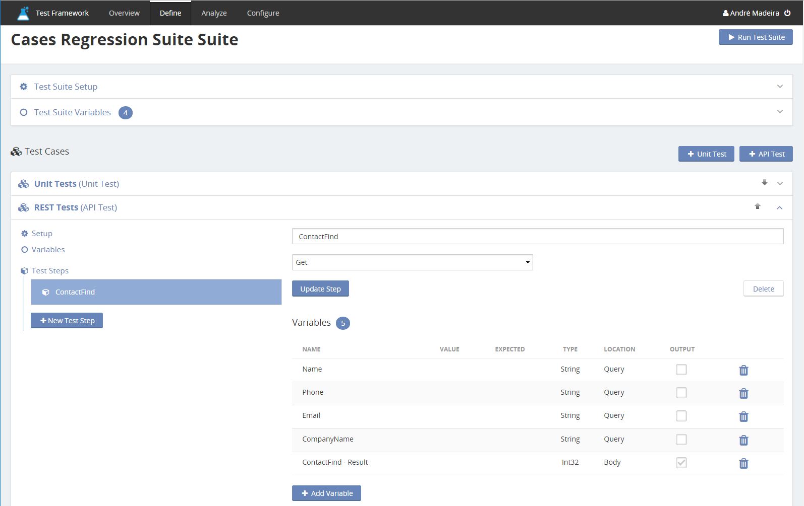

For each test step, you should define the input and expected values. Just select the desired variable and specify the input value or the expected value (if is an output parameter). Press the “Save” button to store that variable.

It is possible to use variable values from previous test steps: just use `${<variable name>}` as the input value.

Here is an example of the final configuration of the test step.

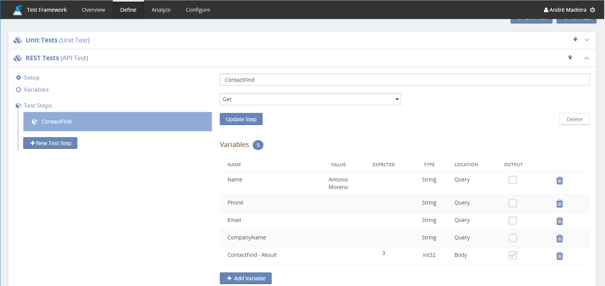

### Advanced API Testing Techniques

There are scenarios where calling API methods is not enough. Sometimes complex operations have to be performed between method calls. The native support from Test Framework won’t be enough for implementing those scenarios.

API tests may be created using the BDD Framework in a very similar way to unit tests. This allows the usage of low-code for advanced API testing. Instead of using Server Actions, you must import the API, using the REST or SOAP endpoint, and then create the tests as explained in the [Unit Tests](#unit-testing-approach) chapter.

Here is the **Given**, **When** and **Then** actions for the Case Create Test, using the REST API, to see how similar this approach is to unit testing:

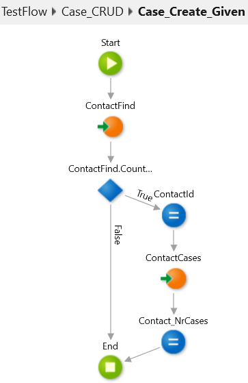 | 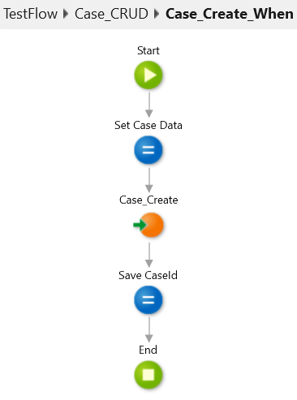 | 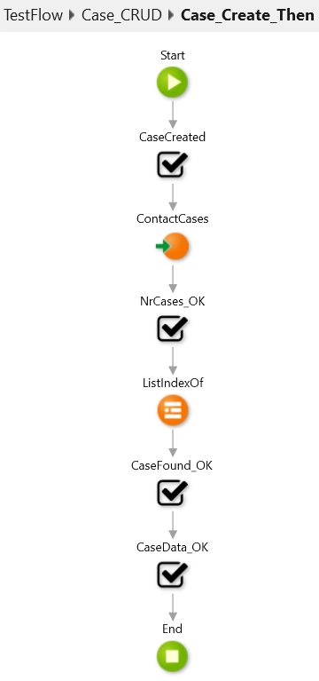  
---|---|---  
  
## Test Framework Overview screen

Test results are organized on a daily basis in the Overview screen. This screen provides a way to easily follow test trends. Press the “Overview” menu option and the following screen appears.

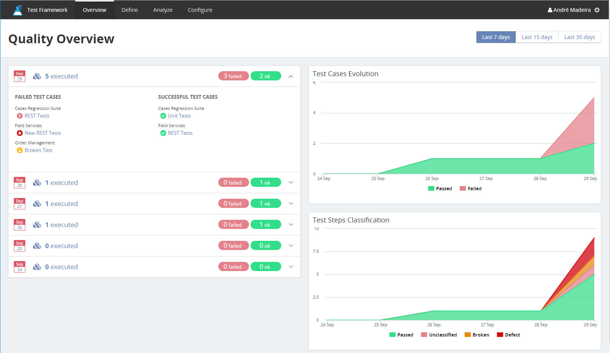

On the left side, test executions are organized by days. By expanding a day, you have easy access to the test executions for each test case executed that day. From the detail list you can drill into test execution to analyze the details.

On the right, the top graph presents the evolution of test case executions, divided into pass and fail. Test cases represent actual tests, each composed of a number of test steps.

During the early stages of a test project, it is normal that the total number of test cases increases as tests are being created for new areas of the application. As work evolves, it is expected that the number of failed test cases reduces while the number of passing test cases increases, meaning that quality is increasing

The bottom graph presents the total number of test steps executed and their classification. Test steps are actually test execution units that either pass or fail. Where they fail they may be classified as a defect or as broken.

The following trends may appear on this graph:

* The higher the number of test steps that pass, the more exhaustive the test project. 

* The higher the number of test steps unclassified, the higher the work that will be required from testers to classify executions: “testing technical debt”. 

* The higher the number of test steps broken, the higher the work that is required to fix tests and make them useful again. 

* The higher the number of test steps that found defects, the lower the quality of the application. 
