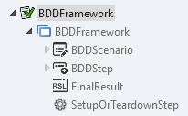
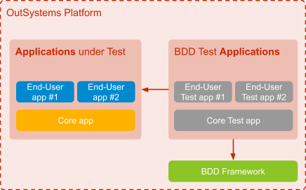
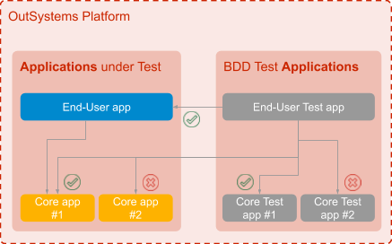
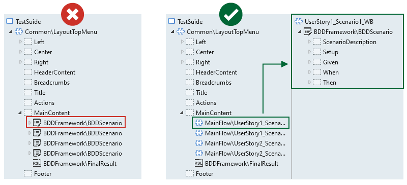

# Component Testing

For component testing, we recommend using the [BDDFramework](https://www.outsystems.com/forge/component-overview/1201/bddframework), which is available on OutSystems Forge. This framework provides a set of web blocks and actions that enable the creation of tests in the Gherkin **Given-When-Then syntax**. Tests are built in a UI screen where the structure of the test is defined by the web blocks provided by the framework, and its logic is implemented through screen actions.

<!-- Test Creation Example -->

The framework has four different web blocks available to build your tests. For each test scenario, you'll need a BDDScenario web block to represent it.

<!-- BDDFramework Web Blocks  -->

Then, for each step inside the test scenario, use a **BDDStep** web block by dragging it onto the BDDScenario web block.

The **FinalResult** gives you stats about all the scenarios run on the web screen and should always be included at the end to count successful or failed tests, for example.

The **SetupOrTeardownStep** can be included before or after the actual test logic in scenarios to perform setup/cleanup operations outside the scope of the scenario from a functional or business perspective. For instance, it can delete test data that was generated during the test. 

## Component Test Architecture

When we're implementing automated component tests, we're implementing OutSystems code. It's code that is used to test other code in our business application, but it's still code anyway. As a consequence, concerns like maintainability, reusability, and scalability need to be considered when running these tests.

### Test Code Isolation

Because you want to have the ability to deploy your business application to production without the test modules, you should have a separate OutSystems application just for testing. By doing so, you create a clear separation between your actual application code and test code, making it easier to manage. Although this separation is beneficial, there is still the need to identify which version of your test code matches which version of your application code. So we recommend that both applications follow the same versioning numbers in Lifetime. Meaning, if the application is tagged with version number 2.1, then the test application should also be tagged with version number 2.1.

Consider the example architecture below. We can clearly see that for each OutSystems application, there is a corresponding test application. Each test application contains a set of modules that implement the required tests for the corresponding OutSystems applications. Another recommendation is that the architecture of test applications should mirror (at most) the architecture of the OutSystems applications. This means:

* If End-User App #1 has strong coupling with the core app (for example, references public actions), then it is okay for the End-User Test App #1 to be strongly coupled to the core test app as well.
* For OutSystems 11 or higher, if it's loosely coupled to the core app and only references service actions and entities, then the test app must be loosely coupled as well.
* If it only references the core app through REST/SOAP APIs, then the test application may only reference REST/SOAP from the core test app too. 

In terms of dependencies between a test application and OutSystems applications, the test application should only reference: 

* Public Entities/Actions/Services/SOAP/RESTs from the corresponding OutSystems application
* Entities from any other OutSystems application that are also referenced from the corresponding OutSystems application

Complying to these rules ensures that the developed tests do not introduce any unwanted dependencies that could potentially impact the deployment plans when promoting new application and/or test code to other environments. 

### Reusability 

As you start implementing more tests, it's likely that you'll start to identify common patterns among different tests inside your test application. For example, you might realize that you are creating the same record in the setup step for three different scenarios. As you identify these common patterns, you should extract them and put them into a reusable pattern defined in a SharedTestPatterns module and import it into each of your tests.

This means that if you need to change it, you'll only do it once, and all tests will be updated. This SharedTestPatterns module holds all the common test patterns that are used by test modules inside the test application. These shared patterns may be referenced between test applications as long as the rules of the component test architecture are not violated.

Experienced developers may already know to identify such patterns upfront. Others may identify them only at a later stage, after implementing the first tests. The important thing is to keep extracting patterns as you identify them and resist the urge to copy-paste. Test code maintenance will benefit greatly as the test base grows bigger.

Notice that it is perfectly fine, and even sometimes desirable, to reuse common patterns from other test applications, as long as the dependency rules mentioned above are followed. 

## Component Test Design Patterns

For simplicity sake, we earlier described that you start defining a test scenario by dragging the BDDScenario web block directly onto your test screen. Furthermore, as a best practice when implementing component testing with the BDD Framework, we recommend you group multiple tests in the same test screen. These tests can be grouped by whatever criteria the team agrees on, such as requirement, functionality, or concept.

By following this approach, each test implements in its own separate web block instead of directly in the test screen. After each test web block is implemented, they can enter the test screen along with the FinalResult web block. When you access the screen, all tests included run just as if they were defined directly on the screen.

This will increase test execution speed, which is a key factor when tests run in the scope of a CI/CD pipeline. It also decreases the consumption of AOs in the OutSystems environment. Furthermore, it promotes the centralization of tests that are somehow related, which will make their management easier. Besides, you can always add more tests to the screen, if it makes sense to do so. 
