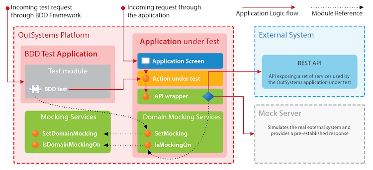
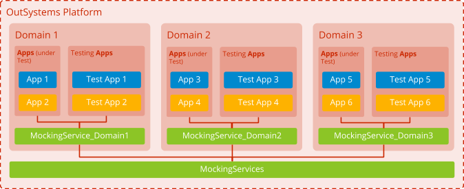
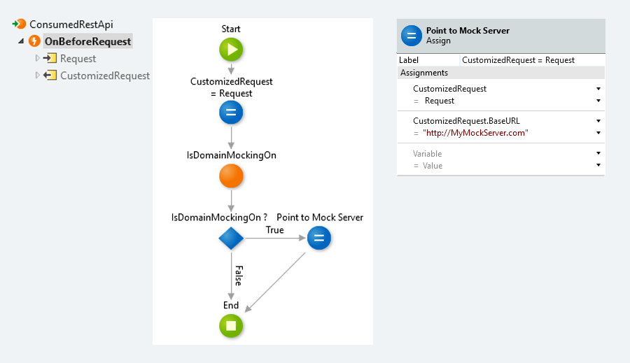
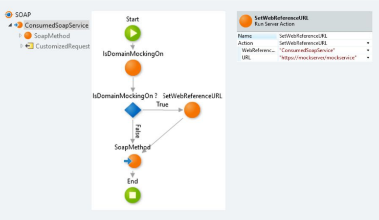
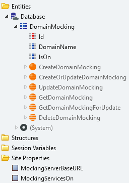
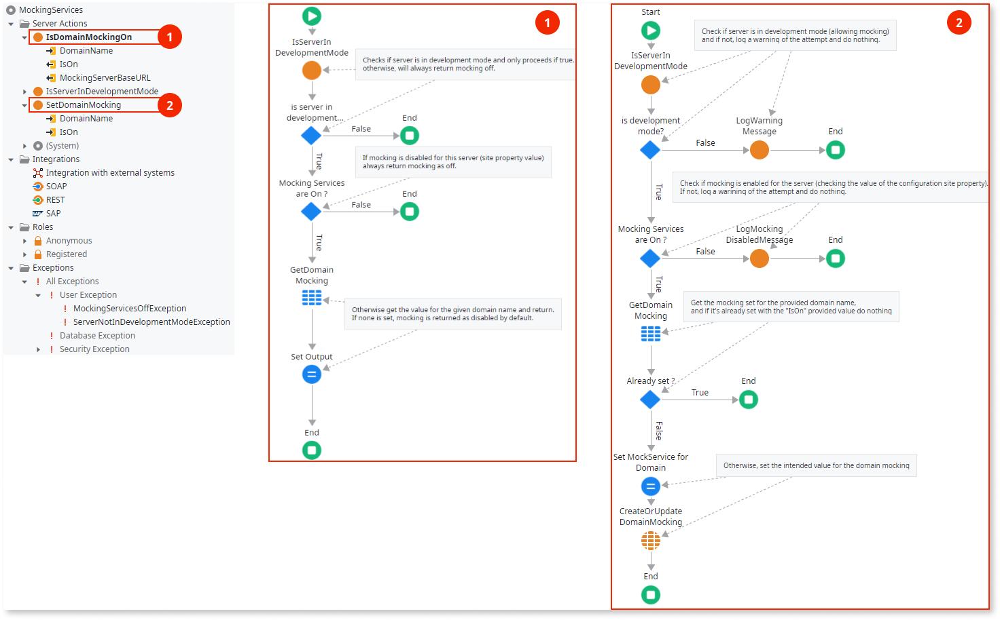
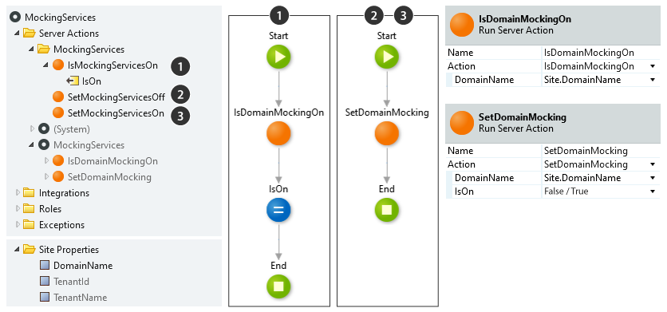

# Automated Testing Strategy

There is a big difference between an application that was built with testability in mind, and an existing application, sometimes even legacy, that was produced with none of these concerns. A good design for testability is crucial for a sound testing strategy, and achieving it requires a continuous effort from all team members throughout the application lifecycle.

You should always design new applications for testability and ensure they are test-automation friendly. Existing legacy applications, on the other hand, can be really hard to automate in an efficient and standard way if the applications didn't develop with testability in mind.

So when thinking about automating an existing application, first analyze how ready this application is for an automated testing approach. If it is not, we should then analyze what needs to be refactored so it can become test-automation friendly. Also analyze the business impacts of the needed refactoring.

One thing to consider is that the risk of refactoring an application can be significantly reduced with a good set of regression tests. Learn more techniques to improve the testability of OutSystems applications in [Developing for Testability](https://success.outsystems.com/Documentation/11/Developing_an_Application/Developing_for_Testability).

## Automated Testing Scenarios

As we explained above, there are two different scenarios when we want to apply automated testing. In one case, we have an application that was built with testability in mind, and we should:

* Apply the Testing Pyramid principles.

In the second case, we have an existing application that was not designed to be tested. In this case, we have two different options:

* Refactor the application and then apply the Testing Pyramid principles.
* Postpone refactoring and apply a more tactical E2E-based test automation approach.

The last option applies to scenarios where there's no business case to apply.

The situation can be worse when a legacy system is involved. In these situations we should focus on the most critical use cases, somehow purposely inverting the testing pyramid by creating UI test scripts or E2E server side tests.

For this last option, your E2E tests will act as a temporary suite of regression tests that ensure your application will continue to behave the same way after the refactor is applied. Consider it only for applications that are critical to the business, ones that  are already running in production, and where the level of required refactoring adds a lot of risk. Once the refactoring is applied and the new final automated tests are implemented and verified, then you can discard the temporary regression suite.

Keep in mind that if we're considering covering a legacy application with automated testing, it's because there is a risk identified that needs mitigation and the application still has ongoing developments (more details in [OutSystems Testing Guidelines - Which Tests to Automate](testing-guidelines.md#which-tests-to-automate).) In these cases, the refactoring effort should be considered part of the automation effort, because it should pay off to do the refactoring together with the tests instead of building hard-to-maintain E2E tests.

### Automated Testing Decision Process

Every new application should follow the standard test automation principles, the testing pyramid, development best practices for testability, and the decision process on which tests should be automated.

The problem is more difficult to solve when we need to automate the tests for an existing application. When we have this scenario we should follow this process.

First of all, we need to assess our application against testability principles explained in [Developing for Testability](https://success.outsystems.com/Documentation/11/Developing_an_Application/Developing_for_Testability). This is done in the **Test Automation Assessment** phase.

In case the result of the assessment is positive, meaning we have an application that was built with testability principles in place, then we should just apply the **Standard Test Automation Practice**, which includes testing pyramid, developing for testability, and the right decision for automating each test.

On the other hand, in case the assessment result is negative, then we should apply a more **Tactical Test Automation Practice**, more based on UI automated tests for critical scenarios identified. Of course, there is always a possibility for a hybrid instantiation, in case there are building blocks that are more testable than others.

In the end, we should always plan a refactoring on the parts that should be more testable-ready. Refactoring is always a good thing, even if it is sometimes hard to explain to the business. In the end it's a crucial tool to reduce technical debt, which business can see  only in the worst way.

If you take into account OutSystems' "True change" capabilities, refactoring becomes much easier to perform. So refactoring should become a part of developers' practices as a way to continuously improve testability and ensure a reduced technical debt.

For more information about refactoring an application, please refer to the following links:
* [Refactor an Application in OutSystems 10](https://success.outsystems.com/Documentation/10/Managing_the_Applications_Lifecycle/Deploy_Applications/Refactor_an_Application)
* [Refactor an Application in OutSystems 11](https://success.outsystems.com/Documentation/11/Managing_the_Applications_Lifecycle/Deploy_Applications/Refactor_an_Application)

## Test Data Management

Managing test data can be as important and difficult to achieve as building the test itself. The data used during test execution instantiates the functional behavior we are validating when running each test. This means that each test's dependency on its data is huge. Most tests fail due to unreliable data. This is even more true as you climb up the testing pyramid and become more dependent on real data. E2E tests depend more on real data than component tests.

When defining test data, it is important to clearly identify which tests can use random/dummy data and which tests require close-to-production test data. A good approach is to provide quality when defining user stories to ensure that all crucial/required checks for each user story acceptance criteria can be performed.

Another important thing is that tests must always be idempotent.Prepare testing to re-execute as many times as needed, without depending on anything else for this goal to be accomplished.

Finally, tests must run fast, or at least they must execute within the minimal time possible. Otherwise they compromise the automation and continuous delivery ultimate goals. If we implement common data setup and teardown for multiple automated tests, these steps will also consume test execution time. We need to follow some criteria to set up test data in a way that optimizes test execution time.

### Test Data Management Options

When we build tests for an OutSystems application, our tests will always depend on two possible data sources:

1. System Under Test (SUT) OutSystems application data
1. External system data (which may include external systems data or other loosely coupled OutSystems application data)

When thinking of SUT OutSystems application data, we can think of two subtypes of data:

1. Common/System-wide/Master data
1. Test specific data

Regarding Common/System-wide/Master data, ideally we want to set up this data once and then use and re-use the data in our tests. To achieve this goal, we can implement specific setup logic to bootstrap a baseline of "realistic" test data before running our test suites.

We can follow a synchronous or asynchronous approach to implement the bootstrap logic, depending on the volume of data. But the main pattern should expose an API to allow orchestrating the bootstrap logic and verifying its completion. This way, an external orchestrator can invoke the API to set up the data, wait for its completion, and then run the required tests.

In case the creation of bootstrap logic is not easily achievable, an alternative approach to obtain reliable data (production-like) for testing purposes exists. This consists of provisioning the whole testing environment with a PRD database clone. This guide provides a detailed description of the required procedure to accomplish this.

However, using a database clone is not recommended, and you should only use it in rare occasions. These are the drawbacks:

* It's hard to automate in a fast way.
* It requires sanitization of system and application data, such as configurations, endpoints, and sensitive data in the cloned database.
* The testing environment must be reregistered in LifeTime.
* Release cycles from all delivery teams must be aligned.
* The potential loss of module versioning history in the testing environment.
* High lead-time of the whole process (if manually performed.)
* It's not possible to perform in PaaS infrastructures.

Furthermore, when building a test we always have to decide whether we need the real data (from 1 or 2 above) or simulated data (built with some mocking mechanism). As we climb the testing pyramid, tests become more dependent on real data.

Regarding test-specific data, we should implement setup/teardown logic for the test (or test suite) that ensures the required data exists in the system before the test is run. Also, this data should not remain in the system after test execution. This way, this same data can be used as often as needed for that specific test or test suite.

Regarding test-specific data, sometimes it's not possible to create the specific data you require. An example would be "time dependent" data such as an "insurance policy that has more than three months," since you may not be able to create policies in the past.

In these scenarios, we can follow a "best effort" approach, where the test itself searches for the data it needs in the DB during the setup. If the data is not found, the test fails. Otherwise, the test will use this previously existing data to execute and, in the teardown phase, revert the data to its previous state.

When thinking of external system data, we also need to do some setup and teardown logic, or use mocking services.

When thinking about mocking services, there are usually two different options:

* **OutSystems application mocking services**: Should be used to make component tests more independent and idempotent.
* **External systems mocking services**: Should better fit the same kind of purpose, but for Integration tests with external services.

We always need to analyze each application test data dependency to allow it to test in the best way possible. So, you must carry out a deep test data for each application to reduce test complexity, effort, and maintainability, and  to reach the ultimate goal of test idempotency.

## Mocking Services for Integrations Points

Mocking services are used to simulate real services used in a given functionality. This method is commonly known as service virtualization. The reason to use mock services is to eliminate dependencies from external systems when we try to test the functionality of our application. By isolating our application, we are able to assess the correctness of our functionalities, regardless of the status of the external system.

This is very useful to pinpoint potential problems during testing. If we have a set of tests on a given functionality that are using mocking services to simulate an external system, and all execute successfully, then we know our application logic is okay. But if we have another set of tests on the same functionality that instead communicate with the actual external system, and they fail, then we know that the problem is at the integration level.The problem is that the API changed or the external system is down. This is a technique called contract testing.

This implies that when the external service is called, the application needs to be aware if it is running in the context of a test execution, and if mocking will apply in external dependencies. Some tests will want to use mocking, and some won't. For this reason, we recommend that you define a separate mocking services framework to provide two simple functionalities:

1. Set the mocking mode on/off — used by the test applications.
1. Check if the current execution is running with Mocking Mode On — used by the business application.

This framework consists of a single MockingServices module that provides the base functionality, and wrapper modules per domain called DomainMockingServices.

### Mocking Services Module

This is a Library-level module that should exist in its own separate application. Because of dependencies that will be created from your OutSystems applications to this module, it will have to be pushed all the way up to production. For this reason, the module needs to be as lightweight as possible, have no dependencies to any other modules, and have no impact on the running applications in production. For an example of a possible implementation, please take a look at the appendix MockingServices sample module.

### DomainMockingServices Module

Because the MockingServices module is generic and will be used by all domains, each domain should abstract its usage by implementing its own module that wraps its functionality, only for that domain. This enables the possibility to have mocking enabled for some domains and disabled for others at the same time.

This is what the architecture should look like:

### Mocking in REST APIs

In the context of REST API methods, simply add the testing mode validation to the "OnBeforeRequest" event action, and if it returns true, customize the request URL to point it to the destination mock service, as shown in this picture.

### Mocking in SOAP APIs

In the context of SOAP API methods, add testing validation before calling the actual service method. If it returns true, override the target URL by calling the "SetWebReferenceURL" action from the "EnhancedWebReferences" module. Here's a small example:

### MockingServices Sample Module

This is a brief description of a possible implementation for this module, with an example for when there's a single mocking server in place. But for scenarios where there are multiple mocking servers, it easily can be extended.

#### Data tab

##### Site Properties

MockingServerBaseURL
:   Indicates the mocking server's base URL. Used by the application modules to know where to redirect the calls.

MockingServicesOn
:   Indicates if the mocking services should be used in the current environment. This property completely disables mocking in the environment, even if some code tries to set up some mocking service. Especially useful for production environment.

##### Entities

DomainMocking
:   Persists the status of the mocking service for a specific domain. We recommend that the domain is the LifeTime team or the business application (as per DDD recommendations). But because the DomainName attribute is a text, it is also possible to set any level of granularity.

#### Logic Tab

##### Public Actions

SetDomainMocking
:   For the domain given by DomainName, this sets the mocking status to on or off, depending on the boolean value of IsOn. If the MockingServicesOn site property is set to false, it throws an exception. If the domain is already set with the value of IsOn, nothing happens.
    This action is used by the test modules to specify that a test needs to be executed using mocking services or not.

IsDomainMockingOn
:   For the domain given by DomainName, this checks if the mocking status is set to on or not. It also returns the mocking server's base URL. If the MockingServicesOn site property is set to false, it always returns false regardless of the domain setting.
    This action is used by the application modules whenever a REST/SOAP API or service action is invoked to understand if the call needs to be redirected to a mocking server or not, and that server's base URL.

##### Exceptions

MockingServicesOffException
:   Exception is thrown when the MockingServicesOn site property is set to false and someone tries to set the mocking for a domain.

### DomainMockingServices Sample Module

Here is a sample implementation of the DomainMockingServices module. Because the MockingServices module accepts the DomainName as generic text, it's best to have these wrapper modules to abstract the tests from the actual domain name.

The module keeps the domain name in a site property and wraps the actions from the MockingServices module in its own public actions that the tests use.

Here's a sample of what one of these DomainMockingServices modules looks like:

