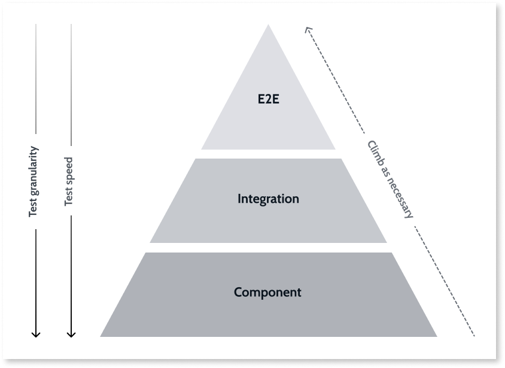

# OutSystems testing guidelines

Applications built with the OutSystems platform benefit from continuous integrity validation, which tracks the impact of changes across your application, (data model, business logic, and presentation) and ensures nothing is broken at deployment time.

Self-healing capabilities automatically correct problems and notify developers of any issues they must handle. Whenever there’s a change, OutSystems tracks all dependencies, automates database updates, and analyzes the impact the change will have on running applications throughout their life cycle.

At a broader level, OutSystems does impact analysis for multiple applications when creating deployment plans in LifeTime. It assesses the impact of moving the selected application versions to the target environment before executing the deployment plan.

So what do you get from testing with OutSystems? The number of bugs introduced is typically much smaller when compared with traditional development technologies, which translates to fewer test-and-fix cycles and greatly reduces development and delivery effort.

Keep in mind that integrity validations, self-healing capabilities, and impact analysis won’t eliminate the need for testing during the application lifecycle. OutSystems actually does software package integrity, validating the overall quality of application, which includes a set of functional, performance, and security criteria.

## Testing throughout delivery lifecycle

The following diagram depicts typical testing activities that can take place during the OutSystems software delivery lifecycle:

Component tests validate the behavior of single units of code. These tests correspond to unit tests in traditional high-code technologies. In OutSystems, these map to Action elements that implement business logic. As part of sprint development activities, developers should automate or manually deliver these tests in the DEV environment. Automated component tests should also run in the continuous integration (CI) environment, as part of the CI flow. Component tests can adopt one of two approaches:

* Solidarity, which incorporates integrations with external OutSystems components.

* Solitary, which isolates the target from communication with other OutSystems components.

Find more details on Component testing in:

* [Developing for Testability > Unit/Component Testing](https://success.outsystems.com/Documentation/11/Developing_an_Application/Developing_for_Testability#Core_Layer)

* [Automated Testing Tools](automated-testing-tools.md)

* Component Testing > [Component Test Architecture](component-testing.md#component-test-architecture)

Integration/API tests validate integration with external systems, such as a middleware layer, or a direct integration with any other independent system, which also include another loosely coupled system made with OutSystems, for example applications that expose APIs to external parties. Developers should automate or execute tests manually in DEV, or do it QA in case target integrations are unavailable or unreliable in DEV. As with component tests, some of the integration tests may be executed automatically as part of the CI flow; however, this practice should be limited to tests that execute quickly.

There’s more for you to read about Integration/API testing in these links:

* Developing for Testability > [Service API Isolation](https://success.outsystems.com/Documentation/11/Developing_an_Application/Developing_for_Testability#Service_API_Isolation)

* Automated Testing Tools > [Automated UI and API Testing Tools](automated-testing-tools.md#testing-tools)

* [Integration/API Testing](integration-api-testing.md)

System or End-to-End (E2E) tests validate complete functionality from an end-user or system perspective. End-to-end tests are typically executed through a web or mobile user interface (UI tests), but not all E2E tests are UI tests. You may want to start by automating only critical use cases, particularly the happy paths. For example, testing an API exposed by an OutSystems application to external parties may be considered an E2E test, as can the set of server-side user actions that comprise a particular end-user flow. Developers are often responsible for automating these tests while QA resources are often responsible for UI tests. Typically, E2E tests aren’t part of the CI flow, because they tend to be slow. Automated E2E tests can be executed in QA, included in the CI/CD pipeline, or also executed manually.

For more about UI testing, here are some useful links:

* Developing for Testability>[Web UI Simulation](https://success.outsystems.com/Documentation/11/Developing_an_Application/Developing_for_Testability#Web_UI_Simulation)

* Automated Testing Tools>[Automated UI and API Testing Tools](automated-testing-tools.md)

* [Web UI Testing](web-ui-testing.md)

Regression tests validate that previously accepted features still perform as expected in new versions of an application, and also that infrastructure changes don’t break the existing functionality. As your OutSystems low-code factory grows, so does the need to automate regression tests. In fact, automation is the only way to accelerate the validation of new changes to existing applications. Continuous delivery depends a lot on this capability, because you can only deliver changes as quickly as you can validate their impact.
Performance tests evaluate application responsiveness and scalability. Load tests are the most common. Load tests validate application behavior under predefined workloads (expected vs. peak) across a variety of scenarios. For applications that are more data intensive, rather than user intensive, it may make more sense to test performance with large quantities of data instead. Performance tests are usually run in PRE environment, even though it compromises PRE for being a reference PRD environment when load tests take too long to execute. Ideally there should be a dedicated environment just for instantiating this specific capability.

Acceptance/Functional tests validate that new functionality complies with business requirements before pushing new changes to production. Acceptance tests typically target business critical features in a release, and they’re normally performed manually in the QA environment prior to release. However, developers can use acceptance tests in DEV to validate features before promoting them to CI or QA.

Security tests validate security of a given system and its underlying infrastructure. A typical strategy is to exploit common security vulnerabilities in runtime. Security testing should happen as early as possible in the delivery lifecycle (shift-left trend), normally by security teams, which can be internal or outsourced as a service. Perform this kind of tests in any of the environments from DEV to PRE-PROD and PROD wherever they are crucial. For example, SQL injection and XSS security tests can build and run in DEV so that the DEV team can quickly promote fixes. Running security tests in DEV also teaches developers how to avoid introducing common security vulnerabilities. Our recommendation is to adopt a shift-left approach to security wherever possible.

Smoke tests are designed to quickly validate the stability and basic functionality of software builds generated by the operations team in PRE and PRD. You should include smoke test steps, which you must document in the runbook. This kind of test is normally executed manually. But when the runbook executes automatically, so these tests can also be automated.

Testing an application always requires investment from the delivery team. For that reason, the type of testing activities and the amount of testing effort invested will largely depend on the complexity or business impact of the application being delivered. As a rule of thumb, the higher the risk associated with application functionality, the more thoroughly you should test it.

It is highly advisable to use realistic data whenever possible to support different testing activities. This allows for realistic testing scenarios and helps pinpoint data-related issues earlier in the delivery cycle, before reaching production. To achieve this, delivery teams should understand the options they have to make every test as fast and idempotent as possible. Read [Test Data Management](strategy.md#test-data-management)​ for further details.

## Which tests to automate

We know from State of DevOps Report that high-performance companies do automate most of their tests. If you have continuous delivery in mind as a goal, you should strive to automate regression testing as much as possible..

It is important to be selective with automation. Trying to automate everything is rarely an effective strategy, as some functionality may be used only infrequently, have little impact if it fails, or be expensive to test.

[Angie Jones](http://angiejones.tech/category/automation/), well-known Senior Automation Developer Advocate, says that automation should be approached with care, because by its nature automation requires time and maintenance, and redundant automation is noisy.

Maintaining automated test scripts can be a huge effort, so it’s important to keep sight of the value of automation relative to the effort required to maintain it. Think about automated tests as any other software you develop and maintain.

Identify what you’re going to automate, and how you should design your test so that it is really efficient in terms of code maintainability and time to execute. Avoid creating redundant test code that is not reusable.

So, how do you decide which tests to automate? Well, we like the approach Angie Jones recommends:

1. Start with your gut feeling. Sometimes there’s something that tells us a specific test is going to bring value if we can automate it. Honor your intuition when determining what tests to automate.

1. Evaluate the risk of not automating a test, taking into account the frequency with which the target functionality is used and the business impact if it breaks.

    

1. Evaluate the value of the test, based on the distinctness of the test and also the time it would take to recover from a failure of the functionality under test

    

1. Evaluate the cost-efficiency of building the test, analyzing how fast and easy it is to build the test.

    

1. Evaluate the history of the user story we want to test, how many functional failures we had in the past in similar areas against the number of failures of this particular test case.

    

1. The score for each item comes from multiplying the two values determined in each vector. In the end, you should finish with a score matrix that will help you decide whether or not you should automate every specific test you need to perform.

    * **&gt; 74** means you should really automate the test

    * **&gt; 24 and &lt; 75** means you should decide based on the gut feeling

    * **&lt; 25** you should not automate the test because it won’t bring the necessary value

    For example:

    

## Segregating automated tests

Test automation greatly reduces regression testing on increasingly complex or mission-critical systems. It is also a critical part of any continuous delivery approach. When choosing which tests to automate, it’s highly advisable to adopt the [Testing Pyramid](https://martinfowler.com/articles/practical-test-pyramid.html) approach, which states that test automation effort should be distributed according to a pyramid shape, with component tests on the bottom layer and moving all the way up to E2E tests. The reason for this is that component tests are easy to write and maintain, as well as very fast to run, whereas E2E tests are typically unstable, hard to maintain, and very time consuming to execute.

A key concept for implementing the Testing Pyramid is to write testable applications. In OutSystems, this means adopting the [4-Layer Canvas architecture principles](https://success.outsystems.com/Support/Enterprise_Customers/Maintenance_and_Operations/Designing_the_architecture_of_your_OutSystems_applications/01_The_4_Layer_Canvas) and distributing functionality into small, testable pieces. For instance, all business entities reside in core layer modules and are wrapped by public server actions that validate data correctness, dependencies, and calculations. No business logic should be in Screen actions because these are not testable with component tests.

Segregated testing enables delivery teams to use automated UI tests sparingly for critical UI flows, and write a comprehensive set of easily automatable unit and integration tests that will cover critical business functionality and define the scope of regression for each new application release.
