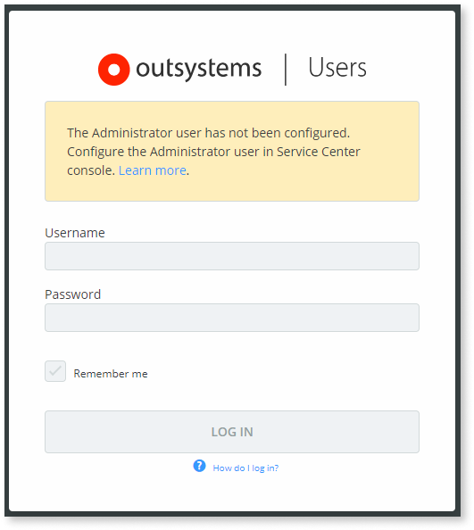

# Access the Users app

The OutSystems **Users** app lets you create, update, and delete [End Users](./add-delete-users.md) (the users of your apps) and their roles. You can also manage [User Roles](../user-roles/intro.md) individually or in bulk using groups.

## Navigate to the Users app

To access the Users app for a specific OutSystems environment, go to:

`https://<environment_address>/Users`

For example, if your environment address is `example.outsystemscloud.com`, go to:

`https://example.outsystemscloud.com/Users/`

## Initial configuration

Before accessing the Users app for the first time, you must configure the Administrator user. Learn how to [configure the Administrator user of the Users app](configure-admin.md).

The Users admin account is **not** the same one you use to connect to Service Center, LifeTime or Service Studio, as those are [IT Administrator Users](../../manage-platform-app-lifecycle/manage-it-teams/intro.md).

