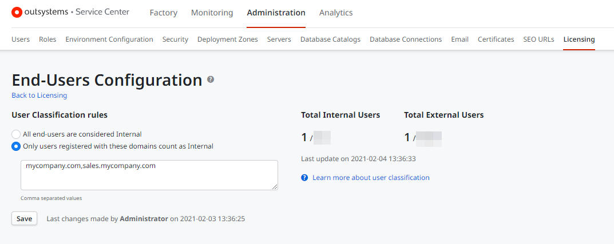

# Classify Users as Internal Users

By default, all end users are considered internal until you configure specific domains that you own within Service Center. When you specify the domains that you own, any users with an email address matching those domains will be classified as internal, and any other email domains will be classified as external. Users without an email on their profile are classified as internal. This is important since you license internal and external end-user capacities separately. [Learn more](https://www.outsystems.com/tk/redirect?g=907b0fd3-bc46-4391-aae2-673296d795d9)

## How to configure your domains

1. Open the Service Center management console.

1. Navigate to **Administration** > **Licensing** and click the "End-Users Configuration" link.

1. Under **User Classification Rules**, select **Only users registered with these domains count as Internal** and enter the domain names that you own. 

    

1. Click **Save**.

After saving your changes, OutSystems starts the process of calculating the current internal and external end users, which might take a few minutes. The totals are recalculated periodically using a timer process. The **Last update on** indicates the last time the user counts were calculated.

