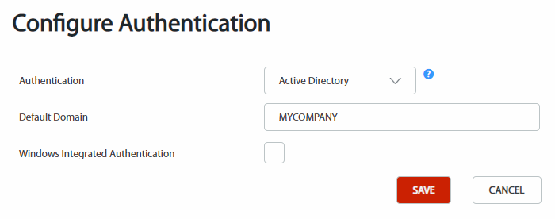

# Configure Active Directory authentication

Only available in OutSystems self-managed installations. In the OutSystems Cloud you can use [LDAP](configure-ldap.md), [Azure AD](configure-azuread.md), [Okta](configure-okta.md), or [SAML 2.0](configure-saml.md).

This article describes how to configure Active Directory authentication for end users.  

## Prerequisites

Before configuring Active Directory authentication, make sure you meet the following requirements.

* The front-end server needs to be part of the Active Directory domain.  

* You need to have a domain (to be set as **Default Domain**) that ensures all traversed paths between domains are bidirectional in terms of trust.

    

    The Active Directory APIs used by the Platform require all traversed paths between domains during the search process to be bidirectional in terms of trust between said domains. If this is not possible, all the synchronization and access to users' details from the external system are unavailable. Some of the issues of using a default domain with restricted access are:

    * Users deactivated in the external system will still be active on the Platform.
    * Metadata changed in the external system will not be synced to the Platform.

    

## Configure Active Directory authentication

To use Active Directory domain authentication:

1. In the [Users application](<../accessing-users.md>), click "Configure Authentication" in the sidebar.

    

1. Choose `Active Directory` in the **Authentication** drop-down list.

1. Add the authentication domain in the **Default Domain** text field.

    

    The **Default Domain** needs to ensure all traversed paths between domains are bidirectional in terms of trust. Don't use a domain with restricted access.

    

    

    Security best practices strongly advise against using the Windows Integrated Authentication when a workstation is shared between several users.

    

