# Configure Azure AD Authentication

**Note**: Azure Active Directory (Azure AD) has been renamed to **Microsoft Entra ID**.

Applies only to Traditional Web Apps and Reactive Web Apps.

## Prerequisites
Requires Platform Server Release Jul.2019 CP2 (11.0.542.0) or later.

## Configuring Azure Active Directory

The configuration of the Azure Active Directory (AD) authentication method is quite similar to the [SAML 2.0](configure-saml.md) one, but in this case the **Claims** settings are already filled in with Azure AD default values.

Additionally, you can fill in the configuration settings for Azure AD authentication by uploading/downloading files with metadata, which helps avoid human errors.

Check the [limitations of the current SAML 2.0 implementation](configure-saml.md#current-limitations) which also apply to the Azure AD authentication method.

To configure Azure AD authentication you must take these general steps:

1. Configure general Azure AD settings in Users app
1. Create and configure application in Azure AD portal
1. Finish configuration in the Users app
1. Assign user or group to Azure application
1. Test your configuration
1. Configure user roles in the Users app
1. Perform some final checks and configurations

The following sections describe these steps in detail.

### Configure general Azure AD settings in Users app

1. In the [Users application](../accessing-users.md), click **Configure Authentication** in the right sidebar.

1. In **Authentication** choose `Azure AD` (A).

    

1. Check the settings values in **1. Service Provider Connector Settings** (B).  
    OutSystems provides default values for the required options and also an auto-generated keystore.

1. Download the Service Provider metadata file by clicking **Download SP Metadata XML**.

    

### Create and configure application in Azure AD portal

On the Azure side, create a new enterprise application from a template and configure SAML sign-on. Do the following:

1. Sign in to the [Azure Active Directory portal](https://aad.portal.azure.com/).

1. In the left navigation menu, click **Enterprise applications**.

1. Click **New application** to create your own application.

    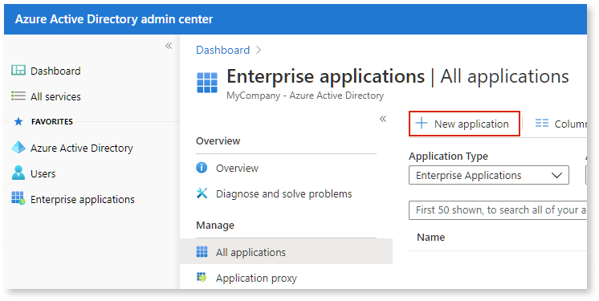

1. Search for the **OutSystems Azure AD** application on Azure AD app gallery (A) and select the application from the search results (B).

    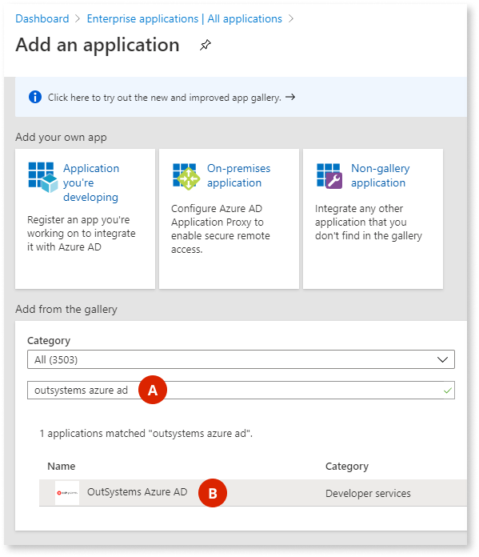

1. A sidebar with options opens at the right side of the page. Define a name for your Azure application in the **Name** field (C) and click **Create** (D).

    Wait a few seconds while Azure creates your application.

    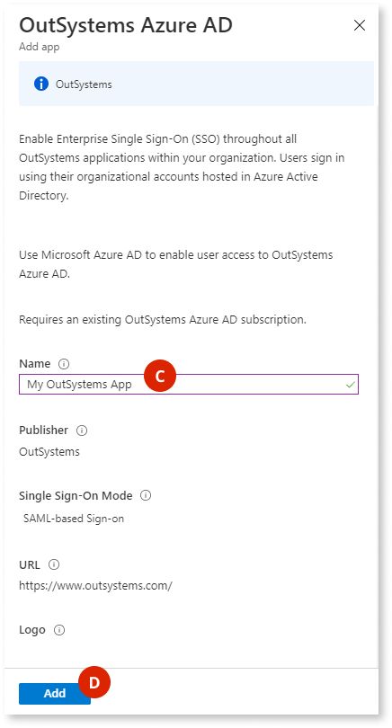

1. After the app has been created, click **Single sign-on** on the left navigation menu and select the **SAML** single sign-on method.

    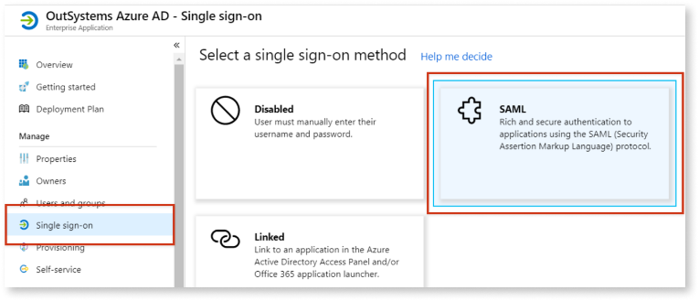

1. Click **Upload metadata file** to upload the XML metadata file downloaded from the Users app.

    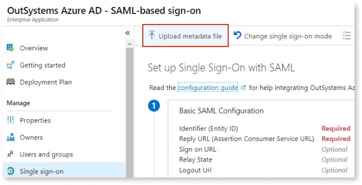

1. Select the XML metadata file and click **Add**.

1. A sidebar with options appears at the right side of the page. Click **Save**.

    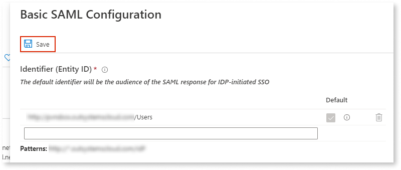

    

    One particular configuration in the Azure application depends on the value of a setting in the Users app.

    Get back to the Users app, scroll to the **1. Service Provider Connector Settings** section, and click **Show Advanced Options**.

    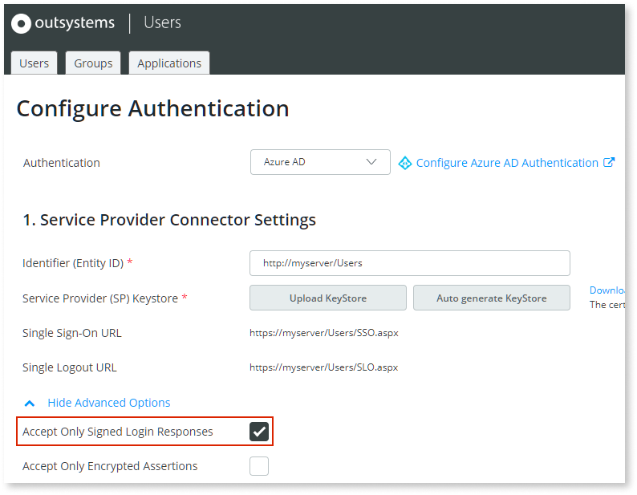

    If the option **Accept Only Signed Login Responses** is **enabled**, activate the corresponding option in Azure by following these sub-steps:

    a) In the Azure portal, edit the **SAML Signing Certificate** settings by clicking the pencil icon on the right.

    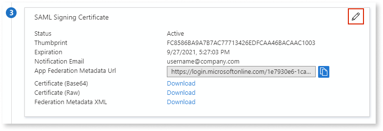

    b) In the **Signing Option** drop-down, select **Sign SAML response and assertion**.

    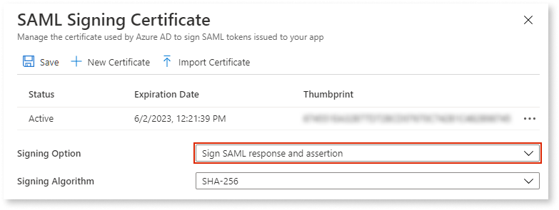

    c) Click **Save** and then close the side window.

    

1. Download the Federation Metadata XML by clicking the corresponding **Download** link.

    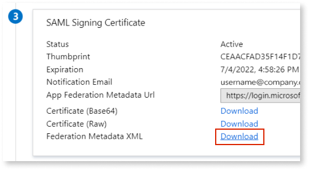

### Finish configuration in the Users app

Back in the Users application, upload the XML file you downloaded in the previous step.

1. Locate the **2. IdP Server Settings** section in the **Configure Authentication** page.

1. Click **Upload from IdP/Federation Metadata XML**.

    

1. Select the Federation Metadata XML file you downloaded from Azure.

1. Click **Save**.

    **Note**: A warning message about enabling SSO between app types is displayed. **Enabling this functionality is optional.**

    

    To enable IdP in Reactive Apps, do the following:
    
    1. Go to the Service Center management console of your OutSystems environment.

    1. Go to the **Administration** section and select the **Security** tab.

    1. In the **Common Login** section, select the **Single Sign-On Between App Types** checkbox, and click **Apply**.

       

    For more information about application authentication, see [Configure App Authentication](../../../security/configure-authentication.md). 

### Assign user or group to Azure application { #assign-user-azure-app }

In the Azure portal, assign a user or a group to the Azure application you created.

Check [Assign users or groups to an app via the Azure portal](https://docs.microsoft.com/en-us/azure/active-directory/manage-apps/assign-user-or-group-access-portal#assign-users-or-groups-to-an-app-via-the-azure-portal) in Microsoft documentation for step-by-step instructions.

### Test your configuration

1. Still in Azure portal, navigate back to your Azure application's single sign-on settings.

    **Tip:** Here's how you can get there: click **Enterprise applications**, search for your app and open it, and select **Single Sign-on** on the left navigation menu.

1. Click **Test** to open the test options.

    

1. A sidebar appears at the right side of the page. Click **Sign in as current user**.

    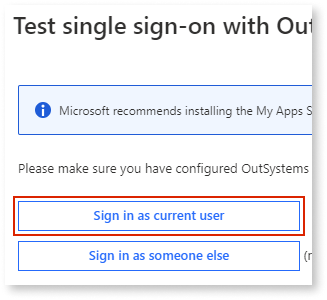

1. Enter the credentials of a user you previously associated with the Azure application in [Assign user or group to Azure application](#assign-user-azure-app).

If the authentication is **successful**, the browser redirects you back to the Users app and you get an error message about not having permissions to view the screen.

This happens because the user you used for testing Azure AD authentication doesn't have any assigned OutSystems roles yet. You need to grant user roles in the Users app after the user logs in for the first time using Azure AD authentication, so that the user already exists in the OutSystems database.

If the authentication is unsuccessful, double-check your configuration settings.

### Configure user roles in the Users app

You're currently logged in with a user account that doesn't have the required permissions to grant roles to end users. You must first log in with an administrator account.

Do the following:

1. Log out of the Users app, since the current user doesn't have the required role.

1. Open the following URL:

    `https://<your_server_name>/Users/Login.aspx`

    Using this specific URL allows you to log in to the Users app skipping the external authentication method that's currently configured (Azure AD).

1. Log in with an administrator account.

You now have permissions to grant OutSystems roles to users. Check [Grant a role to an end user](../end-user-roles.md#grant-role) for detailed instructions.

### Configure group roles 

If you want to leverage the AD groups that exist in Azure AD to assign OutSystems roles and control the permissions in your OutSystems apps, you first need to configure AD so that the security roles are sent in the SAML response. 

Follow the procedure below:

1. Access the Azure AD single sign-on configurations.
1. Add the security groups as a Group Claim.
    
    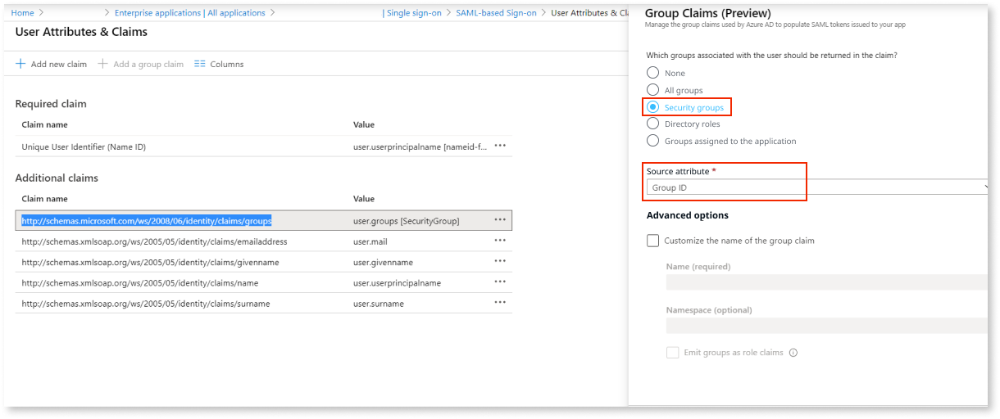

1. Access the configurations on the Users app and make sure that the Group information is mapped according to the response received from Azure AD.

    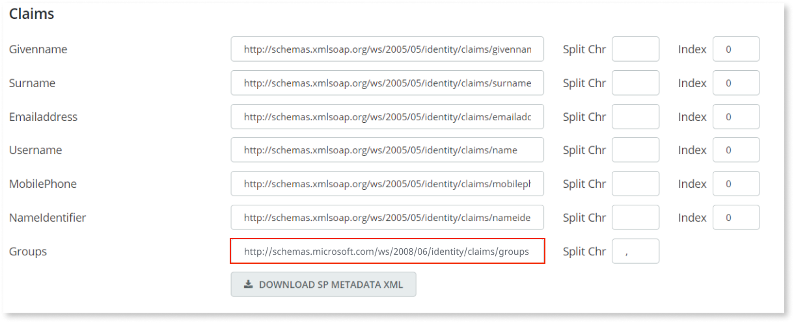
    
This should enable Azure AD to send the group ids (object id in Azure), which is created upon user authentication (if they don't already exist).

Because group names in Azure AD are not unique, they cannot be sent for mapping. However, a relevant description can be added to the group name in the Users app.

Azure AD limits the number of groups it will emit in a token to 150 for SAML assertions. The [IdP Forge component](https://www.outsystems.com/forge/component-overview/599/idp) can be used for installations with more than 150 groups. 

After having the groups synchronized you should be able to access the OutSystems groups in the Users app and assign the desired OutSystems roles accordingly.

### Perform some final checks and configurations

Just like when using SAML 2.0 authentication, you must perform these two final tasks:

1. [Check if the authentication flows of your OutSystems application already support external authentication](configure-saml.md#change-auth-flows). The instructions provided for the SAML 2.0 authentication method are also applicable to Azure AD authentication.

1. If you're using Azure AD authentication in **Reactive Web Apps**, [enable the "Single Sign-On Between App Types" setting](configure-saml.md#enable-sso-between-app-types) in Service Center.

## Troubleshooting Azure AD authentication issues

Since the Azure AD authentication method is very similar to the SAML 2.0 authentication method, you can troubleshoot them in the same way:

* Check the [SAML Message Logs page](configure-saml.md#logs) for detailed information on Azure AD messages exchanged for end user authentication.

* Use the same method for [accessing the Users application when you're locked out](configure-saml.md#locked-access) due to incorrect configuration settings in end user authentication.

## Renew Azure AD Certificate

To renew a SAML signing certificate that is about to expire, complete the following steps: 

1. Create the new signing certificate or upload your own in **Azure AD Admin Center**.
1. Update the **Certificate** field on the Users page.
1. Set the new certificate as **Active** in **Azure AD Admin Center**.

For more information about renewing SAML signing certificates, refer to the [Tutorial: Manage certificates for federated single sign-on](https://learn.microsoft.com/en-us/entra/identity/enterprise-apps/tutorial-manage-certificates-for-federated-single-sign-on#create-a-new-certificate). 

Restarting the service is unnecessary once you renew the SAML signing certificate.

When updating a SAML signing certificate, there is always some downtime. This happens because there are two simultaneously **active** signing certificates. From the moment you upload the new certificate to the Users page and set the new certificate as **Active** in **Azure AD Admin Center**, there will be a short period when SAML requests fail due to an invalid signature. However, you can significantly minimize downtime if you already have the new certificate in **Azure AD Admin Center**. This only applies if you upload your own certificate. If you use an Azure AD certificate, this does not apply as you create the certificate in **Azure AD Admin Center**.

