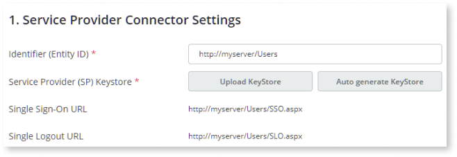
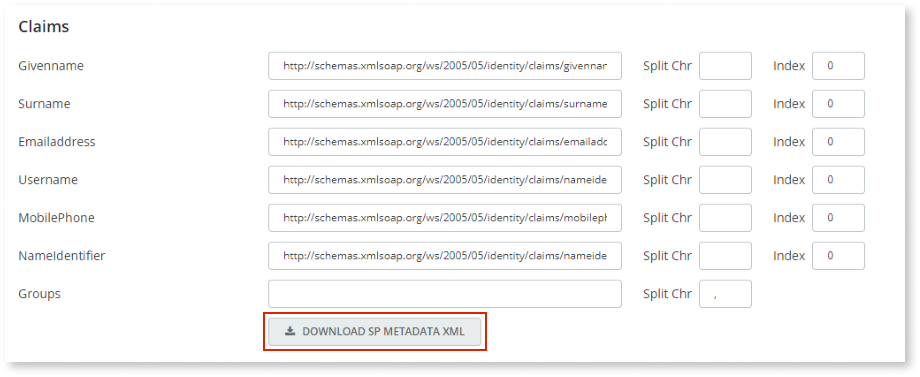
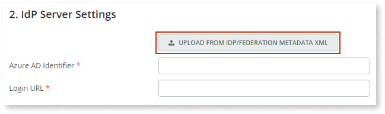
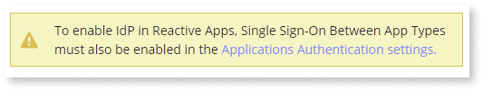
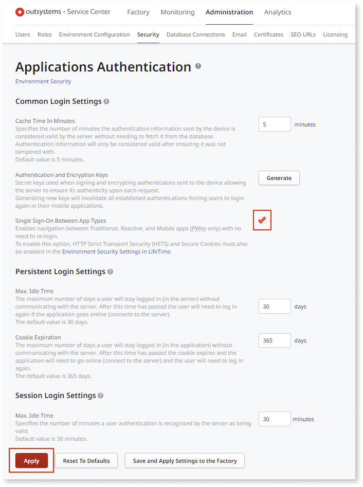
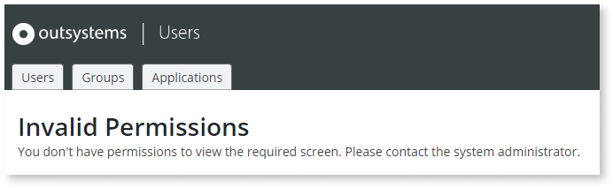

# Configure Microsoft Entra authentication

Applies only to Traditional Web Apps and Reactive Web Apps.

## Prerequisites

Requires Platform Server Release Jul.2019 CP2 (11.0.542.0) or later.

## Configuring Microsoft Entra

The configuration of the Microsoft Entra authentication method is quite similar to the [SAML 2.0](configure-saml.md) one, but in this case, the **Claims** settings are already filled in with Microsoft Entra default values.

Additionally, you can fill in the configuration settings for Microsoft Entra authentication by uploading/downloading files with metadata, which helps avoid human errors.,

Refer to the [limitations of the current SAML 2.0 implementation](configure-saml.md#current-limitations), which also apply to the Microsoft Entra authentication method.

To configure Microsoft Entra authentication you must take these general steps:

1. [Configure general Microsoft Entra settings in the Users app](#configure-general-microsoft-entra-settings-in-the-users-app)
1. [Create and configure an application in Microsoft Entra admin center](#create-and-configure-application-in-microsoft-entra-admin-center)
1. [Finish configuration in the Users app](#finish-configuration-in-the-users-app)
1. [Assign user or group to Microsoft Entra application](#assign-user-or-group-to-microsoft-entra-application--assign-user-entra-app-)
1. [Test your configuration](#test-your-configuration)
1. [Configure user roles in the Users app](#configure-user-roles-in-the-users-app)
1. [Perform some final checks and configurations](#perform-some-final-checks-and-configurations)

The following sections describe these steps in detail.

### Configure general Microsoft Entra settings in the Users app

1. In the [Users application](../accessing-users.md), click **Configure Authentication** in the right sidebar.

1. From the **Authentication** dropdown, choose `Microsoft Entra`.

1. Check the settings values in **Service Provider Connector Settings**.  

    
        
    OutSystems provides default values for the required options and also an auto-generated keystore.

1. Download the Service Provider metadata file by clicking **Download SP Metadata XML**.

    

### Create  and configure an application in Microsoft Entra

1. From the [Microsoft Entra admin center](https://entra.microsoft.com/#home), create a new OutSystems Microsoft Entra ID enterprise application.

1. Configure SAML as the single sign-on method. 

    **Note**:  If you only want to accept signed login responses, set the **Signing Option** to **Sign SAML response and assertion**.

1. Upload the XML metadata file you downloaded from the Users app. 

For more information on how to create a new application in Microsoft Entra, refer to [Add an enterprise application](https://learn.microsoft.com/en-us/entra/identity/enterprise-apps/add-application-portal#add-an-enterprise-application)

### Finish configuration in the Users app

Back in the Users app:

1. Locate the **IdP Server Settings** section in the **Configure Authentication** page.

1. Click **Upload from IdP/Federation Metadata XML**.

    

1. Select the Federation Metadata XML file you downloaded from Microsoft Entra.

1. Click **Save**.

    **Note**: A warning message about enabling SSO between app types is displayed. **Enabling this functionality is optional.**

    

    To enable IdP in Reactive Apps, do the following:
    
    1. Go to the Service Center management console of your OutSystems environment.

    1. Go to the **Administration** section and select the **Security** tab.

    1. In the **Common Login** section, select the **Single Sign-On Between App Types** checkbox, and click **Apply**.

        

    For more information about application authentication, see [Configure App Authentication](../../../security/configure-authentication.md). 

### Assign user or group to Microsoft Entra application { #assign-user-entra-app }

In the Microsoft Entra admin center, assign a user or a group to the Microsoft Entra application you created.

For more information about assigning groups to an app, refer to  [Manage users and groups assignment to an application](https://docs.microsoft.com/en-us/azure/active-directory/manage-apps/assign-user-or-group-access-portal#assign-users-or-groups-to-an-app-via-the-azure-portal).

### Test your configuration

In the Microsoft Entra admin center, navigate back to your application's single sign-on settings and test the connection. 

For information on how to test the configuration, refer to [Test SSO](https://learn.microsoft.com/en-us/entra/identity/saas-apps/outsystems-tutorial#test-sso). If the authentication is **successful**, the browser redirects you back to the Users app and you get an error message about not having permissions to view the screen.

This happens because the user you used for testing Microsoft Entra authentication doesn't have any assigned OutSystems roles yet. You need to grant user roles in the Users app after the user logs in for the first time using Microsoft Entra authentication, so that the user already exists in the OutSystems database.

If the authentication is unsuccessful, double-check your configuration settings.

### Configure user roles in the Users app

You're currently logged in with a user account that doesn't have the required permissions to grant roles to end users. You must first log in with an administrator account.

Do the following:

1. Log out of the Users app, since the current user doesn't have the required role.

1. Open the following URL:

    `https://<your_server_name>/Users/Login.aspx`

    Using this specific URL allows you to log in to the Users app skipping the external authentication method that's currently configured (Microsoft Entra).

1. Log in with an administrator account.

You now have the permissions to grant OutSystems roles to users. Refer to [Grant a role to an end user](../end-user-roles.md#grant-role) for detailed instructions.

### Configure group roles 

If you want to leverage the groups that exist in Microsoft Entra to assign OutSystems roles and control the permissions in your OutSystems apps, you first need to configure Microft Entra so that the security roles are sent in the SAML response. 

For more information on how to configure group roles, refer to [Add group claims to tokens for SAML applications using SSO configuration](https://learn.microsoft.com/en-us/entra/identity/hybrid/connect/how-to-connect-fed-group-claims#add-group-claims-to-tokens-for-saml-applications-using-sso-configuration).

This should enable Microsoft Entra to send the group IDs (object ID in Microsoft Entra), which is created upon user authentication (if they don't already exist).

Because group names in Microsoft Entra are not unique, they cannot be sent for mapping. However, a relevant description can be added to the group name in the Users app.

Microsoft Entra limits the number of groups it will emit in a token to 150 for SAML assertions. The [IdP Forge component](https://www.outsystems.com/forge/component-overview/599/idp) can be used for installations with more than 150 groups. 

After having the groups synchronized you should be able to access the OutSystems groups in the Users app and assign the desired OutSystems roles accordingly.

### Perform some final checks and configurations

Just like when using SAML 2.0 authentication, you must perform these two final tasks:

1. [Check if the authentication flows of your OutSystems application already support external authentication](configure-saml.md#change-auth-flows). The instructions provided for the SAML 2.0 authentication method are also applicable to Microsoft Entra authentication.

1. If you're using Microsoft Entra authentication in **Reactive Web Apps**, [enable the "Single Sign-On Between App Types" setting](configure-saml.md#enable-sso-between-app-types) in Service Center.

## Troubleshooting Microsoft Entra authentication issues

Since the Microsoft Entra authentication method is very similar to the SAML 2.0 authentication method, you can troubleshoot them in the same way:

* Check the [SAML Message Logs page](configure-saml.md#logs) for detailed information on Microsoft Entra messages exchanged for end user authentication.

* Use the same method for [accessing the Users application when you're locked out](configure-saml.md#locked-access) due to incorrect configuration settings in end user authentication.

## Renew Microsoft Entra certificate

To renew a SAML signing certificate that is about to expire, complete the following steps: 

1. Create the new signing certificate or upload your own in **Microsoft Entra admin center**.

1. Update the **Certificate** field on the Users page.

1. Set the new certificate as **Active** in **Microsoft Entra admin center**.

For more information about renewing SAML signing certificates, refer to the [Tutorial: Manage certificates for federated single sign-on](https://learn.microsoft.com/en-us/entra/identity/enterprise-apps/tutorial-manage-certificates-for-federated-single-sign-on#create-a-new-certificate). 

Restarting the service is unnecessary once you renew the SAML signing certificate.

When updating a SAML signing certificate, there is always some downtime. This happens because there are two simultaneously **active** signing certificates. From the moment you upload the new certificate to the Users page and set the new certificate as **Active** in **Microsoft admin center**, there will be a short period when SAML requests fail due to an invalid signature. However, you can significantly minimize downtime if you already have the new certificate in **Microsoft Entra admin center**. This only applies if you upload your own certificate. If you use an Microsoft Entra certificate, this does not apply as you create the certificate in **Microsoft Entra admin center**.

