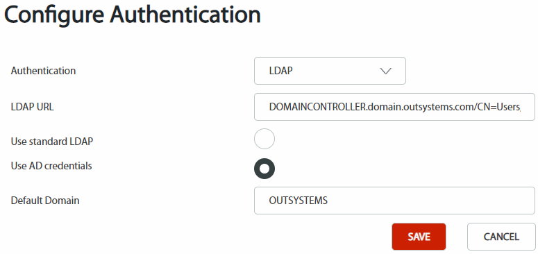
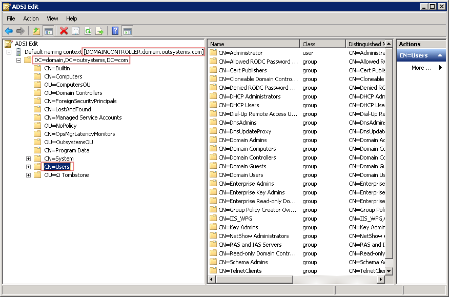
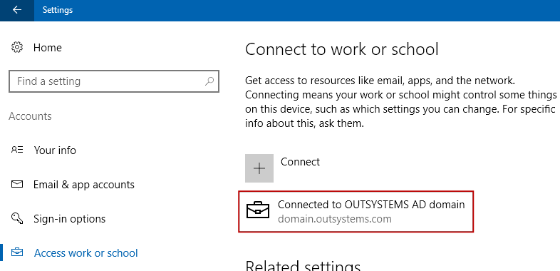

# Configure LDAP Authentication

There are two ways of configuring LDAP (Lightweight Directory Access Protocol) for authenticating end users of your OutSystems applications:

Use LDAP protocol to connect to Active Directory (AD)
:   Used when you have an Active Directory infrastructure that you want to connect to, but the OutSystems front-end servers can't be part of the Active Directory domain (for example, in cloud infrastructures). Use this option for a simplified configuration process. Note that the front-end servers must be able to access the Active Directory domain controller.

Use standard LDAP
:   Used when you are connecting to a non-AD infrastructure like OpenLDAP.

## Configure LDAP authentication with Active Directory

To configure the OutSystems end user authentication for LDAP with Active Directory do the following:

1. In the [Users application](<../accessing-users.md>), click "Configure Authentication" in the sidebar.

1. Choose `LDAP` in the **Authentication** drop-down list.

1. In the **LDAP URL** field, enter the URL in the following format:  

    `ldap://<LDAP_Server>:<Port>/<Base_Distinguished_Name>`

    Check [Obtain Active Directory configuration information](<#obtain-ad-info>) for more information on how you can build this field value.

    _Notes:_  
    To use secure LDAP, use the protocol `ldaps://` instead.  
    You can omit the `ldap://` prefix in the URL, but must include the `ldaps://` prefix when using secure LDAP.

1. Select **Use AD credentials**.

    

1. Optionally, in the **Default Domain** field, enter the domain where end users are going to be authenticated.

1. Test your configurations by entering your credentials in the respective fields for testing:

### Example

Consider the following example which uses the ADSI Edit tool, included in [Windows Remote Server Administration Tools (RSAT)](<https://support.microsoft.com/en-us/help/2693643/remote-server-administration-tools-rsat-for-windows-operating-systems>), to explore the Active Directory hierarchy tree.

In this case the domain controller address (used as the server address) is `DOMAINCONTROLLER.domain.outsystems.com`, configured in the default port, and the Distinguished Name (DN) of the displayed root LDAP node is `DC=domain,DC=outsystems,DC=com`.

To authenticate end users configured under the `CN=Users` LDAP node, use the following Base Distinguished Name in the LDAP URL field:

`CN=Users,DC=domain,DC=outsystems,DC=com`

Note that Distinguished Names are read from right (root) to left (leaf). The final value of the **LDAP URL** field would be:

`ldap://DOMAINCONTROLLER.domain.outsystems.com/CN=Users,DC=domain,DC=outsystems,DC=com`

## Configure standard LDAP authentication

To configure OutSystems end user authentication with standard LDAP (that is, LDAP not associated with Active Directory) do the following:

1. Choose `LDAP` in the **Authentication** drop-down list.

1. In the **LDAP URL** field, enter the URL in the following format:

    `ldap://<LDAP_Server>:<Port>/<Base_Distinguished_Name>`.

    _Notes:_  
    To use secure LDAP, use the `ldaps://` URL scheme instead.  
    You can omit the `ldap://` prefix in the URL, but must include the `ldaps://` prefix when using secure LDAP.

1. Select **Use Standard LDAP**.

1. In **User Search Filter** write the filter to use when searching users. The `{0}` placeholder denotes the username. If there's no query defined, the username is sent to the LDAP server exactly as provided.

    

    OutSystems provides a few search filter examples in the help text below the **User Search Filter** field. For more information on search filters check the [Search Filter Syntax](<https://docs.microsoft.com/en-us/windows/desktop/adsi/search-filter-syntax>) in Microsoft's documentation.

    You can use a tool like Microsoft's [Active Directory Explorer](<https://docs.microsoft.com/en-us/sysinternals/downloads/adexplorer>) to explore the information stored in your LDAP provider, and to build and test your search filters. Note that if your LDAP server doesn't allow unauthenticated operations, you need to provide user credentials for a user with permissions to perform search operations.

    **Note:** Some LDAP servers, especially non-AD ones, only allow you to login with the **LDAP Distinguished Name (DN)** of the user. Using a search filter allows the platform to take an OutSystems username and search for its distinguished name in the LDAP server before attempting to log in the user.

1. Test your configurations by entering your credentials in the respective fields for testing:

## Obtain Active Directory configuration information { #obtain-ad-info }

### Using a computer which is part of the Active Directory

If you're using a computer that's **part of the Active Directory domain** used for authenticating end users, you can use tools available out-of-the-box in Windows to find the necessary information (domain name, Base Distinguished Name and domain controller address) to build the **LDAP URL** field value.

1. **Obtain your current domain name.**

    If you're using Windows 8 or higher, open the **Settings** app and then go to Accounts > "Access work or school". There's an indication telling you that you're connected to an Active Directory domain and what's the domain name:

    

    If using Windows 7, open **Control Panel**, go to **System and Security** and click on System. The current domain is shown in the "Computer name, domain and workgroup settings".

    

1. **Get the Base Distinguished Name from the domain name.**

    Apply the following transformation to build it from the domain name:

    1. Replace any `"."` (dot) character in the domain address with a `","` (comma) character.  
    1. Add `DC=` before each part of the address.

    For example, `domain.outsystems.com` becomes `DC=domain,DC=outsystems,DC=com`.

    _Tip:_ You can narrow down the LDAP search by providing a more specific Base Distinguished Name (BDN). In the following example, there's an additional part in the BDN to authenticate only the users configured under the `CN=Users` LDAP node:

    `CN=Users,DC=domain,DC=outsystems,DC=com`

1. **Obtain the LDAP server address (in this case, the AD Domain Controller server address).**

    There are several ways of getting this information. Here's two possible ways:

    **A)** Open a command-line console and run the `nslookup` command. Enter the following commands at the `>` prompt, replacing `DOMAINNAME.mycompany.com` with your specific domain name:

    `set type=all`  
    `_ldap._tcp.dc._msdcs.DOMAINNAME.mycompany.com`

    The second command outputs some information. Search for any lines in the form:

    `svr hostname   = SERVERNAME.mycompany.com`

    These are addresses for Active Directory domain controllers. Choose one of the server addresses to include in the **LDAP URL** field.  
    For more information check [How to verify that SRV DNS records have been created for a domain controller](<https://support.microsoft.com/en-us/help/816587/how-to-verify-that-srv-dns-records-have-been-created-for-a-domain-cont>) in Microsoft's documentation.

    _Tip:_ If you get more than one address, check with your network administrator which is the most appropriate one. 

    **B)** Alternatively, open a command-line console and run the following command, replacing `DOMAINNAME.mycompany.com` with your own domain name:

    `nltest /dclist:DOMAINNAME.mycompany.com`

    You should get a list of Active Directory domain controller addresses (one or more entries), along with other information in each line. Choose one of the server addresses to include in the **LDAP URL** field.  

    _Tip:_ If you get more than one address, check with your network administrator which is the most appropriate one.

### Using a computer outside of the Active Directory

If you are using a computer that's **not part of the Active Directory domain** used for authenticating end users, ask your network administrator for the correct LDAP server address and Base Distinguished Name.
