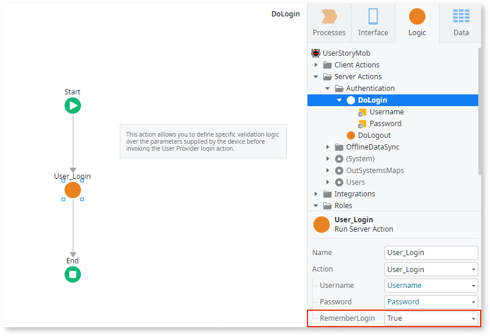

# Persistent Login

When authenticating the end users, you can choose to use a persistent login. After logging into the application for the first time, the end user will not have to provide the credentials again, unless:

* The end user explicitly logs out through the [User_Logout](<../../../ref/apis/auto/users-api.final.md#User_Logout>) action.
* The persistent login times out because the end user does not access the application for a certain amount of days.

In Web Applications, persistent login only works if the end user has enabled the use of cookies in the browser. It keeps independent sessions in different browsers allowing end users to have different persistent login sessions for the same application in different browsers and devices.

To use persistent login, the `RememberLogin` input from the [User_Login](<../../../ref/apis/auto/users-api.final.md#User_Login>) action must be set to `True`.

The default duration of a persistent login session is 10 days in Traditional Web apps, and 30 days in Reactive Web and Mobile apps.  
For Traditional Web apps you can customize this duration by using the supported Forge Component [Factory Configuration](https://www.outsystems.com/forge/component/25/factory-configuration/) and changing the `Remember Login(days)` parameter in the Platform Configurations Tab.  
For Reactive and Mobile apps you can customize this duration in Service Center by [changing the `Max Idle Time` parameter](<../../../security/configure-authentication.md#configure-app-authentication-settings>) for persistent authentication.

For example, when you create a mobile application that uses one of the built-in [Application Templates](<../../../building-apps/application-templates/intro.md>), the use of persistent login is the default.

