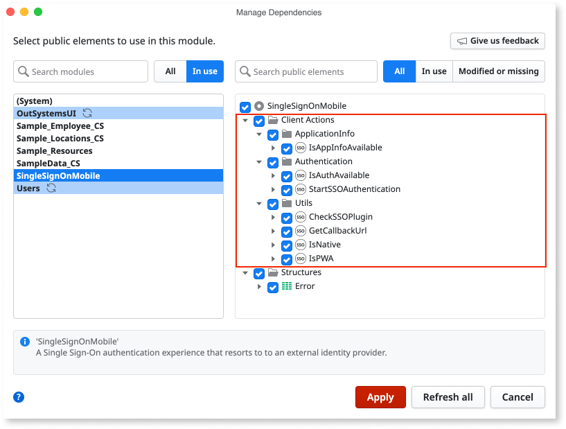
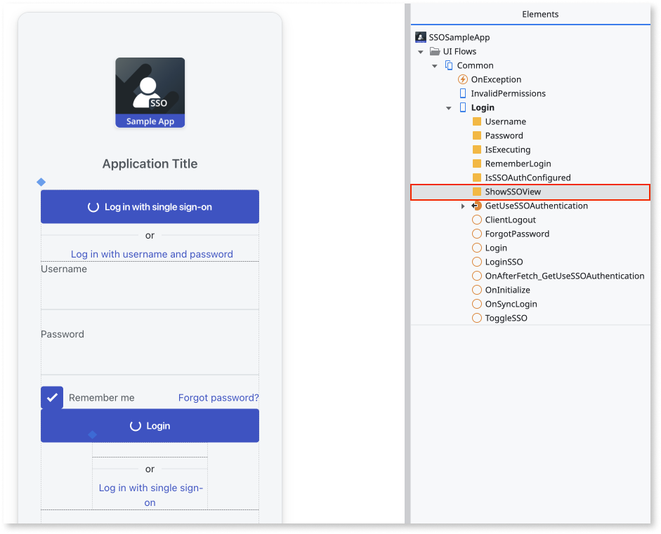
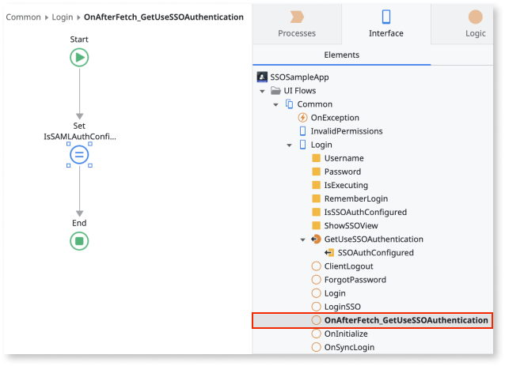
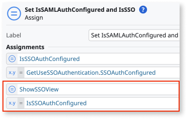
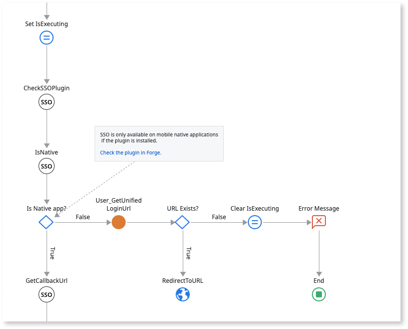
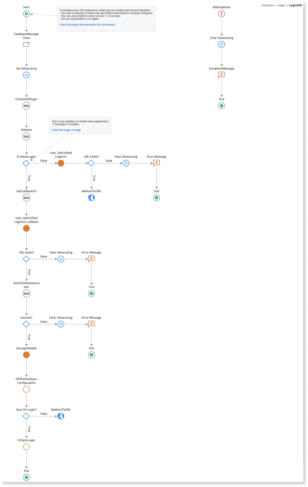
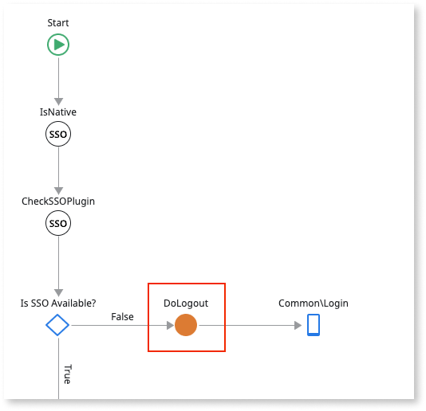
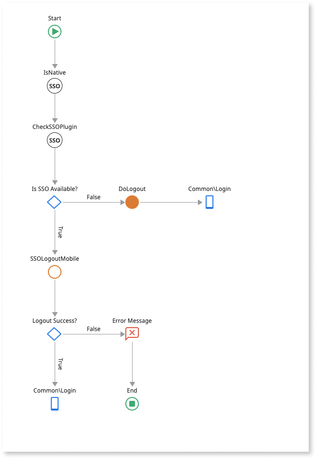

# Updating the login and logout flows of your Mobile App to support SAML 2.0

## Prerequisites

Support for Identity Providers that use SAML Authentication is part of the Login template for OutSystems apps that comply with the following prerequisites:

* Platform Server version 11.20 or later
* MABS 9.0 or later
* It's a new app

For apps that comply with these prerequisites, to enable single sign-on, continue to the [Configuration and activation](#configuration-and-activation) step.

For new apps that don’t comply with the two first prerequisites and are using a Platform Server version 11.18 or later, you must perform the [Configuration and activation](#configuration-and-activation) step and the [Updating the login and logout flows](#updating-the-login-and-logout-flows) step.

## Configuration and activation

To enable single sign-on on your Mobile App, you must configure an identity provider with SAML 2.0 Authentication and activate single sign-on between app types settings.

To configure SAML 2.0 and add your identity provider, see the  [Configure SAML 2.0 Authentication](../configure-saml.md) documentation.

To activate the Single Sign-On Between App Types setting in Service Center, see the [Configure App Authentication](../../../../security/configure-authentication.md) documentation.

## Updating the login and logout flows

1. [Install the **Single Sign-On Mobile** plugin and add its dependencies in the home module of your app.](#install-the-single-sign-on-mobile-plugin)

1. [**Create UI** for an SSO Mobile experience.](#create-a-ui-for-an-sso-mobile-experience)

1. [Update the OnClick Client Action for the **SSO** Login button.](#update-the-onclick-action-for-the-loginsso-button)

1. [Update the **UserInfo Block** to manage the logout flow.](#update-the-userinfo-block-to-manage-the-logout-flow)

### Install the Single Sign-On Mobile plugin

Go to Forge and install the [**Single Sign-On Mobile**](https://www.outsystems.com/forge/component-overview/14284/single-sign-on-mobile) plugin. After installing the plugin in your environment, you must manage the dependencies on your target project so that you can access the SSO capabilities enclosed in this plugin. To manage the dependencies, follow these steps:

1. In Service Studio, open the home module of your mobile app.

1. Open the **Manage Dependencies** window.

1. Select **Single Sign-On Mobile** in the producer modules list.

1. Select all Client Actions as dependencies:

    * ApplicationInfo folder:

        * IsAppInfoAvailable

    * Authentication folder:

        * IsAuthAvailable

        * StartSSOAuthentication

    * Utils folder:

        * CheckSSOPlugin

        * GetCallbackUrl

        * IsNative

        * IsPWA

         

1. Click **Apply**.

Verify you are working on a Platform Server version 11.18 or later as you will need to use the following server actions available on the Users folder:

* UseSAMLAuthentication
* User_GetUnifiedLoginUrl
* User_GetUnifiedLogoutUrl
* User_Login_Mobile
* User_Logout_Mobile

If you're using Platform Server version 11.18 or later, and don’t see some of these server actions, make sure you have fetched all dependencies from Users.

### Create a UI for an SSO Mobile experience

In this step we suggest you adapt your app’s user interface to reflect the SSO authentication option for your users. The following is an example where the user can toggle between an SSO authentication and a more conventional user name/password authentication, using a local variable called **ShowSSOView**.



To use a Data Action to check if SSO is available and adapt the screen accordingly, follow these steps:

1. Create the a new Data action **GetUserSSOAuthentication** and call the **UseSAMLAuthentication** server action.

    

1. Set an action for the **OnAfterFetch** event to get the result of the server action and assign it to **IsSSOAuthConfigured**.

    

1. Assign **ShowSSOView** to the value of **IsSSOAuthConfigured**.

    

### Update the **OnClick** action for the **LoginSSO** button

For SSO authentication in both PWA and Native applications, create logic to update the OnClick action for the LoginSSO button by following these steps:

1. Add the **IsNative** action to verify if you are running a PWA or Native application:

    1. If you’re running a PWA application, add the **User_GetUnifiedLoginUrl** server action and verify if a URL was returned. If it was, redirect to that URL.

        

    1. If you’re running a native application, see step 2.

1. Add the **IsNative** client action and upon checking that it returns TRUE:

    1. Run the **GetCallbackURL** client action.
        This action returns a URL.

    1. Add the **User_GetUnifiedLoginURL** server action, setting its **OriginalUrl** parameter as:

    ``GetCallbackUrl.Url (the output of the GetCallbackURL action)``

    1. Verify that the URL exists. You can use the following condition:

        ```
        Length(UserGetUnifiedLoginURL2.Url) > 0
        ```

    1. If the URL exists add the **StartSSOAuthentication** client action and verify if it runs successfully.

    1. If so, create a new **DoLoginMobile** server action with the input parameter **Token** and add it to the logic flow, passing the value of the parameter **Token** (output of StartSSOAuthentication).

    1. In this new server action, call **User_Login_Mobile** and pass the **Token** value.
        **Note**: Remember that the login property of the **User_Login_Mobile** server action must be set to TRUE to allow the session to persist.

    1. Finally, use the **OfflineDataSyncConfiguration** client action and if it returns **OfflineDataSyncConfiguration.SyncOnLogin == True**, then add the **SyncOnLogin** client action. This is an action available on the default Login screen of the Common UI flow.

The following is an overview of the complete logic:



### Update the **UserInfo** block to manage the logout flow

In this step you update the **ClientLogout** client action of the **UserInfo block**.

1. Add the **IsNative** action to verify if you are running a PWA or Native application.

    1. If it’s not a Native application, add the **DoLogout** server action and redirect the application to the Login screen.

        

    1. If you’re running a native application, see step 2.

1. Add the **IsNative** client action and upon checking that it returns TRUE:

    1. Create a new **SSOLogoutMobile** client action and add it to the flow. Inside this new client action:

        1. Call User_IsExternaluser and if User_IsExternalUser.IsExternal is TRUE, run DoLogout server action;

        1. If User_IsExternalUser.IsExternal is FALSE, run the GetCallbackURL client action. This action will return a URL;

        1. Add the User_GetUnifiedLogoutURL server action, setting the OriginalUrl parameter as: GetCallbackUrl.Url

        1. Verify that the URL exists. You can use the condition:

            ```
              Length(UserGetUnifiedLoginURL2.Url) > 0
            ```

        1. If the URL exists add the StartSSOAuthentication client action and verify if it runs successfully;

        1. If so, run the User_Logout_Mobile server action.

    1. Verify if the Logout was successful and if so redirect the application to the Login Screen.

The following is an overview of the complete logic:


