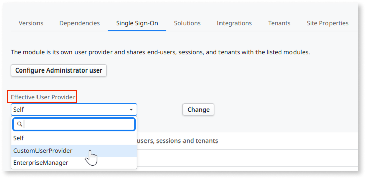

# Single sign-on

By default, OutSystems provides single sign-on capabilities for apps that have cookies enabled. After users are authenticated in one application, they can access all other applications without having to log in again.

**Note**: For Traditional Web Apps, you must log in again once the session times out. For more information, see [Troubleshoot SSO sessions for Traditional Web Apps](https://success.outsystems.com/support/troubleshooting/application_development/troubleshoot_sso_sessions_for_traditional_web_apps/).

## Using single sign-on

All created applications have single sign-on capabilities by default, because their User Provider module is set to **Users**. You can also [use a different User Provider](#different-user-provider).

In a Single Sign-On scenario, check out your unified modules in Service Center: edit a module and select the **Single Sign-On** tab to see the User Provider module and User Subscriber modules.

For the single sign-on to work throughout different app types, you also need to activate it in the security settings of your environment. See [Configure app authentication settings](../../../security/configure-authentication.md) and the instructions about SSO.

## Sharing users

The User Provider module contains an entity that stores the end user information. This entity is set with the `Public` property to `Yes` so that it can be reused by User Subscriber modules.

To authenticate an end user, you should check if the provided credentials match a record in the entity of the User Provider module.

## Sharing sessions

The session is created the first time the end user accesses the server to request a page of any unified module. However, since the session is shared by the unified modules, the first `On Session Start` action to be invoked is the one of the User Provider module. Only then, if there is an On Session Start action in the requested module, it is invoked.

From then on, the On Session Start actions of the User Subscriber modules are invoked the first time each module is accessed via a screen, web block, or public action.

In a Single Sign-On situation, there is only one session shared by the unified modules which consists of all the session variables defined in these modules. If you need to reference or change a session variable from another module, you must use public actions, because there is no other way to add and remove session references between modules.

Note that sharing session variables through public actions only works for unified modules of the same set. Otherwise, as you will have different sessions, you will refer to different variables from each module.

## Using a different user provider {#different-user-provider}

By default, all created applications have **Users** as their user provider. If you want to use a different user provider:

* Identify the **User Provider module** which provides the end users and sessions to other modules. Open the module in Service Studio, set the module's property **Is User Provider** to **Yes**, and publish the module.

* Identify the User Subscriber modules that share the end users and sessions with the User Provider module. Open each one of the subscriber modules in Service Studio, and select the **User Provider module** in the drop-down list of the User Provider module property.

For modules configured as user provider, you can change its **Effective User Provider** module in the Service Center console - the default user provider is the one set at design time in Service Studio.

Changing the **effective user provider** of a user provider module affects all the subscriber modules - their effective user provider will also be the selected **Effective User Provider**.
