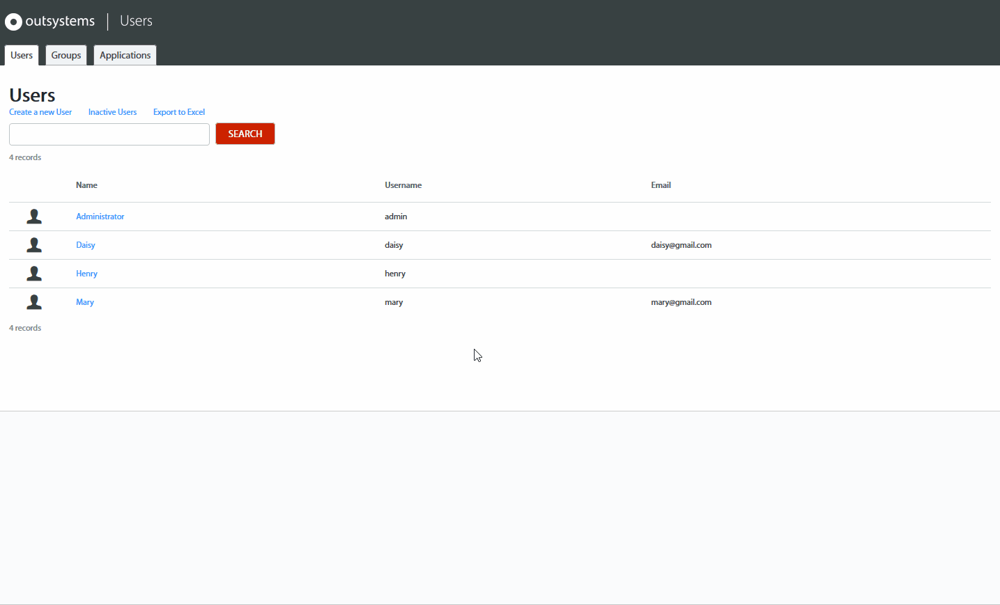
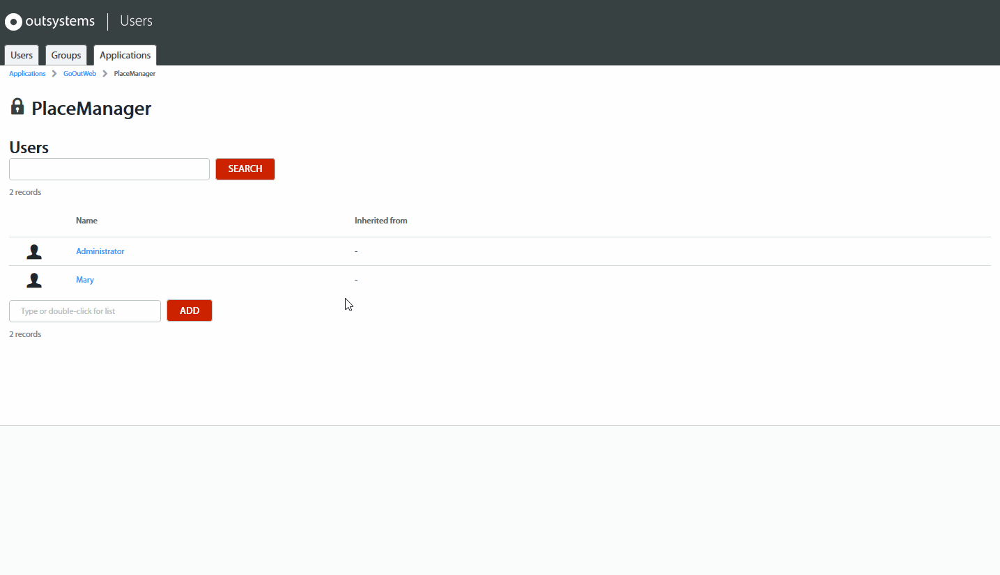
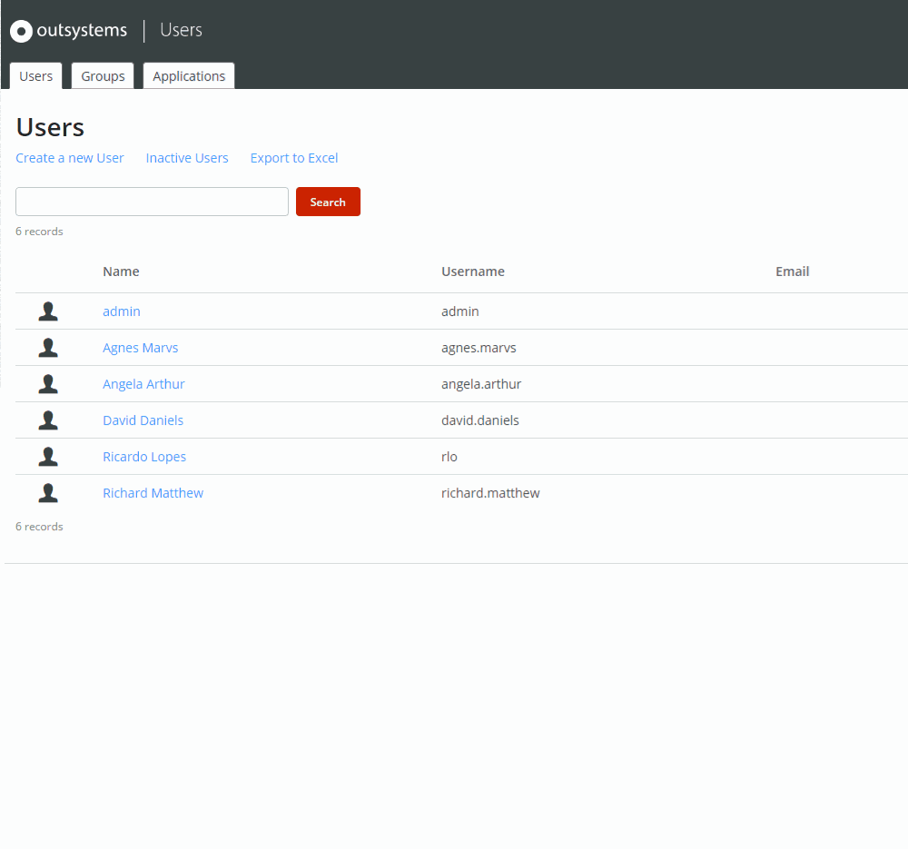

# Grant and Revoke End User Roles

User roles allow you to grant access to applications and specific screens or tasks. You create roles during development in Service Studio. When you deploy the application, the roles are automatically available in the Users application. [Learn more about roles definition](../user-roles/intro.md).

## Grant a role to an end user { #grant-role }

To grant a role to an end user:

1. In the [Users application](accessing-users.md), click the **Applications** tab to view a list of all the applications in the environment.

1. Click the application name to open the application detail page. You can view the list of roles that exist in the application and a list of the users who have access to the application, based on the roles granted to them.

1. In the application detail page, click a role to view the list of end users who currently have the role.

1. Under the list of Users, in the input box, type the required username.

1. Click on **Add** to grant the role to the end user.

## Revoke a role from an end user { #revoke-role }

To revoke a role from an end user:

1. In the Users application, click the **Applications** tab to view a list of all the applications in the environment.

1. Click the application name to open the application detail page.

1. In the application detail page, click the required role to view the list of end users who currently have the role.

1. Type the required username in the search box above the list of users and click **Search**.

1. Hover over the end user in the list and click on **Remove** to revoke the role from the end user.

Alternatively, you can grant or revoke a role from a user in the user details page. In this page you can view the list of all the roles granted to the user.

