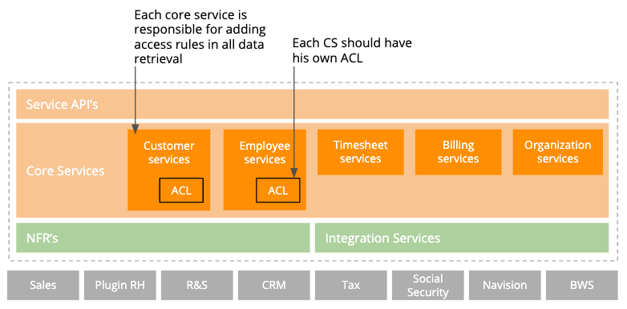
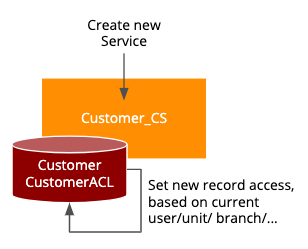
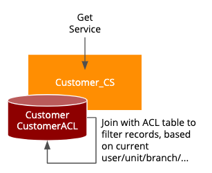
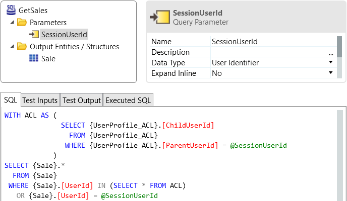
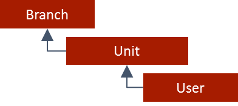
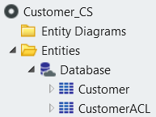
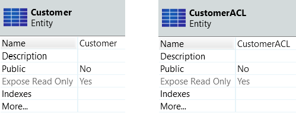
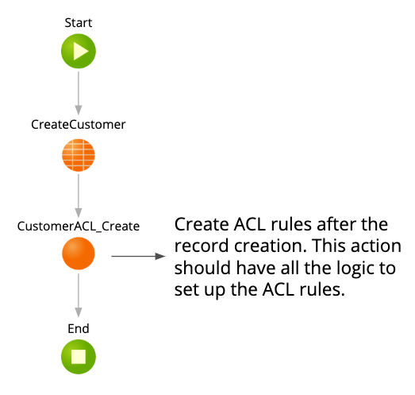
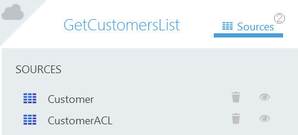
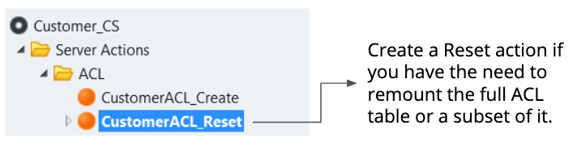

# Use Access Control List to set up permission-based access to data

## What is Access Control List?

An access control list (ACL) is a list of permissions attached to an object. The ACL stores what objects are granted to which users or group of users. Common uses of ACL are access to financial data to specific user profiles, data access based on user’s unit/branch or hierarchical accesses.

In OutSystems, the recommendation is to use [OutSystems user roles](https://success.outsystems.com/Documentation/11/Developing_an_Application/Secure_the_Application/User_Roles) to restrict or allow end users to access specific screens and operations of your application.
However, user roles shouldn’t be used if you want to set up a hierarchical permission control to your application data. To guarantee a scalable and dynamic data segregation per business requirement the recommendation is to build ACL.

For Core Services that require ACL, we propose a model where each Core Service module is responsible for setting the data access rules.

The Core Services modules must isolate as much as possible the ACL logic in data retrieval methods (e.g., Web Service APIs), but for entities that are public and used outside the Core Service module, developers must know that the access to those tables need to be subject to ACL control.

For that reason, we advise that the objects (Entities) with an associated ACL should be tracked on an **ACL tracking list**, like the following:

|Core Service Module|Entity|ACL Entity|
|---|---|---|
|Customer_CS|Customer|CustomerACL|
|Employee_CS|Employee|EmployeeACL|
|...|...|...|

## ACL Patterns

### Creating new ACL Records

When creating data, if a good module isolation is being made, it should be handled by the proper Core Service who will be responsible by setting up the ACL, accordingly to the rules in place. For instance, when creating a Customer, read/write accesses can be given based on current Unit, Branch, etc.

### Accessing new ACL Records

Accessing data should consider the access rules stored in the ACL, so when retrieving data from a given Entity, a join to the proper ACL entity should be made. This way, the result set will have only data compliant with the ACL rules.

#### Example

Let’s see a possible approach on querying data controlled by an ACL.
With the below query, we are able to get a hierarchical view over the sales of the user’s team. While a Sales Account can only see its own sales, the Sales Director (parent in the hierarchy) is able to see the whole team sales.

* ACL provides, per user, the full list of users belonging to their hierarchy

* On every user profile update, recreate the ACL list

* Abstracts the original API(s), matching to internal structures and concepts (e.g. composing a customer concept with complementary information from different systems)

This example provides a runtime accelerator to fetch hierarchical results.

## Performance

To improve performance of ACL rules, access control should be restricted to critical entities on top of a hierarchy, to avoid too much overhead on queries and code maintenance.

For example, if access control is set at Branch level, it is not necessary to do it on Unit or User level.

## Best Practices

For Core Services where ACL is applicable, some conventions/best practices should be followed:

* ACL tables should have the same name than the Entity, followed by a suffix “ACL”.

    

* The ACL table should have the same “Public” property as the Entity. If possible, keep this property set to No, to have total control of ACL rules enforcement inside the Core Service.

    

* When creating a new record on an Entity subject to ACL rules, the ACL record(s) should also be created. The logic to handle ACL rules creation should be placed in a separate server action to facilitate application management.

    

Changes on a record subject to ACL may require reprocessing the ACL rules for it.

* When retrieving data from an Entity with ACL rules, make a join between the Entity and the ACL entity to get the expected results list.

    

* It may be necessary to create a reset action to remount the ACL rules. This action should implement the logic needed to recreate the full ACL table or only a subset of it.

    A good practice is to store all the actions related to ACL within a specific folder.

    
